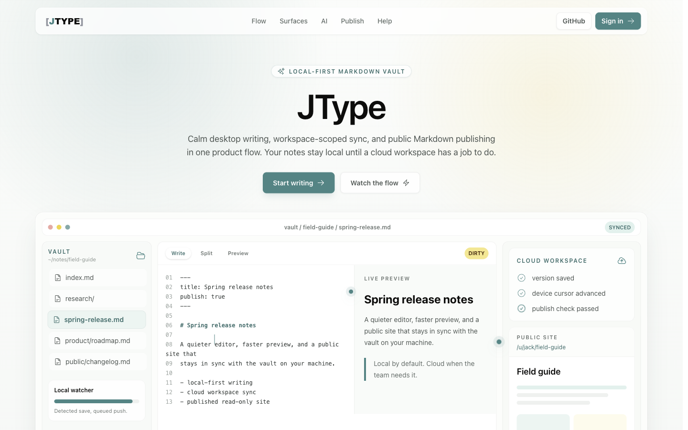
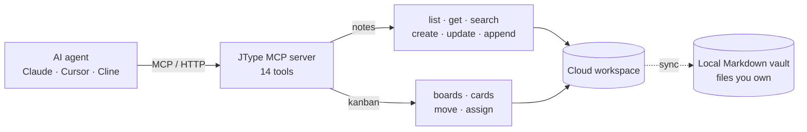
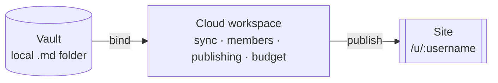
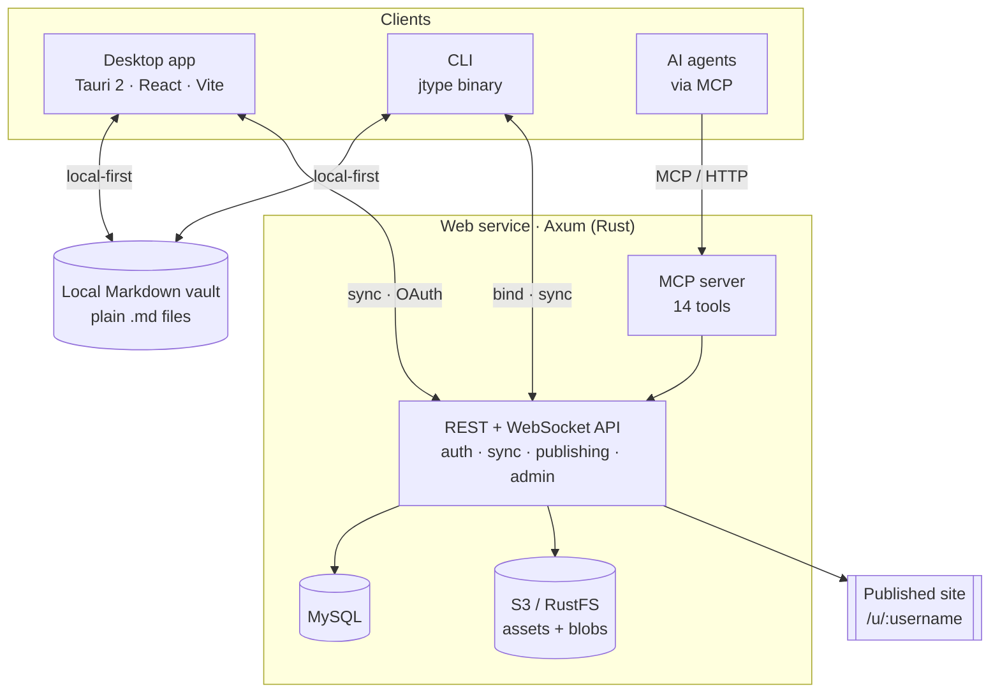

# JType

**The local-first knowledge base your AI agents can actually use.**

Your notes and boards stay as plain Markdown in a folder on your disk — and your AI
agents (Claude, Cursor, Cline, anything that speaks MCP) can read and write them through
a standard protocol. Own your files *and* let agents do the work.

English · [中文](README.zh-CN.md)

<p align="center">
  <a href="https://github.com/cnjack/jtype/stargazers"></a>
  
  
  <br>
  
  
  
  
  
</p>

<p align="center">
  <a href="https://jtype.nightc.com">
    
  </a>
</p>

<p align="center"><sub>Live demo: <a href="https://jtype.nightc.com">jtype.nightc.com</a></sub></p>

---

## Why JType

Obsidian gives you data ownership but doesn't understand AI. Notion and Linear understand
AI but lock your data in their cloud. JType refuses the trade-off.

| | Obsidian | Notion / Linear | **JType** |
|---|---|---|---|
| Data ownership | Local `.md` ✅ | Cloud-locked ❌ | Local `.md` ✅ |
| AI-agent native | Plugins, weak | SaaS, closed | **MCP + CLI + Skills, open protocol** ✅ |
| Notes + Kanban + Diagrams | Plugin patchwork | Separate products | **One vault** ✅ |
| Publish to a site | Paid add-on | Limited | **Built-in themes + custom domains** ✅ |
| Self-hostable | ❌ | ❌ | **Docker / Helm / your own S3** ✅ |
| Desktop · Web · CLI | Desktop + mobile | Web-first | **Same vault on all three** ✅ |

**The hook:** your files live in a local Markdown folder you control, and an MCP server
exposes your notes and Kanban boards to agents over the wire.

## AI-native, by design

JType ships a real, tested AI surface — not a hidden roadmap item:

- **MCP server** — `POST /mcp` (Streamable HTTP, JSON-RPC) with **14 tools** covering notes
  (`list/get/search/create/update/append`) and Kanban (`list_boards/get_board/list_cards/create_card/update_card/move_card/list_members`).
- **OAuth device flow** (RFC 8628) — `jtype login` opens a browser, approves once, and stores
  a scoped token. No passwords on the client.
- **CLI** — the `jtype` binary works local-first over the vault in your current directory,
  with `bind` + `sync` for cloud write-through and `jtype mcp-stdio` to bridge into any
  stdio-only MCP client.
- **Agent Skills** — `jtype-notes` and `jtype-kanban`, verified against real models.



Point an agent at your workspace in one block of config:

```jsonc
// e.g. ~/.jcode/config.json or any MCP client
"mcp_servers": {
  "jtype": {
    "type": "http",
    "url": "http://localhost:13345/mcp",
    "headers": { "Authorization": "Bearer <token from `jtype login`>" }
  }
}
```

Full walkthrough: [Connect your AI](docs/connect-your-ai.md).

> Scope note: the AI surface (MCP/CLI/Skills) currently drives the **cloud workspace** —
> notes and the cloud Kanban. The desktop app's `.board` files are a separate, file-based
> board model; see [Kanban gaps & roadmap](internal-docs/kanban/gaps-and-roadmap.md). The
> desktop in-app AI UI is intentionally still hidden.

## What you get

- **Notes** — a split-pane Markdown editor (Write / Split / Preview) with live incremental
  rendering, YAML frontmatter, wikilinks (`[[Note|Label]]`), and KaTeX math.
- **Diagrams & rich files in the vault** — Mermaid (fenced or `.mmd`), Excalidraw (full
  in-app canvas), Draw.io, PlantUML, Swagger/OpenAPI, PDF documents, and inline images.
- **Kanban** — cloud boards with columns, cards, labels, priorities, assignees, due dates,
  drag-and-drop, real-time WebSocket sync, soft-delete + 30-day trash, and optimistic locking.
- **Publishing** — turn a workspace into a read-only site at `/u/:username/:page_path`, with
  a server-side theme engine and verified custom domains.
- **Three surfaces, one vault** — local-first desktop (Tauri 2), a cloud web app, and the CLI.
- **i18n** — English, Japanese, Korean, and Chinese.
- **Self-hosting** — Docker Compose for local/dev, a Helm chart for Kubernetes, and pluggable
  S3 / RustFS / local-filesystem object storage.

## Screenshots

<table>
<tr>
<td width="50%" valign="top">
<br>
<sub><b>Split editor</b> — live preview with KaTeX math and rendered Mermaid, right in the vault.</sub>
</td>
<td width="50%" valign="top">
<br>
<sub><b>Kanban</b> — columns, cards, grouping, filtering, and real-time sync.</sub>
</td>
</tr>
</table>

## Product model

- **Vault** — a local Markdown folder on the user's device.
- **Cloud workspace** — the server-side collaboration, sync, publishing, budget, and
  membership boundary.
- **Vault binding** — a per-device mapping from one cloud workspace to one local vault path.
- **Site** — the published read-only output for a user/workspace.

Desktop stays local-first. Web owns identity, OAuth, cloud workspaces, admin, custom domains,
and online editing.



---

## Quickstart

### Desktop app

```bash
npm install
npm run tauri dev
```

Frontend-only preview (no Tauri backend):

```bash
npm run dev
```

First launch shows a welcome screen: use the default vault (`~/Documents/.jtype`), open an
existing vault, open a single Markdown file, or pick from recent vaults/files. Single-file mode
is a focused editor with no sync, account, or publish surfaces; vault mode adds navigation,
quick open, split preview, publishing checks, and account/cloud sync. Desktop login is
browser-based OAuth through the web service — the desktop never collects passwords.

### Self-host the cloud service

```bash
docker compose up -d
```

This brings up MySQL, RustFS (S3-compatible), and the `jtype-web` service. The default cloud
service URL is `http://localhost:13345`. A Helm chart for Kubernetes lives in `helm/`.

### CLI

```bash
jtype login                     # browser device flow → scoped token
jtype note list                 # local-first over the vault in your CWD
jtype board list --workspace <id>
jtype sync                      # headless pull/push with 3-way merge
jtype mcp-stdio                 # bridge the tool set into a stdio MCP client
```

---

## Architecture



Source layout: desktop in `src/` + `src-tauri/`, web service in `services/jtype-web/`, CLI in
`services/jtype-cli/` (shares the `jtype-core` crate with the desktop). Tests live in `tests/e2e/`
(Playwright) and per-crate `cargo test`.

### Backend locations

There are two Rust backends in this repo, plus the CLI:

- **Desktop embedded backend** — `src-tauri/src/lib.rs` and `src-tauri/src/workspace.rs`.
  Local files, vault operations, static export, validation, profile storage, vault bindings,
  and AI index generation. Starts with `npm run tauri dev`.
- **Companion web backend** — `services/jtype-web`. Axum service for registration/login (email
  OTP + SMTP, password reset), device OAuth, cloud workspaces, sync, conflicts, Kanban, admin,
  settings, custom domains, the MCP server, and public sites. Starts with Docker Compose.
- **CLI** — `services/jtype-cli`. Shares the `jtype-core` crate with the desktop for vault logic.

The desktop app talks to the web backend over HTTP. It should not connect directly to MySQL or
RustFS.

### URLs

- Web landing: `http://localhost:13345/`
- Dashboard and app pages: handled by the web SPA.
- Published sites: `/u/:username` and `/u/:username/:page_path`
- MCP endpoint: `POST http://localhost:13345/mcp`

Do not use bare `/:username` routes for public sites — they conflict with SPA routes like
`/workspaces/:id`.

---

## Build

```bash
npm run build          # frontend
npm run tauri build    # desktop bundle (Windows target: nsis)
```

## Test

```bash
npm run build
npx playwright test tests/e2e/app.spec.ts
npm run test:web
cargo test --manifest-path src-tauri/Cargo.toml
cargo test --manifest-path services/jtype-web/Cargo.toml --lib
```

`npm run test:e2e` runs the configured Playwright suite. For focused desktop app work, prefer
`npx playwright test tests/e2e/app.spec.ts`.

## Documentation

- [Connect your AI](docs/connect-your-ai.md) — MCP setup for Claude / Cursor / Cline / jcode
- [AI integration design](internal-docs/ai-integration/README.md) — MCP + CLI + Skills
- [REST API reference](docs/api/README.md) — documents, folders, sync, members, workspaces, trash
- [Architecture overview](AGENTS.md) · [Design notes](DESIGN.md)
- Agent guides: [Frontend](docs/agents/frontend.md) · [Tauri backend](docs/agents/tauri-backend.md) · [Web service](docs/agents/web-service.md) · [Testing](docs/agents/testing.md)

## Notes

- Markdown rendering uses `marked`, `dompurify`, KaTeX, and Mermaid.
- The desktop app uses the Tauri dialog, filesystem, and opener plugins.
- AI index infrastructure exists on the desktop; the in-app AI UI is kept hidden until the
  desktop AI features are ready. The shipped AI surface today is the MCP server, CLI, and Skills.
- The current Windows bundle target is `nsis`.
