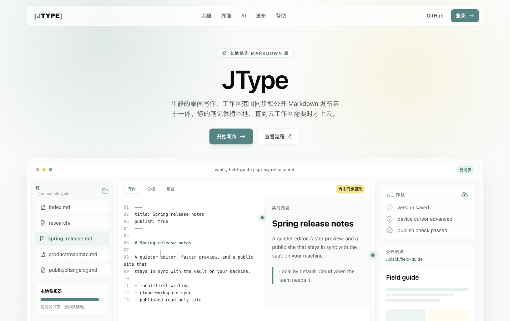
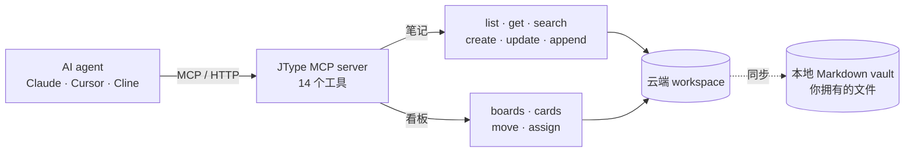
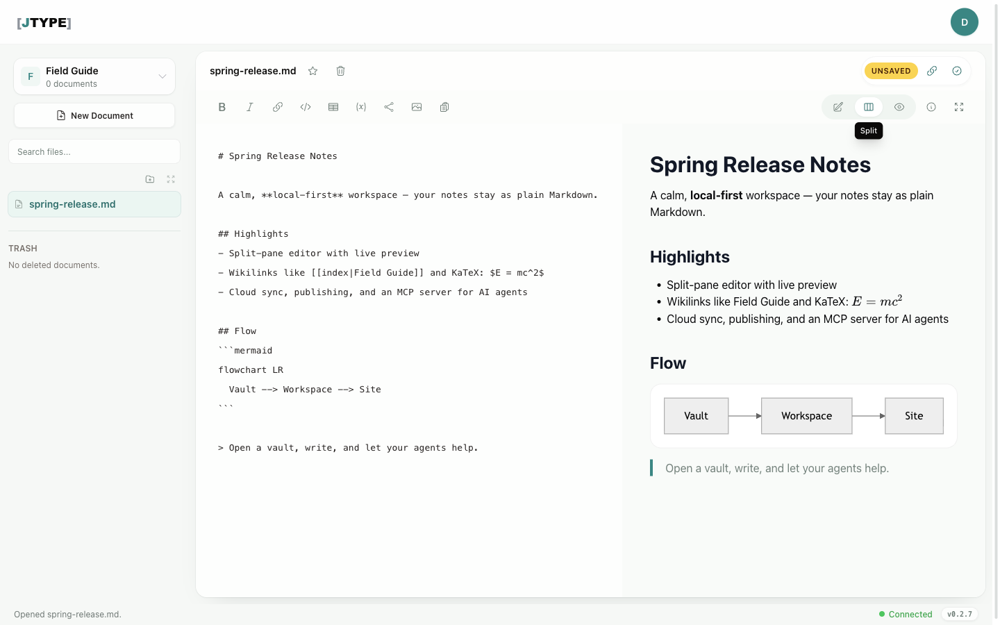
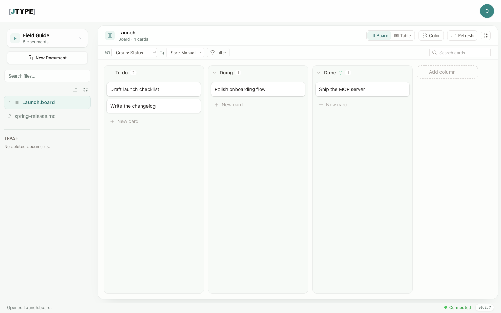
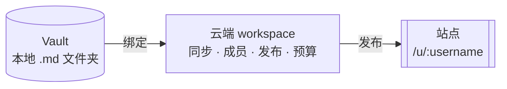
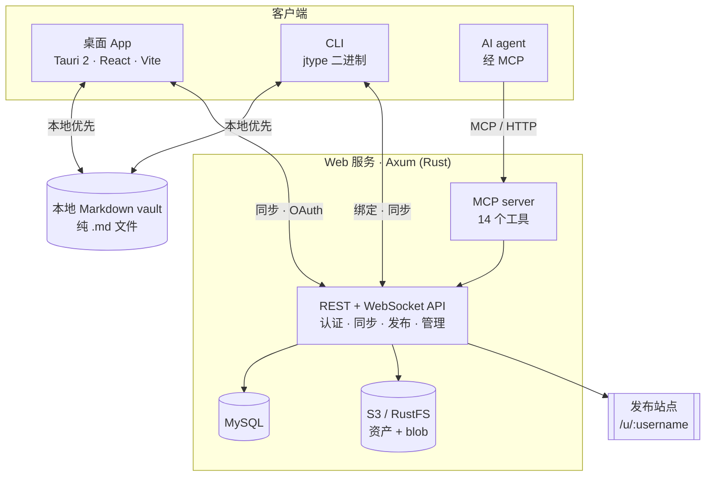

# JType

**一个本地优先的知识库 —— 你的 AI agent 真的能用它干活。**

你的笔记和看板始终是硬盘上一个文件夹里的纯 Markdown，而你的 AI agent（Claude、Cursor、
Cline，任何会说 MCP 的客户端）可以通过标准协议读写它们。**文件是你的，agent 能干活。**

[English](README.md) · 中文

<p align="center">
  <a href="https://github.com/cnjack/jtype/stargazers"></a>
  
  
  <br>
  
  
  
  
  
</p>

<p align="center">
  <a href="https://jtype.nightc.com">
    
  </a>
</p>

<p align="center"><sub>在线 Demo:<a href="https://jtype.nightc.com">jtype.nightc.com</a></sub></p>

---

## 为什么选 JType

Obsidian 给你数据主权，但不懂 AI；Notion / Linear 懂 AI，但把你的数据锁在它们的云里。
JType 拒绝这个二选一。

| | Obsidian | Notion / Linear | **JType** |
|---|---|---|---|
| 数据所有权 | 本地 `.md` ✅ | 云端锁定 ❌ | 本地 `.md` ✅ |
| AI agent 原生 | 需插件，弱 | SaaS，封闭 | **MCP + CLI + Skills，开放协议** ✅ |
| 笔记 + 看板 + 图 一体 | 插件拼凑 | 拆成多个产品 | **一个 vault** ✅ |
| 发布成站点 | 付费插件 | 有限 | **内置主题 + 自定义域名** ✅ |
| 自托管 | ❌ | ❌ | **Docker / Helm / 自有 S3** ✅ |
| 桌面 · Web · CLI | 桌面 + 移动 | Web 为主 | **三端同一个 vault** ✅ |

**钩子**：你的文件躺在一个你掌控的本地 Markdown 文件夹里，同时一个 MCP server 把你的笔记和
看板通过网络暴露给 agent。

## AI 原生，不是画饼

JType 提供的是一套真实、已测试的 AI 能力，而非藏在 roadmap 里的占位：

- **MCP server** —— `POST /mcp`（Streamable HTTP，JSON-RPC），**14 个工具**，覆盖笔记
  （`list/get/search/create/update/append`）与看板
  （`list_boards/get_board/list_cards/create_card/update_card/move_card/list_members`）。
- **OAuth device flow**（RFC 8628）—— `jtype login` 打开浏览器，授权一次，存下带作用域的
  token。客户端不收集密码。
- **CLI** —— `jtype` 二进制以当前目录的 vault 为准、本地优先工作，`bind` + `sync` 做云端
  write-through，`jtype mcp-stdio` 桥接到任何只支持 stdio 的 MCP 客户端。
- **Agent Skills** —— `jtype-notes` 与 `jtype-kanban`，已用真实模型验证。



一段配置就能把 agent 指向你的 workspace：

```jsonc
// 例如 ~/.jcode/config.json 或任意 MCP 客户端
"mcp_servers": {
  "jtype": {
    "type": "http",
    "url": "http://localhost:13345/mcp",
    "headers": { "Authorization": "Bearer <来自 `jtype login` 的 token>" }
  }
}
```

完整流程见 [Connect your AI](docs/connect-your-ai.md)。

> 范围说明：当前 AI 能力（MCP/CLI/Skills）驱动的是**云端 workspace**——笔记与云端看板。
> 桌面端的 `.board` 文件是另一套基于文件的看板模型，详见
> [看板缺口与路线图](internal-docs/kanban/gaps-and-roadmap.md)。桌面 App 内的 AI UI 目前
> 仍刻意隐藏。

## 你能得到什么

- **笔记** —— 分栏 Markdown 编辑器（Write / Split / Preview），实时增量渲染，YAML
  frontmatter，wikilink（`[[Note|Label]]`），KaTeX 数学公式。
- **vault 内的图与富文件** —— Mermaid（fenced 或 `.mmd`）、Excalidraw（完整画布编辑）、
  Draw.io、PlantUML、Swagger/OpenAPI、PDF 文档、内联图片。
- **看板** —— 云端 board，含列、卡片、标签、优先级、负责人、到期日、拖拽、WebSocket 实时
  同步、软删除 + 30 天回收站、乐观锁。
- **发布** —— 把 workspace 变成 `/u/:username/:page_path` 的只读站点，带服务端主题引擎与已
  验证的自定义域名。
- **三端，一个 vault** —— 本地优先桌面端（Tauri 2）、云端 Web App、CLI。
- **多语言** —— 英语、日语、韩语、中文。
- **自托管** —— 本地/开发用 Docker Compose，Kubernetes 用 Helm chart，可插拔的
  S3 / RustFS / 本地文件系统对象存储。

## 截图

<table>
<tr>
<td width="50%" valign="top">
<br>
<sub><b>分栏编辑器</b> —— vault 内实时预览，KaTeX 公式与 Mermaid 直接渲染。</sub>
</td>
<td width="50%" valign="top">
<br>
<sub><b>看板</b> —— 列、卡片、分组、筛选、实时同步。</sub>
</td>
</tr>
</table>

## 产品模型

- **Vault** —— 用户设备上的本地 Markdown 文件夹。
- **Cloud workspace** —— 服务端的协作、同步、发布、预算与成员边界。
- **Vault binding** —— 单设备上「一个云端 workspace ↔ 一个本地 vault 路径」的映射。
- **Site** —— 面向某用户/workspace 发布的只读输出。

桌面端保持本地优先。Web 负责身份、OAuth、云端 workspace、管理后台、自定义域名与在线编辑。



---

## 快速开始

### 桌面 App

```bash
npm install
npm run tauri dev
```

仅前端预览（不带 Tauri 后端）：

```bash
npm run dev
```

首次启动是欢迎屏：使用默认 vault（`~/Documents/.jtype`）、打开已有 vault、打开单个 Markdown
文件，或从最近列表里选。单文件模式是纯编辑器，无同步/账户/发布；vault 模式则有导航、quick
open、分栏预览、发布检查、账户/云端同步。桌面登录是经由 web 服务的浏览器 OAuth——桌面端从不
收集密码。

### 自托管云服务

```bash
docker compose up -d
```

会拉起 MySQL、RustFS（S3 兼容）与 `jtype-web` 服务。默认云服务 URL 是
`http://localhost:13345`。Kubernetes 用的 Helm chart 在 `helm/`。

### CLI

```bash
jtype login                     # 浏览器 device flow → 带作用域 token
jtype note list                 # 以当前目录 vault 为准，本地优先
jtype board list --workspace <id>
jtype sync                      # 无头 pull/push，三方合并
jtype mcp-stdio                 # 把工具集桥接进 stdio MCP 客户端
```

---

## 架构



源码布局：桌面端在 `src/` + `src-tauri/`，Web 服务在 `services/jtype-web/`，CLI 在
`services/jtype-cli/`（与桌面共享 `jtype-core` crate）。测试在 `tests/e2e/`（Playwright）
与各 crate 的 `cargo test`。

### 后端位置

仓库里有两个 Rust 后端，外加 CLI：

- **桌面内嵌后端** —— `src-tauri/src/lib.rs` 与 `src-tauri/src/workspace.rs`。本地文件、vault
  操作、静态导出、校验、profile 存储、vault binding、AI 索引生成。随 `npm run tauri dev` 启动。
- **配套 web 后端** —— `services/jtype-web`。Axum 服务，负责注册/登录（email OTP + SMTP、
  密码重置）、device OAuth、云端 workspace、同步、冲突、看板、管理后台、设置、自定义域名、
  MCP server 与公开站点。随 Docker Compose 启动。
- **CLI** —— `services/jtype-cli`。与桌面端共享 `jtype-core` crate 的 vault 逻辑。

桌面 App 通过 HTTP 与 web 后端通信，不应直连 MySQL 或 RustFS。

### URL

- Web 落地页：`http://localhost:13345/`
- Dashboard 与 App 页面：由 web SPA 处理。
- 已发布站点：`/u/:username` 与 `/u/:username/:page_path`
- MCP 端点：`POST http://localhost:13345/mcp`

公开站点不要用裸 `/:username` 路由——会和 `/workspaces/:id` 这类 SPA 路由冲突。

---

## 构建

```bash
npm run build          # 前端
npm run tauri build    # 桌面包（Windows target：nsis）
```

## 测试

```bash
npm run build
npx playwright test tests/e2e/app.spec.ts
npm run test:web
cargo test --manifest-path src-tauri/Cargo.toml
cargo test --manifest-path services/jtype-web/Cargo.toml --lib
```

`npm run test:e2e` 跑配置好的 Playwright 套件。专注桌面 App 时优先用
`npx playwright test tests/e2e/app.spec.ts`。

## 文档

- [Connect your AI](docs/connect-your-ai.md) —— Claude / Cursor / Cline / jcode 的 MCP 接入
- [AI 集成设计](internal-docs/ai-integration/README.md) —— MCP + CLI + Skills
- [REST API 参考](docs/api/README.md) —— 文档、文件夹、同步、成员、workspace、回收站
- [架构概览](AGENTS.md) · [设计笔记](DESIGN.md)
- Agent 指南：[前端](docs/agents/frontend.md) · [Tauri 后端](docs/agents/tauri-backend.md) · [Web 服务](docs/agents/web-service.md) · [测试](docs/agents/testing.md)

## 备注

- Markdown 渲染用 `marked`、`dompurify`、KaTeX、Mermaid。
- 桌面 App 使用 Tauri 的 dialog、filesystem、opener 插件。
- 桌面端已有 AI 索引基础设施，但 App 内 AI UI 在桌面 AI 功能就绪前保持隐藏。当前已交付的
  AI 能力是 MCP server、CLI 与 Skills。
- 当前 Windows 打包目标是 `nsis`。
