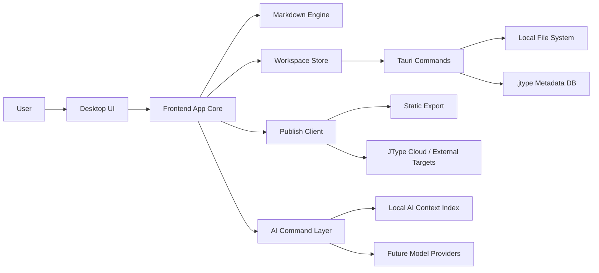
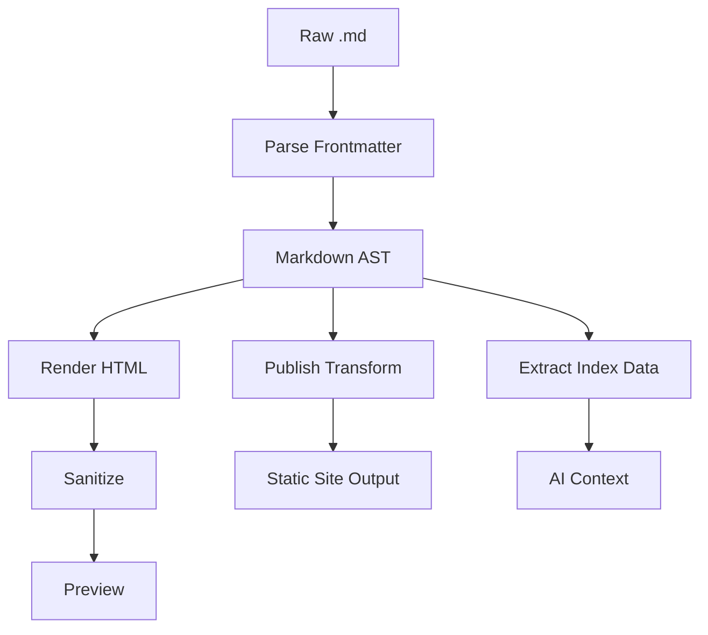
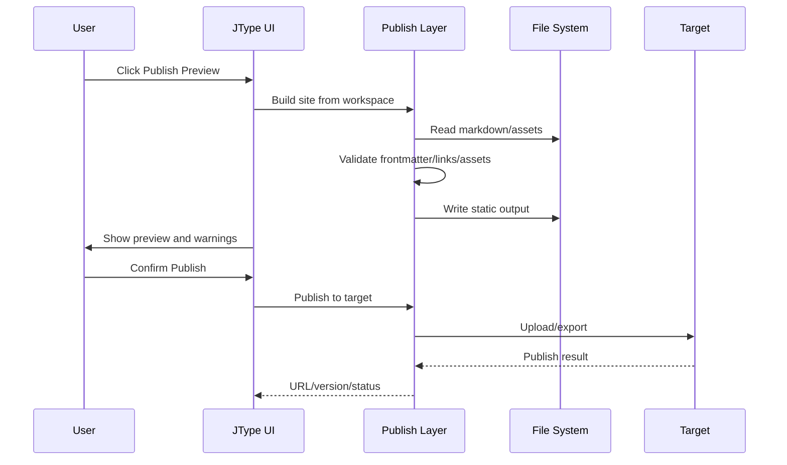

# JType High-Level Design

## 1. 设计目标

JType 的架构应从“单文件 Markdown Viewer”演进为“local-first Markdown workspace + 发布服务 + AI-ready 内容平台”。

核心原则：

- Markdown 文件是事实来源。
- 本地优先，云端和发布是增强能力。
- 所有索引和 AI 上下文都可以从文件重新生成。
- UI、文件系统、发布和 AI 能力解耦，避免后续扩展时重写主流程。

## 2. 当前技术基础

当前项目使用：

- Tauri 2 作为桌面壳。
- Vite + TypeScript 作为前端。
- `@tauri-apps/plugin-dialog` 选择文件。
- `@tauri-apps/plugin-fs` 读取文件。
- `marked` 渲染 Markdown。
- `dompurify` 清理 HTML。

这套基础适合继续作为本地桌面端的起点。

## 3. 总体架构



分层说明：

- UI Layer：目录树、编辑器、预览、发布面板、AI 面板。
- App Core：打开文件、保存、workspace 状态、路由、命令调度。
- Workspace Store：文件树、文档索引、资源索引、元数据缓存。
- Tauri Commands：安全地访问本地文件、监听文件变化、处理文件关联和拖拽。
- Markdown Engine：解析 Markdown、frontmatter、AST、HTML 渲染、发布转换。
- Publish Layer：生成站点、发布目标适配、发布历史。
- AI Command Layer：为未来 AI 操作提供统一上下文、权限和 diff 流程。

## 4. 前端模块设计

推荐目录结构：

```text
src/
  app/
    bootstrap.ts
    command-bus.ts
    routes.ts
  workspace/
    workspace-store.ts
    file-tree.ts
    document-model.ts
    recent-items.ts
  editor/
    markdown-editor.ts
    save-state.ts
    shortcuts.ts
  preview/
    markdown-renderer.ts
    sanitizer.ts
  publish/
    publish-config.ts
    publish-preview.ts
    publish-client.ts
  ai/
    ai-context.ts
    ai-command-registry.ts
    diff-preview.ts
  tauri/
    fs-api.ts
    drag-drop.ts
    file-association.ts
```

### 4.1 App Core

职责：

- 管理当前模式：single-file mode 或 workspace mode。
- 管理当前打开文档、保存状态、错误状态。
- 把 UI 命令转换为 domain command，例如 `openFile`、`openWorkspace`、`saveDocument`、`publishSite`。

### 4.2 Workspace Store

职责：

- 从本地目录构建文件树。
- 读取和缓存 Markdown 文档摘要。
- 维护文档 id、路径、标题、frontmatter、链接关系。
- 将可重建索引写入 `.jtype/index.sqlite` 或 `.jtype/index.json`。

建议优先从 JSON 文件起步，后续 workspace 文件量变大后切换 SQLite。

### 4.3 Editor

短期可以保留普通 textarea 或 contenteditable，但建议尽快切换 CodeMirror 6：

- Markdown 语法高亮。
- 大文件性能更稳定。
- 后续 AI diff、局部替换、命令插入更容易。
- 插件生态适合实现 lint、补全、frontmatter 编辑。

### 4.4 Preview

职责：

- 使用统一 Markdown pipeline 渲染预览。
- 输出前使用 DOMPurify 清理 HTML。
- 支持相对路径图片解析。
- 支持代码高亮、目录、锚点。

预览和发布应尽量复用同一 Markdown pipeline，避免“编辑预览正常，发布后不同”的问题。

## 5. Tauri 后端设计

### 5.1 Commands

建议 Rust 侧提供以下命令：

```text
open_file(path) -> DocumentContent
save_file(path, content, expected_revision) -> SaveResult
open_workspace(path) -> WorkspaceSnapshot
list_directory(path) -> DirectoryNode[]
move_entry(from, to) -> MoveResult
delete_entry(path) -> DeleteResult
watch_workspace(path) -> event stream
build_workspace_index(path) -> IndexResult
export_static_site(workspace, config) -> ExportResult
```

### 5.2 文件关联

Tauri bundle 配置应增加 Markdown 文件关联：

```json
{
  "bundle": {
    "fileAssociations": [
      {
        "ext": ["md", "markdown", "mdown", "mkd"],
        "name": "Markdown Document",
        "description": "Markdown document",
        "role": "Editor",
        "mimeType": "text/markdown"
      }
    ]
  }
}
```

应用启动时需要读取系统传入的文件路径，并调用 `openFile(path)`。如果传入多个文件，默认打开第一个，同时把其他文件加入最近列表或打开标签。

### 5.3 拖拽打开

Tauri 2 可通过当前 webview 的 drag/drop event 获取拖入路径。处理规则：

- 拖入单个 Markdown 文件：打开文件。
- 拖入多个 Markdown 文件：打开第一个，其他加入待打开列表。
- 拖入目录：作为 workspace 打开。
- 拖入不支持的文件：提示仅支持 Markdown 或文件夹。

### 5.4 文件监听

Workspace 模式需要监听文件系统变化：

- 外部新增文件：更新目录树。
- 外部删除当前文件：提示文件不存在。
- 外部修改当前文件：若当前无本地未保存修改，自动刷新；否则提示冲突。

## 6. 数据模型

### 6.1 Workspace

```ts
type Workspace = {
  id: string;
  rootPath: string;
  name: string;
  createdAt: string;
  updatedAt: string;
  settings: WorkspaceSettings;
};
```

### 6.2 Document

```ts
type Document = {
  id: string;
  path: string;
  title: string;
  frontmatter: Record<string, unknown>;
  headings: Heading[];
  links: LinkRef[];
  assets: AssetRef[];
  status: "draft" | "ready" | "published" | "archived";
  updatedAt: string;
};
```

### 6.3 AI Chunk

```ts
type AIChunk = {
  id: string;
  documentId: string;
  path: string;
  headingPath: string[];
  startLine: number;
  endLine: number;
  contentHash: string;
  text: string;
  tokens?: number;
  embeddingRef?: string;
};
```

稳定 id 建议使用 workspace id + normalized path + content hash 的组合，避免简单移动文件后完全丢失上下文。

## 7. Markdown Pipeline



建议引入 unified/remark/rehype 生态作为中期目标：

- `remark-parse` 解析 Markdown AST。
- `remark-frontmatter` 处理 frontmatter。
- `remark-gfm` 支持 GFM。
- `rehype-sanitize` 或 DOMPurify 处理 HTML 安全。

当前 `marked + dompurify` 可以继续用于早期预览。

## 8. 发布设计

### 8.1 发布配置

`.jtype/publish.json`：

```json
{
  "siteName": "My Docs",
  "baseUrl": "",
  "source": "articles",
  "output": ".jtype/dist",
  "theme": "default",
  "navigation": "auto",
  "includeDrafts": false,
  "targets": []
}
```

### 8.2 发布流程



### 8.3 发布目标

第一阶段：

- 本地静态导出。
- 本地发布预览。

第二阶段：

- GitHub Pages。
- Cloudflare Pages。
- S3/R2。

第三阶段：

- JType Cloud 托管。
- 自定义域名。
- 发布历史和回滚。

## 9. AI-Friendly 设计

AI 能力不要直接耦合具体模型。应先设计稳定的上下文层和命令层。

### 9.1 AI Context Index

`.jtype/ai-context.jsonl` 可以按文档块记录：

```jsonl
{"type":"document","id":"doc_1","path":"articles/hello.md","title":"Hello","tags":["intro"]}
{"type":"chunk","id":"chunk_1","documentId":"doc_1","headingPath":["Intro"],"startLine":1,"endLine":24,"text":"..."}
{"type":"link","from":"doc_1","to":"doc_2","kind":"markdown-link"}
```

### 9.2 AI Command Layer

AI 操作统一抽象为 command：

```ts
type AICommand = {
  id: string;
  name: string;
  scope: "selection" | "document" | "folder" | "workspace";
  input: AICommandInput;
  proposedChanges: FilePatch[];
  explanation: string;
};
```

所有 AI 写入走同一流程：

1. 收集上下文。
2. 生成建议。
3. 展示 diff。
4. 用户确认。
5. 写入文件。
6. 记录操作日志。

### 9.3 未来 AI 功能

- 当前文档总结。
- 按目录生成 README。
- 自动补全 frontmatter。
- 批量生成 slug 和 description。
- 检查断链和重复内容。
- 将一篇长文拆成多篇。
- 根据 workspace 内容问答。
- 发布前 SEO 和结构检查。

## 10. 状态管理

关键状态：

- `currentMode`: `single-file` 或 `workspace`
- `currentWorkspace`
- `currentDocument`
- `openTabs`
- `dirtyDocuments`
- `fileTree`
- `searchIndex`
- `publishStatus`
- `syncStatus`
- `aiContextStatus`

保存策略：

- 编辑器内维护 dirty buffer。
- 保存时带上读取时的 revision 或 content hash。
- 如果磁盘文件已变化，进入冲突流程。

## 11. 性能策略

- 大 workspace 初次打开先展示目录树，再后台构建全文索引。
- Markdown 文件摘要懒加载。
- 文件树虚拟滚动。
- 搜索索引增量更新。
- 预览渲染 debounce。
- AI chunk 和 embedding 延迟计算。

目标：

- 1,000 个 Markdown 文件目录树 2 秒内可交互。
- 单文档编辑预览延迟控制在 200ms 到 500ms。
- 索引构建不阻塞编辑。

## 12. 安全策略

- 只访问用户授权的文件或目录。
- Markdown HTML 继续清理。
- 发布前复制资源到输出目录，避免泄漏 workspace 外部文件。
- AI 上传前必须显示范围和用途。
- API key 不写入 Markdown 文件，不进入发布产物。

## 13. 迁移计划

### Step 1：整理单文件能力

- 抽出 `openMarkdownFile(path)`。
- 抽出 markdown renderer。
- 增加错误状态和 loading 状态。

### Step 2：补入口能力

- 配置 file associations。
- 接入 drag/drop event。
- 支持启动参数路径。
- 加最近文件。

### Step 3：引入编辑和保存

- 用编辑器组件替换只读源码。
- 增加保存命令。
- 管理 dirty state。

### Step 4：引入 workspace

- 支持打开文件夹。
- 构建目录树。
- 支持新建、移动、重命名、删除。
- 写入 `.jtype/workspace.json`。

### Step 5：引入发布和 AI 索引

- 构建统一 Markdown pipeline。
- 增加发布配置。
- 增加本地静态导出。
- 生成 AI context index。

## 14. 主要风险

- 文件系统权限在 Windows、macOS、Linux 行为不同，需要尽早做跨平台验证。
- 文件关联路径传递方式在不同平台不同，需要在 Tauri 启动流程中单独处理。
- Markdown 解析器选择会影响预览、发布和 AI 索引一致性，后续应统一 pipeline。
- 云同步若过早引入会增加复杂度，建议先完成 local-first workspace。
- AI 功能若没有 diff 和权限控制，容易造成用户文件被误改。
