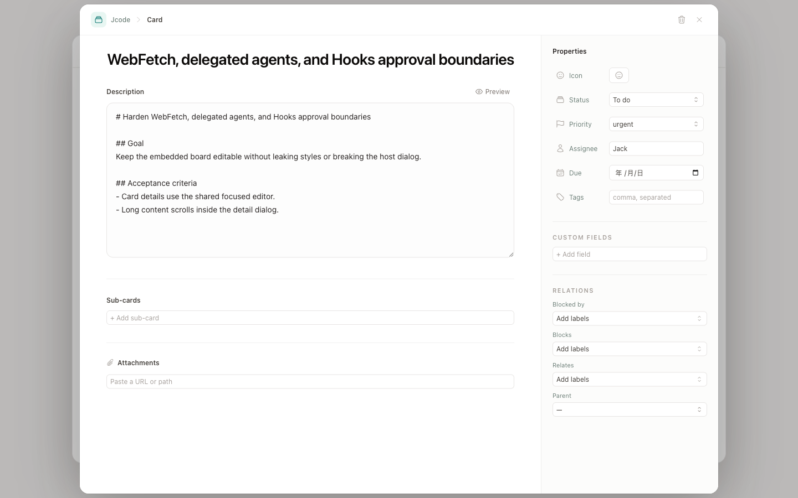

# Card actions UI redesign

Date: 2026-07-31

## Impact matrix

| Area | Decision | Rationale |
| --- | --- | --- |
| Desktop app | Yes | Local vault boards use the shared board surface. New cards must persist their Markdown body and frontmatter in the initial filesystem write. |
| Web app | Yes | Cloud workspace boards expose the same card workflow and need matching creation/detail behavior and permissions. |
| Shared model/utilities | Yes | `BoardActions.createCard` accepts an optional initial card patch so every adapter can create a complete card without a reload race. Parent/dependency resolution now supports collision-resistant relative-path keys while retaining unique legacy basenames. |
| Shared UI | Yes | The quick-create dialog and expanded card detail have the same information architecture on Desktop and Web and remain props-in/callbacks-out. |
| Web service/API | No | Existing document create/update APIs already persist the required Markdown and frontmatter. No contract, auth, migration, event, or budget change is needed. |
| `packages/board-react` | Yes | Editable embeds consume the shared `BoardSurface`, so quick-create and card detail must stay aligned with the apps. The published 0.1.0 package incorrectly routed every open through its old read-only panel; 0.1.1 restores the editable detail while preserving the explicit read-only path. |
| CLI/MCP | Yes | Command and tool behavior already accepts the relation string; help/schema copy now documents collision-resistant relative-path references and legacy basename compatibility. |
| In-app Help | Yes | Card creation and detail navigation are user-visible workflows. The English and Chinese boards-and-cards article now explains them. |
| Other docs | Yes | The board package README now describes the shared quick-create/detail behavior and lightweight Markdown preview boundary. |
| Release/deployment | Yes | Rebuild Desktop/Web assets and `packages/board-react@0.1.1` dist; Cloud can consume the exact git commit before npm publication. No backend image, migration, or CLI binary is required. |

## Surface decisions and acceptance criteria

### Desktop and Web

- Entry point: **New card** at the bottom of any visible swimlane.
- Empty state: title is focused; description and core properties are optional.
- Existing data: selecting a card opens a wide detail dialog with content on the left and properties on the right.
- Read-only/permissions: existing read-only behavior continues to hide creation and mutation affordances.
- Persistence: title, Markdown description, status, priority, assignee, labels, and due date are written during card creation; subsequent edits use the existing update adapter.
- Sub-cards: the `parent` relationship is included in the initial create write, avoiding the stale-metadata race from the former create-then-update flow.
- Rapid edits: Web card writes read and advance a ref-backed metadata snapshot, so queued field changes compose on the latest content/hash even before React rerenders.
- Relations: new parent/dependency choices persist a normalized relative path; existing basename-only links continue to resolve when unique and are left unresolved rather than misbound when ambiguous.
- Recovery: the create action stays open while saving and preserves the form if the adapter rejects. Failed sub-card drafts are also preserved, while switching cards resets draft/error state and isolates any older in-flight request.
- Keyboard: Command/Ctrl + Enter creates; Escape closes through Headless UI dialog behavior.
- Responsive: the property inspector moves below the main content on narrow windows.

### Embeddable board package

- Editable boards receive the shared quick-create and focused card-detail dialogs.
- Read-only boards continue to intercept card opens with the package's built-in read-only detail.
- A host `onCardOpen` callback continues to replace either built-in detail path.
- The package accepts the shared detail's Markdown source but uses a safe
  plain-text preview by default, avoiding the KaTeX/Mermaid document-renderer
  dependency chain. Desktop and Web inject their full renderer.
- Portaled dialog and nested dropdown elements carry the package scope class so styles do not leak into the host.
- A real 1180 × 790 Cloud-style host verifies bounded board layout, per-column
  vertical scrolling, editable card details, quick creation, sub-card creation,
  host open interception, persistence, and explicit read-only behavior.

## Migration and release notes

- No mandatory data migration is required. Legacy basename relations remain
  compatible when unique; newly saved relations use collision-resistant paths.
- No HTTP API or server rollout is required.
- Rebuild the Desktop and Web frontends and the checked-in `packages/board-react/dist` output from the same commit.
- Publish `jtype-board-react@0.1.1` when the npm release is authorized; the
  Cloud consumer may pin the reviewed git commit in the meantime.
- Feature smoke test: create a card with description and properties, reload, reopen it, and verify all values persist.

## Verification

- `npm run build` — Desktop frontend build passed.
- `(cd services/jtype-web/frontend && npm run build)` — Web frontend build passed.
- `npm run test:unit` — 65 unit tests passed, including queued Web saves composing on the latest content/hash.
- `(cd packages/board-react && npm run build && npm test)` — package bundle rebuilt; 21 package unit tests and 3 real-embed E2E tests passed.
- `npx playwright test --config playwright.board.config.ts --workers=1` — 16 Chromium E2E tests passed.
- `cargo check --manifest-path services/jtype-cli/Cargo.toml` — CLI check passed.
- `cargo check --manifest-path services/jtype-web/Cargo.toml` — Web service check passed.
- Grok CLI and Kimi CLI final read-only reviews — `NO ACTIONABLE FINDINGS`.
- Visual smoke test at 1440 × 960 and 720 × 900 verified the focused create dialog, wide detail layout, responsive property inspector, and clean browser console.
