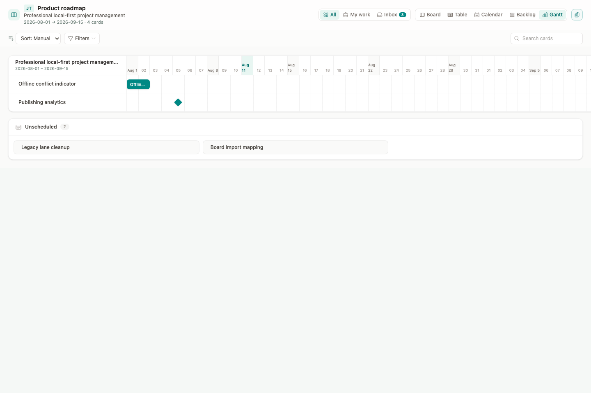
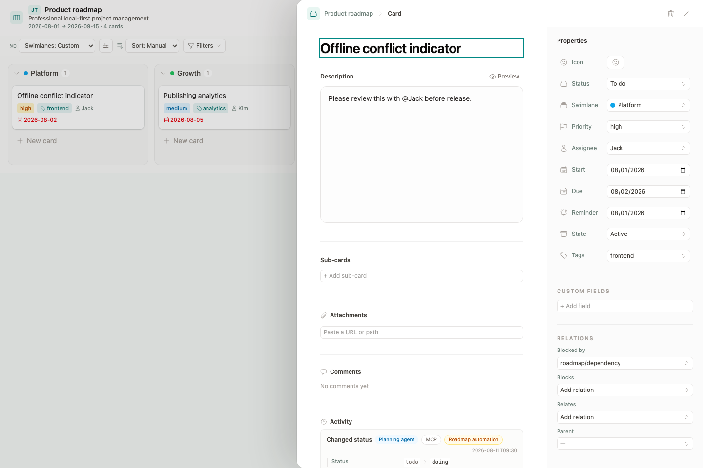
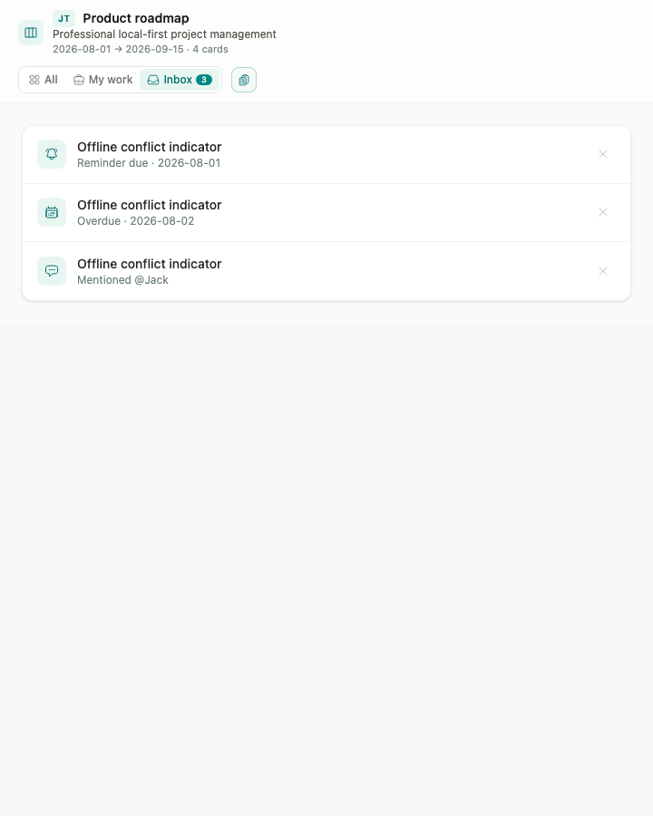

# Markdown-native project workspace

Date: 2026-08-11

## Intent

This change turns a JType board into a professional project workspace without
creating a second task database. A `.board` file remains the project boundary
and configuration document. Every Card remains a normal Markdown document whose
frontmatter carries project fields. Board, Backlog, Gantt, My Work, and Inbox are
projections over the same Cards.

The design deliberately does not add a `.project` manifest. One is justified
only when a real project must own multiple boards, shared milestones, or
cross-board permissions that cannot be represented by one `.board` file.

## Product principles

1. **Markdown is the fact source.** UI, REST, CLI, MCP, sync, and embeds mutate
   the same frontmatter and Markdown body.
2. **Shared project data and personal display state stay separate.** Project
   dates and status definitions belong in `.board`; filters, active projection,
   collapsed groups, and Inbox dismissals belong to a user/device preference.
3. **Every mutation is attributable.** Cloud writes publish a typed domain
   event with actor, client, token label, field changes, time, and document
   identity.
4. **Automation is reviewable.** MCP uses the same validation, permissions,
   event, and optimistic-write paths as the product UI.
5. **Views never fork data.** Moving a Card in Board, editing it in Backlog, or
   changing dates in Gantt updates one Markdown file.

## Design direction

This is a dense, calm project workspace for technical teams. It retains JType's
teal and stone tokens, existing typography, 8-12 px radius system, Heroicons,
and Headless UI interaction primitives. It adopts product-workspace interaction
patterns, not landing-page decoration.

- Design variance: 4. The established shell remains recognizable; the right
  detail sheet and timeline introduce a stronger work hierarchy.
- Motion intensity: 3. Motion is limited to hover, focus, drag feedback, and
  sheet state transitions. Reduced-motion users get immediate transitions.
- Visual density: 7. Rows and metadata are compact, but destructive actions,
  dates, and audit labels remain legible.
- Accent: semantic `brand` teal for selection and primary actions. Amber and red
  remain reserved for due risk, blockers, and destructive actions.
- Accessibility: all controls have a text alternative, visible focus state,
  keyboard operation, and a non-color state cue. Mobile detail becomes a full
  width sheet and timeline remains horizontally scrollable.

## Visual verification

The captures below come from the final shared Board fixture. Desktop and Web
use this same props-in/callbacks-out surface; host-specific persistence,
permissions, and network behavior are covered separately by their integration
tests.

### Gantt projection — 1440 x 960



### Card detail and field-level Activity — 1440 x 960



### Mobile Inbox — 720 x 900



## Information architecture

```text
Project (.board)
├── Project header
│   ├── key, title, summary
│   ├── start and target dates
│   └── project settings
├── Personal scope
│   ├── All work
│   ├── My work
│   └── Inbox
├── Projection
│   ├── Board
│   ├── Table
│   ├── Calendar
│   ├── Backlog
│   └── Gantt
├── Filters, sort, search, saved personal state
└── Card detail sheet
    ├── Markdown content and comments
    ├── properties, schedule, labels, relations
    ├── field-level Activity with actor provenance
    └── Open full document
```

My Work and Inbox are project-scoped in this iteration because `.board` is the
project boundary. A cross-project home is a later shell-level projection and
does not require changing the Card or event models defined here.

## Primary layout

```text
┌ Project key / title / dates ─────────────── settings ┐
│ All work   My work   Inbox                            │
├ Board  Table  Calendar  Backlog  Gantt ─ search/filter┤
│                                                       │
│ current projection                                   │
│                                                       │
└───────────────────────────────┬───────────────────────┤
                                │ Card detail sheet     │
                                │ content + properties  │
                                │ comments + activity   │
                                └───────────────────────┘
```

The detail sheet is right-aligned and preserves the underlying scroll,
selection, active scope, projection, filters, and search. Escape or Back to
project returns to that exact context. Open full document transitions to the
normal Markdown editor when the host supports it.

## Projection behavior

### Board

The existing draggable status/swimlane surface remains the execution view.
Archived Cards are hidden by default and available through the state filter.

### Backlog

Backlog is a compact grouped list using the board's status definitions. It
shows priority, assignee, schedule, labels, blockers, and multi-select. It is
optimized for triage and bulk changes, not a second storage model.

### Gantt

Gantt uses Card `start` and `due` dates. A Card with only `due` renders as a
milestone. A Card with neither date appears in an Unscheduled group. The
project's optional start and target dates define the initial range; Card dates
expand it. The first implementation edits dates in the detail sheet and uses
the timeline for navigation, avoiding imprecise drag-to-date behavior.

### My Work

My Work contains active Cards assigned to the current user. It prioritizes
overdue, due today, blocked, then remaining work. An unavailable identity yields
an explicit sign-in/connect state instead of an empty success state.

### Inbox

Inbox is an actionable project queue. Items are produced by:

- a mention of the current user in Card Markdown;
- a Card reminder whose date is due;
- an assigned Card that is overdue or due today;
- a newly blocked assigned Card.

Each item has a stable reason key. Dismissing a reason stores that key in the
personal view state. If the underlying reason changes, such as a new reminder
date or a different blocker set, a new key is generated and the item returns.

## Card detail sheet states

| State | Behavior |
| --- | --- |
| Opening | Keep project visible; show a structure-matching body and property skeleton if notes/activity are remote. |
| Editable | Title, Markdown, status, assignee, labels, start, due, reminder, archive, custom fields, dependencies, attachments, comments, and sub-Cards are editable. |
| Read-only | Keep the same information hierarchy; remove every mutation, upload, drag, and destructive affordance before the user acts. |
| Saving | Field remains locally visible; repeated edits serialize per Card. |
| Save failed | Preserve the draft, show the adapter error, allow retry, and do not close the sheet. |
| Conflict | Keep the remote/local recovery path already owned by document sync; never silently overwrite. |
| Deleted | Close the sheet only after deletion succeeds and return to the preserved project context. |
| Open full | Host opens the Markdown document. Closing the editor returns through the host's existing navigation history. |

## Shared data model

### `.board` project metadata

```json
{
  "id": "launch",
  "title": "Launch readiness",
  "project": {
    "key": "LR",
    "summary": "Prepare desktop and cloud release",
    "startDate": "2026-08-01",
    "targetDate": "2026-09-15"
  },
  "columns": []
}
```

All project fields are optional for backward compatibility. No `.project` file
is read or written.

### Card frontmatter additions

```yaml
start: 2026-08-12
due: 2026-08-16
reminder: 2026-08-14
archived: false
```

Existing `status`, `priority`, `assignee`, `tags`, `attachments`, `parent`,
`blocked_by`, `blocks`, and `relates` remain canonical.

### Cloud board-membership projection

Card Markdown remains authoritative. The Web service materializes only
`workspace_id`, `document_id`, and the exact `board` value in
`board_document_memberships`; it does not add data to Card Markdown. The
`(workspace_id, board_ref)` binary-collation index lets the Board Card snapshot
JOIN only the selected Board's documents rather than fetching and parsing every
Markdown document in the cloud workspace.

Create, accepted update, automatic merge, conflict resolution, Desktop sync,
Live, REST, and MCP writes share the document transaction and replace this
projection there. A board change therefore removes the old membership and adds
the new one atomically with the Markdown save. Trash/delete removes it in the
delete transaction (with a document FK cascade as defense in depth); restore
rebuilds it in the restore transaction. `.board` and other non-Markdown synced
documents are never members even if their opaque content contains `board:`.

### Personal view state

```ts
type BoardPersonalViewState = {
  version: 1
  viewType?: 'board' | 'table' | 'calendar' | 'backlog' | 'gantt'
  groupBy?: 'status' | 'priority' | 'assignee'
  swimlaneBy?: 'status' | 'priority' | 'assignee' | 'custom'
  calendarMode?: 'month' | 'agenda'
  sortBy?: 'manual' | 'due' | 'priority' | 'title'
  filters?: BoardFilters
  collapsedGroupKeys?: string[]
  scope?: 'all' | 'my-work' | 'inbox'
  dismissedInboxItemKeys?: string[]
}
```

Desktop and Web persist this under a key composed from the current identity,
vault/cloud workspace, and board id. `BoardSurface` and `board-react` expose a
props-in/callbacks-out state contract. The embed package does not reach into a
host's global storage; a host may persist the state or leave it session-only.

Legacy `.board` `viewType`, `groupBy`, `swimlaneBy`, and `calendarMode` values
remain the initial default, but user interaction no longer rewrites them.

## Domain event and audit contract

New cloud events extend the current durable `kanban_events` sequence log. The
legacy `event` name remains for webhook and live-client compatibility, while
`domainEvent` is the typed semantic name.

```json
{
  "eventId": "uuid",
  "sequence": 42,
  "event": "kanban:card-updated",
  "domainEvent": "card.status_changed",
  "workspaceId": "workspace-id",
  "board": "launch",
  "card": {
    "documentId": "document-id",
    "path": "launch/release.md",
    "title": "Release",
    "status": "doing"
  },
  "actor": {
    "kind": "agent",
    "userId": "user-id",
    "label": "jack"
  },
  "client": {
    "kind": "mcp"
  },
  "token": {
    "label": "release-agent"
  },
  "changes": [
    { "field": "status", "before": "todo", "after": "doing" }
  ],
  "createdAt": "2026-08-11T10:00:00Z"
}
```

Supported semantic events in this slice are:

- `card.created`, `card.deleted`, `card.updated`;
- `card.status_changed`, `card.assignee_changed`, `card.schedule_changed`;
- `card.labels_changed`, `card.dependencies_changed`;
- `card.archived`, `card.restored`;
- `comment.created`, `comment.updated`, `comment.deleted`,
  `comment.resolved`, `comment.reopened`;
- `mention.created` when a Card/comment write introduces a new mention.

Field diffs are derived server-side from the previous and accepted Markdown,
not trusted from a client request. Token secrets, hashes, and hash prefixes are
never stored in events or emitted; only an operator-assigned label is shown.

`board` is an audited projection-membership field. Moving a Card from board A
to board B writes two rows in the same document transaction: a legacy-compatible
`kanban:card-deleted`/`card.deleted` event scoped to A, followed by a
`kanban:card-created`/`card.created` event scoped to B with its own sequence.
Pull, SSE, and webhooks deliver both committed payloads, preventing the old
board projection from retaining a ghost Card.

Activity renders semantic text plus compact Actor, Client, and Token labels.
Legacy versions without structured events fall back to Created or Updated.

Conflict resolution still marks `sync_conflicts.status = resolved` immediately
after the document/event transaction rather than inside it. A database failure
between those commits can leave an already-applied conflict visibly open; a
same-content retry is idempotent and writes no second version, clock, or event.
Invalid and repeated-resolution API tests cover the safe retry boundary. Making
the conflict row and document version one transaction is a follow-up because it
requires extracting the existing document-save transaction core without
reversing its workspace-clock/document lock order.

## MCP contract

Both unpinned and board-pinned Kanban MCP surfaces receive the same capability
set. Pinned tools omit workspace and board arguments and validate every Card
against the immutable board grant.

| Tool | Behavior |
| --- | --- |
| `delete_card` | Moves one Card document to trash through the normal REST permission and audit path. |
| `set_card_labels` | Replaces, adds, or removes Card labels from a string array; labels remain frontmatter `tags`. |
| `add_card_attachment` | Adds one safe HTTPS URL or vault-relative path without duplicating it. |
| `remove_card_attachment` | Removes one exact attachment reference. |
| `set_card_relations` | Replaces `parent`, `blocked_by`, `blocks`, and `relates`; validates targets, self-links, and board scope. |
| `bulk_update_cards` | Applies status, assignee, labels, start, due, reminder, archive, and priority to several Cards and reports each success/error. |
| `list_statuses` | Reads the ordered status definitions, done status, Board document id, and content hash needed for an optimistic update. |
| `set_board_statuses` | Replaces ordered status definitions and done status; refuses orphaning Cards unless a fallback status is supplied. |

`create_card` and `update_card` also accept labels, attachments, relations,
start, reminder, and archive state. Batch operations validate the complete
request before the first write where possible. Document saves remain
individually optimistic, so a partial result is explicit and retryable rather
than falsely described as atomic.

## Feature impact matrix

| Area | Decision | Rationale |
| --- | --- | --- |
| Desktop app | Yes | Local vault projects need all projections, device-local personal view state, schedule/reminder/archive frontmatter, side detail context, and full-document navigation. |
| Web app | Yes | Cloud projects add member-aware My Work, Card mentions, structured comment/mention Activity, read-only enforcement, and the same projections. |
| Shared model/utilities | Yes | Project metadata, Card fields, view state, Inbox reasons, Gantt ranges, event display types, and frontmatter transforms have multiple consumers. |
| Shared UI | Yes | The projection switcher, work scopes, side sheet, Backlog, Gantt, bulk toolbar, and Activity presentation are materially the same and stay props-in/callbacks-out. |
| Web service/API | Yes | Accepted writes need structured field diffs and actor provenance; comments/deletes need events; Activity needs a card query; a durable board-membership projection prevents workspace-wide Card scans; MCP calls use the document/trash APIs. |
| `packages/board-react` | Yes | The package exposes the same projections and bulk Card model. Its public state callback permits host-managed persistence; checked-in dist and README must change. |
| CLI/MCP | MCP: Yes; CLI: No | MCP receives the requested complete Card/status operations. The CLI is not expanded in this slice because the request targets MCP and the existing generic Markdown commands already preserve unknown frontmatter. No CLI parity or binary release is claimed. |
| In-app Help | Yes | Users need the projection, personal-state, Inbox, schedule/archive, Activity, and automation workflows in English and Chinese. |
| Other docs | Yes | API event docs, MCP connection docs, package README, examples, and this implementation note become part of the contract. |
| Release/deployment | Yes | Rebuild Desktop and Web assets, the Web service image with migration, and board package dist. No CLI binary, standalone project database, or `.project` migration is introduced. |

## Surface acceptance criteria

### Desktop

- Entry: open any `.board` from the vault tree.
- Default: legacy shared view values seed the first personal state; later opens
  restore the user's scope, projection, sort, filters, and collapsed groups.
- Existing data: all old Cards render without migration. Missing dates appear
  under Unscheduled in Gantt.
- Read-only: N/A for a normal local vault. A host-provided read-only surface
  still removes all mutations through the shared contract.
- Persistence: project data writes `.board`; Card data writes Markdown;
  personal state writes device-local preference storage.
- Recovery: write errors preserve UI input and authoritative reload behavior.

### Web

- Entry: open a `.board` document in a cloud workspace.
- Default/existing data: same as Desktop, with current member identity enabling
  My Work and Inbox.
- Read-only: workspace viewers can open, filter, and switch projections but
  cannot drag, create, edit, upload, comment, bulk-change, archive, or delete.
- Persistence: project/Card writes use versioned document API; personal state
  is keyed to user + workspace + board; audit is durable and sequence ordered.
- Recovery: optimistic conflicts remain explicit; Activity and Inbox failures
  degrade independently without blocking Card reading.

### Embed

- The host can control and persist personal view state.
- `readOnly` continues to cover every new projection and side-sheet action.
- The package emits no storage, network, or platform side effect outside its
  injected client and callbacks.

## Test strategy

1. Shared unit tests: frontmatter round trips, view-state normalization,
   filtering archived work, Inbox reason keys, Backlog ordering, Gantt range,
   mentions, and semantic Activity formatting.
2. Shared board fixture E2E: switch Backlog/Gantt/My Work/Inbox, edit project
   metadata, use bulk assignee/labels/due/archive, preserve failed selections,
   and open/close the side sheet without losing context.
3. Desktop and Web host E2E: reload and restore personal state without changing
   `.board`, prove viewer controls are absent, and render actor/client/token
   labels from Activity.
4. Web service tests: field diff classification, actor redaction, create/update/
   delete/comment event persistence, per-Card Activity authorization, legacy
   pull compatibility, exact board-index reads, and membership consistency after
   REST save, Desktop sync create/update/delete, cross-board move, conflict
   resolution, trash, and restore.
5. MCP tests: catalog schemas, pinned argument rejection, board isolation,
   relation validation, attachment safety, status fallback, partial batch
   results, and delete-to-trash.
6. Package tests: public types, injected-client boundaries, controlled personal
   state, read-only behavior, scoped portal CSS, dist rebuild, and real host
   fixture.
7. Builds/checks: Desktop frontend, Web frontend, package build/test, Tauri unit
   tests, Web service tests, `git diff --check`.
8. Visual QA: final captures cover Gantt and side detail at 1440 x 960 plus
   Inbox at 720 x 900. Automated interaction tests cover all five projections,
   work scopes, read-only controls, error recovery, focus restoration, menus,
   and horizontal timeline containment.

## Verification results

All results below were recorded from the final working tree on 2026-08-11:

- shared TypeScript unit suite: **78 passed**;
- shared Board fixture E2E: **27 passed**;
- Desktop app E2E: **33 passed**, including loading/stale-snapshot mutation lockout
  and recovery;
- Web dashboard/Board E2E: **33 passed**, including viewer read-only,
  workspace-wide Card membership, Activity, and personal-state reload;
- `board-react`: **21 unit + 19 embed E2E passed**; package build and checked-in
  `dist` rebuild passed;
- Web service: **150 relevant Rust/API tests passed** across library, Board
  snapshots, documents, sync, trash, Activity, comments, Kanban pull, and MCP;
- shared `jtype-core`: **38 passed**; Tauri backend: **2 passed**;
- Desktop frontend, Web frontend, and package production builds passed;
- Desktop and Web Lingui catalogs extracted and compiled; scoped and final
  `git diff --check` passed.

## Adversarial review checklist

- No view creates or caches a second authoritative Card record.
- Personal actions do not rewrite shared `.board` display defaults.
- All mutation paths respect read-only before interaction and server RBAC after.
- Pinned MCP tools cannot smuggle another board/workspace through arguments or
  relation targets.
- Batch results never claim atomic success after a partial write.
- Event field diffs come from accepted persisted content, including merged
  saves, and cannot expose token secrets or full bearer hashes.
- Delete, comment, sync, REST, WebSocket, Desktop, and MCP paths either produce
  the canonical event or document an intentional non-event.
- Archived Cards are recoverable, distinguishable from trash, and excluded from
  active work by default.
- Gantt date math is timezone-stable for ISO dates and remains usable with no
  scheduled Cards.
- Comment and Markdown mentions cannot inject HTML and match complete handles,
  not substrings.
- No `.project` file, second task table, platform branch in shared UI, custom
  modal/focus trap, inline SVG icon, or hidden destructive action is introduced.

## Release notes

- Migration `0030_project_activity` extends the existing event log and creates
  `board_document_memberships`; it does not rewrite Card Markdown. It performs
  an all-row UUID backfill on `kanban_events`, joins live documents to recover
  historical `document_id`, creates indexes/columns, and alters the
  `document_versions.source` enum.
- Migration `0031_board_membership_rollout_bridge` adds a per-workspace
  projection watermark plus `(workspace_id, updated_clock, id)` lookup index,
  then performs the only Card-content backfill. For each workspace it first
  locks `workspaces.sync_clock` (which every accepted document write advances
  before commit, and which current writers lock first), reconciles every current
  document's membership in 250-row batches with the
  canonical Rust frontmatter parser, and commits the locked clock as the
  watermark. An old instance that commits later necessarily assigns a higher
  document clock; the next Board snapshot repairs only those newer documents
  under the same lock before advancing the watermark. This closes the rolling
  deployment gap without triggers, `SUPER` privileges, SQL YAML parsing, or an
  instantaneous fleet restart. Operators should still plan for one content scan,
  temporary per-workspace document-write blocking, and MySQL DDL metadata locks
  on large installations.
- Pre-0031 delete code acquired document locks before the workspace clock, while
  the rollout backfill and read repair must lock the clock before rebuilding FK
  membership. During a mixed-version window that inversion can produce MySQL
  `1213` deadlocks or `1205` lock-wait timeouts. Projection scans lock candidate
  document rows with MySQL 8 `FOR UPDATE NOWAIT` before touching membership FKs;
  an already-held legacy lock therefore returns `3572` immediately and releases
  the workspace lock. Migration and request repair retry the complete transaction
  with bounded 8/16/32 ms backoff: prompt `1213`/`3572` errors get at most four
  attempts, while potentially long `1205` waits get only one retry. Exhaustion is
  logged, and every other database error is returned unchanged.
- Restoring trash onto a path occupied by a current document now returns `409`
  and rolls back the workspace clock and trash mutation. It never deletes the
  current document or its versions, comments, reactions, conflicts, or Activity.
- Rolling `0030` back loses provenance fidelity: `mcp` version sources are
  deliberately mapped to `web` before the enum is narrowed. The migration has
  not been deployed by this PR; `0031` must be rolled out and back with the same
  service build because Board reads depend on its watermark table.
- Existing `.board` and Markdown files require no rewrite.
- Old webhook event names remain accepted. New payloads add `domainEvent`,
  actor/client/token metadata, and field changes.
- This PR rebuilds checked-in `board-react` output but does not publish a new
  npm version, Desktop installer, Web image, or production migration.
- Feature smoke test after deployment: open one existing board, set project
  dates, schedule and remind a Card, switch all projections, bulk-change two
  Cards, perform one MCP label/relation update, reload, verify Activity actor
  labels, and confirm a viewer cannot mutate.
