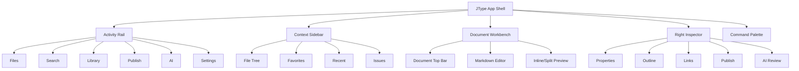

# JType Interaction Design

## 1. Design Direction

JType should feel like a focused writing and publishing workspace, not a generic IDE and not a heavy CMS. The interface should be quiet, dense, and fast:

- Left side organizes the workspace.
- Center is always the current document.
- Right side explains context: preview, properties, outline, links, publish, AI.
- Commands are available through keyboard and menus.
- Publish/sync states are visible without interrupting writing.

## 2. Information Architecture



## 3. Main Layout

```text
+--------------------------------------------------------------------------------+
| Workspace / Breadcrumbs                    Dirty  Synced  Published     Publish |
+------+---------------------------+---------------------------------------------+
| Rail | Sidebar                   | Document Workbench                 Inspector |
|      |                           |                                             |
|  F   | Files                     | # Current Document                         |
|  S   | Favorites                 |                                             |
|  L   | Recent                    | Markdown editor / split preview            |
|  P   | Workspace Tree            |                                             |
|  AI  |                           |                                             |
|  ?   |                           |                                             |
+------+---------------------------+---------------------------------------------+
```

### Layout Rules

- Activity rail width: 48px.
- Sidebar width: 260px default, resizable from 220px to 420px.
- Inspector width: 320px default, collapsible.
- Workbench owns remaining width.
- On narrow windows, inspector collapses first, then sidebar.
- Current editor scroll and cursor are preserved when switching side panels.

## 4. Activity Rail

Purpose:

Give users stable global navigation without overloading the file tree.

Items:

- Files: workspace tree, favorites, recent.
- Search: workspace search and quick filters.
- Library: table/list management views.
- Publish: publish queue and checks.
- AI: AI commands, pending patches, context index state.
- Settings: workspace and app settings.

Interaction:

- Single click switches sidebar content.
- Active item has a visible left indicator.
- Tooltip shows item name and shortcut.
- Badges can show issue count or failed sync count.

## 5. Sidebar Design

### 5.1 Files Sidebar

Sections:

- Workspace header
- Favorites
- Recent
- Files
- Trash

File tree row anatomy:

```text
[chevron] [file icon] Title.md              [status dot] [...]
```

Status indicators:

- Gray dot: local only.
- Yellow dot: unsaved changes.
- Blue dot: synced.
- Green dot: published.
- Red dot: sync/publish error.

Context menu:

- Open
- Rename
- Move To
- Duplicate
- Delete
- Add to Favorites
- Copy Markdown Link
- Copy Public URL
- Reveal in Explorer

### 5.2 Search Sidebar

Search modes:

- Files
- Text
- Tags
- Properties
- Broken links

Result row:

- Title
- Path
- Match snippet
- Status chips

### 5.3 Library Sidebar

Saved views:

- All documents
- Drafts
- Published
- Needs review
- Broken links
- Recently edited

Main workbench can switch to a table view when Library is active.

### 5.4 Publish Sidebar

Sections:

- Publish target
- Ready to publish
- Drafts
- Outdated
- Failed
- Last sync

Primary action:

- Run Checks
- Sync Workspace
- Open Public Site

## 6. Document Top Bar

Anatomy:

```text
Workspace / folder / Current.md     Draft  Dirty  Synced  Published     [Run Checks] [Sync]
```

Elements:

- Breadcrumb path.
- Editable title.
- Favorite toggle.
- Status chips.
- Primary document actions.
- More actions menu.

Status chip rules:

- Dirty means editor buffer differs from disk.
- Saved means disk is up to date.
- Synced means remote service has latest local saved version.
- Published means document is public and not draft.
- Outdated means web version is older than local saved version.

## 7. Editor Workbench

Modes:

- Write: editor only.
- Split: editor and preview.
- Preview: rendered document only.
- Focus: hides sidebar and inspector.

Toolbar commands:

- Bold
- Italic
- Link
- Code
- Quote
- Task list
- Table
- Image
- More insert actions

Insert menu:

- Heading
- Table
- Code block
- Callout
- Task list
- Image/asset
- Internal link
- Frontmatter template

Keyboard:

- `Ctrl+S`: save.
- `Ctrl+O`: quick switcher.
- `Ctrl+Shift+P`: command palette.
- `Ctrl+B`: bold.
- `Ctrl+I`: italic.
- `Ctrl+K`: link.
- `F2`: rename current file.

## 8. Inspector Tabs

### 8.1 Preview

- Render sanitized Markdown.
- Resolve local assets.
- Keep scroll sync optional.

### 8.2 Properties

Fields:

- title
- description
- tags
- slug
- status
- publish
- createdAt
- updatedAt
- custom fields

Behavior:

- Writes YAML frontmatter.
- Preserves unknown fields.
- Shows source fallback for unsupported structures.
- Validates slug/status.

### 8.3 Outline

- Lists headings.
- Shows heading depth.
- Clicking scrolls editor/preview.
- Missing H1 warning appears when relevant.

### 8.4 Links

Sections:

- Outgoing links.
- Backlinks.
- Missing links.
- Assets.
- Public URL.

Actions:

- Open target.
- Reveal source.
- Repair link.
- Copy link.

### 8.5 Publish

Checklist:

- Title exists.
- Slug is unique.
- Status is publishable.
- Links are valid.
- Assets are synced.
- Public URL exists.

Actions:

- Run checks.
- Sync workspace.
- Preview public page.
- Copy public URL.

### 8.6 AI

Sections:

- Context scope.
- Suggested commands.
- Pending patches.
- AI index status.

Write safety:

- AI output appears as patches.
- User can accept all, reject all, or apply selected hunks.
- Patch source and context scope are visible.

## 9. Command Palette Design

Open:

- `Ctrl+Shift+P`

Structure:

```text
Search commands...

Recently used
  Save current file                     Ctrl+S
  Sync workspace

Commands
  New note                              Ctrl+N
  Run publish checks
  Build AI index
```

Command result anatomy:

- Icon.
- Command name.
- Scope label.
- Shortcut.
- Disabled reason if unavailable.

Search behavior:

- Fuzzy match command title and aliases.
- Recent commands rank higher when query is empty.
- AI commands appear only when AI feature flag is enabled.

## 10. Quick Switcher Design

Open:

- `Ctrl+O`

Structure:

```text
Open or create note...

Recent
  Product Plan                         docs/plans.md
  Runtime Notes                        docs/runtime.md

Results
  Interaction Upgrade PRD              docs/interaction-upgrade-prd.md
```

Behavior:

- Empty state shows recent documents.
- Typing filters by title, path, aliases, and tags.
- Enter opens selected document.
- Shift+Enter creates a new note.
- Ctrl+Enter opens in a new tab when tab support lands.

## 11. Library View Design

Table columns:

- Title
- Path
- Status
- Tags
- Updated
- Sync
- Publish
- URL

Toolbar:

- View selector.
- Filter.
- Sort.
- Properties.
- New.

Views:

- All documents.
- Drafts.
- Published.
- Needs review.
- Broken links.

Empty state:

- If no documents match, show filter reset and create note action.

## 12. Publish Queue Design

Queue groups:

- Ready
- Draft
- Outdated
- Failed
- Published

Row anatomy:

```text
Title                         /path/to/file.md       Outdated       [Check] [Sync]
```

Details panel:

- Validation issues.
- Last synced time.
- Last published URL.
- Asset sync status.
- Revision later.

## 13. Rename/Move Impact Dialog

When users rename or move a document:

```text
Rename "old.md" to "new.md"

Impact:
- 4 Markdown links can be updated automatically.
- 1 public URL may change.
- 0 missing assets.

[Cancel] [Rename Only] [Rename and Update Links]
```

Rules:

- Never silently break links.
- Show affected documents.
- Allow user to inspect link patches later.

## 14. AI Patch Review Design

Flow:

1. User runs an AI command.
2. JType shows context scope.
3. AI returns proposed changes.
4. Review panel shows diff.
5. User applies or rejects changes.
6. JType writes files and updates index.

Patch review states:

- Pending.
- Applied.
- Rejected.
- Partially applied.
- Failed.

## 15. Visual Style

Style direction:

- Dense, calm, documentation-native.
- Neutral base with restrained accent color.
- Avoid marketing-page composition in the app shell.
- Use icons for repeated actions.
- Cards only for repeated items, dialogs, and review panels.

Recommended tokens:

- Background: zinc/neutral 50 or 950 depending theme.
- Sidebar: slightly separated neutral surface.
- Accent: emerald or cyan, used sparingly.
- Warning: amber.
- Error: red.
- Success/published: emerald.
- Sync/info: blue.

Component rules:

- Toolbars use icon buttons with tooltips.
- Status is chip-like but compact.
- Context menus are short and scoped.
- Tables are compact with sticky headers.
- Inspector uses tabs to avoid stacked panels.

## 16. Implementation Design

### 16.1 Frontend Modules

```text
src/
  commands/
    registry.ts
    commandTypes.ts
    defaultCommands.ts
    shortcuts.ts
  shell/
    activityRail.ts
    sidebar.ts
    topbar.ts
    inspector.ts
  navigation/
    commandPalette.ts
    quickSwitcher.ts
    breadcrumbs.ts
  workspace/
    fileTreeView.ts
    libraryView.ts
    issueView.ts
  editor/
    editorToolbar.ts
    insertMenu.ts
    outline.ts
  metadata/
    propertiesPanel.ts
    frontmatterModel.ts
  links/
    backlinksPanel.ts
    linkImpact.ts
  publish/
    publishQueue.ts
    publishStatus.ts
  ai/
    aiCommandSurface.ts
    patchReview.ts
```

### 16.2 Command Type

```ts
type CommandScope =
  | "global"
  | "workspace"
  | "file"
  | "folder"
  | "editor"
  | "selection"
  | "publish"
  | "ai";

type AppCommand = {
  id: string;
  title: string;
  aliases?: string[];
  icon?: string;
  shortcut?: string;
  scope: CommandScope[];
  isEnabled: () => boolean;
  disabledReason?: () => string | undefined;
  run: () => Promise<void> | void;
};
```

### 16.3 Backend Additions

Rust/Tauri commands eventually needed:

- `search_workspace`
- `list_recent_documents`
- `toggle_favorite`
- `parse_frontmatter`
- `update_frontmatter`
- `extract_outline`
- `get_document_links`
- `get_backlinks`
- `preview_rename_impact`
- `apply_rename_with_link_updates`
- `move_to_trash`
- `restore_from_trash`

### 16.4 Data Additions

`.jtype/workspace.json` can add:

```json
{
  "favorites": ["docs/plans.md"],
  "recentDocuments": [
    { "path": "docs/plans.md", "openedAt": "2026-05-01T00:00:00Z" }
  ],
  "savedViews": [
    { "name": "Drafts", "filter": { "status": "draft" } }
  ]
}
```

AI and link indexes remain rebuildable.

## 17. Testing Design

Unit tests:

- Command registry enable/disable behavior.
- Fuzzy command matching.
- Quick switcher ranking.
- Frontmatter parse/update preservation.
- Link extraction and backlink indexing.
- Rename impact calculation.

Integration tests:

- Rename file and update links.
- Edit properties and save Markdown.
- Run publish checks from command palette.
- Build library view from workspace index.

E2E tests:

- Open command palette and save file.
- Quick switcher opens a file.
- Add favorite and verify sidebar section.
- Edit property and verify file content.
- Run publish check and see issue list.
- Rename document and accept link update.

## 18. Rollout Sequence

1. Build command registry and migrate existing buttons to commands.
2. Add command palette and quick switcher.
3. Redesign shell with activity rail, topbar, and inspector tabs.
4. Add favorites, recent files, context menus, breadcrumbs.
5. Add properties and outline panels.
6. Add library and publish queue views.
7. Add backlinks/link impact.
8. Add AI patch review surface.
