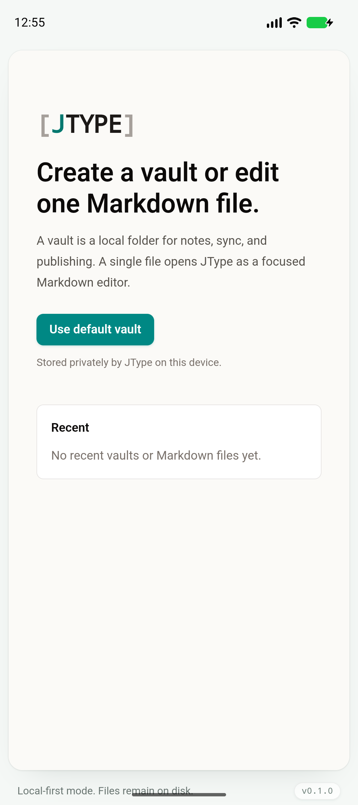
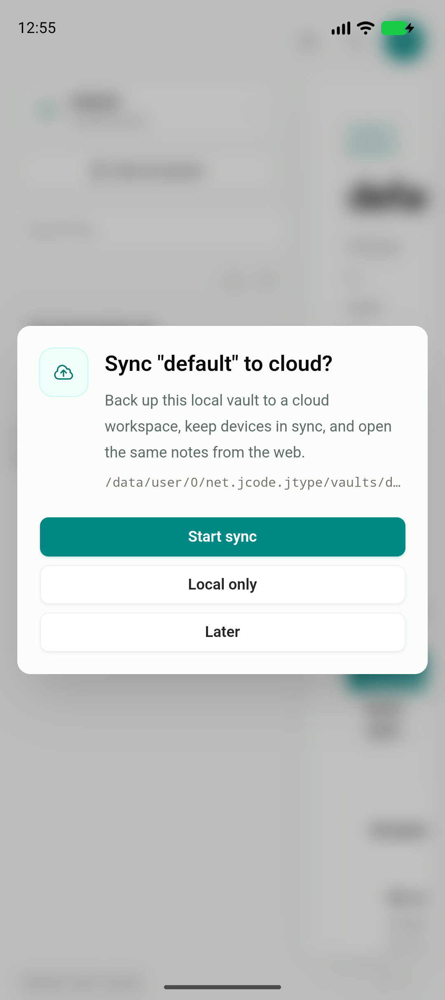
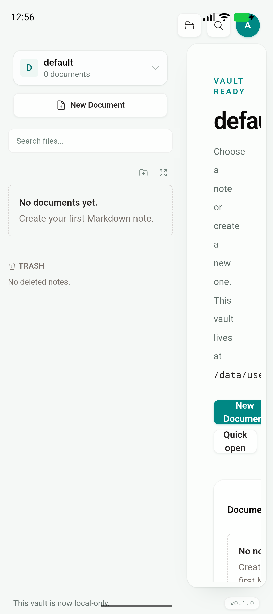
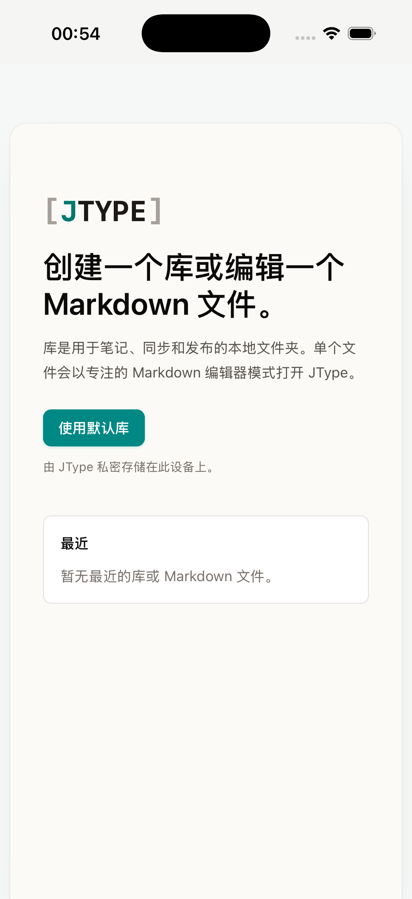

# Phase 0 — Mobile foundation verification

> 验收日期：2026-07-18  
> Feature branch：`codex/mobile-app`  
> 被测 app commit：`a60ed04`  
> 结论：通过。Android/iOS 共用现有 Tauri + React 应用壳，均在真实模拟器冷启动；Android 进一步验证了 app-private 默认库。

## 本阶段覆盖

- 生成并纳管 Tauri Android/iOS 原生工程。
- Android/iOS 使用 `net.jcode.jtype`；desktop identifier 与升级链保持不变。
- desktop updater、process restart、window drag、CLI 与外部 vault capability 不进入 mobile runtime。
- Rust/React 通过同一份 `RuntimeCapabilities` 合约做兼容，不建立第二套移动端 UI。
- mobile 默认库与配置进入 app-private storage；desktop 继续使用原路径。
- mobile lifecycle、外部 URI 与真实 filesystem path 建立统一边界。
- 欢迎页仍复用 desktop 组件，但在 mobile 隐藏尚未支持的外部 vault/file 操作，并正确说明私有存储。

## 测试环境

| 平台 | 环境 |
| --- | --- |
| Host | macOS 26.5.2, Apple Silicon |
| Android | AVD `JType_API_36_1`, Android 16 / API 36, arm64, 1080 × 2424 |
| iOS | iPhone 17 Pro Simulator, iOS 26.5, arm64, UDID `BD64DE20-5397-486C-8899-4B974425A0AD` |
| Rust | 1.96.1；desktop、Android 四 ABI、iOS device/simulator targets |
| Android toolchain | SDK 36/36.1, NDK 27.2.12479018, JDK 21 |

## 自动化与构建结果

| 门禁 | 结果 |
| --- | --- |
| `pnpm build` | PASS |
| `cargo test --manifest-path src-tauri/Cargo.toml` | PASS，2 passed |
| `pnpm exec playwright test tests/e2e/app.spec.ts` | PASS，31 passed；包含 desktop runtime 与 mobile private-vault capability 用例 |
| `pnpm tauri android build --debug --target aarch64 --apk --ci` | PASS；生成 `app-universal-debug.apk` |
| `pnpm tauri ios build --debug --target aarch64-sim --no-sign --archive-only --ci` | PASS；生成 `jtype_iOS.xcarchive` |
| `pnpm tauri dev` | PASS；macOS 原生 binary 成功启动并持续运行 62 秒，无退出/崩溃 |

桌面 empty、vault home、document、编辑保存、同步和草稿等行为由同一轮 31 条 app E2E 覆盖。尝试用 Computer Use 读取原生窗口时 host 处于锁屏状态，安全边界阻止 UI 捕获；没有尝试绕过。该限制不影响 Android/iOS 模拟器证据。

## Android Emulator

执行流程：

1. 冷启动 `JType_API_36_1`，`sys.boot_completed=1`。
2. `adb install -r` 安装最新 debug APK。
3. `am start -W -n net.jcode.jtype/.MainActivity` 返回 `Status: ok`、`LaunchState: COLD`。
4. `dumpsys activity` 显示 `net.jcode.jtype/.MainActivity` 为 `topResumedActivity`。
5. 检查 `AndroidRuntime:E` / native fatal log，无启动崩溃。
6. 点击“Use default vault”，选择“Local only”。
7. `run-as net.jcode.jtype find vaults` 确认创建：
   - `vaults/default/.jtype/workspace.json`
   - `vaults/default/.jtype/publish.json`

启动页：



app-private 默认库与同步选择：



进入 VaultHome 后的截图：



最后一张图刻意保留了 Phase 1 的首要问题：desktop 双栏 VaultHome 在手机宽度下被挤压。Phase 0 只验收共享应用壳、平台兼容层与私有库；adaptive navigation/container 在 Phase 1 修复，并必须重新在模拟器截图验收。

## iOS Simulator

执行流程：

1. boot iPhone 17 Pro，`simctl bootstatus -b` 完成。
2. 安装无签名 simulator archive 中的 `JType.app`。
3. `simctl launch ... net.jcode.jtype` 成功返回进程 PID。
4. 等待启动后截图，确认不是 splash，而是共享 React 欢迎页。
5. 截图确认 mobile capability 已隐藏外部 vault/file 操作，并显示 app-private storage 文案。



## 已知警告与处理

- Tauri iOS CLI 在 simulator `--no-sign` 的非 archive-only 收尾中会尝试把 `JType.app` 重命名到同名目录，返回 `Directory not empty`。`--archive-only` 完整编译 Rust、前端与 Xcode archive，并稳定产出可安装的 simulator app；后续 simulator gate 固定使用该命令。
- Xcode 提示 app 声明了文件类型但尚未声明 `LSSupportsOpeningDocumentsInPlace` / document browser。Phase 1 实现 iOS file importer/security-scoped adapter 时一起确定策略。
- 首次把 Android 与 iOS 完整构建并行执行时 Gradle 返回一次非确定性失败；独立重跑 Android 完整命令成功。后续阶段的最终发布门禁串行执行两个原生构建，避免共享前端/生成目录争用。
- Vite 的 chunk size、第三方 direct `eval` 与 dynamic-import 提示是既有 warning，本阶段没有扩大为构建错误。

## 证据校验值（SHA-256）

```text
cdf9986d8d3906ec6e2e09e9e17752aead52fc610e2a0df87428ea67b6c44888  android-start.png
95fc574fec7f2fae7bcb23bfe3a1d3cdaae9303aac36539c948d3cb95d363235  android-default-vault.png
1641e2c929e97bef44e8f2292a80767d53fe165d3c1bae10f6d9729825eee859  android-vault-home.png
e0d4fa58893518949811e0882886bbb373750d8323bc980fbdf43d1d5c8480ac  ios-start.png
```

## Phase 1 入口条件

Phase 0 没有改造 desktop 的导航与编辑器结构。Phase 1 从同一份组件树继续，优先交付：

1. compact navigation/container，使 VaultHome、文档列表、编辑器、预览、Document Info 和 Board 在手机宽度可用；
2. app-private vault 内的创建、编辑、保存、搜索和回收站完整 flow；
3. Android/iOS 文件导入 adapter；
4. 每个工作段继续独立 commit，并在双模拟器保存功能截图。
