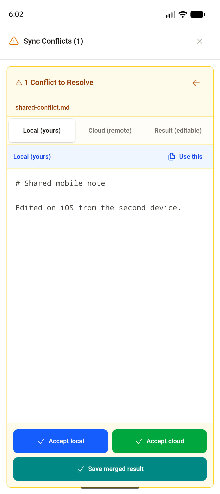
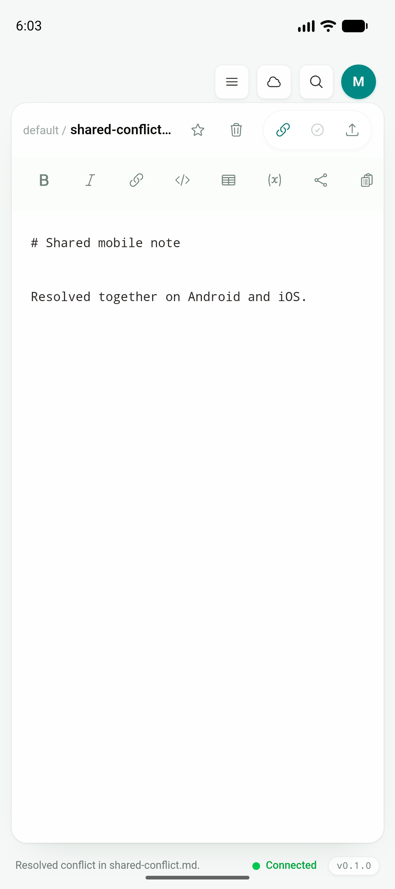
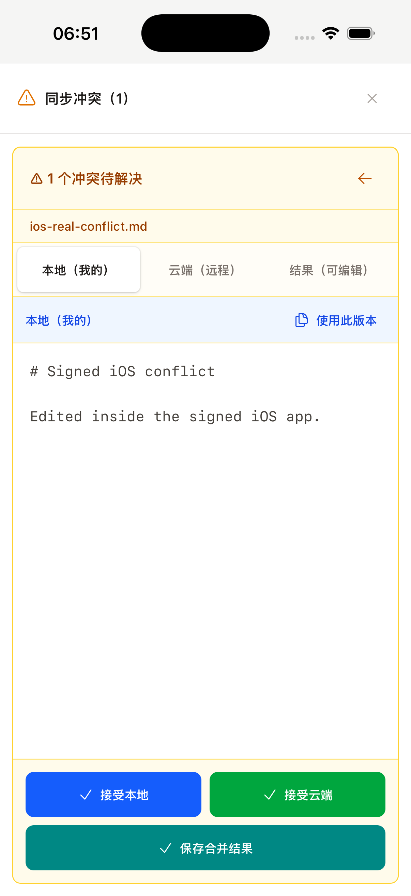
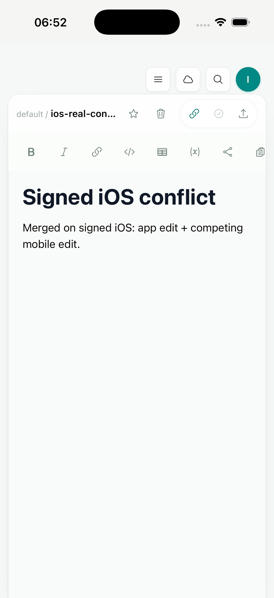

# Phase 1.7：移动端冲突比较与真实服务解决流程

日期：2026-07-18

实现 commit：`b39e920`

## 结果

移动端继续复用 desktop 的 `ConflictDialog`、`ConflictResolver`、`useCloudSync` 和服务端三方合并协议，没有建立第二套冲突业务逻辑。兼容差异只通过现有 `RuntimeCapabilities` 传入共享组件：phone 使用 Local / Cloud / Result 单面板 tabs、全高 safe-area Dialog 和至少 44px 的底部动作；desktop 与 web 未传入 compact capability 时仍保持原有三栏比较界面。

Android 与 signed iOS Simulator 都已在真实本地 Axum 服务、MySQL、一次性账户和 cloud workspace 上完成 conflict → manual merge → resolved 闭环。两端都使用共享 `EditorShell`、eager sync、冲突 Dialog 和 resolution callback；第二个经过认证的 mobile client 负责制造重叠编辑。

Android 的完整流程为：

1. app-private vault 拉取初始文档和 sync base。
2. Android 在共享 `EditorShell` 中编辑并保存，现有 eager sync 把正文提交到 cloud，clock 从 1 更新为 2。
3. 第二个经过认证的 mobile 客户端以旧 base 提交同一区域的 iOS 编辑，REST header 使用 `x-client-type: mobile`，服务端生成 open conflict，并返回 base / local / cloud 与冲突行范围。
4. Android 通过现有 online recovery / pull 链路看到 `1 CONFLICT`，打开共享冲突 Dialog。
5. 在 phone compact UI 中查看 Local / Cloud / Result，编辑合并结果并执行 `Save merged result`。
6. 服务端 conflict 更新为 `resolved`、resolution 为 `manual_merge`；文档正文更新为合并结果，clock 从 2 更新为 3。

服务端创建的 conflict id、一次性 token、账户密码均未写入截图或仓库；测试结束后对应用户及级联数据被精确删除。

## UI 兼容实现

- `ConflictResolver` 新增可选 `compact` / `touchOptimized` props，默认值保持 desktop/web 三栏行为。
- phone 只渲染当前 Local、Cloud 或 Result pane，避免 390px viewport 内出现三个不可读窄列。
- Result 使用相同的 editable merge buffer；Accept local、Accept cloud、Save merged result 继续调用原有 callbacks。
- mobile action footer 固定在可视区域底部并包含 bottom safe area；按钮触控高度至少 44px。
- 图标继续使用 Heroicons；Dialog 继续使用 Headless UI `Dialog` / `DialogPanel`。
- `shared/` 不读取 Tauri 或 user agent；platform layer 从 canonical capability provider 传入布局能力。

## 模拟器证据

### Android：真实 conflict → manual merge → resolved

环境：`JType_API_36_1`，Android API 36.1 arm64 emulator；app commit `b39e920`。

冲突页显示三个明确 tabs，当前只展示一份正文，底部动作始终可触达：

提交 manual merge 后回到共用 `EditorShell`，冲突 badge 消失，状态栏显示解决成功与 Connected，编辑器正文与服务端一致：

### iOS：signed app 的真实 conflict → manual merge → resolved

环境：iPhone 17 Pro Simulator，iOS 26.5，arm64；app code commit `ad5a9ef`；Xcode `Sign to Run Locally`。

1. signed JType 从 app-private vault 打开 `ios-real-conflict.md`，拉取初始正文和 sync base。
2. 第二个 authenticated mobile client 修改 cloud；iOS 在共享 editor 中编辑本地正文并按 Save。
3. eager sync 立即显示 `1 个冲突`，无需再手动执行一次全量同步。
4. 打开 compact conflict Dialog，逐一查看 Local / Cloud / Result，编辑 Result 并保存 manual merge。
5. UI 回到共享 editor，冲突 badge 消失；服务端 open conflict 数为 0，文档正文与 Result 一致。

首次真实运行还暴露出 eager save 后紧接全量 sync 会为同一路径生成两个 open conflict。`ad5a9ef` 完成两层修复：前端解析 eager push 返回的 conflict 并立即更新 UI；服务端复用同一路径现有 open conflict，解决时同时清理旧版本遗留的重复 open rows。修复后重新制造重叠编辑，Save 后立即出现一个 conflict；再次手动 Sync 仍保持同一个 conflict id、数据库 open count 为 1，manual merge 后为 0。

## 自动化与回归

| 验证 | 结果 |
| --- | --- |
| `npm run build` | PASS |
| `npm run build --prefix services/jtype-web/frontend` | PASS |
| `npm run test:unit` | PASS，47/47 |
| `npx playwright test tests/e2e/app.spec.ts` | PASS，42/42 |
| `cargo test --manifest-path services/jtype-web/Cargo.toml --test sync_tests` | PASS，12/12 |
| `cargo test --manifest-path src-tauri/Cargo.toml` | PASS，5/5 |
| 390×844 mobile conflict comparison/manual merge E2E | PASS |
| desktop conflict comparison/manual merge E2E | PASS |
| `pnpm tauri android build --debug --target aarch64 --apk --ci` | PASS |
| `pnpm tauri ios build --debug --target aarch64-sim --no-sign --archive-only --ci` | PASS |

新增 E2E 会在 mobile capability 下断言三个 tabs、单 pane、touch actions 和 manual merge callback；同轮 desktop 用例继续断言 Local / Cloud / Result 三栏同时存在，从测试层防止 compact 分支污染 desktop。

最终 Android debug APK：

- 路径：`src-tauri/gen/android/app/build/outputs/apk/universal/debug/app-universal-debug.apk`
- 大小：189,218,612 bytes
- SHA-256：`d6d3287d3d894fff1363e314bdd1e6fa99febe39e0ef09e7855a1048f1cef854`

本轮 iOS 运行证据来自 Simulator 专用的本地签名 app；签名仅用于在模拟器启用与正式 app 相同的 Keychain entitlement，不修改仓库中的发布签名配置。

## 已知问题与后续

- Phase 2 继续处理进程终止后的安全 OAuth pending-state 恢复、外部 vault provider、系统 share target 与真实设备弱网。
- 并发请求在数据库事务级别的唯一性强化可继续纳入 Phase 2 sync 幂等工作；当前 sequential eager/full-sync 重复提交已经由服务端测试和真实 iOS 流程覆盖。
