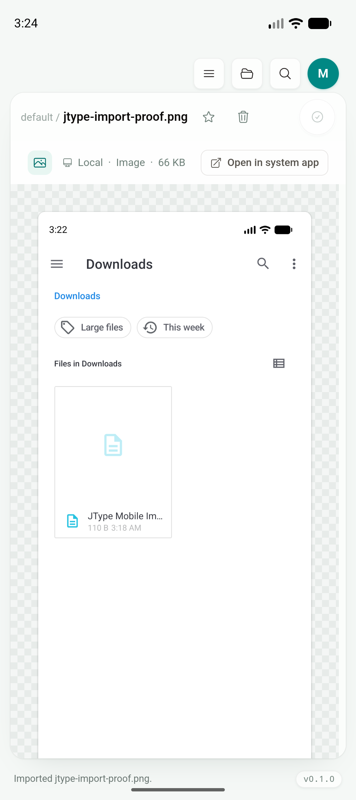
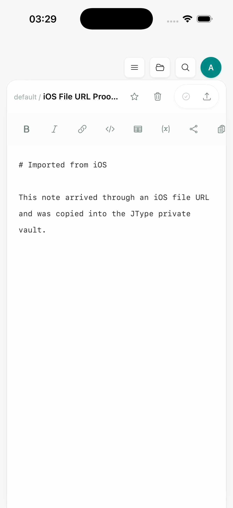

# Phase 1.5：移动端外部文件导入

日期：2026-07-18

## 结果

Android 与 iOS 已共用 desktop 的 vault 导入和资源打开流程。平台层只负责把系统文件引用转换成短生命周期的本地缓存文件：Android 读取 `content://`，iOS 读取 file URL 并尝试访问 security-scoped resource；随后仍由 Rust `jtype-core` 完成 collision-safe import，React 继续使用同一套 Markdown 编辑器、资源查看器、状态提示和目录刷新逻辑。

移动端不会把 provider 文件当作可长期持有的路径，也不会原地编辑外部文件。iOS bundle 明确配置 `LSSupportsOpeningDocumentsInPlace = false`，导入完成后只保留 app-private vault 中的副本。

## 实现范围

- 新增内部 Rust-only Tauri plugin `plugins/mobile-import`，不向 JavaScript 暴露额外权限。
- Android adapter 使用 `ContentResolver` 读取授权 URI，通过 `OpenableColumns.DISPLAY_NAME` 保留文件名，并复制到 `cacheDir/jtype-imports/<uuid>/`。
- iOS adapter 对 picked file URL 调用 `startAccessingSecurityScopedResource()`，复制到 `Caches/jtype-imports/<uuid>/` 后释放访问权。
- Rust `import_external_paths` 在 mobile 先 materialize，再调用现有 `jtype-core::import_external_path`，最后清除临时目录。
- cold-start 与 warm open-with 统一进入 `pending_external_file_sources` 队列；前端消费后立即 drain，避免下次启动重复导入。
- 文件选择、drag/drop、open-with 共用 `importExternalSources()`；desktop 仍使用普通路径，行为和不支持类型校验保持不变。
- New Resource 的 Import 会沿用当前目录，不再总是落到 vault 根目录。

## 运行验证

### Android

环境：`JType_API_36_1`，Android API 36，arm64 emulator。

通过共享 New Resource → Import file 操作打开系统 DocumentsUI，在 Downloads 选择 PNG。系统返回真实授权 `content://` URI，adapter 成功读取并导入：

- app-private 结果：`vaults/default/jtype-import-proof.png`
- 界面状态：`Imported jtype-import-proof.png.`
- 资源查看器自动打开导入图片

### iOS

环境：iPhone 17 Pro simulator，iOS 26.5，arm64 simulator archive。

`simctl` 不能可靠模拟 Files app 的 Open with 选择，因此运行验证使用一次性 debug smoke hook，把 simulator 内的 file URL 注入同一个 cold-start external-source 队列。Swift adapter、Rust import、默认私有 vault 恢复和 React 自动打开编辑器均实际执行；hook 随后已从源码删除，并重新生成了最终 archive。

- app-private 结果：`Library/Application Support/net.jcode.jtype/vaults/default/iOS File URL Proof.md`
- 文件内容与源文件一致
- 同一套 mobile Markdown editor 自动打开导入文档
- 最终 archive 的 `LSSupportsOpeningDocumentsInPlace` 为 `false`

仍需在签名真机上补一轮第三方 Files provider 的 security-scoped URL 与系统 Open with 入口验收；这不阻塞当前 adapter、共享导入流程和 simulator archive。

## 回归结果

- `pnpm build`：通过
- `npx playwright test tests/e2e/app.spec.ts`：35/35 通过
  - 新增 Android `content://` 共享资源导入覆盖
  - 新增 iOS-like initial file URL / open-with 覆盖
- `cargo check --manifest-path plugins/mobile-import/Cargo.toml`：通过
- `cargo test --manifest-path src-tauri/Cargo.toml --locked`：4/4 通过
- `pnpm tauri android build --debug --target aarch64 --apk --ci`：通过
- `pnpm tauri ios build --debug --target aarch64-sim --no-sign --archive-only --ci`：通过

最终 Android debug APK：

- 路径：`src-tauri/gen/android/app/build/outputs/apk/universal/debug/app-universal-debug.apk`
- 大小：365,967,908 bytes
- SHA-256：`f4eaf504bce086bb59f579779f40296c950b2b81001309569b86f0e00709628c`

最终 iOS simulator archive：`src-tauri/gen/apple/build/jtype_iOS.xcarchive`（约 98 MB）。

## 后续

- 签名 iPhone/iPad 上验证第三方 provider 和真实 Open with 生命周期。
- 完成移动端导出/分享流程。
- 补 Android `ACTION_SEND` / `ACTION_SEND_MULTIPLE` 和 iOS Share Sheet 的端到端验收。
