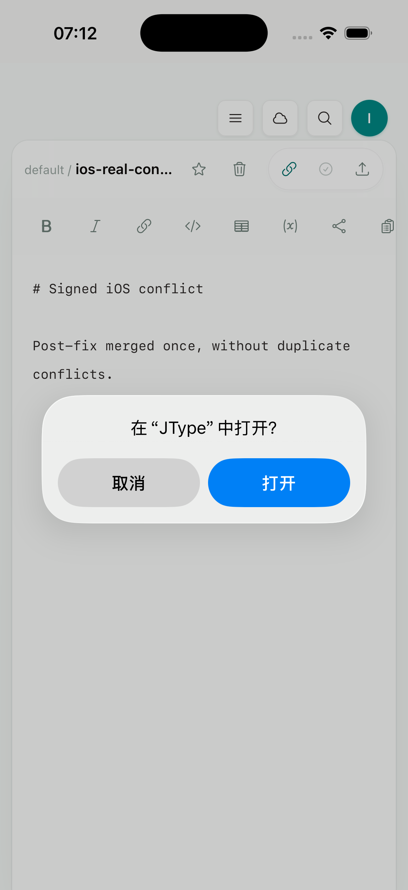
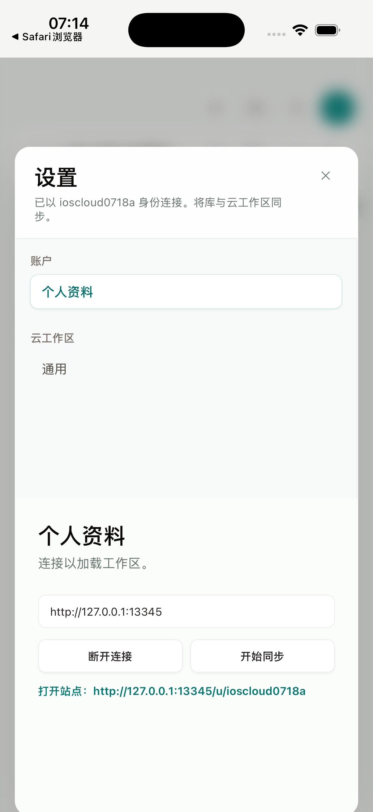

# Phase 1.6：移动端浏览器 OAuth 与 deep-link 回跳

日期：2026-07-18

实现 commit：`844e9ea`

Android 兼容修复 commit：`99f474a`

signed iOS 终验 app code commit：`ad5a9ef`

## 结果

Android 与 iOS 现在继续复用 desktop 的 `useCloudSync`、device OAuth API、账户 Dialog 和 cloud profile；移动端没有第二套登录 UI 或操作链。平台差异只位于 capability、原生 deep-link 注册和回跳 adapter：mobile 请求附带固定回调 `jtype://oauth/complete`，浏览器授权完成后由 Tauri deep-link listener 唤醒同一个轮询流程；desktop 的 OAuth request body、verification URL 和浏览器流程保持原样。

回调不携带 code、token、用户名或其他凭据。客户端和服务端都只接受完全相等的 `jtype://oauth/complete`：query、hash、credentials、其他 host/path 与 `https` URL 均拒绝，避免把任意 URL 变成开放重定向。真正的授权仍由原有短期 device code、服务端审批和 token polling 完成。

## 实现边界

- `shared/lib/mobileOAuth.ts` 定义唯一 callback 常量和严格校验函数，desktop/mobile/web OAuth 页面共用同一规则。
- `useCloudSync` 继续拥有唯一的 device OAuth command；mobile 只增加 `returnUrl`、在打开系统浏览器前安装回跳 handler，并在回跳后立即触发现有 poll。
- `useMobileOAuthDeepLink` 只在 mobile capability 下加载 Tauri deep-link plugin，监听运行中 URL 和启动时待处理 URL；desktop 不加载该 listener。
- Android Manifest 注册 `VIEW`、`BROWSABLE` 和 `jtype` scheme；iOS `CFBundleURLTypes` 注册相同 scheme。
- Axum 仅允许固定 mobile callback，并把它编码为 verification URL 的 `return_to`；未提供 `returnUrl` 的 desktop 请求完全保持原 contract。
- web Device OAuth 页面授权成功后尝试返回 JType，并提供显式的 “Return to JType” 按钮；英文、简体中文、日文和韩文文案同步更新。
- 内存中的 active handler 只服务当前 OAuth 流程；app 被系统终止后的 device-code 恢复明确放到 Phase 2，不在本段伪装成已完成。

## Android 真实流程

环境：`JType_API_36_1`，Android API 36.1 arm64 emulator；最终 app commit `99f474a`。

真实 smoke 使用本地 Axum `jtype-web`、MySQL 和一次性用户。服务端创建真实 device code，verification URL 带有 URL-encoded `return_to=jtype://oauth/complete`。Chrome 中完成真实登录与 device authorization 后，页面显示自动返回状态和显式 “Return to JType” 动作；Android 将该动作解析为 `VIEW dat=jtype://oauth/complete`。

第一次运行暴露出底层兼容问题：Tao 0.35.0 在 Android `onNewIntent` 中对无 MIME 的 custom-scheme Intent 调用 JNI string conversion，并对 null result `unwrap()`，导致 `NullPtr("get_object_class")` 和 `SIGABRT`。这不是 JType OAuth 状态机或内存压力造成的。`99f474a` 将锁定版本升级到 Tao 0.35.3；该版本会先过滤 null MIME，再以可失败方式读取字符串。

修复后使用同一真实服务链重复创建并审批 device code，再发送真实 Android `VIEW` Intent：

1. JType 在 PID `10601` 中启动 OAuth、进入后台并保持 active handler。
2. 服务端审批完成后发送 `jtype://oauth/complete`。
3. Android 把当前 JType task 拉回前台；回跳后 PID 仍为 `10601`，不是冷启动替代验证。
4. listener 立即触发原有 poll，设置页显示 `Connected as oauthsmoke0718c.` 和 cloud workspace 入口。
5. 清空后的 logcat 中没有 `panic`、`FATAL`、`SIGABRT` 或 `NullPtr`。

截图不包含 device code、password 或 token；一次性账号及其级联数据在验证后精确删除。

## iOS signed 真实流程

环境：iPhone 17 Pro Simulator `BD64DE20-5397-486C-8899-4B974425A0AD`，iOS 26.5，arm64；app code commit `ad5a9ef`；Xcode `Sign to Run Locally`。

signed app 的 `Info.plist` 包含 `CFBundleURLTypes` / `jtype`。第一次执行 callback 时，LaunchServices 找到 `net.jcode.jtype` 并显示系统“在 JType 中打开？”确认；Maestro 通过真实 XCTest input 点按“打开”，JType 返回前台且进程保持存活。

随后从共享 Account Dialog 完整执行真实流程：

1. 断开已有 profile，点击“在浏览器中连接”。
2. JType 通过现有 API 创建短期 device code，并打开 Safari verification URL。
3. 使用一次性已认证账户在真实 Axum 服务批准该 device code。
4. 打开固定 `jtype://oauth/complete` callback，JType 从 Safari 返回前台。
5. active handler 立即调用原有 poll；Account Dialog 显示 `Connected as ioscloud0718a.`。
6. `load_cloud_profile` 返回同一用户名与 64 字符 token；磁盘 `cloud-profile.json` 的 token 长度为 0，证明最终凭据写入 iOS Keychain 而非 WebView/JSON。

一次性用户、workspace、documents、conflicts 和 device OAuth 数据在验证后按明确 id/username 级联删除；截图和仓库未保存 password、device code 或 token。

## 自动化与回归

| 验证 | 结果 |
| --- | --- |
| `npm run build` | PASS |
| `npx playwright test tests/e2e/app.spec.ts` | PASS，41/41 |
| `npm run test:unit` | PASS，47/47 |
| `cargo test --manifest-path services/jtype-web/Cargo.toml --test oauth_tests` | PASS，9/9 |
| `cargo test --manifest-path src-tauri/Cargo.toml --locked` | PASS，4/4 |
| `cargo check --manifest-path services/jtype-web/Cargo.toml` | PASS |
| `npm run build --prefix services/jtype-web/frontend` | PASS |
| `pnpm tauri android build --debug --target aarch64 --apk --ci` | PASS |
| `pnpm tauri ios build --debug --target aarch64-sim --no-sign --archive-only --ci` | PASS |

关键自动化断言包括：desktop OAuth body 不出现 `returnUrl`；mobile 使用固定 callback；无关 deep link 不触发 poll；合法回跳立即 poll 并打开账户 Dialog；服务端拒绝外部 return URL；无 callback 的 desktop verification URL 不出现 `return_to`。

最终 Android debug APK：

- 路径：`src-tauri/gen/android/app/build/outputs/apk/universal/debug/app-universal-debug.apk`
- 大小：189,217,061 bytes
- SHA-256：`d44425b213be5ffeff707c744bd404ad6fd1ee377e1a4ae06b442b606fc424af`

最终 iOS simulator archive：`src-tauri/gen/apple/build/jtype_iOS.xcarchive`（约 99 MB）。

## 后续

- Phase 2.2：把 device code、poll interval、expiry 和 pending return intent 持久化到安全的原生状态，使 app 被系统终止后仍能冷启动恢复授权；不得持久化最终 token 到 WebView storage。
- Phase 2.3：在固定自有 deep link 基础上增加可验证的 universal/app links，并支持定位到 cloud workspace、vault 和文档。
- Phase 2.4：在真实设备弱网、浏览器切换、后台时间限制和进程终止场景重复 OAuth/sync 验收。
