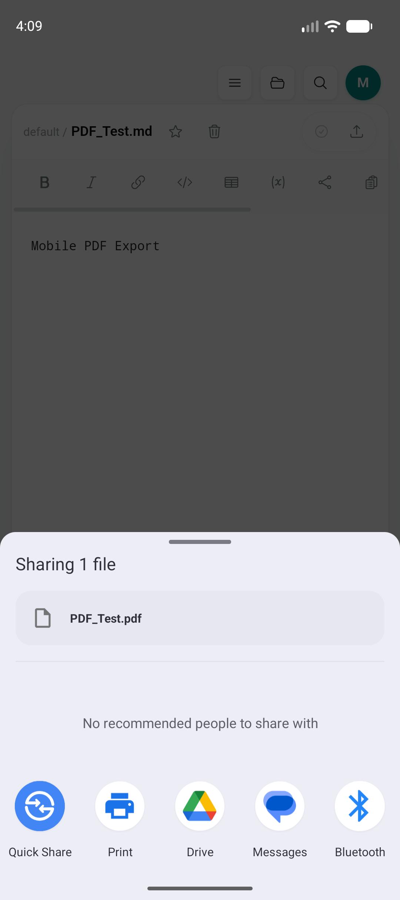
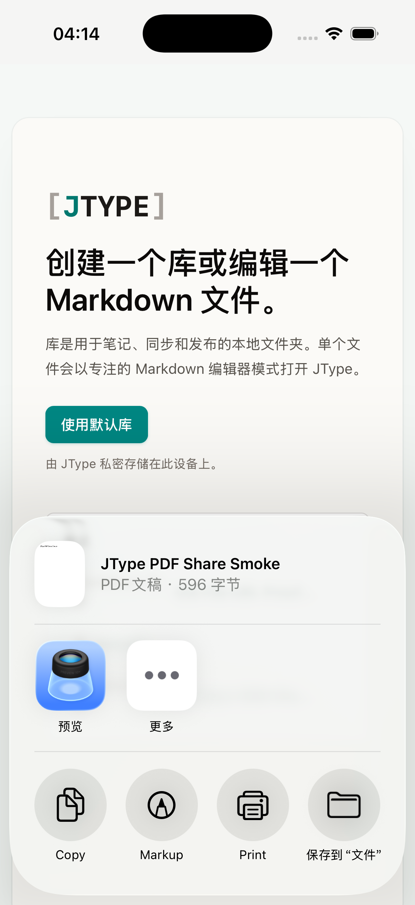

# Phase 1.5：移动端 PDF 导出与系统分享

日期：2026-07-18

实现 commit：`0556be3`

## 结果

Android 与 iOS 现在复用 desktop `EditorShell` 中同一个 Export → PDF 菜单、`renderPreviewPdfBytes()` renderer 和当前 editor buffer。平台差异只发生在生成 PDF 之后：desktop 继续打开保存对话框并写入用户选择的路径，mobile 将同一份 PDF 写入 app-scoped share cache，再打开系统分享面板。

没有复制 PDF renderer、Export 菜单或移动端 EditorShell。`RuntimeCapabilities.isMobile` 是组件内唯一分支；文件名清理、cache 生命周期和 native Share Sheet 位于 Rust / native adapter 边界。

## 实现范围

- 新增内部 `share_pdf` Tauri command，接收现有 renderer 生成的 PDF bytes。
- Android/iOS/Markdown/PDF 共用 `plugins/mobile-share` 的 `shareFile` native entry；adapter 只接收受限缓存路径和 MIME，不接触编辑器业务。
- Rust 在 `app_cache_dir()/jtype-shares/<process>-<timestamp>/` 写入分享文件，清理文件名中的路径和控制字符，并保证 `.pdf` / Markdown 扩展名。
- native adapter 只允许分享 JType bundle/app cache 下的 `jtype-shares` 文件，并只接受 `application/pdf` 或 `text/markdown`。
- Android 使用现有独立 `FileProvider`、`ACTION_SEND`、临时只读 URI permission 和系统 chooser；iOS 使用 `UIActivityViewController`。
- 两端继续清理超过 24 小时的 share cache；启动 Share Sheet 失败时立即清理本次目录。

模拟器第一次尝试将 10 MB PDF 作为 JSON 整数数组再次跨 Rust → native bridge 传递时，Android 在序列化阶段触发 OOM。最终实现改为 Rust 先落 app cache、native 只接收路径，消除了第二次大字节 JSON 拷贝。修正后的相同 PDF 在 Android chooser 中成功打开。

## 运行验证

### Android

环境：`JType_API_36_1`，Android API 36，arm64 emulator。

从共享 EditorShell 创建并编辑 `PDF_Test.md`，实际执行 Export → PDF。系统 `ChooserActivity` 成功打开并确认：

- headline：`Sharing 1 file`
- 文件名：`PDF_Test.pdf`
- 接收动作：Quick Share、Print、Drive、Messages、Bluetooth
- 前台窗口：`com.android.intentresolver/.ChooserActivityLauncher`
- share cache 文件：10,703,266 bytes，签名 `%PDF-1.3`

将该文件从 emulator 拉出后使用 `pdfinfo` 验证：1 页、A4 595.28 × 841.89 pt、未加密、PDF 1.3；使用 Poppler 重新渲染后，页面正确显示 editor 中的 `Mobile PDF Export` 内容。该短文档的 10.7 MB 体积表明当前 canvas-based renderer 仍需在 Phase 2 做内存和文件大小优化，但系统分享链路已稳定工作。

### iOS

环境：iPhone 17 Pro simulator，iOS 26.5，arm64 simulator archive。

`simctl` 不提供可靠的 WebView tap 注入，因此 UI action → renderer → `share_pdf` 由 E2E 覆盖；native 运行验证使用一次性 debug smoke 开关调用完全相同的 Rust cache / plugin entry，并传入一份经过 `pdfinfo` 验证的单页 PDF fixture。Share Sheet 成功识别：

- 标题：`JType PDF Share Smoke`
- 类型：PDF 文稿
- 大小：596 字节
- 系统动作：预览、Copy、Markup、Print、保存到“文件”
- cache 路径正确位于 bundle-scoped `Library/Caches/net.jcode.jtype/jtype-shares`

验证过程中发现并修正了 Tauri `app_cache_dir()` 与 UIKit caches 根目录之间的 bundle 子目录差异。一次性 smoke 开关随后已从源码删除，最终 iOS archive 已重新生成且不包含该入口。

Android 测试文档、两端 PDF fixture 和 share cache 均已从模拟器删除；仓库只保留验证截图。

## 回归结果

- `npm run build`：通过
- `npx playwright test tests/e2e/app.spec.ts`：38/38 通过
  - desktop PDF export 仍走 save-file adapter，并写出 `%PDF` bytes
  - mobile PDF export 使用当前未保存 editor buffer，并将 `%PDF` bytes 送入 `share_pdf`
  - 原有 desktop / mobile Markdown export 回归继续通过
- `cargo check --manifest-path plugins/mobile-share/Cargo.toml`：通过
- `cargo test --manifest-path src-tauri/Cargo.toml --locked`：4/4 通过
- `pnpm tauri android build --debug --target aarch64 --apk --ci`：通过
- `pnpm tauri ios build --debug --target aarch64-sim --no-sign --archive-only --ci`：通过

最终 Android debug APK：

- 路径：`src-tauri/gen/android/app/build/outputs/apk/universal/debug/app-universal-debug.apk`
- 大小：366,159,128 bytes
- SHA-256：`82f0abf808f4c649f3cc360c2de7896e443e4499c1382cc30473340474c0d5cd`

最终 iOS simulator archive：`src-tauri/gen/apple/build/jtype_iOS.xcarchive`（约 99 MB）。

## 后续

- 在签名 Android / iOS 真机上补第三方接收应用、后台切换和大文件分享生命周期验收。
- Phase 2 对长文档分页、CJK/自定义字体视觉、canvas 内存峰值和 PDF 文件大小设定基准并优化。
- 继续 Phase 1.6：前后台与网络恢复时的受控 cloud sync、WebSocket 重连和 mobile OAuth deep link。
