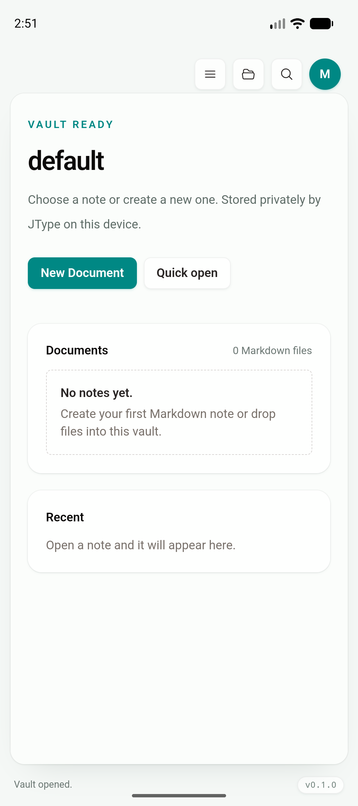
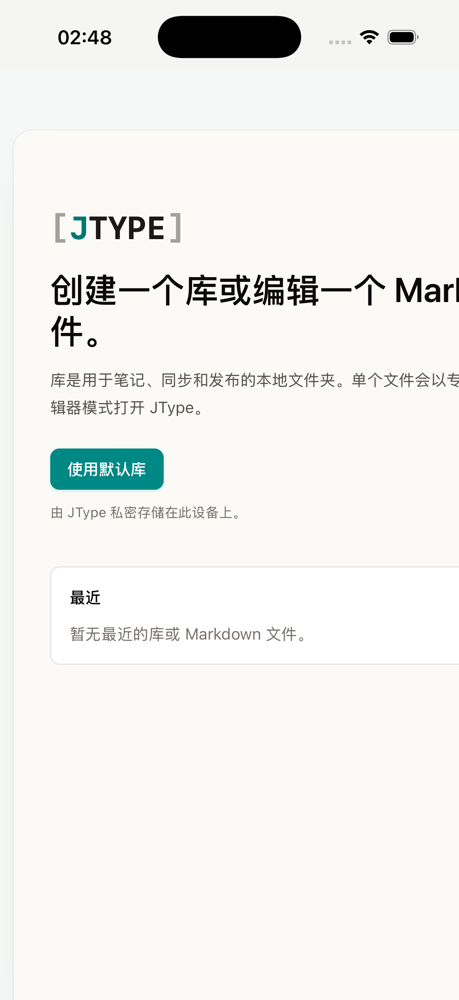

# Phase 1.6 — Mobile secure credential storage

> 日期：2026-07-18
>
> 实现 commit：`5110c83`
>
> 分支：`codex/mobile-app`

## 范围与结论

本段把 cloud token 从移动端 WebView `localStorage` 和 `cloud-profile.json` 中移除，并保持 desktop 现有存储行为不变。

- Android：token 由 Android Keystore 中的 AES-GCM key 加密，密文保存在 app-private `SharedPreferences`。模拟器已完成保存、进程重启、恢复和清理验证。
- iOS：token 使用 Security.framework generic-password Keychain，accessibility 为 `AfterFirstUnlockThisDeviceOnly`；adapter、entitlement、原生编译和调用链已接入。当前机器没有有效 Apple codesigning identity，unsigned Simulator archive 调用 Keychain 时缺少 entitlement，因此持久化验收保持未完成。
- React：mobile build 会清理旧版 `jtype.sync.token`，不再把敏感字段写入 WebView storage；账号名、site URL 等非敏感状态仍复用现有 reducer/storage 路径。
- Rust：`load_cloud_profile` / `save_cloud_profile` 仍是前端唯一接口。旧版 JSON 明文 token 只会在安全存储写入成功后才从 JSON 擦除，避免迁移中丢失唯一副本。
- 插件只从 Rust command 调用，没有暴露给页面 JavaScript 的 permission。

## 验证环境

| 平台 | 设备 | 系统 | 结果 |
| --- | --- | --- | --- |
| Android | `JType_API_36_1` / arm64 emulator | API 36.1 | Keystore 保存、恢复和清理通过 |
| iOS | iPhone 17 Pro Simulator `BD64DE20-5397-486C-8899-4B974425A0AD` | iOS 26.5 | 构建、安装、启动和原生调用通过；Keychain 持久化等待 signed build |
| Desktop | Chromium Playwright desktop capability | macOS host | 33/33 app E2E 通过 |

## 自动化与构建

| 命令 | 结果 |
| --- | --- |
| `cargo check --manifest-path plugins/secure-storage/Cargo.toml` | PASS |
| `cargo test --locked --manifest-path src-tauri/Cargo.toml` | PASS，4/4 |
| `pnpm build` | PASS |
| `pnpm exec playwright test tests/e2e/app.spec.ts` | PASS，33/33 |
| `pnpm tauri android build --debug --target aarch64 --apk --ci` | PASS |
| `pnpm tauri ios build --debug --target aarch64-sim --no-sign --archive-only --ci` | PASS |

## Android 运行时证据

在 Android WebView 调试连接中先放入旧版 localStorage token，再安装本段 mobile build，随后通过现有 `save_cloud_profile` / `load_cloud_profile` command 验证：

1. 启动后旧版 `localStorage["jtype.sync.token"]` 为 `null`。
2. 保存 profile 后，`cloud-profile.json` 的 `token` 为 `""`。
3. `jtype-secure-storage.xml` 只包含 AES-GCM IV/ciphertext，不含明文 token。
4. force-stop 并重新启动后，`load_cloud_profile` 返回与保存前一致的 token，同时 localStorage 仍为 `null`。
5. 验证结束后使用空 token 删除测试 credential，`SharedPreferences` 恢复为空 map。

报告不记录或截图任何测试 token。

## iOS 签名限制

最终无签名 app 可以在 Simulator 正常安装和启动，Swift plugin 也由最终工程成功编译。为了单独验证原生调用链，测试构建曾直接触发一次 profile 保存；Security.framework 返回 `A required entitlement isn't present.`。主机执行 `security find-identity -v -p codesigning` 显示 `0 valid identities found`。

仓库已经声明 Keychain access group，但 `--no-sign` archive 不会获得可用的 application identifier/keychain entitlement。后续需要在具有 Apple Development identity 与 provisioning 的环境中重复“保存 → 终止 → 重启 → 恢复 → 删除”流程，之后才能把 roadmap 的安全存储项标记为完成。临时 smoke 代码、测试 profile 和临时 entitlement 文件均已删除。

## 截图

Android：安全存储运行时验证完成后的 app-private vault。

iOS：最终无签名构建正常启动。截图同时记录一个尚未归入本提交修复范围的已知问题：首次启动欢迎内容在窄屏存在横向溢出，后续作为 adaptive shell UI 工作单独修复。

## 剩余验收

- 在 signed iOS Simulator/device build 验证 Keychain 跨进程持久化与删除。
- 修复 iPhone 窄屏欢迎页横向溢出，并补 phone 横竖屏截图。
- Phase 1 最终验收时再执行真实 cloud service 的 Android/iOS 登录、sync 和 conflict smoke flow。
