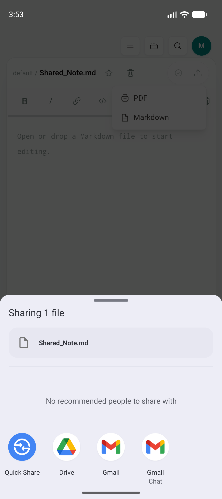
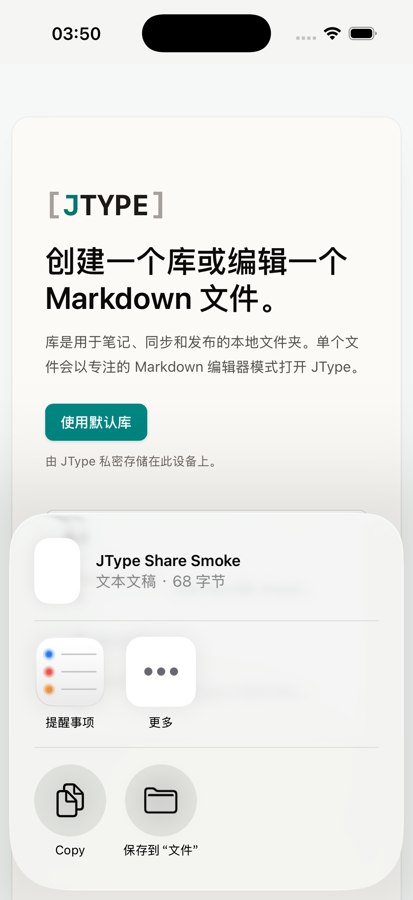

# Phase 1.5：移动端 Markdown 导出与系统分享

日期：2026-07-18

实现 commit：`4321824`

## 结果

Android 与 iOS 现在复用 desktop 编辑器里的同一个 Export → Markdown 操作。前端 action 只根据 canonical `RuntimeCapabilities.isMobile` 选择能力：desktop 继续打开保存对话框并写入用户选择的路径；mobile 则把当前编辑缓冲区交给 Rust-only adapter，再打开平台系统分享面板。

分享内容直接来自当前 editor buffer，不依赖磁盘上的旧版本，因此未保存修改也会进入分享文件。没有复制 EditorShell、菜单或 Markdown 导出业务组件，平台差异只存在于 adapter 内。

## 实现范围

- 新增内部 Tauri plugin `plugins/mobile-share`，不向 JavaScript 暴露 plugin command 或额外 capability 权限。
- `useFileSystem.exportCurrentMarkdown()` 保持为唯一 Markdown export action：desktop 原有 save dialog / write path 不变，mobile 调用同一个 Rust `share_markdown` command。
- Android 将 buffer 写入 `cacheDir/jtype-shares/<uuid>/<name>.md`，通过插件独立的 `FileProvider` 生成只读 `content://` URI，再以 `ACTION_SEND`、`text/markdown` 和临时读权限打开 chooser。
- Android chooser 排除 JType 自身，避免把导出内容再次导入本 app；其他接收应用只获得当前 URI 的临时读权限。
- iOS 将 buffer 写入 `Caches/jtype-shares/<uuid>/<name>.md`，使用 `UIActivityViewController` 展示系统 Share Sheet，并为 iPad popover 设置安全锚点。
- 两端每次分享都会清理超过 24 小时的 share cache；启动分享失败时清理本次临时目录。
- 文件名会去除路径和控制字符，并确保使用 Markdown 扩展名。

## 运行验证

### Android

环境：`JType_API_36_1`，Android API 36，arm64 emulator。

从共享 EditorShell 实际执行 Export → Markdown。系统 `ChooserActivity` 成功打开并确认：

- headline：`Sharing 1 file`
- 文件预览：`Shared_Note.md`
- JType 自身没有出现在候选接收应用中
- Quick Share、Drive、Gmail 等系统候选正常展示
- 当前前台窗口属于 `com.android.intentresolver`

### iOS

环境：iPhone 17 Pro simulator，iOS 26.5，arm64 simulator archive。

`simctl` 不提供可靠的 WebView tap 注入，因此运行验证使用一次性 debug smoke 开关调用与 UI action 完全相同的 Rust plugin entry，并传入文件名和 editor-buffer fixture。系统 Share Sheet 成功识别：

- 标题：`JType Share Smoke`
- 类型：文本草稿
- 大小：68 字节，与传入 buffer 一致
- Copy 与“保存到文件”等系统 action 正常展示
- simulator 日志确认 `com.apple.sharinguiservice` 启动，`UIActivityViewController` ready to interact

一次性开关随后已从源码删除，最终 iOS archive 已重新生成且不包含 smoke trigger。

两端测试文档和 share cache 已从模拟器删除，仓库只保留验证截图。

## 回归结果

- `npm run build`：通过
- `npx playwright test tests/e2e/app.spec.ts`：36/36 通过
  - desktop Markdown export 仍走原 save dialog，并保持原状态文本
  - mobile 测试验证未保存 editor buffer 与文件名原样进入 `share_markdown`
- `cargo check --manifest-path plugins/mobile-share/Cargo.toml`：通过
- `cargo test --manifest-path src-tauri/Cargo.toml --locked`：4/4 通过
- `pnpm tauri android build --debug --target aarch64 --apk --ci`：通过
- `pnpm tauri ios build --debug --target aarch64-sim --no-sign --archive-only --ci`：通过

最终 Android debug APK：

- 路径：`src-tauri/gen/android/app/build/outputs/apk/universal/debug/app-universal-debug.apk`
- 大小：366,298,744 bytes
- SHA-256：`786c47078620b6f5bb963c67a5dc9e72ffee71e200d1788dabe94de23260e09f`

最终 iOS simulator archive：`src-tauri/gen/apple/build/jtype_iOS.xcarchive`（约 99 MB）。

## 后续

- 将当前 PDF 导出接到同一个 mobile system-share adapter，并验证生成 PDF 的分页和字体。
- 在签名 Android / iOS 真机上补第三方接收应用与后台分享生命周期验收。
- 继续 Phase 1.6：前后台与网络恢复时的受控 cloud sync、WebSocket 重连和 mobile OAuth deep link。
