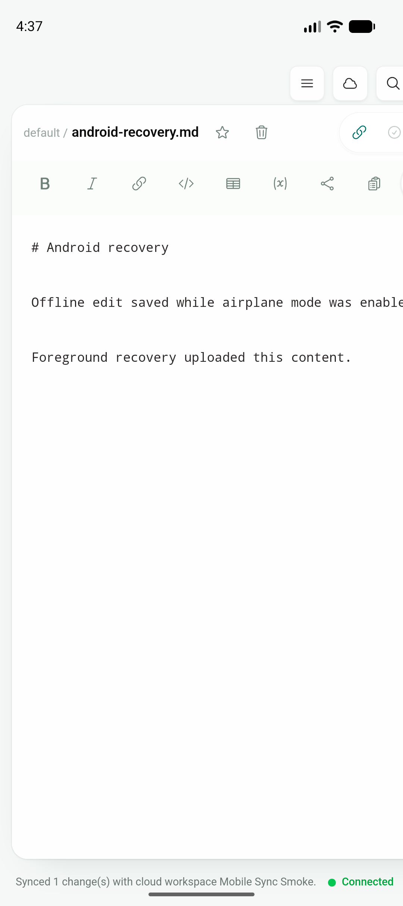
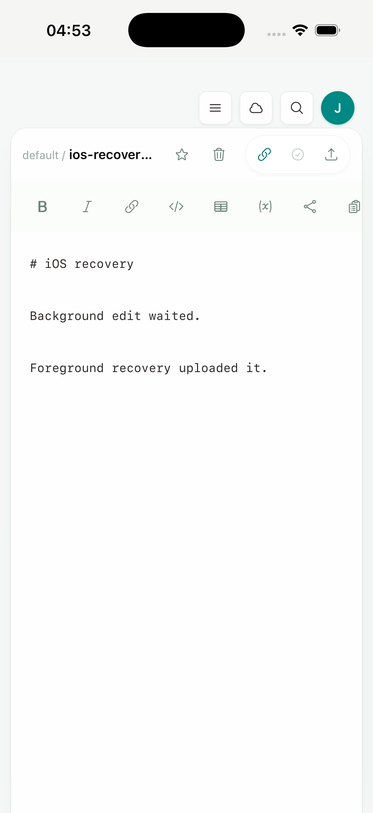

# Phase 1.6：移动端受控同步与 WebSocket 恢复

日期：2026-07-18

实现 commit：`27326e4`

## 结果

Android 与 iOS 现在共用 desktop 的 `useCloudSync`、vault binding、push/pull、冲突模型和 WebSocket command。移动端没有复制同步实现；只新增 lifecycle coordinator，在 app 进入后台时停止当前 cloud listener，在恢复前台或网络恢复时立即重启 listener，并调用同一个串行化 `syncWorkspaceToWeb()`。

恢复事件有 5 秒去重窗口和 in-flight guard。原生 lifecycle 与 WebView visibility 同时上报时只执行一轮恢复；如果 app 在旧恢复尚未结束时再次进入后台，则保留一轮必须执行的后续恢复。当前 editor 只有 dirty 时才从恢复同步中跳过，desktop 原有 visibility / online 行为保持不变。

## 实现范围

- 新增 `useMobileSyncRecovery`，统一处理 `app-resume`、`network-online`、后台停止与恢复排队。
- iOS/Android 原生 `app:lifecycle=active` 作为 mobile 恢复的权威信号，不依赖 WebView 一定先发出 hidden。
- mobile 后台调用现有 `stop_cloud_listener`，恢复时先调用现有 `start_cloud_listener`，再执行共享 push/pull 与 reconcile。
- `usePeriodicSync` 的 desktop visibility / online 恢复继续保留；mobile 由 lifecycle coordinator 接管，避免双重同步。
- 30 秒内由 mobile recovery 完成的全量 push/pull 会抑制随后 `cloud:ws-connected` 产生的重复 pull。
- E2E 的 Tauri mock 现在保留真实 event subscription callback，可以验证 lifecycle、online、WebSocket stop/start 和事件去重顺序。

## 运行验证

真实 smoke 使用本地 Axum `jtype-web`、MySQL、一次性用户和 cloud workspace。测试结束后用户及其级联数据已精确删除，两端 app 测试数据也已清理。

### Android：离线编辑 → 后台 → 恢复网络 → 热回前台

环境：`JType_API_36_1`，Android API 36.1 arm64 emulator；测试 app commit `27326e4`。

1. 安装当前 debug APK，在 app-private 默认 vault 绑定一次性 cloud workspace。
2. force-stop / relaunch 后，Android Keystore 中的 token 恢复成功，vault binding 恢复，UI 显示 Connected。
3. 打开 `android-recovery.md`，启用飞行模式并确认 host 不可达。
4. 离线编辑并保存；UI 显示 `Saved ... Offline`，服务器正文与 clock 保持不变。
5. 将 app 送入后台，在后台恢复网络，再热回前台。
6. 约 1 秒内 UI 显示 `Synced 1 change(s) with cloud workspace Mobile Sync Smoke.` 与 `Connected`。
7. 服务器文档 clock 从 1 更新为 2，正文与离线编辑完全一致；WebSocket event 的 source 为 `mobile`。

### iOS：后台文件变化 → 热回前台 → WebSocket 重连与 push

环境：iPhone 17 Pro simulator，iOS 26.5，arm64；测试 app commit `27326e4`。

运行验证使用 Xcode `Sign to Run Locally` 生成并安装的 self-contained `JType.app`，不依赖 Vite dev server。首次启动将 legacy profile JSON token 迁移到 iOS Keychain，磁盘 token 长度变为 0；随后冷启动仍能恢复身份、binding 与 cloud connection。

1. 打开 app-private 默认 vault 和共享 `EditorShell` 中的 `ios-recovery.md`。
2. 启动系统 Settings 将 JType 送入后台，保持 JType 进程存活。
3. 在后台修改 vault 中的 Markdown 文件。
4. 通过 `simctl launch` 将 JType 热回前台；PID 保持不变，证明走的是 resume 而不是冷启动。
5. 服务器创建该文档并将 clock 更新为 3；第二轮相同热恢复又将 clock 更新为 4，正文逐字一致。
6. `lsof` 显示 JType 进程与 `127.0.0.1:13345` 保持 ESTABLISHED TCP 连接，UI 顶部 cloud link 为连接态。

iOS 本轮验证覆盖真实 suspend/resume、signed Keychain 持久化、WebSocket 连接与 push；网络完全断开/恢复由 Android 真实飞行模式和双平台 E2E 的 online event 覆盖。双平台真实 UI 冲突解决随后已在 [Phase 1 conflict report](phase-1-conflict.md) 完成。

## 自动化与回归

- `npm run build`：通过
- `npx playwright test tests/e2e/app.spec.ts`：40/40 通过
  - mobile background 会停止 listener
  - resume / online 会重启 listener 并执行共享同步
  - native active + online burst 只执行一轮恢复
  - desktop visibility / online 不会停止或重启 listener
- `cargo test --manifest-path src-tauri/Cargo.toml --locked`：4/4 通过
- `pnpm tauri android build --debug --target aarch64 --apk --ci`：通过
- `pnpm tauri ios build --debug --target aarch64-sim --no-sign --archive-only --ci`：通过

最终 Android debug APK：

- 路径：`src-tauri/gen/android/app/build/outputs/apk/universal/debug/app-universal-debug.apk`
- 大小：366,159,128 bytes
- SHA-256：`730f78f2413098109051a60cd7c859033effc8434e6bdb3059b57620a75cad3a`

最终 iOS simulator archive：`src-tauri/gen/apple/build/jtype_iOS.xcarchive`（约 99 MB）。archive 在运行 smoke 后重新执行 no-sign build，未保留临时 smoke 签名或入口。

## 已知问题与后续

- 双设备同时编辑同一文档的冲突可见性与解决动作尚未做真实服务终验。
- iOS 模拟器本轮未单独切断 host 网络；后续真机弱网、进程终止和系统后台时间限制放入 Phase 2.4。
- 热恢复期间打开含超长不换行文本的 editor 曾出现横向 viewport 偏移；短行和冷启动恢复正常。该问题并入 Phase 1.1 dynamic viewport / 软键盘 / 旋转审计。
- 下一段继续 Phase 1.6 mobile browser OAuth / deep-link 回跳，保持 desktop OAuth 路径不变。
