# Phase 1：Desktop core experience on mobile

日期：2026-07-18

Feature branch：`codex/mobile-app`

当前 app code commit：`b39e920`

当前 tracking commit：`1111156`

## 结论

JType 的核心 desktop 产品体验现在由同一套 `src/`、`shared/`、commands、hooks 和 Tauri backend 运行在 Android、iPhone 和 iPad 上。移动端没有单独的 landing page、help/docs website 或 web dashboard，也没有复制 Markdown 文件列表、编辑器、Preview、Document Info 或 Board 的业务实现。

本阶段在真实模拟器完成了以下本地核心闭环：

- 首次启动并创建 app-private 默认 vault。
- 通过共享 New Resource flow 新建 Markdown 文档。
- 在共享 `EditorShell` 编辑、保存并切换 Write / Preview。
- 在 Document Info 编辑 title / tags，确认写回同一 YAML frontmatter；同时查看 Outline、Publish 和 Links。
- 新建 Board、创建 card、打开全宽 card detail，并把 card 从 To do 移到 Doing。
- force-stop / terminate 后重新启动，自动恢复最后打开的 Markdown 文档、正文和显示模式。
- Android 与 iOS 软件键盘真实出现后，编辑区和 toolbar 保持可用。
- Android 与 iOS 横屏后仍使用同一 adaptive shell；iPad 使用 Split 与右侧 Document Info，而不是 phone bottom sheet。

cloud sync、secure storage、前后台恢复、browser OAuth、system share、PDF、external import 和真实 conflict 的分段证据继续由本报告末尾链接的专项报告提供。

## 复用边界

| 产品能力 | 唯一业务实现 | Mobile compatibility boundary |
| --- | --- | --- |
| App state / commands | `src/app/`、`src/hooks/` | `RuntimeCapabilities` 与 lifecycle adapter |
| Vault / file list | `Sidebar`、`VaultHome`、Tauri workspace commands | phone drawer、app-private root、URI materialization |
| Markdown editor / preview | `EditorShell`、shared Markdown renderer、toolbar commands | phone Write/Preview；tablet Split；safe-area/keyboard container |
| Document Info | 同一 Properties / Outline / Publish / Links sections | phone Headless UI bottom sheet；tablet/desktop right inspector |
| Board | shared `BoardSurface` / `BoardPeek` 与同一 callbacks | compact horizontal columns、explicit touch move action、full-width card detail |
| Account / sync / conflict | `useCloudSync`、共享 API contract、`ConflictResolver` | secure token adapter、lifecycle recovery、phone conflict tabs |

`shared/` 仍保持 props-in / callbacks-out，不导入 Tauri，不读取 user agent。未传入 mobile capability 时 desktop/web 继续走原有布局与行为；desktop conflict 三栏、OAuth request body、窗口拖拽和 updater 路径均由回归测试保护。

## 模拟器验收

### Android phone

环境：`JType_API_36_1`，Android API 36.1 arm64 emulator，1080×2424；app code commit `b39e920`。

实际执行：默认 vault → 新建 `android-phase1.md` → 编辑 frontmatter/正文 → 保存 → Preview → Document Info 编辑 title/tags → 新建 `android-board.board` → 新建 card → To do 移到 Doing → force-stop / cold launch 恢复文档。

Preview：

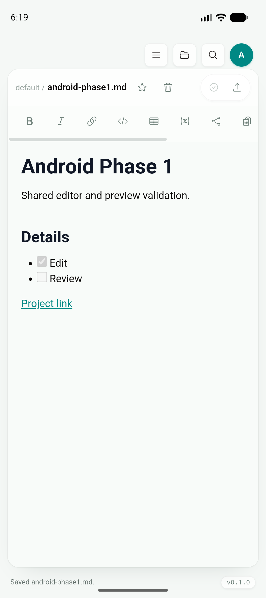

Document Info：

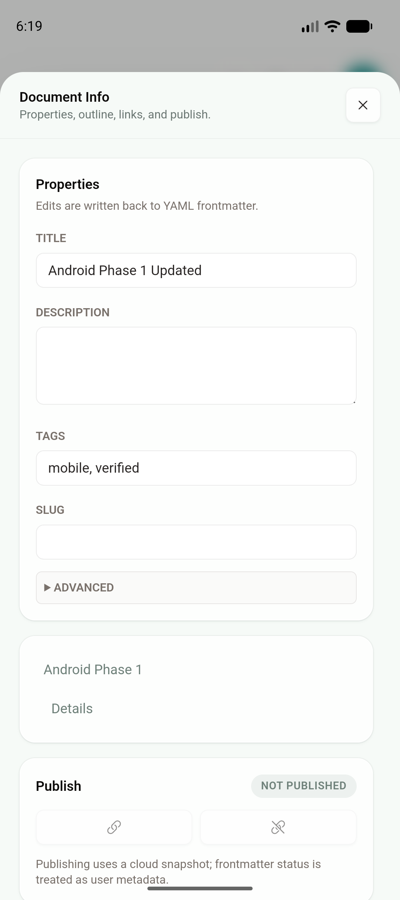

Board 与移动后的 card：

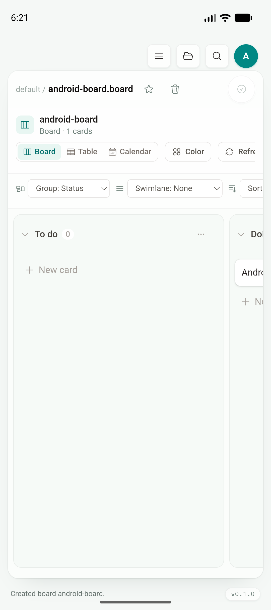

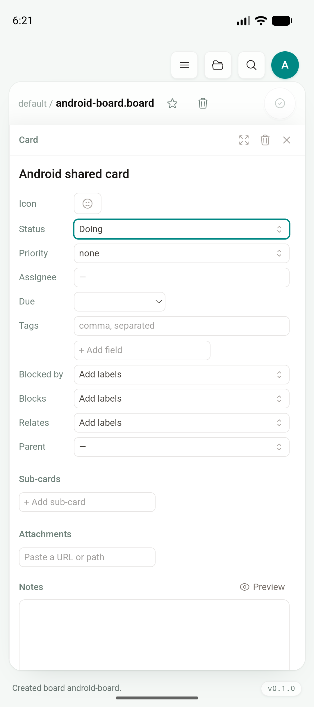

软件键盘由真实 ADB touch 触发；keyboard 显示时 editor 仍可滚动，toolbar、header、状态栏和 bottom safe area 均未被覆盖：

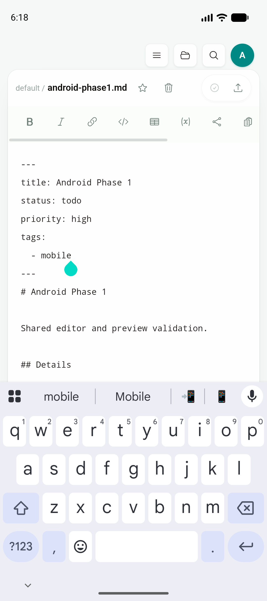

横屏 viewport 为 923×411 CSS px，仍保留 phone navigation、editor/preview toggle、Document Info 与 Focus actions：

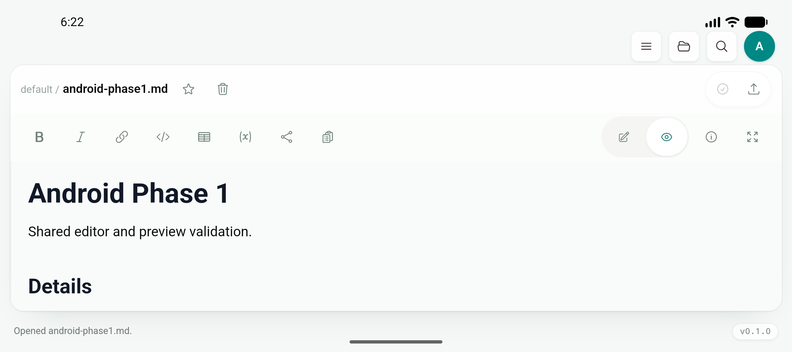

force-stop 后冷启动恢复 `android-phase1.md` 与 Preview：

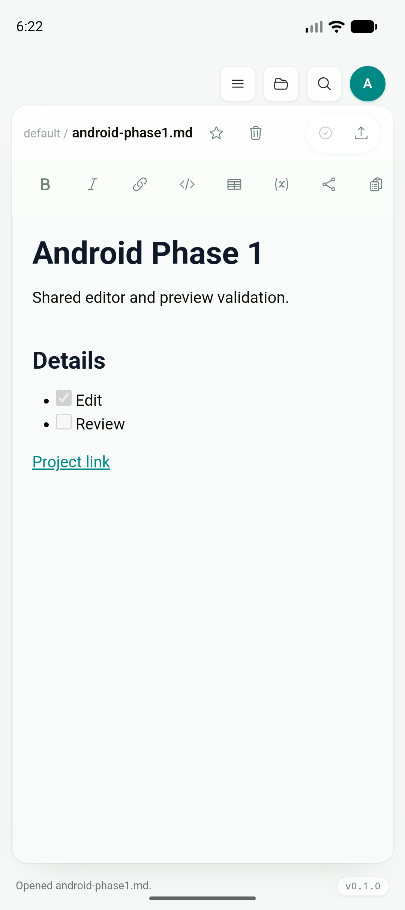

### iPhone

环境：iPhone 17 Pro Simulator，iOS 26.5，arm64，1206×2622；app code commit `b39e920`。

实际执行与 Android 相同：默认 vault、新建/编辑/保存 Markdown、Preview、Document Info property 写回、Board 创建与 card move、terminate / launch 恢复。由于主机锁屏，DOM 业务操作通过 iOS Web Inspector 执行；需要系统级触控的键盘与旋转使用 Maestro 2.6.1 的 XCTest runner 驱动真实 simulator input，而不是浏览器响应式模拟。

Preview：

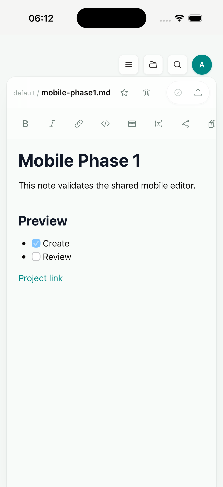

Document Info phone sheet：

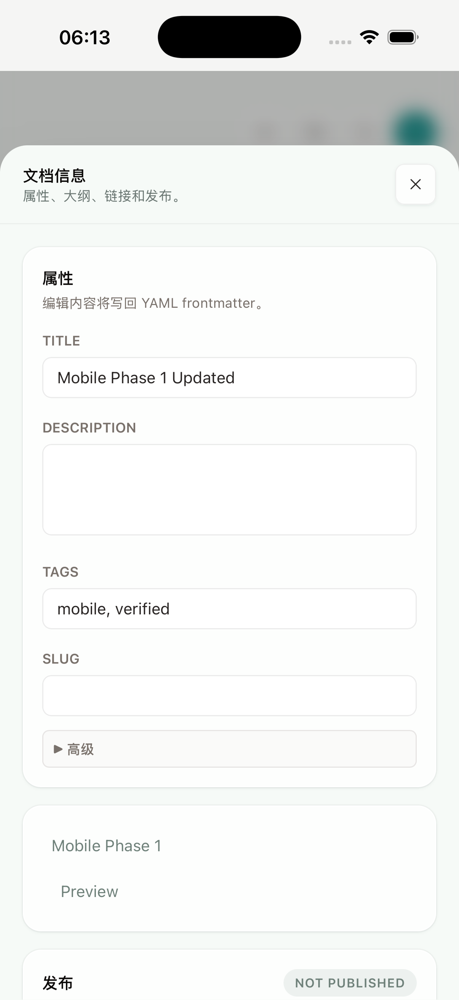

Board 与移动后的 card detail：

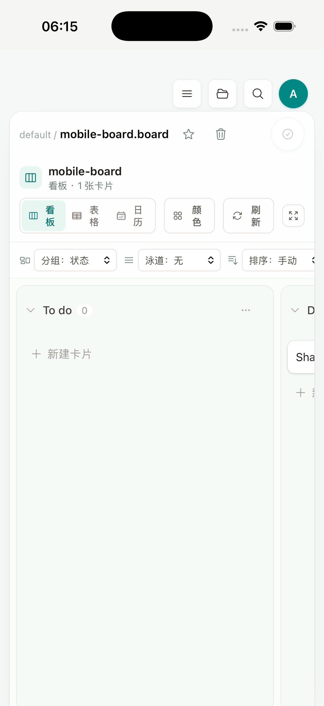

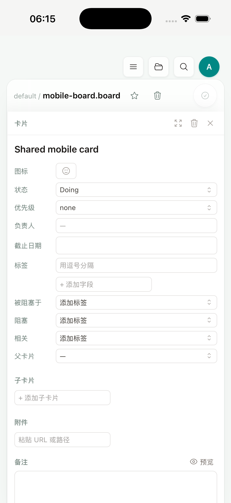

软件键盘显示后，编辑器自动缩小到键盘上方，input accessory、cursor 和 toolbar 都可见：

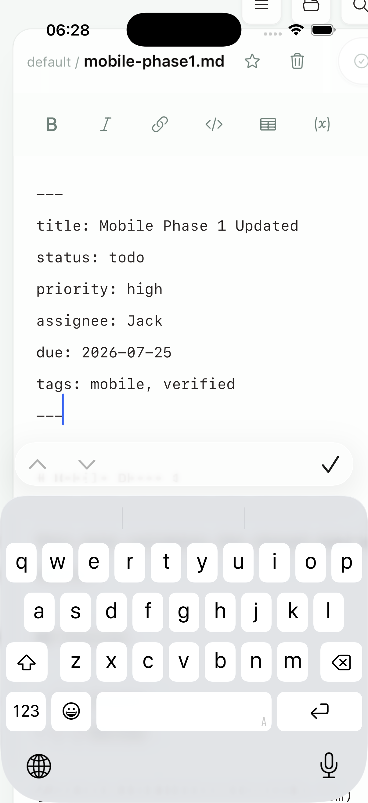

真实 `LANDSCAPE_LEFT` 后 app shell、editor actions 与 bottom safe area 正常，随后恢复 portrait：

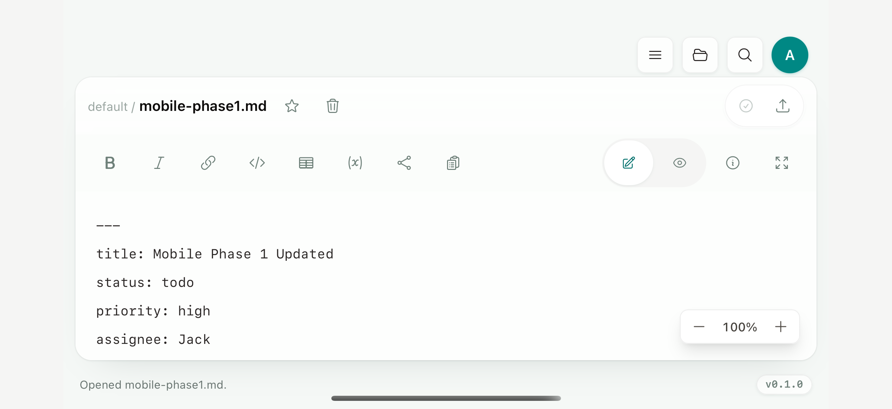

terminate 后重新 launch 恢复 `mobile-phase1.md` 与 Preview：

### iPad tablet

环境：iPad Air 11-inch (M4) Simulator，iPadOS 26.5，arm64，1640×2360；app code commit `b39e920`。

在当前 archive 上创建 `tablet-phase1.md` 并编辑保存。820×1148 CSS viewport 显示 Write / Split / Preview；Split 模式中复用同一 editor，Document Info 使用右侧 inspector，Properties、Outline、Publish、Links 与 phone/desktop 内容一致。

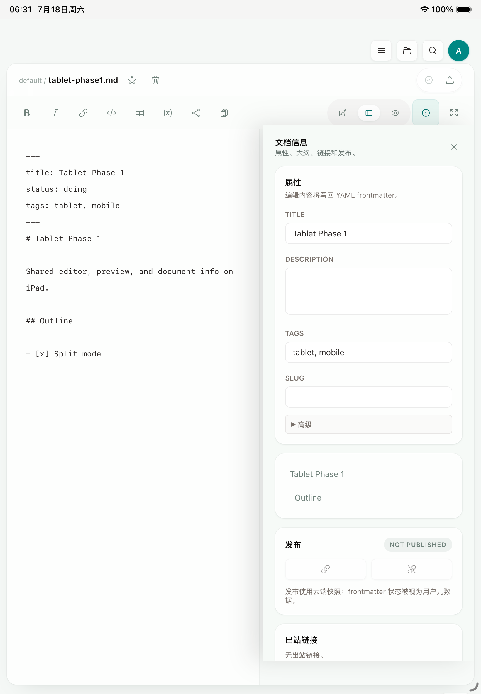

## 自动化与构建回归

| 验证 | 结果 |
| --- | --- |
| `npm run build` | PASS |
| `npm run build --prefix services/jtype-web/frontend` | PASS |
| `npm run test:unit` | PASS，45/45 |
| `npx playwright test tests/e2e/app.spec.ts` | PASS，42/42 |
| desktop conflict 三栏 + manual merge | PASS |
| 390×844 mobile conflict tabs + manual merge | PASS |
| `pnpm tauri android build --debug --target aarch64 --apk --ci` | PASS |
| `pnpm tauri ios build --debug --target aarch64-sim --no-sign --archive-only --ci` | PASS |
| Android real touch keyboard + orientation | PASS |
| iOS Maestro real touch keyboard + orientation | PASS |
| iPad actual Split / right inspector | PASS |

Android debug APK：

- `src-tauri/gen/android/app/build/outputs/apk/universal/debug/app-universal-debug.apk`
- 189,218,612 bytes
- SHA-256 `d6d3287d3d894fff1363e314bdd1e6fa99febe39e0ef09e7855a1048f1cef854`

iOS simulator archive：`src-tauri/gen/apple/build/jtype_iOS.xcarchive`，约 99 MB。最终 archive 为重新生成的 no-sign 产物，不包含 smoke-test entitlements 或临时签名。

## Phase 1 专项报告

- [Secure credential storage](phase-1-secure-storage.md)
- [External file import / open-with boundary](phase-1-external-import.md)
- [Markdown system share](phase-1-share-export.md)
- [PDF export and system share](phase-1-pdf-export.md)
- [Lifecycle / network sync recovery](phase-1-sync-recovery.md)
- [Browser OAuth / deep-link return](phase-1-oauth-deep-link.md)
- [Conflict comparison / manual merge](phase-1-conflict.md)

## 尚未关闭的 Phase 1 边界

- iOS browser OAuth 的首次 system confirmation 和真实 cloud conflict 页仍需在可交互的 signed simulator session 补齐；Android 已完成真实服务全链，iOS 共享 React callbacks 有 E2E，不能把它们描述成 iOS cloud UI 终验。
- external provider 的真实第三方 Open with、签名真机 provider、大文件分享生命周期属于 Phase 1.5 尾项，并与 Phase 2 external vault provider 一起继续。
- 完整 VoiceOver/TalkBack、动态字体、haptic、低内存、进程终止草稿恢复与真实设备弱网按 roadmap 位于 Phase 2。

这些尾项不改变本报告已经验证的本地 desktop core experience；Phase 1 当前保持“核心体验完成、cloud/system integration 尾项进行中”，不会提前宣称整个移动产品已完成。
