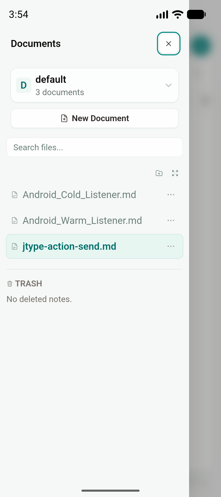
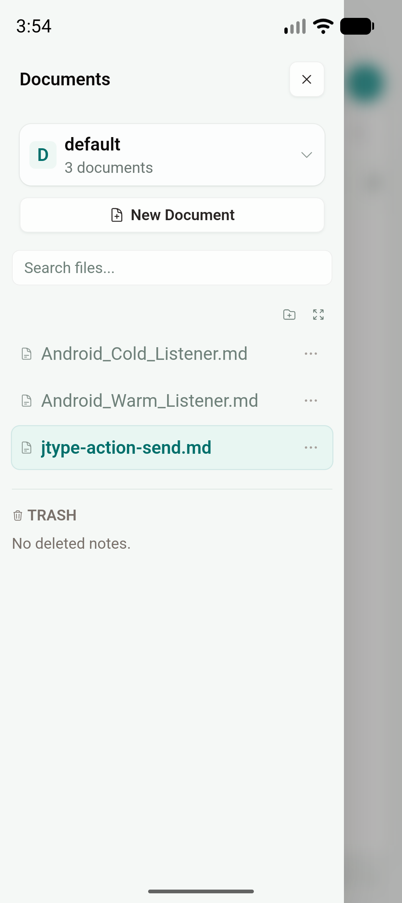
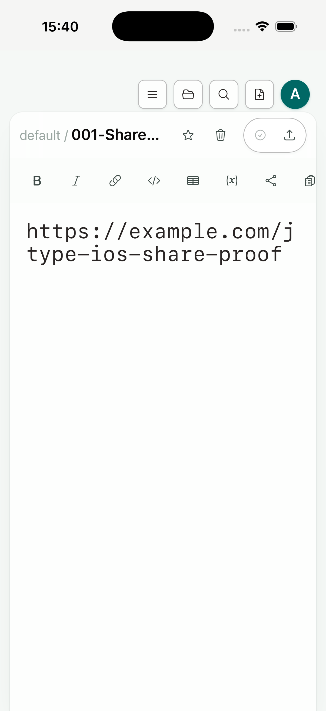

# Phase 2D：移动无障碍与硬件键盘

日期：2026-07-18

Feature branch：`codex/mobile-app`

实现 commit：`409919c`

状态：Android/iOS Simulator gate 与 desktop 回归通过；Android 已实际启用 TalkBack 验证焦点和语义。iOS 已验证 VoiceOver 使用的 XCUITest accessibility tree、动态字体和增强对比度，physical iPhone 上的 VoiceOver 语音、转子与手势仍属于 Phase 2 最终真机 gate。

## 结论

本增量继续运行同一个根目录 `src/` 产品前端，复用 desktop 的 `Header`、`Sidebar`、`EditorShell`、Board、toolbar 和 command system。没有增加移动端 landing page、docs website、第二套导航、文件列表或编辑器。

实际审计发现并关闭了四类问题：

- icon-only account action 在 iOS accessibility tree 中只读成头像字母 `A`；现使用“登录”或“账户：用户名”作为可访问名称。
- 全局样式同时清除了 `:focus` 与 `:focus-visible`；现保留 pointer 的原生 app 外观，并为键盘、Switch Control 与 TalkBack 焦点提供 2px brand outline。
- Android WebView 不会让 CSS `rem` 自动跟随系统字体缩放；Android native adapter 现在把 `Configuration.fontScale` 映射到 `WebSettings.textZoom`，并在配置变化时刷新。
- toolbar/command 对 textarea 的直接 `setRangeText` 不会稳定进入 WebView 原生撤销栈；格式化和插入命令现在通过 native editing primitive 写入，并保留安全 fallback。

## 共享 UI 与平台兼容边界

共享层只补充语义，不引入平台判断：

- icon action 增加 `aria-label`；当前状态增加 `aria-pressed`、`aria-expanded`、`aria-current`。
- editor view 使用命名 group，格式化区使用命名 toolbar。
- Save、Quick open、New document、Bold、Italic、Link 等动作声明 `aria-keyshortcuts`。
- Board column collapse/menu 使用包含列名的可访问名称。
- 所有可交互共享控件恢复统一的 `:focus-visible` 指示器。
- `prefers-contrast: more` 增强 token、边框和 active state；`prefers-reduced-motion` 关闭非必要动效。

平台差异只留在兼容层：

- Android `MainActivity` 读取系统 `fontScale`，只调整同一个 WebView 的 text zoom；React DOM 与业务组件不分叉。
- iOS `RuntimeCapabilities` 用 `-apple-system-body` 测量 Dynamic Type。内容区最多使用 160% scale，chrome 文本最多使用 135% scale；root rem 和触控目标尺寸不变，避免 accessibility size 把 header/action 几何一起放大。
- 非 iOS 环境的 `--jtype-font-scale` 固定为 1；desktop 的 breakpoint、窗口布局和 capability 路径不变。

## Android Emulator gate

环境：`JType_API_36_1`，Android 16 / API 36，arm64，package `net.jcode.jtype`；app commit `409919c`。

系统 font scale 调整为 1.3，安装最终 aarch64 debug APK。TalkBack 通过系统 accessibility service 实际启用，`dumpsys accessibility` 确认 `com.google.android.marvin.talkback/.TalkBackService` 已绑定。随后运行：

```text
maestro test tests/mobile/android-talkback.yaml
```

flow 通过 accessibility tree 找到 Documents、Local vault mode、Quick open、New document、Sign in、Markdown editor 与 Bold，并使用 TAB 推进真实焦点。共享 Documents drawer 的 Close action 显示新的高可见焦点环：



系统字体放大后，drawer 仍使用 desktop/shared `Sidebar` 内容；文案放大、action hit target 与 safe-area 布局保持可用：



在同一 emulator 上连接硬件键盘，实际执行 `Ctrl+B` → `Ctrl+Z` → `Ctrl+Shift+Z`。Bold 包裹、撤销与重做均按预期恢复 textarea 内容，证明 shared command edit 已进入 Android WebView 原生 history。

## iPhone Simulator gate

环境：iPhone 17 Pro Simulator，iOS 26.5，arm64，UDID `BD64DE20-5397-486C-8899-4B974425A0AD`；app commit `409919c`。

使用最终 no-sign aarch64-sim archive 干净安装，将 content size 设为 `accessibility-extra-large` 并开启 Increase Contrast。运行：

```text
maestro test tests/mobile/ios-voiceover.yaml
```

XCUITest accessibility tree 能以中文找到“文档”“本地库模式”“快速打开”“新建文档”“登录”“Markdown 编辑器”和“粗体 - Ctrl+B”，TAB 顺序可推进。此 tree 与 VoiceOver 消费的 native accessibility hierarchy 相同，但 Simulator 本轮未得到可重复的 VoiceOver 语音/手势服务，因此不把语义 flow 冒充为 physical VoiceOver 终验。

Dynamic Type 与增强对比度下，共享 editor 的内容字号变大，toolbar/Save hit target、header、safe area 和单栏几何保持稳定：



## 自动化与构建结果

| 验证 | 结果 |
| --- | --- |
| `npm run build` | PASS |
| `npm run test:unit` | PASS，47/47 |
| `npx playwright test tests/e2e/app.spec.ts` | PASS，48/48；新增移动 accessibility、focus、contrast、reduced-motion、shortcut 和 undo/redo 回归 |
| `cargo test --manifest-path src-tauri/Cargo.toml` | PASS，28/28 |
| `npx tauri android build --debug --target aarch64 --apk` | PASS |
| `pnpm tauri ios build --debug --target aarch64-sim --no-sign --archive-only --ci` | PASS |
| `maestro test tests/mobile/android-talkback.yaml` | PASS；实际 TalkBack service 已启用 |
| `maestro test tests/mobile/ios-voiceover.yaml` | PASS；XCUITest accessibility tree + TAB flow |
| Android hardware keyboard `Ctrl+B` / undo / redo | PASS |

截图 SHA-256：

```text
57697105bd8a25350f878c456bda8d2fd7ad6f195ea8a0f4d96dcca97d5c2bbc  android-talkback-focus.png
ef622b3a8b82e9c897934c81238fd6396573f3b1e97f2e18fb9153841dbf7359  android-accessibility-large-text.png
5a3e39494e6fa771dbe27d2c0dd7bc7f0c4cbe82bdac237226d848fafbb93c34  ios-accessibility-large-text.png
```

## Desktop 安全性

Android font adapter 只存在于 generated Android activity；iOS Dynamic Type 只在 canonical capability 报告 `platform=ios` 时生效。shared 组件的变化是标准 ARIA 语义、明确 keyboard focus 与原生 undo history，这些同时改善 desktop，但不改变 desktop 的布局、导航或 command contract。

完整 desktop E2E 48/48、frontend build、unit tests 与 Tauri Rust tests 同轮通过；没有建立 web/mobile 专用产品界面。

## 剩余 Phase 2 gate

- physical iPhone：VoiceOver 语音、swipe、转子、输入与动态字体全尺寸检查。
- physical Android：TalkBack gesture、系统最大字体/显示尺寸与厂商 WebView 检查。
- keyboard accessory 仍待实现；本增量只关闭 hardware shortcut 和 native undo/redo。
- long-press、swipe selection 与 haptic feedback 仍待实现。
- 大 vault、低内存、弱网、通知/深链定位和双平台真实设备终验继续按 Phase 2 roadmap 推进。
