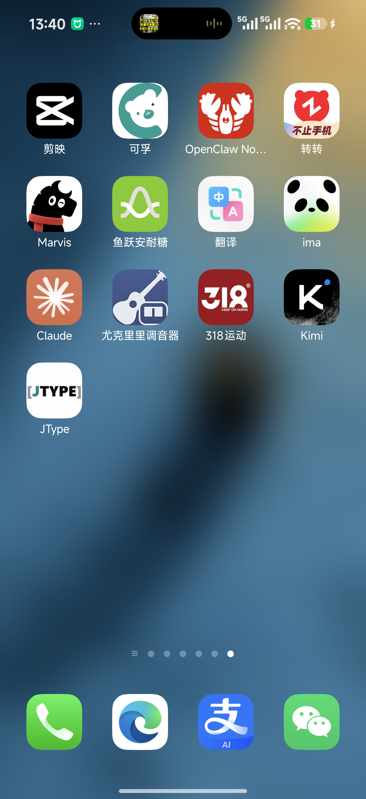
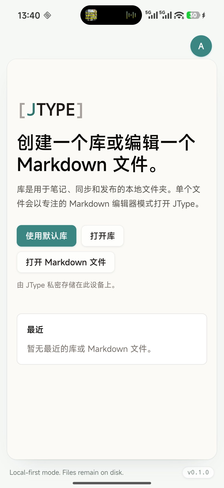

# Phase 2D — Android 真机安装与 launcher icon

日期：2026-07-19

实现 commit：`1d29199`

状态：Android physical-device preflight、arm64 build、USB install、cold launch、shared UI 与真实 Launcher 图标 gate 已通过；完整真机可靠性矩阵仍待后续执行

## 结论

JType 已安装到用户连接的 Xiaomi Android 真机。设备运行 Android 16 / API 36，ABI 为 `arm64-v8a`；项目 preflight 从此前的无设备 blocked 变为 Android **READY**。最终 APK 只包含 arm64 native library，覆盖安装成功，cold launch 为 `261 ms`，JType 进程存活且没有 `AndroidRuntime` fatal。

本段同时修复 Android 生成工程仍使用旧彩色模板 launcher icon 的问题。canonical `src-tauri/icons/android/` 已经是白底 `[JTYPE]` 品牌图标，但 `src-tauri/gen/android/app/src/main/res/mipmap-*` 没有同步。现在五档 density 的普通、foreground、round PNG 全部与 canonical 资源一致，并补齐 Android 8+ adaptive icon、白色 background resource 和 manifest `roundIcon`。

移动端产品画面继续来自根目录 `src/` 的 Desktop 共用 Welcome、Vault、EditorShell 和 commands；没有增加 mobile-only 文档列表/编辑器，也没有引入 landing page、docs website 或 web dashboard。

## 设备与 preflight

项目自带 preflight 输出：

- Manufacturer / model：Xiaomi `25098PN5AC`
- Android：16，API 36
- ABI / Tauri target：`arm64-v8a` / `aarch64`
- Physical devices：1
- Emulator：0
- JType installed：yes
- Android gate：**READY**

完整脱敏输出见 [`android-physical-install-preflight.md`](assets/phase-2/android-physical-install-preflight.md)。

## 图标修复

实际问题不是品牌源文件缺失，而是 generated Android project 仍保留初始化模板：

- canonical xxxhdpi `ic_launcher.png`：`[JTYPE]`；
- generated xxxhdpi `ic_launcher.png`：旧的青/黄色环形模板；
- manifest 只有 `android:icon`，没有 `android:roundIcon`；
- generated project 缺少 canonical adaptive icon 与 background color。

`1d29199` 将 5 个 density × 3 个 launcher PNG 同步到 generated project，增加 `mipmap-anydpi-v26/ic_launcher.xml`、`values/ic_launcher_background.xml` 和 round icon manifest contract。新增 unit test 对 15 个 PNG 做 byte-for-byte 对比，并校验 adaptive XML、background XML 和 manifest，防止后续生成工程再次与 canonical icon 漂移。

APK 的 `aapt2 dump badging` 结果确认：

```text
package: name='net.jcode.jtype' versionCode='1000' versionName='0.1.0'
application: label='JType' icon='res/mipmap-anydpi-v26/ic_launcher.xml'
native-code: 'arm64-v8a'
```

真机 Xiaomi Launcher 最后一页实际显示新的 `[JTYPE]` 图标：



这张截图证明的是已安装包经过系统 Launcher mask/render 后的真实结果，不只是仓库 PNG 或 APK 静态检查。

## 构建、安装与运行

构建命令：

```text
pnpm tauri android build --debug --target aarch64 --apk --ci
```

构建通过，同时重跑 shared frontend TypeScript/Vite build。输出路径虽然属于 Gradle `universal/debug` flavor，但 `aapt2` 和 APK ZIP 都确认只包含 `lib/arm64-v8a/libjtype_lib.so`。

首次 `adb install -r` 被 Xiaomi 的 USB install 安全确认以 `INSTALL_FAILED_USER_RESTRICTED` 拦截。用户在手机上允许 USB 安装后，使用保留现有数据的命令重试成功：

```text
adb install -r -g app-universal-debug.apk
Performing Streamed Install
Success
```

安装后包信息：

- `versionCode=1000`
- `versionName=0.1.0`
- `primaryCpuAbi=arm64-v8a`
- `lastUpdateTime=2026-07-19 13:39:33`

显式 force-stop 后 cold launch：

```text
Status: ok
LaunchState: COLD
Activity: net.jcode.jtype/.MainActivity
TotalTime: 261
WaitTime: 265
PID: 13142
```

真机画面正确显示中文 shared Welcome/Vault entry，没有启动崩溃：



## 自动化与 artifact

| 验证 | 结果 |
| --- | --- |
| Android icon contract targeted unit | PASS，1/1 |
| `pnpm test:unit` | PASS，87/87 |
| shared frontend build | PASS；arm64 Android build 的 `beforeBuildCommand` 实际执行 |
| arm64 Android debug APK | PASS |
| Android physical preflight | READY；1 physical device，API 36，arm64，installed |
| `adb install -r -g` | PASS |
| physical cold launch | PASS，261 ms，PID 13142，无 `AndroidRuntime` fatal |
| physical Xiaomi Launcher icon | PASS，真实 `[JTYPE]` adaptive/round render |

```text
e79f4f8f772302b83503b87ff9ac1b6b986862e7f50dd23c5209eb451a82148e  app-universal-debug.apk (205915822 bytes)
e4fc13e229bf92251f1b7eab5ff17a5784ad9ec12f81a27351e99c5a1cfdb514  android-physical-install-ui.png (232377 bytes)
14b4d75fda57cb9f8a7a78dbb5862bbed36de2b412076a9b6d9d74b39f24ee1c  android-physical-install-launcher.png (2307320 bytes)
```

## 尚未由本段关闭的真机 gate

这次完成的是安装、启动、shared UI 和 launcher icon 的基础 physical gate，不把它扩大描述为完整 Phase 2 真机终验。以下仍待单独执行：

1. Android external provider/SAF 的真实目录、权限撤销、重新授权和大批量 reconcile/write-back；
2. 弱网、网络切换、Doze/background/terminated、低存储和进程终止矩阵；
3. 大 vault peak RSS、系统 memory pressure、系统分享大文件和通知 provider 真凭据；
4. release signing、verified App Links、Google Play internal testing 与 store artifacts。
