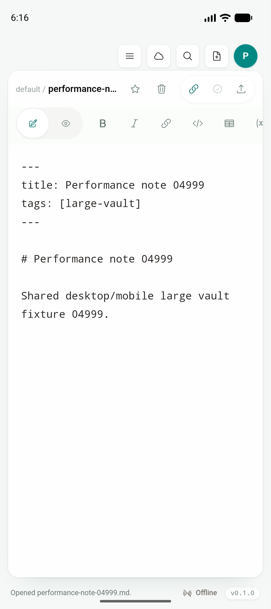

# Phase 2D：Android Studio 默认 arm64 variant

日期：2026-07-19

Feature branch：`codex/mobile-app`

实现 commit：`cc2ec80`

状态：Android Gradle product-flavor model、Tauri session build、arm64 AVD 安装/冷启动、shared workbench Maestro flow 与跨平台回归均通过。宿主 Mac 在最后的 Android Studio 可视复核时处于锁屏，因此没有把工具栏点击冒充为通过；下述 Gradle model、Tauri build 与 Emulator gate 不依赖该 UI 截图。

## 结论

Tauri Android 工程同时生成 `universal`、`arm64`、`arm`、`x86`、`x86_64` 五个 ABI flavor。Android Studio 过去默认选择 `armDebug`，而当前 Android Studio 创建的 `JType_API_36_1` AVD 只支持 `arm64-v8a`，普通 **Run app** 会在正确的 JType 产品代码启动前落入错误 ABI。

`cc2ec80` 在 Tauri 生成的 Gradle plugin 中把 `arm64` 标为唯一 `isDefault` flavor。该属性是 Android Gradle Plugin 为 “Studio 默认选择的 product flavor” 提供的正式 DSL；没有删除或重命名其他 ABI，也没有改变 Desktop、iOS、React 产品层或 Tauri command contract。参考：[Android Gradle Plugin `ApplicationProductFlavor.isDefault`](https://developer.android.com/reference/tools/gradle-api/8.12/com/android/build/api/dsl/ApplicationProductFlavor#isDefault())。

移动端仍运行 Desktop 共用的 `App`、`Sidebar`、Documents drawer、`EditorShell`、Preview、Document Info、Board 和 commands。本段没有新增 landing page、docs 页面、mobile-only 文档列表或编辑器。

## 实现

`RustPlugin.kt` 在创建 ABI flavors 时设置：

```kotlin
isDefault = arch == "arm64"
```

同一 plugin 注册 `verifyAndroidStudioDefaultVariant` verification task，严格要求默认 flavor 集合等于 `[arm64]`。根 `package.json` 暴露稳定命令：

```text
pnpm mobile:android:verify-studio-variant
```

`tests/mobile/android-large-vault.yaml` 在选择搜索结果后显式关闭 shared Documents drawer，再断言共用 EditorShell 的正文。这只让不同 WebView/点击命中行为下的测试更稳定，没有引入新的产品操作。

## Tauri session 边界

`./gradlew :app:assembleArm64Debug` 不能脱离 Tauri CLI 单独作为完整 build gate。`rustBuildArm64Debug` 会调用 `tauri android android-studio-script --target aarch64`，而该命令从 `tauri android dev/build` 创建的本地 WebSocket 会话读取 CLI options；没有 session 时会准确报 `failed to build WebSocket client ... Connection refused`。

因此正确门禁分为两层：

1. `pnpm mobile:android:verify-studio-variant` 验证 Android Studio project model 默认 `arm64`；
2. `pnpm tauri android build --debug --target aarch64 --apk --ci` 建立 Tauri session，实际完成 `android-studio-script --target aarch64`、Rust `aarch64-linux-android` 和 APK 构建。

直接 Gradle 的 session-less 失败已保存在日志中并标记为 **EXPECTED FAIL**，没有被隐藏或计为产品回归失败。Android Studio 的 run/debug configuration 本身仍是通用 `app`；ABI 选择由正式 product-flavor default 完成，不提交用户机器的 `.idea/workspace.xml`。

## Emulator gate

环境：Android Studio 创建的 `JType_API_36_1`，Android API 36，`emulator-5554`，ABI `arm64-v8a`。

| 验证 | 结果 |
| --- | --- |
| Android Studio default-flavor verification | PASS；`Android Studio default flavor: arm64` |
| Tauri arm64 session build | PASS；`android-studio-script --target aarch64` |
| APK native library | 只含 `lib/arm64-v8a/libjtype_lib.so` |
| install / cold launch | PASS；`net.jcode.jtype/.MainActivity`，`Status: ok` |
| installed package ABI | `primaryCpuAbi=arm64-v8a` |
| `tests/mobile/android-large-vault.yaml` | PASS；Documents → tail search → shared EditorShell |

APK：

```text
204,323,392 bytes
SHA-256 ba2e6d7b94883ca00d3a735e6c1d5d47779fcfcb179b60db7e4700a708acb764
```

截图显示 root `src/` 共用的 compact EditorShell、toolbar、文档 frontmatter 和正文，不是移动端复制 UI：



完整摘录：[`assets/phase-2/android-studio-arm64-gate.txt`](assets/phase-2/android-studio-arm64-gate.txt)。

## 回归

| 验证 | 结果 |
| --- | --- |
| `pnpm test:unit` | PASS，73/73 |
| `pnpm test:e2e` | PASS，56/56 |
| `cargo test --manifest-path services/jtype-core/Cargo.toml` | PASS，46/46 |
| `cargo test --manifest-path src-tauri/Cargo.toml` | PASS，29/29 |
| `pnpm build` | PASS；Desktop product layer 不受影响 |
| `pnpm mobile:ios:build:simulator-static` | PASS；static archive verifier PASS |

iOS regression binary：

```text
109,370,520 bytes
SHA-256 7b428dbbe4c37d0c9fc5aca4fa1b7043e0284bcf1bce098d24efc87ac0b1f822
```

证据哈希：

```text
e699e7de3cc1e2796bda09e87335b18068067ab85934d4ef5eb45eb9220ade44  android-studio-arm64-runtime.png
ba2e6d7b94883ca00d3a735e6c1d5d47779fcfcb179b60db7e4700a708acb764  app-universal-debug.apk
7b428dbbe4c37d0c9fc5aca4fa1b7043e0284bcf1bce098d24efc87ac0b1f822  JType iOS binary
```

## 剩余边界

- 宿主解锁后可补一次 Android Studio 工具栏 **Run app** 的可视录屏；当前没有把锁屏状态当作 UI gate 通过。
- physical Android 的 OEM WebView、进程/低存储与真实设备性能仍属于 Phase 2 最终矩阵。
- 其他 ABI 与 universal release/build 任务继续保留；本段只修正 Studio 开发默认值。
