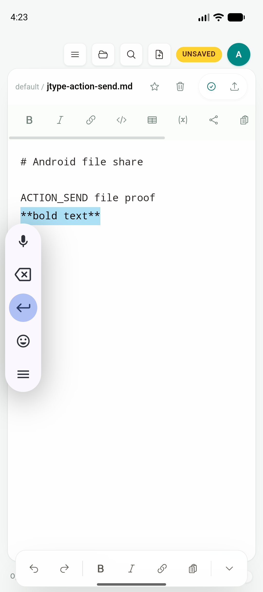
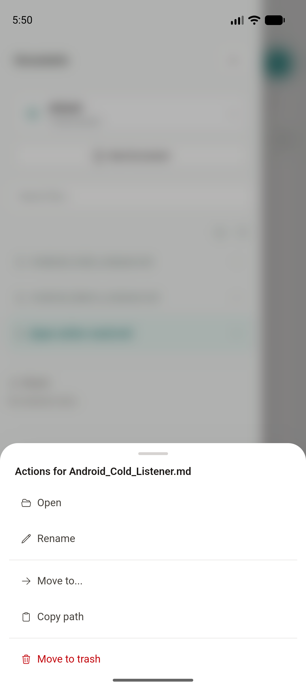
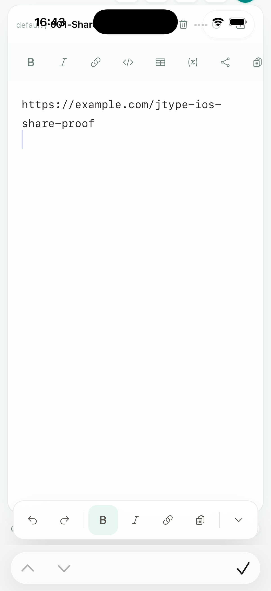
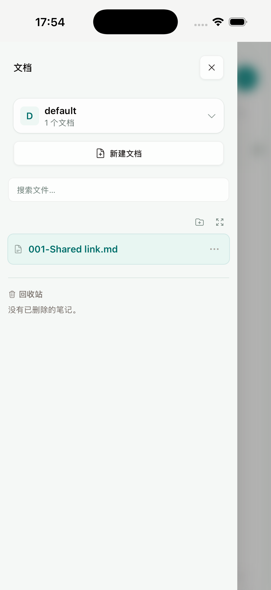

# Phase 2D：移动触控交互与键盘辅助栏

日期：2026-07-18

Feature branch：`codex/mobile-app`

App code commit：`7e65195`

状态：共享实现、desktop 回归与 Android native flow 已完成；iOS Simulator 已验证界面、可访问性树和手势注入流程可以运行，但当前 XCUITest/WKWebView 组合没有把注入的长按、滑动和辅助栏点击传递给 WebKit JavaScript。iPhone 真机上的手势回调、触感反馈和辅助栏激活保留为发布前 gate，不用 Simulator 结果替代。

## 结论

本增量没有增加 mobile-only 文件列表、编辑器、预览或 Document Info。Android、iOS 与 desktop 继续使用根目录 `src/` 和 `shared/` 中同一套 `Sidebar`、`EditorShell`、Board、action callbacks 与 command system；移动兼容逻辑只处理输入事件、键盘视口和原生触感反馈。

- Sidebar 文件/文件夹长按和向左滑动调用现有 action sheet callback，与可见的省略号按钮进入同一个菜单。
- Board 长按进入多选，后续触摸增删选择；向左滑动调用现有 card action callback。
- Editor 的 Undo、Redo、Bold、Italic、Link、Task 和收起键盘辅助栏调用现有编辑命令；undo/redo 继续使用 WebView native editing history。
- 触控编辑器保留系统文本选择、复制与 callout；desktop 自定义右键菜单、Board pointer drag 和快捷键路径不变。
- 原生触感反馈通过私有 Tauri plugin 封装：Android 使用 `performHapticFeedback`，iOS 使用 UIKit feedback generator；desktop 实现为空操作。

## 复用与兼容边界

共享组件仍遵守 props-in / callbacks-out：Board 只接收可选的 haptic callback，不导入 Tauri 或判断平台。平台层通过 canonical `RuntimeCapabilities` 启用 `useTouchActionGesture`、keyboard inset 与 `useMobileInteraction`，没有在组件内散落 user-agent 分支。

触控手势兼容 Pointer Events、Touch Events 和 `contextmenu` fallback。长按阈值为 450 ms；手势识别后抑制紧随其后的 click，避免重复打开 action sheet。Android 最终 log 证明一次长按和一次滑动各只触发一次 impact feedback。

键盘辅助按钮兼容 pointer、touch、mouse 与 click，并使用短期 activation lock 防止同一次输入被多套事件重复执行。按钮全部有本地化 accessible label。

## Android native gate

设备：Android Emulator `JType_API_36_1`，Android 16 / API 36，1080 × 2424。

执行：

```bash
maestro test tests/mobile/android-touch-interactions.yaml
```

结果：PASS，并在最终构建上重复通过。实际 flow：

1. 打开 shared editor 并显示移动键盘辅助栏。
2. Bold 插入加粗文本，Undo 删除该变更，Dismiss 收起软件键盘。
3. 打开 Documents，长按文件行，出现现有文件 action sheet。
4. 关闭菜单后向左滑动同一文件行，再次出现相同 action sheet。

Android native haptic log：

```text
07-18 17:51:11.616 D/JTypeHaptics: style=selection performed=true
07-18 17:51:13.703 D/JTypeHaptics: style=selection performed=true
07-18 17:51:16.229 D/JTypeHaptics: style=selection performed=true
07-18 17:51:21.076 D/JTypeHaptics: style=impact performed=true
07-18 17:51:24.507 D/JTypeHaptics: style=impact performed=true
```

前三条对应辅助栏操作；后两条分别对应一次长按和一次向左滑动，没有 Touch Events fallback 导致的重复触发。





## iOS Simulator gate 与限制

设备：iPhone 17 Pro Simulator，iOS 26.5，UDID `BD64DE20-5397-486C-8899-4B974425A0AD`。

执行：

```bash
maestro test tests/mobile/ios-touch-interactions.yaml
maestro test tests/mobile/ios-touch-swipe.yaml
```

两条 flow 均 PASS：JType 键盘辅助栏在 accessibility tree 中可见，Documents drawer、文件行、触控 action affordance 可操作，长按和滑动注入步骤可完成。截图中的 iOS 系统输入区使用 Simulator 当前的硬件键盘/input assistant 配置；JType 辅助栏位于编辑器底部。

但 iOS 26 的 XCUITest 在该 Tauri/WKWebView 环境中没有把注入的长按、滑动和辅助栏激活事件传给 WebKit JavaScript；语义目标、坐标手势、Pointer Events、Touch Events、`contextmenu` fallback 与 450 ms 阈值均已覆盖，仍只能证明 native injection 完成，不能证明回调或触感反馈发生。因此本报告不宣称 iOS action sheet 或 haptic native gate 已通过。真实 iPhone 需要确认：

- 文件行和 Board 的长按/滑动进入与省略号相同的 action callback。
- 选择、impact、success 与 warning 触感可感知且不重复。
- Bold、Undo、Redo、Dismiss 等辅助栏按钮实际生效。
- VoiceOver 手势与系统文本选择/copy callout 不冲突。





## Desktop 隔离

Mobile interaction capability 在 desktop 为 false，原生 haptic plugin 的 desktop 实现为空操作。Desktop 继续使用 click、right-click、keyboard shortcut、hover controls 和 Board pointer drag，没有因 touch recognizer 增加手势延迟或替换现有操作。

新增 App E2E 覆盖 mobile Sidebar 长按/滑动进入同一 callback、Board selection/action callback、编辑器辅助栏命令、click suppression，以及 desktop 路径保持关闭。

## 自动化与构建结果

| 验证 | 结果 |
| --- | --- |
| `npm run build` | PASS |
| `npm run build --prefix services/jtype-web/frontend` | PASS；shared 变更未破坏 web build |
| `npm run test:unit` | PASS，47/47 |
| `npx playwright test tests/e2e/app.spec.ts` | PASS，49/49 |
| `cargo test --manifest-path src-tauri/Cargo.toml` | PASS，28/28 |
| `cargo check --manifest-path plugins/mobile-interaction/Cargo.toml` | PASS |
| root 与 `plugins/mobile-interaction` Cargo fmt check | PASS |
| `pnpm tauri android build --debug --target aarch64 --apk --ci` | PASS |
| Android Bold / Undo / Dismiss / long-press / swipe flow | PASS；native haptic log 可见且无重复 impact |
| `pnpm tauri ios build --debug --target aarch64-sim --no-sign --archive-only --ci` | PASS |
| iOS accessory accessibility tree / long-press injection / swipe injection | PASS；WebKit callback、按钮激活和触感反馈待真机 gate |

## 构建产物

Android debug APK：

- `src-tauri/gen/android/app/build/outputs/apk/universal/debug/app-universal-debug.apk`
- 199,564,812 bytes
- SHA-256 `a9645389958a58ea8277425fffe8d8879a266312a70f036791b9cebf4b7ef86d`

iOS no-sign Simulator archive：

- `src-tauri/gen/apple/build/jtype_iOS.xcarchive`
- app binary：`Products/Applications/JType.app/JType`
- binary size：106,868,728 bytes
- binary SHA-256 `757fd77592dfcdcf620e0e7f656795a2a2773c276f5d2032bda1d13b718b635c`

截图 SHA-256：

```text
a859dc7facc0c9ff3c1b5153649cca81bb7c5ed8d31537baed1077661cd7aa3a  android-keyboard-accessory.png
4ebc895f6e80119ca3db76713250c5d33cf232e1c7d166400cd97d14015e0546  android-touch-action-sheet.png
aba8143f881434c46e1bd1d05fce99e74ce6627b041cc4969af1afaa6b61763d  ios-keyboard-accessory.png
d8a7d059400a63ac9620b8beecc7522ebc6640ac2340e5ab975c699bf049e54e  ios-touch-affordance.png
```

## 剩余 gate

本段不再增加独立 mobile UI。接下来进入 Phase 2D 性能、可靠性和系统通知；同时把 iPhone 真机手势/触感/VoiceOver、external bookmark 失效/重新授权和第三方 Files provider 纳入 Phase 2 最终设备矩阵。
