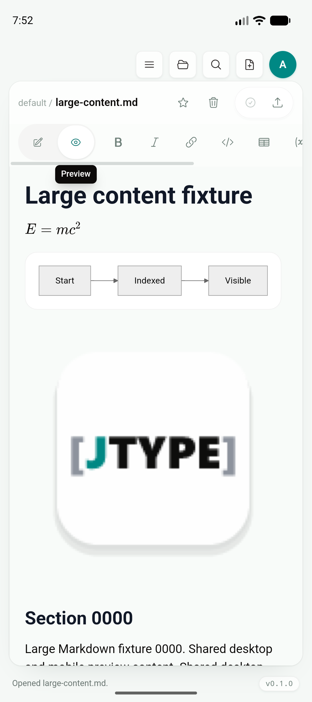
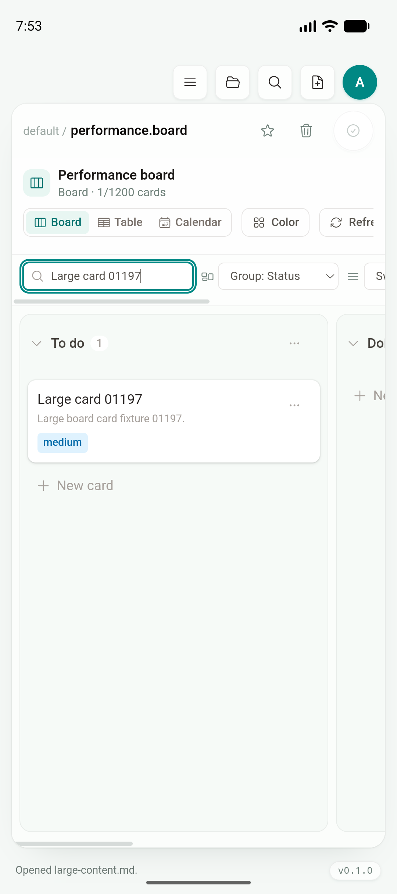
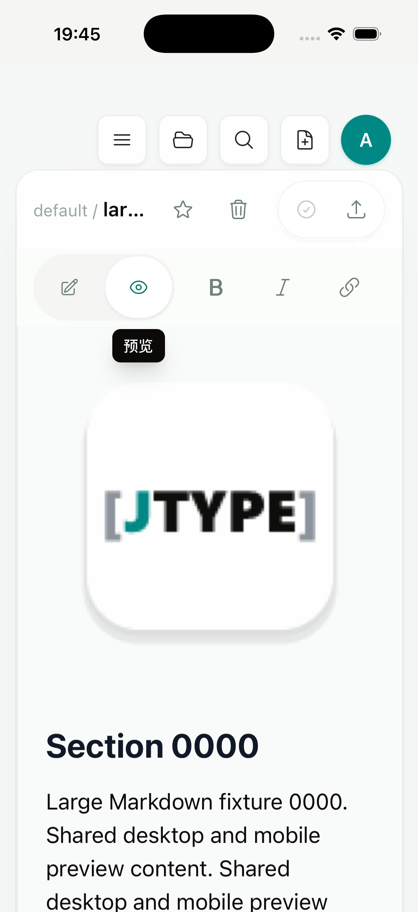
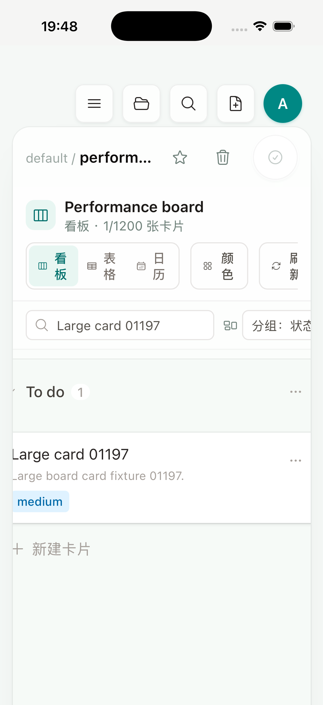

# Phase 2D：大 Markdown、附件与大 Board 渐进渲染

日期：2026-07-18

Feature branch：`codex/mobile-app`

App code commit：`4cdf48d`

## 结论

大 Markdown、Mermaid、KaTeX、大附件与 1,200-card Board 已在 Android API 36 Emulator 和 iPhone 17 Pro / iOS 26.5 Simulator 中通过最终构建与真实交互 gate。测试 vault 同时保留前一轮大 vault 数据，共包含 6,204 篇文档；目标 Markdown 为 353,355 characters、900 个 section、1,826 个顶层 block、23 张 3072×3072 PNG，并包含 KaTeX 与 Mermaid；Board 为三列、每列 400 张、合计 1,200 张卡片。

本增量继续以 desktop 产品层为唯一实现：Android、iOS 与 desktop 共用根目录 `src/`、`shared/lib/markdown.ts`、`EditorShell`、`BoardSurface`、`BoardTable`、`BoardCalendar` 和 `BoardSwimlanes`。没有建立 mobile-only 文档列表、编辑器、预览、Document Info 或 Board，也没有复用 web landing page、help/docs website 或 dashboard。web frontend 只因为消费同一个 shared renderer 而同步接受兼容调用。

大内容不再一次挂载全部 DOM：Preview 首批最多 240 个 block；Board 每列首批 80 张，三列共 240 张；Table、Agenda 与 Swimlane 首批 160 张。搜索、计数、依赖与 filter 仍基于完整数据模型，`Show more` 只扩大挂载窗口。PDF/export 显式关闭渐进模式，因此离屏导出仍包含完整文档。

Android 最终包实测 workspace 打开 201 ms、共享索引 23.2 ms、Preview 首批 240/1,826 block 渲染 107 ms，低于预设 2,000 ms gate。iOS Unified Log 不转发 WKWebView `console.info`，因此本报告不虚构 iOS JavaScript 时长；iOS 以最终 archive 的完整 Maestro flow、可访问性断言和截图作为本轮 Simulator gate。physical Android/iPhone 的低内存压力与峰值 RSS 仍是 Phase 2 最终 gate，roadmap 因此保持进行中。

## 共享实现

### Markdown / Preview

`shared/lib/markdown.ts` 先对原始 Markdown 做一次 top-level lex，记录完整 block 数，只对当前窗口内的 block 执行 KaTeX、wikilink、Marked parse 与 DOM sanitize。每个 preview container 用独立 WeakMap version 防止旧异步结果覆盖新文档；同一文档编辑时保留已展开窗口，切换文档时由稳定 `renderKey` 重置为 240。

Mermaid 改为相对 Preview container 的 visibility-driven render：进入视口前 480 px 才进入队列。多个 Preview 共用串行 Mermaid queue，避免全局 ID/state 并发冲突；不支持 `IntersectionObserver` 的运行时安全退回完整渲染。PlantUML、Mermaid SVG 和普通图片均限制在 Preview 宽度内。

`EditorShell` 只在 vault-relative 图片接近当前 Preview viewport 时读取 binary；图片使用 lazy loading 与 async decode，blob URL 继续按 vault lifecycle 缓存和回收。Desktop E2E 验证初屏 binary read 小于 6 次，而不是立即读取全部 23 张大图。

### Board

Board 的完整 `cards` 数组仍用于搜索、filter、列计数、blocker/sub-card 关系和各种 view model。只在 React render 边界截取：

- Board：每列首批 80，按列独立 `Show more 80`；
- Table：首批 160，按 160 扩展；
- Agenda：按 due sort 后首批 160，按 160 扩展；
- Swimlane：全局首批 160，但 lane count 来自完整模型；
- Calendar month：沿用每天最多 4 张的紧凑展示，计数来自完整模型。

自动化使用尾部卡片 `Large card 01199` 验证搜索不会只查首批 DOM；双模拟器使用 `Large card 01197` 完成真实输入、精确过滤与目标卡片可见 gate。

### 移动运行时兼容

模拟器验证发现并修复了四个共享壳层问题，没有引入第二套 UI：

1. touch toolbar 中 Write/Preview toggle 原先被格式按钮推到窄屏外；同一个 toggle 仅在 touch-primary 排到首位，desktop 顺序不变。
2. compact Board 搜索原先位于 Group/Swimlane/Sort/Filter 之后；同一个搜索框仅在 compact 排到首位，desktop 顺序不变。
3. 3072×3072 vault 图片与 Mermaid SVG 原先可撑宽 Preview；共享 preview CSS 现在约束所有图片和 SVG。
4. iOS Dynamic Type 下 WKWebView layout viewport 为 536，而物理 visual viewport 约为 402，导致共享根容器、侧栏 close 和 Preview 被裁切。`RuntimeCapabilities` 现在只在 mobile 暴露 visual viewport width，现有 root 与 Headless UI `MobileSidebarDialog` 消费该变量；Desktop 不进入该分支。E2E 增加 root/panel 不超过 visual viewport 的 contract。

## 预设阈值与结果

| 指标 | Gate | 实测 | 结果 |
| --- | ---: | ---: | --- |
| 大 Markdown 首批 block | `<= 240` | `240 / 1,826` | PASS |
| 大 Markdown 首批 render | `< 2,000 ms` | Android `107 ms`；Desktop E2E 受同一断言约束 | PASS |
| 首屏 vault-relative binary read | `< 6` | Desktop E2E `< 6`；其余图片 visibility-driven | PASS |
| Board 首批 DOM | `<= 240` | `80 × 3 = 240 / 1,200` | PASS |
| Table / Agenda / Swimlane 首批 DOM | `<= 160` | `160 / 1,200` | PASS |
| 完整模型尾部搜索 | 精确命中 1,199/1,197 | Desktop、Android、iOS 均命中 | PASS |
| 大 fixture workspace open | `< 3,000 ms` | Android `201 ms` | PASS |
| 大 fixture workspace index | `< 250 ms` | Android `23.2 ms` | PASS |

这些是 debug/test 环境回归 gate，不是商店发布包性能承诺。Simulator 无崩溃和有界 DOM 证明当前实现避免明显的初始渲染峰值，但不能替代 physical device 的 memory warning、后台恢复和峰值 RSS 测量。

## 可重复夹具与自动化

`scripts/mobile-seed-large-content.sh <android|ios> [section-count] [card-count]` 只替换 app-private default vault 中以下固定测试路径：

- `large-content.md`
- `large-content-assets/`
- `performance.board`
- `performance/`

脚本拒绝异常 count，完成后核对 section、card 与 asset 数量；不会清空整个 vault。默认生成 900 section、1,200 cards 和 23 张 3072×3072 PNG。

本轮自动化：

- `tests/mobile/android-large-content.yaml`
- `tests/mobile/ios-large-content.yaml`
- `tests/mobile/android-large-board.yaml`
- `tests/mobile/ios-large-board.yaml`

iOS 26 XCUITest 对 WKWebView Headless UI close 的 accessibility tap 只会聚焦节点、不一定触发 DOM click；正式 flow 在 close 可见时对修复后完全位于 visual viewport 内的真实坐标执行 tap。Board 搜索结束后点击共享标题使输入失焦，避免依赖 iOS 不支持的 Maestro `hideKeyboard`。这些 workaround 只在自动化层，产品代码没有 iOS 专用 Sidebar 或 Board。

## Android Emulator

环境：`sdk_gphone64_arm64`，Android 16 / API 36，arm64，1080×2424；universal debug APK；app code commit `4cdf48d`。

大 Markdown flow 完整通过。Logcat：

```text
[JTypePerformance] workspace_open nodes=6208 documents=6204 elapsed_ms=201
[JTypePerformance] workspace_index nodes=6207 documents=6204 elapsed_ms=23.2
[JTypePerformance] preview_render characters=353355 blocks=1826 rendered=240 elapsed_ms=107
```

公式、Mermaid、大图与第一节正文都来自共享 Preview：



1,200-card Board 能精确过滤尾部卡片，紧凑工具栏优先显示同一个搜索框：



## iPhone Simulator

环境：iPhone 17 Pro Simulator，iOS 26.5，arm64，1206×2622；no-sign simulator archive；app code commit `4cdf48d`。

大 Markdown flow 完整通过：打开 Documents、搜索并进入 `large-content.md`、关闭共用 Sidebar、切换 Preview、断言标题、滚动并断言 `Section 0000`。最终截图同时证明 visual viewport 修复后 Header、toolbar、大图和正文都在物理屏幕内：



Board flow 完整通过：Quick Open `performance.board`、断言 `1 / 1200`、输入 `Large card 01197`、断言唯一目标并使键盘失焦：



## Desktop、Web、Rust 与构建回归

| 验证 | 结果 |
| --- | --- |
| `npm run build` | PASS |
| `npm --prefix services/jtype-web/frontend run build` | PASS；shared renderer 改动没有破坏 web build，但 mobile 不复用 web 产品层 |
| `npm run test:unit` | PASS，50/50 |
| `npx playwright test tests/e2e/app.spec.ts` | PASS，51/51；新增 353,355-character Preview、KaTeX、Mermaid、lazy attachment、1,200-card Board、尾部搜索与 Table window case |
| `cargo test --manifest-path services/jtype-core/Cargo.toml` | PASS，38/38 |
| `cargo test --manifest-path src-tauri/Cargo.toml` | PASS，28/28 |
| `npm run mobile:android:build -- --debug` | PASS；四 ABI universal APK/AAB |
| `npx tauri ios build --debug --target aarch64-sim --no-sign --archive-only --ci` | PASS；no-sign simulator archive |
| `bash -n scripts/mobile-seed-large-content.sh` | PASS |
| 四条 Android/iOS Maestro flow | PASS |
| `git diff --check` | PASS |

## Artifacts 与截图校验

Android debug APK：

- `src-tauri/gen/android/app/build/outputs/apk/universal/debug/app-universal-debug.apk`
- 740,663,642 bytes
- SHA-256 `d4916852dedcc03cf1400bab38b97e1bd72bb5d4c1887909613049915913d410`

iOS archive：

- `src-tauri/gen/apple/build/jtype_iOS.xcarchive`
- archive 约 531 MiB；app binary 106,874,360 bytes
- app binary SHA-256 `492b4bceeb5cc4b3528f569f1440681b43cd9f90cbfdd9eb8abe93147d5e53e2`
- 包含 `JType.app/PlugIns/JType Share.appex`

截图 SHA-256：

```text
e7a42b28950fcacb1fa4b443be54d6521bdec5efd05858870a90bcedfd075522  android-large-content-preview.png
8fc2525e14ace87183b7ccc5e2f917451d309aeaf336ee80487b7db8eb5a6cce  ios-large-content-preview.png
794e892fa2bc0a9781035213081fc4318563b4e6cab44e6a1de3c3041cc9f115  android-large-board.png
29002f6767ae88bb6df6af1535e6363395f87eceb248e9004dfb9f805d65e7a5  ios-large-board.png
```

## 剩余边界

本轮完成了共享 Preview/Board 的有界挂载、visibility-driven diagram/attachment、完整模型搜索与双模拟器功能 gate。以下项目继续保留在 Phase 2D：

- physical Android/iPhone 的 memory warning、峰值 RSS、后台/前台恢复和更大附件测试；
- 原生 `WorkspaceSnapshot` 与 external provider source 的按需枚举/materialization；
- sync batching、弱网、重试、幂等和可观测错误；
- 通知、universal/app links，以及 physical iPhone gesture/haptic/VoiceOver / bookmark 失效 gate。

因此 roadmap 的“大 Markdown、Mermaid、KaTeX、附件和 Board”从 `[ ]` 更新为 `[~]`：共享渲染与双模拟器 gate 已完成，physical low-memory gate 尚未完成。
