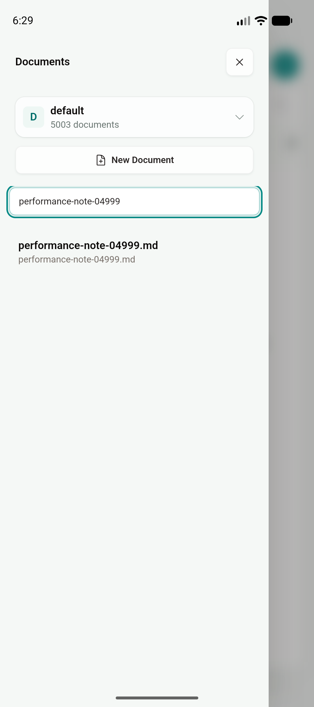
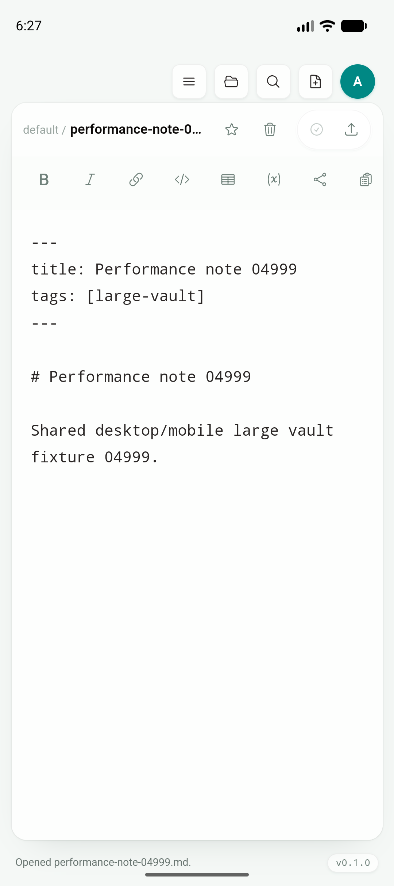
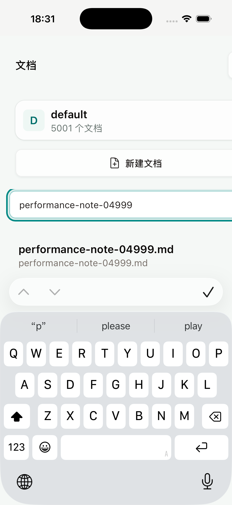
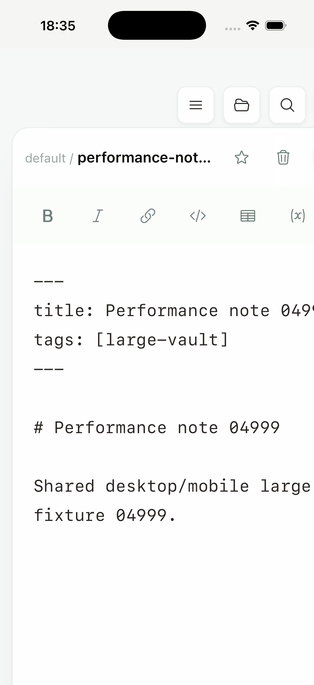

# Phase 2D：大 vault 索引与渐进渲染

日期：2026-07-18

Feature branch：`codex/mobile-app`

App code commit：`85dee2f`

## 结论

5,000 篇真实 Markdown 文件已在 Android API 36 Emulator 与 iPhone 17 Pro / iOS 26.5 Simulator 中通过冷启动、打开 Documents、搜索尾部文件 `performance-note-04999.md`、进入共享 EditorShell 并读取正文的完整 gate。

本增量没有建立 mobile-only 文档列表、编辑器、预览或 Document Info，也没有接入 web landing page、help/docs website 或 dashboard。Android、iOS 与 desktop 继续运行根目录 `src/` 的同一套 `Sidebar`、`VaultHome`、`QuickSwitcher`、`EditorShell`、wikilink 与 filesystem action；移动平台差异仅存在于已有 Tauri/provider adapter、测试夹具注入和 Maestro 自动化层。

本轮预先记录的 5,000 文档阈值全部达到：Android 原生 workspace 打开 131 ms、共享前端索引 24.9 ms；iOS 原生 workspace 打开 48 ms；树的首批 DOM window 固定不超过 160 个 sibling；Desktop 2,500 文档完整 E2E case 为 795 ms。20,000 文档索引单测实测 27.62 ms，低于 750 ms gate。

## 共享实现边界

`src/lib/workspaceIndex.ts` 为每个不可变 `workspace.entries` snapshot 建立一个 WeakMap 缓存的迭代索引。以下消费者取得的是同一个索引对象，不再各自递归扫描文件树：

- Sidebar 文档数与文件搜索；
- VaultHome 最近文档列表；
- Quick Open 的文档/Board 搜索与 folder filter；
- Editor wikilink target lookup；
- filesystem rename/delete 前的 link impact lookup。

搜索结果保持有界：Sidebar 最多 30 条，Quick Open 最多 40 条；Quick Open 先返回 exact substring，再补 fuzzy subsequence，避免大 vault 中较早的模糊命中挤掉精确文件。

`TreeNodeList` 在每一级 sibling list 上只挂载 160 行，并提供同一个共享树内的“Show more”动作。通过 Quick Open 或搜索打开窗口尾部文档时，window 会围绕 active path 定位，因此不需要先挂载它前面的数千行。Tree row 改为 props-in / callbacks-out，不再让每一行重复建立 AppState、filesystem、runtime capability 与 haptic hooks。

Rust `jtype-core::open_workspace` 在 debug build 中为 1,000 篇以上的 vault 输出原生枚举计数与耗时；共享前端索引输出同一格式的 debug console 记录。release 分支不增加原生计时日志。

## 预设阈值与结果

| 指标 | Gate | 实测 | 结果 |
| --- | ---: | ---: | --- |
| 5,000 文档原生 workspace cold open | `< 3,000 ms` | Android `131 ms`；iOS `48 ms` | PASS |
| 5,000 文档共享前端索引 | `< 250 ms` | Android `24.9 ms` | PASS |
| 20,000 文档共享索引单测 | `< 750 ms` | `27.62 ms` | PASS |
| 首批 sibling DOM window | `<= 160` | `160`；active 尾部文件仍在 window 内 | PASS |
| Sidebar / Quick Open 结果上限 | `30 / 40` | `30 / 40` | PASS |
| Desktop 2,500 文档搜索、打开、active window、Quick Open E2E | `< 2,000 ms` | `795 ms` | PASS |

20,000 文档索引和 Desktop E2E 的时间来自本机 debug/test 环境，不是商店发布包性能承诺；gate 的作用是阻止明显的 O(n²) 回归。

## 可重复测试夹具

`scripts/mobile-seed-large-vault.sh <android|ios> [count]` 只在测试 app 的私有 default vault 中替换 `performance-note-*.md`，不会清空整个 vault。每个文件包含 frontmatter、标题和可断言的唯一正文。脚本验证最终文件数，并拒绝小于 100 或大于 50,000 的输入。

Android 首次注入发现 macOS tar 会携带 AppleDouble `._performance-note-*.md`，应用因此如实显示 10,003 篇文档。夹具现已使用 `COPYFILE_DISABLE=1` 打包，并在重灌时同时清理旧的 AppleDouble 文件；重新校验后 Android 为 5,003 篇（5,000 夹具 + 原有 3 篇），iOS 为 5,001 篇（5,000 夹具 + 原有 1 篇）。这个修复只改变测试工具，没有在产品文件树里加入针对夹具的特殊过滤。

重复命令：

```bash
env PATH=/Users/jack/Library/Android/sdk/platform-tools:/usr/bin:/bin:/usr/sbin:/sbin \
  ./scripts/mobile-seed-large-vault.sh android 5000

env JTYPE_IOS_UDID=BD64DE20-5397-486C-8899-4B974425A0AD \
  PATH=/usr/bin:/bin:/usr/sbin:/sbin \
  ./scripts/mobile-seed-large-vault.sh ios 5000
```

## Android Emulator

环境：`JType_API_36_1`，Android 16 / API 36，arm64，1080×2424；debug APK；app code commit `85dee2f`。

Maestro flow：`tests/mobile/android-large-vault.yaml`。

完整 flow 通过，wall time 28.59 s；该值包含 Maestro driver、launch、逐项等待和 accessibility assertion，不作为应用交互延迟。原生日志为：

```text
[JTypePerformance] workspace_open nodes=5004 documents=5003 elapsed_ms=131
[JTypePerformance] workspace_index nodes=5003 documents=5003 elapsed_ms=24.9
```

精确搜索只返回目标文档：



目标文档通过共用 EditorShell 打开：



## iPhone Simulator

环境：iPhone 17 Pro Simulator，iOS 26.5，arm64，1206×2622；no-sign simulator archive；app code commit `85dee2f`。

Maestro flow：`tests/mobile/ios-large-vault.yaml`。iOS WebView 输入在动画结束前偶发丢失 XCUITest 注入，因此正式 flow 在打开共享 Sidebar 后等待动画结束、清空输入，再写入查询；产品组件没有 iOS 分支。

完整 flow 通过，wall time 18.08 s；同样包含自动化开销。Unified Log 中的原生记录为：

```text
[JTypePerformance] workspace_open nodes=5002 documents=5001 elapsed_ms=48
```

iOS 精确搜索结果：



同一目标文档通过共用 EditorShell 打开：



## Desktop、Web、Rust 与构建回归

| 验证 | 结果 |
| --- | --- |
| `npm run build` | PASS |
| `npm run build --prefix services/jtype-web/frontend` | PASS；shared 改动没有破坏 web build，但 mobile 不复用 web dashboard 产品层 |
| `npm run test:unit` | PASS，50/50；含 5,000/20,000 文档索引、bounded search、wikilink 与 active window |
| `npx playwright test tests/e2e/app.spec.ts` | PASS，50/50；2,500 文档 case 验证首批 160、Show more 320、精确搜索、尾部 active window 与 Quick Open |
| `cargo test --manifest-path services/jtype-core/Cargo.toml` | PASS，38/38 |
| `cargo test --manifest-path src-tauri/Cargo.toml` | PASS，28/28 |
| `pnpm tauri android build --debug --target aarch64 --apk --ci` | PASS |
| `pnpm tauri ios build --debug --target aarch64-sim --no-sign --archive-only --ci` | PASS |
| `bash -n scripts/mobile-seed-large-vault.sh` | PASS |
| `git diff --check` | PASS |

## Artifacts 与截图校验

Android debug APK：

- `src-tauri/gen/android/app/build/outputs/apk/universal/debug/app-universal-debug.apk`
- 199,564,812 bytes
- SHA-256 `de9e948206fb747d0c517e5d60e378be3d9f81a524aa0b629fd6ad3f02dac9f4`

iOS archive：

- `src-tauri/gen/apple/build/jtype_iOS.xcarchive`
- archive 约 531 MiB；app binary 106,874,360 bytes
- app binary SHA-256 `bc554d6e045563909553bdcdaaddd6dd5e577c0fac9a6d7a62610452bbad6733`

截图 SHA-256：

```text
fa339e2158ccb3a4677c020a65f25cbd3b9b2542e7a82e3f5e867823e8cf2ce0  android-large-vault-search.png
81217b8d0a30aa75a24041a541449e0cfe11da7a2f9e1bbd0ac423c24442e72b  android-large-vault-editor.png
5b0e44318c09d378284e4be2e32769c6ebb851dd4c4ad938946a3674adbd394f  ios-large-vault-search.png
84ea191ffcac29e313cb8c89855c3edbcddfe70324cf3c70076715e1d0e6ef32  ios-large-vault-editor.png
```

## 剩余边界

这次完成的是共享前端索引、bounded search 和 DOM 渐进挂载，并证明当前原生全量枚举在 5,000 文档下满足 gate。以下工作仍保留在 Phase 2D：

- `open_workspace` 仍会构造完整 `WorkspaceSnapshot`；真正的 native folder on-demand scan/materialization 尚未实现；
- external provider reconcile 仍会完整 materialize source snapshot；
- 大 Markdown、Mermaid、KaTeX、附件和大 Board 的内存/渲染 gate；
- sync batching、弱网、离线重试、幂等与可观测错误；
- physical Android/iPhone 的低内存与真实设备最终 gate。

因此 roadmap 中“大文件树增量加载与搜索索引”标记为进行中，而“5,000 文档预设基准达到阈值”可以标记完成。
