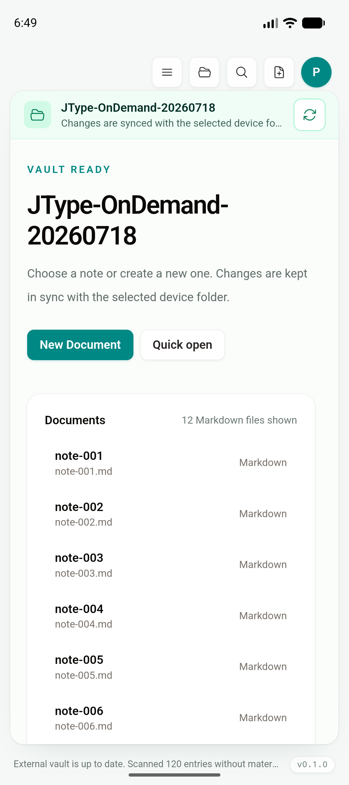
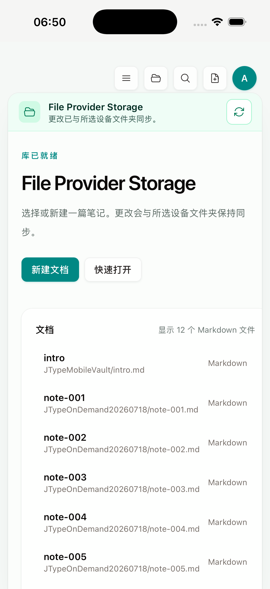

# Phase 2D：Stable external mirror baseline reuse

日期：2026-07-19

Feature branch：`codex/mobile-app`

实现 commit：`a374204`

状态：工程、Desktop 回归、Android API 36 AVD 与 iPhone 17 Pro / iOS 26.5 Simulator gate 已完成；source full hash、首次离线 mirror 与 physical provider 指标仍保留。

## 结论

external provider 的 unchanged reconcile 原来会顺序读取两遍完整内容：

1. Android SAF / iOS security-scoped adapter 完整枚举并 SHA-256 source；
2. Rust 再完整读取并 SHA-256 app-private mirror；
3. source / baseline / mirror 三方比较后确认 unchanged。

`a374204` 保留第 1 步的强内容校验，但在严格稳定条件下复用可信 baseline 作为 mirror manifest，跳过第 2 步。Android/iOS 没有新增 UI；仍使用根目录 `src/` 的 `VaultProviderBanner`、`VaultHome`、Sidebar、EditorShell、Document Info、Board 和 commands。

## 安全条件

baseline 只有同时满足以下条件才能复用：

- baseline 文件通过 version、canonical revision 与 entry integrity 校验；
- provider store 中的 `sourceRevision` 与 baseline revision 完全相同；
- 刚刚完整 SHA-256 得到的 source entries 与 baseline entries 完全相同；
- 没有 active local-mutation marker；
- 没有 pending write-back journal。

external mirror 位于 app-private storage，产品内容 mutation 全部经过 `with_external_vault_mutation`；开始 mutation 前先创建完整 backup/marker，source write-back 前保存 journal，成功后才清理。进程终止恢复、journal forward recovery 与三方 conflict 路径不满足稳定条件，继续执行原 mirror hash 和 reconcile plan。

本实现没有使用 provider mtime/size 猜测内容相同。Android `COLUMN_LAST_MODIFIED` 虽是标准列，但允许在未知时返回 null，且值由 provider 维护；它不足以替代 JType 的内容身份校验。[Android DocumentsContract.Document](https://developer.android.com/reference/android/provider/DocumentsContract.Document#COLUMN_LAST_MODIFIED)

## 明确不变的边界

- source 仍完整枚举并读取文件流计算 SHA-256；这次没有宣称 source scan 已增量化。
- 首次选择 external vault 仍完整 mirror，保证离线打开、编辑和既有 Desktop filesystem contract。
- source 发生变化时继续按 Rust plan 只 materialize 变化路径。
- active mutation / pending journal / stale baseline / missing baseline / source change 全部 fail closed，回到原完整路径。
- Desktop 不进入 mobile external-provider 分支；`src/`、`shared/` 和 desktop filesystem command contract 没有变化。

## Native evidence

完整脱敏日志：[`mirror-manifest-reuse.txt`](assets/phase-2/mirror-manifest-reuse.txt)。

### Android unchanged 与负例

Android API 36 arm64 AVD 使用已有真实 SAF 120-file fixture。unchanged 检查为：

```text
external_source_scan entries=120 files=120 bytes=5087 elapsed_ms=415
external_mirror_manifest_reuse operation=reconcile entries=120
workspace_open_partial loaded=121 total=121 elapsed_ms=0
```

shared `VaultHome` 仍显示原 provider、文档和 `External vault is up to date` operation status：



负例先精确备份 source `note-001.md`，追加唯一行并确认 SHA 从 `d44a…1d9` 变为 `d2a0…9cc`。reconcile 没有输出 reuse，而是：

```text
external_source_scan entries=120 files=120 bytes=5122 elapsed_ms=438
external_source_materialize requested_paths=1 files=1 directories=0 bytes=124
```

恢复备份后再次 materialize 1 file / 89 bytes，source SHA 精确回到 `d44a…1d9`，临时备份已删除。真实变化与恢复都继续走原三方 plan。

### iOS unchanged

iPhone 17 Pro / iOS 26.5 Simulator 使用已有 security-scoped Files bookmark。更新后的 `tests/mobile/ios-on-demand-provider.yaml` 能处理安装后中英文 cloud-sync prompt，并通过 shared provider action：

```text
external_source_scan entries=123 files=121 bytes=4707 elapsed_ms=35
external_mirror_manifest_reuse operation=reconcile entries=123
workspace_open_partial loaded=3 total=3 elapsed_ms=0
```



## 回归与构建

| 验证 | 结果 |
|---|---|
| `cargo fmt --manifest-path src-tauri/Cargo.toml --check` | PASS |
| `cargo test --manifest-path src-tauri/Cargo.toml` | PASS；30/30 |
| `cargo test --manifest-path services/jtype-core/Cargo.toml` | PASS；46/46 |
| `pnpm test:unit` | PASS；78/78 |
| `pnpm test:e2e` | PASS；56/56 |
| `pnpm build` | PASS；Desktop frontend |
| `pnpm tauri android build --debug --target aarch64 --apk --ci` | PASS |
| `pnpm mobile:ios:build:simulator-static` | PASS；static archive verifier |
| Android unchanged shared provider smoke | PASS；source scan + mirror reuse + 0 materialize |
| Android changed/restored source smoke | PASS；两轮均 1-file materialize，SHA 完整恢复 |
| `tests/mobile/ios-on-demand-provider.yaml` | PASS；source scan + mirror reuse + shared `VaultHome` |

Artifacts：

```text
Android arm64 debug APK: 402,744,398 bytes
SHA-256 46cf37ddb20bda49c74dbe4ed6f586dd8fd9a0618043aa9cd6d6f1d42a55bc98

iOS Simulator app binary: 109,371,624 bytes
SHA-256 c446e267f19458328ea0c4194742d00a4c546a912080708a5b7092e853b627e4
```

截图 SHA-256：

```text
bd8275d76f19f1b8ac956e075e16d4765f3d489265c023b0eb1b95fb5bd0905d  android-mirror-manifest-reuse.png
b255845aa90a75f95c26739e12a6a008d7de0f3367f07dd2f42ac1fba025469f  ios-mirror-manifest-reuse.png
```

## 后续边界

下一步仍是 physical-device 下的 source scan / total reconcile / peak RSS / storage 指标，以及 iCloud/第三方 Files provider 生命周期。若要减少 source full hash，必须取得能证明内容版本的 provider change token，或继续读取内容；本阶段不会用可缺失/不可靠的 metadata 牺牲冲突正确性。

provider-native direct streaming 也不在本增量中打开：当前完整 app-private mirror 是离线编辑和 Desktop filesystem contract 的一致性边界。是否引入稀疏 mirror/eviction，需要单独设计离线可用性、local mutation、sync 与 provider 失联语义。
