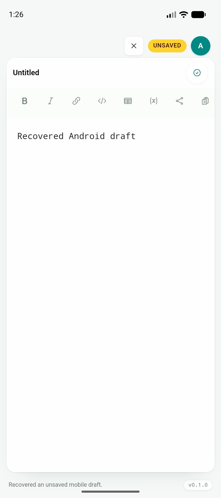
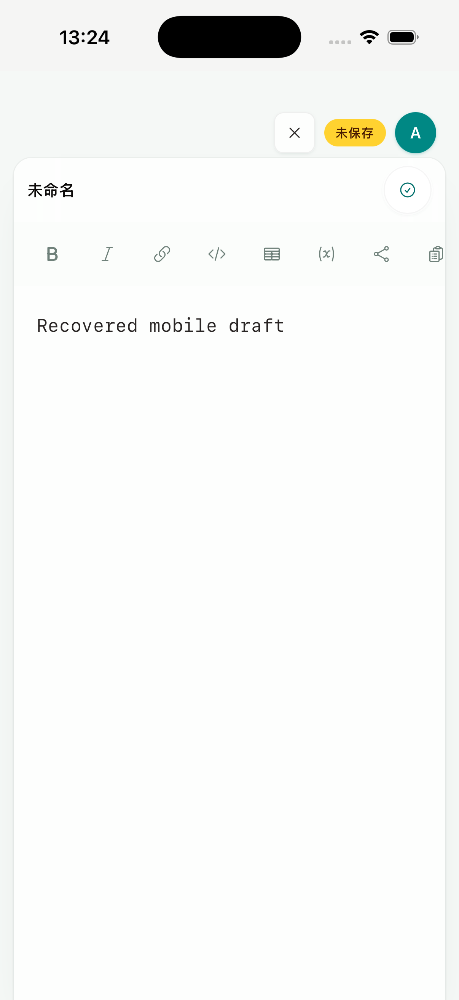

# Phase 2D：移动端草稿与 OAuth 冷恢复

日期：2026-07-18

## 结果

Android 与 iOS 现在可以在系统回收进程后恢复一份未保存的 untitled draft，也可以恢复尚未完成的 browser device OAuth。两项能力继续使用 desktop 的 `AppState`、`EditorShell`、Account Dialog、device OAuth command 和 cloud profile；没有新增移动端编辑器、文件列表、登录页或 Web dashboard。

平台兼容逻辑只负责生命周期与原生持久化：普通文档仍由现有 Save/provider transaction 负责，最终 cloud token 仍由 Phase 1 secure storage 保存。

## 草稿恢复边界

- `useMobileDraftRecovery` 只观察共享 reducer 中的单一 untitled draft，不处理已经有真实路径的文档。
- dirty draft 在输入停止 150 ms 后写入 app-private versioned JSON；进入后台时立即补写一次。
- Rust 使用 sibling temporary file + rename 原子替换，拒绝未知 schema、超过 10 MB 的正文和异常长 workspace path。
- 启动优先级是：系统显式打开/分享目标 → pending draft → 上次 vault/document。恢复后仍派发共享 `NEW_DRAFT` 与 `SET_EDITOR_CONTENT`，不会伪造 `lastFilePath`。
- Save-as、Discard 或离开 draft 会清理记录；用户删空正文时也立即清除旧 snapshot，避免冷启动复活已删除文字。
- desktop 的 draft 行为保持不变；恢复文件不进入 WebView storage，也不参与 cloud sync。

Android API 36 与 iPhone 17 Pro Simulator / iOS 26.5 均完成：新建 draft → 输入 → kill app → cold launch → 正文和 Untitled editor 恢复 → Discard → 再次 kill/cold launch → 不再恢复。





## OAuth 恢复与安全边界

- device code、user code、verification URL、service URL、device ID 与开始时间在打开系统浏览器前写入 secure storage。
- Android 使用已有 Keystore adapter；iOS 使用已有 Keychain adapter。pending record 不写 localStorage/sessionStorage 或普通 profile JSON。
- `App` 是唯一 cold-recovery owner；Account Dialog 和其他消费者仍调用同一个 `useCloudSync`，process-wide poll owner 阻止重复 poll，并允许任一 surface 取消当前流程。
- 恢复记录有效期固定为 10 分钟。过期、取消、非 pending 终态、断开账户和授权成功都会清理记录；网络中断与服务端 5xx 保留记录并继续重试。
- 授权成功时先把最终 token 写入 secure cloud profile，再向共享 AppState 暴露 connected session。Keychain/Keystore 写入失败不会留下只在内存中存在的伪登录。
- iOS 仅为 localhost 自托管开发服务增加窄范围 ATS local-network exception，没有开放任意明文 HTTP。

Android 和 signed iOS Simulator 均完成真实本地 Axum 服务流程：开始授权 → 系统浏览器打开 → 回到 JType → kill/cold launch 后恢复 waiting → 再次 kill/cold launch 仍恢复 → Cancel → kill/cold launch 后回到 Connect in browser。iOS 测试包使用 `Sign to Run Locally` 并携带实际 Keychain entitlement；无签名 archive 只作为编译 gate，不用来冒充 Keychain 验收。

自动化流程：

- `tests/mobile/android-draft-recovery.yaml`
- `tests/mobile/ios-draft-recovery.yaml`
- `tests/mobile/android-oauth-cold-recovery.yaml`
- `tests/mobile/ios-oauth-cold-recovery.yaml`

## 回归结果

| 验证 | 结果 |
| --- | --- |
| `npm run build` | PASS |
| `npm run test:unit` | PASS，47/47 |
| `npx playwright test tests/e2e/app.spec.ts` | PASS；新增 OAuth/draft cold reload 与 read-only mobile action 回归 |
| `cargo test --manifest-path src-tauri/Cargo.toml` | PASS，28/28 |
| `cargo fmt --manifest-path src-tauri/Cargo.toml --check` | PASS |
| Android aarch64 debug APK | PASS |
| iOS aarch64 Simulator archive | PASS |
| Android draft + OAuth process-kill Maestro flows | PASS |
| signed iOS draft + OAuth process-kill Maestro flows | PASS |

截图 SHA-256：

```text
89dde3150c331b1e0a0ae67a3564af86190e1567d353514caa7e761803dd4a5c  android-draft-cold-recovery.png
c971e2e2e55995ebc96c7491e94fcec28883878ce188fc697024908d1116f44d  ios-draft-cold-recovery.png
```

## 后续

本段完成 2D 的草稿与 pending OAuth 冷恢复。下一段接入 Android `ACTION_SEND` 与 iOS Share Extension，把 Markdown、纯文本和文件统一送入现有 `importExternalSources()`；随后继续无障碍、硬件键盘、大 vault/弱网与真实设备 gate。
