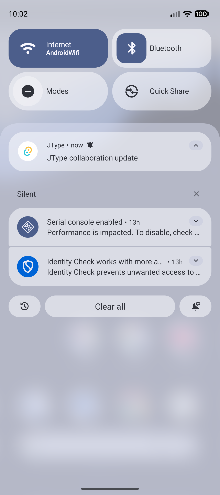
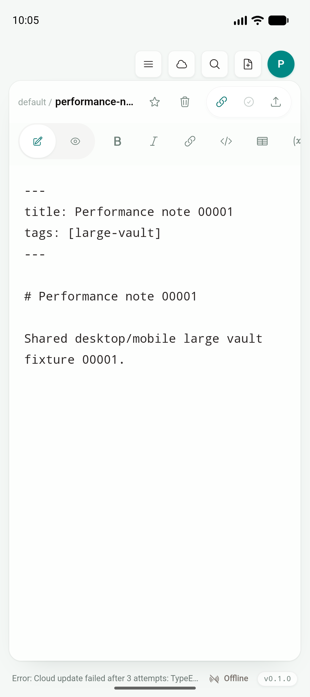
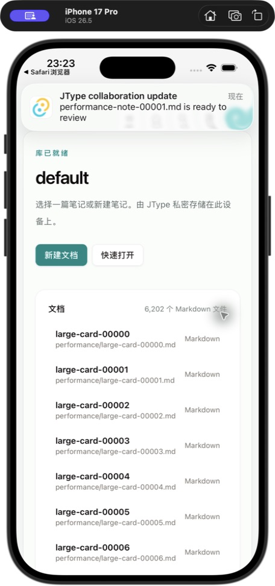
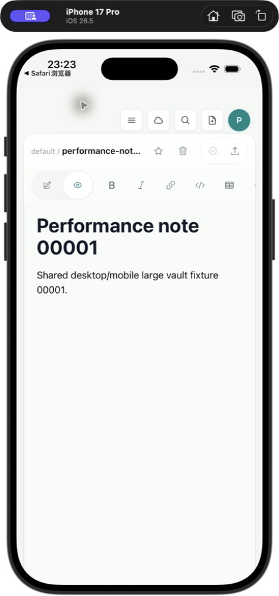
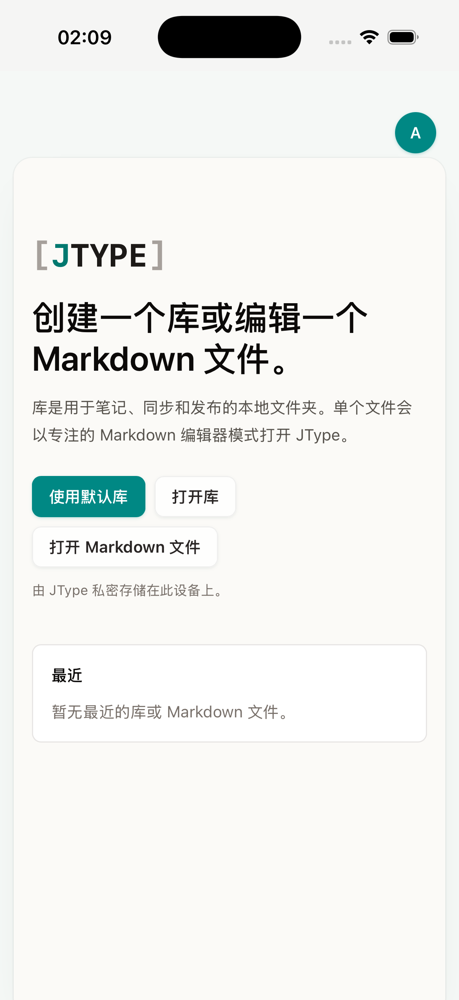

# Phase 2D — 系统通知与文档定位

日期：2026-07-18；首屏回归更新：2026-07-19

Feature branch：`codex/mobile-app`
实现 commits：`2a1fc09`、`ff21f86`、`999dc11`

## 结论

JType 已建立一条无凭据的 canonical 文档路由：

```text
jtype://open/document?workspaceId=<cloud-workspace-id>&path=<vault-relative-path>
```

Android/iOS 共用同一通知 adapter 和同一条文档打开链路。通知点击后不会进入 web dashboard、landing page、docs website，也没有新增 mobile-only 文档列表、编辑器、预览或 Document Info；路由解析完成后直接调用 Desktop 已有的 vault binding、`openWorkspace`、`openMarkdownFile`、`openDiagramFile`、Board selection 与 sync pull 操作。移动端新增内容仅限 deep-link/notification payload、平台权限和生命周期兼容。

Android API 36 与 iPhone 17 Pro / iOS 26.5 Simulator 都已完成真实系统通知 → 点击 → 已绑定 cloud workspace → app-private vault → `performance-note-00001.md` → 共用 Desktop EditorShell 的原生闭环。两端都复用同一条 canonical route 和 Desktop 操作；平台差异只留在通知呈现 adapter 内。

本增量接通的是本地原生通知、tap callback 和目标定位。APNs/FCM token 注册、服务端厂商投递、后台有限刷新，以及 universal/app links 不在本 commit 内，继续作为 Phase 2D 后续项。

## 复用边界

```text
notification / custom scheme
          |
          v
strict route parser
          |
          v
cloud workspace vault binding
          |
          v
existing openWorkspace + optional full pull
          |
          v
existing Desktop document / Board operation
```

- `src/lib/mobileNavigation.ts` 只负责构造和校验 canonical route。
- `src/lib/mobileNotifications.ts` 只负责移动平台通知权限、Android channel、payload 和 adapter fallback。
- `src/hooks/useMobileDocumentNavigation.ts` 只负责把系统入口转换成现有 Desktop 操作，不拥有第二套导航栈或 UI。
- `App.tsx` 仅在 mobile startup 等待 cloud profile 与 vault bindings 就绪；Desktop 保持原来的异步启动行为。
- `openWorkspace` 增加返回 `WorkspaceSnapshot | null`，现有调用方行为不变，路由 adapter 可以等待真实打开结果。

## 路由与安全边界

解析器拒绝：

- username/password、port、fragment、未知 query 参数和重复参数；
- 绝对路径、反斜线、空 segment、`.` / `..` traversal；
- `.jtype`、`.git`、`node_modules`、`target` reserved segment；
- 超长或不符合约束的 workspace ID / relative path。

通知 payload 只保存 canonical route，不保存 token、server URL 或用户凭据。若目标 cloud workspace 没有本机 vault binding，应用打开现有 Account → cloud workspace 区域并显示状态，不猜测本地目录。若文档暂时不在本地且已有 sync token，只执行一次 full pull 后重试；仍不存在时停止并报告目标不可用。

Android 官方 action callback 在本机实测返回 `notification: null`，iOS active payload 也可能不带 `extra`。因此 adapter 使用一个固定 collaboration notification ID，并只保存最新一条 canonical route 作为 callback fallback；读取后立即删除，避免积累旧通知目标。iOS 点击完成后 WebKit localStorage 中 `mobile.notification.latestRoute` 的记录数为 `0`，确认 fallback 已被消费。

Simulator 通知预览入口 `jtype://debug/notification?...` 需要 Rust command 返回 true。该 command 仅在 `mobile + debug_assertions` 为 true，release build 不允许外部链接制造本地通知。产品级通知仍应由后续 APNs/FCM adapter 调用同一 `showMobileCollaborationNotification` 和 route contract。

## Android 原生验证

环境：

- AVD：`JType_API_36_1`
- OS：Android 16 / API 36，arm64
- 分辨率：1080×2424
- workspace ID：`dd3a196e-2b7a-47dc-8a7a-69de70283acb`
- 目标：`performance-note-00001.md`

实际流程：

1. 安装 debug APK 并恢复已绑定的测试 cloud workspace。
2. 通过 debug-only custom scheme 请求一条延时 2.5 秒的系统通知。
3. 系统通知出现在 Android notification surface。
4. 点击通知；原生日志记录 `Tauri/Notification: Notification received: null`。
5. WebView listener 使用一次性 canonical route fallback。
6. 应用定位到对应 binding，并使用共用 Desktop EditorShell 打开目标文档。





截图 SHA-256：

```text
9d57babbe5fc512189c4c20cc48fd42be8022e9ad30862539a888a99a3a29ca2  notification-android.png
27a25b145e4fe6ce74e7d7872d8cbaf1f11ce4eebbe7523e4101d131e488abad  notification-target-android.png
```

## iOS 原生验证

环境：iPhone 17 Pro Simulator，iOS 26.5，arm64；workspace ID `532c9728-7ec7-4a2b-ad77-8fb600093398`，目标 `performance-note-00001.md`。

实际流程：

1. 安装最终 no-sign Simulator archive，并按需授权系统通知。
2. 通过 debug-only custom scheme 请求包含 canonical 文档 route 的本地通知。
3. iOS 在 JType 前台显示真实系统横幅；系统日志记录 notification request、`willPresent` 与 banner presentation。
4. 点击横幅；adapter 在 iOS payload 缺少 `extra` 时读取一次性 canonical route fallback。
5. 应用定位到对应 binding，并使用共用 Desktop EditorShell 打开 `Performance note 00001`。
6. 点击完成后确认 fallback localStorage 记录数为 `0`。

Tauri notification `2.3.3` 的 iOS `Schedule.at()` 会把带 `Z` 的 ISO 时间按本地时间 literal 解析；在 Asia/Shanghai 时区，短延时会被判定为过去时间。兼容层因此先在 JavaScript 进程内等待 2.5 秒，让 WKWebView 完成首次 paint，再动态导入 plugin 并使用 iOS 原生前台立即呈现；Android 继续把 2.5 秒延时交给 native scheduler。这个分支只决定系统通知何时呈现，不复制 route、navigation、文档打开或 UI 代码。





截图 SHA-256：

```text
ff6c2100eb7960b95222a2e028c2753bd46199197304bffaaa9bdecfac7a4a24  notification-ios.png
8cb3a85b74f01f925b9b50311b50dca3c7bd99c1b655a0010484a3cd7743add3  notification-target-ios.png
```

## Fresh-launch 首屏回归

在后续 unloaded-entry artifact gate 中，fresh uninstall/install 的 iOS archive 停留在白色 launch surface。独立 worktree 的 clean build 与 Simulator framebuffer 二分确认：`798be1c`、`2a1fc09` 正常，`ff21f86` 是第一个白屏提交，后续 `5970d15` 仍复现。App Group entitlement 和单纯修正 `Schedule.at` 墙上时间都不能消除问题；触发条件是通知 plugin 的成功调用发生在 WKWebView 首次 paint 前。

`999dc11` 把 iOS preview 的延迟放在 plugin import/call 之前，Android 行为不变，并为 delivery mode 增加纯函数单测。最终 no-sign archive 在 iPhone 17 Pro / iOS 26.5 Simulator 卸载旧包、安装、冷启动并等待 6 秒后正常显示同一 shared Welcome：



```text
5d988efcefdacac41dcd90d2d967e85cd4b2e1140efa724a7e53cf9096eeaf9f  ios-unloaded-entry-query-smoke.png  1206x2622
```

## 自动化与构建

| 验证 | 结果 |
| --- | --- |
| `pnpm run test:unit` | PASS，66/66；包含 route/payload 与 iOS first-paint、Android native schedule 三条 delivery-mode 回归 |
| `pnpm exec playwright test tests/e2e/app.spec.ts` | PASS，55/55；新增 cold deep link 和 Android `notification:null` tap fallback 两条测试 |
| `pnpm build` | PASS |
| `cargo test --manifest-path src-tauri/Cargo.toml` | PASS，29/29 |
| `cargo check --manifest-path src-tauri/Cargo.toml` | PASS |
| `pnpm tauri android build --debug --target aarch64 --apk --ci` | PASS |
| `pnpm tauri ios build --debug --target aarch64-sim --no-sign --archive-only --ci` | PASS |
| Android system notification → tap → shared EditorShell target | PASS |
| iOS system notification → tap → shared EditorShell target | PASS；真实 iOS 26.5 系统横幅、点击、一次性 fallback 消费与共享 EditorShell 目标 |

构建产物：

```text
44a2dbb64221c939a29db82269894dc28dd3c4d237d8f8130c1bd8c0b38bd22d  app-universal-debug.apk
85f059c1d37ed073b4c53219fcf94d9078a26c5ec0b04a2b4a6eca069b6e7bbc  JType.app/JType
```

- Android universal debug APK：394,311,366 bytes
- iOS Simulator app binary：108,822,248 bytes

## 后续工作

1. 增加 APNs/FCM device token lifecycle、服务端 collaboration event 投递和用户通知偏好。
2. 将 vendor payload 映射到同一 canonical route；后台只做系统允许的有限刷新。
3. 增加 universal links / Android app links，同时保留 custom scheme 作为明确 fallback。
4. 在真实 Android/iPhone 上验证 cold/warm/background tap、权限拒绝/恢复、重复通知与目标已删除场景。

API 形状与权限行为以 Tauri 官方 [notification JavaScript API](https://v2.tauri.app/reference/javascript/notification/) 和 [notification plugin](https://github.com/tauri-apps/plugins-workspace/tree/v2/plugins/notification) 为实现基准。
