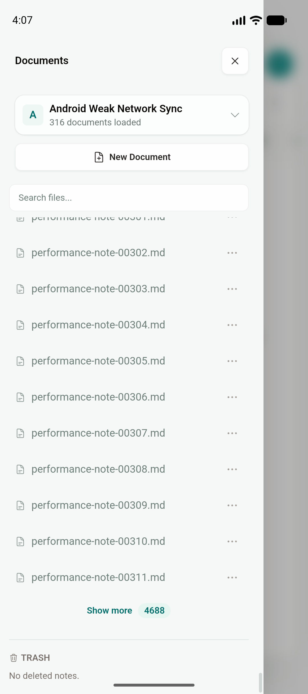
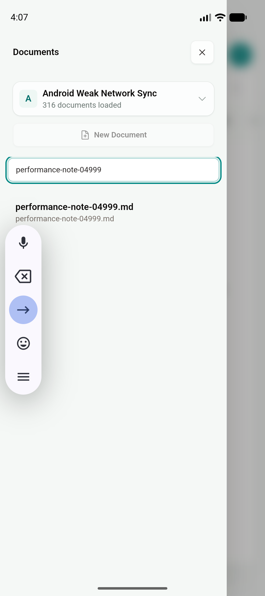
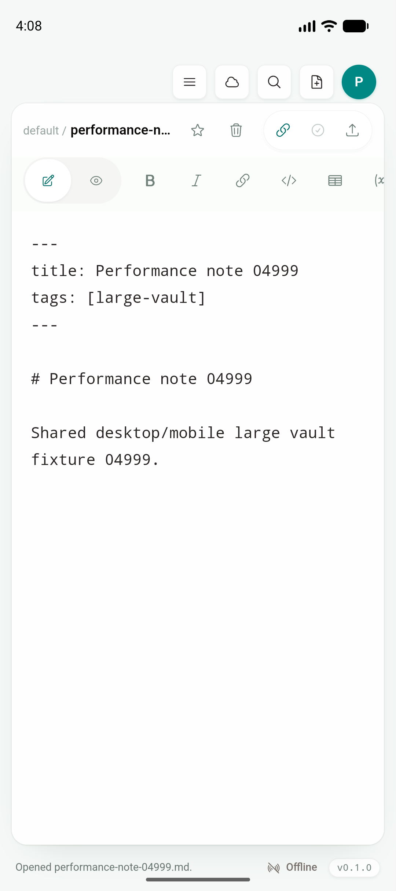
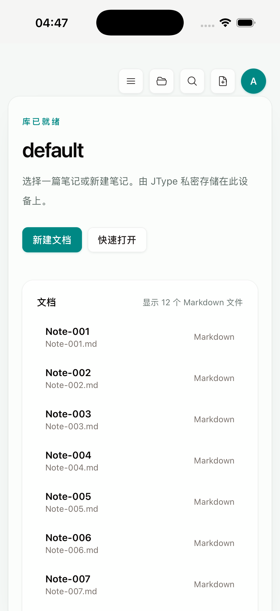
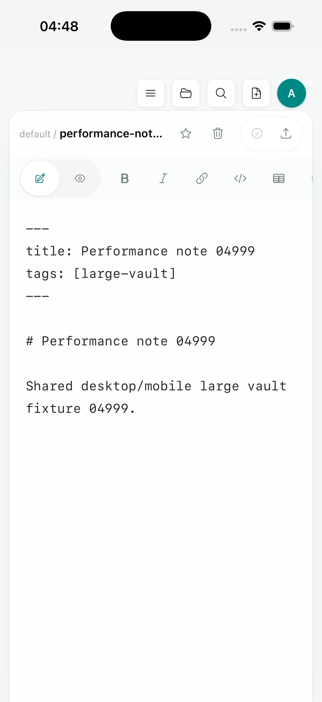

# Phase 2D：Mobile partial 5,000-entry vault gate

日期：2026-07-19

Feature branch：`codex/mobile-app`

实现 commit：`231aa18`；iOS 静态运行修复：`5865737`

状态：Android API 36 的 5,008-entry partial cold open、连续分页、尾部搜索/打开与内存采样通过；iPhone 17 Pro / iOS 26.5 Simulator 的干净静态 archive 已完成 5,406-entry partial cold open，并从首批 160 项之外冷恢复打开 `performance-note-04999.md`。physical-device low-memory、iOS 交互式连续分页/搜索和 Files provider 性能 gate 仍待完成。

## 结论

这次没有创建 mobile-only Markdown 列表、编辑器、Preview、Document Info 或操作层，也没有把 web landing page、docs website 或 dashboard 放进 app。Android/iOS 继续使用根 `src/` 的 Desktop `Sidebar`、`QuickSwitcher`、`EditorShell` 和 commands；移动差异仍只存在于 runtime capability、Tauri/Rust shallow page 与 provider adapter。

`231aa18` 做了两项收口，后续 `5865737` 修复 iOS 启动适配：

1. 将 shared `TreeNodeList` 的 DOM 渐进 window 与 native shallow page 合并为一个 **Show more** 操作。真实 Android 5,008-entry 运行曾暴露两个同名按钮（一个扩展已加载 DOM、一个读取 native page）；现在每次点击同时扩展可见 window，并在 partial cursor 存在时读取下一页，加载期间通过 `aria-busy`/`disabled` 防止重复请求。Desktop complete snapshot 仍只扩展 DOM window，不调用 native page。
2. mobile partial bootstrap 记录完整 JavaScript → Tauri IPC 耗时和 UTF-8 snapshot 字节数。指标位于内部 runtime adapter，Desktop 完整 `open_workspace` 路径不变。
3. iOS 启动时的 share inbox drain 改由 Tauri background worker 等待 native plugin；Swift 的小型 pending-share drain 在 native command 返回前完成，避免 WebView 主线程与 plugin response queue 互相等待。UI、AppState、文件列表和 EditorShell 没有分叉。

## Android 性能与连续分页

环境：Android API 36 arm64 emulator，1080×2424；app-private default vault 根目录共 5,008 个 entry，其中 5,000 个为确定性 Markdown fixture。

| 指标 | 结果 |
| --- | ---: |
| Activity cold launch `TotalTime` | 302 ms |
| native partial root page | 16 ms |
| JavaScript → Tauri partial bootstrap | 22.4 ms |
| initial serialized snapshot | 30,580 bytes |
| 首批 | 160 / 5,008 entries |
| 第二个 native page | 21 ms，累计 320 / 5,008 |
| cold stable memory（5 秒） | PSS 126,056 KB；RSS 304,012 KB；swap PSS 106 KB |
| 第二页后 memory | PSS 119,549 KB；RSS 298,260 KB；swap PSS 47 KB |

第二页后的采样没有出现随分页增长的 RSS；单次模拟器样本不能替代 physical-device peak/memory-warning gate。早期 complete snapshot 基线 `85dee2f` 在同族 5,003-document fixture 的 native full open 为 131 ms；本轮 native 首批为 16 ms，但旧报告没有记录完整 snapshot 的 IPC bytes/RSS，因此只记录 core 枚举时延变化，不推导完整端到端内存降幅。

原始数值保存在 [`android-partial-large-vault-performance.txt`](assets/phase-2/android-partial-large-vault-performance.txt)。

连续分页后只保留一个共享操作，徽标显示剩余 4,688 项：



native 全 vault search 直接命中尚未加载的 `performance-note-04999.md`：



命中项继续由 Desktop 共用 `EditorShell` 和原有 read command 打开唯一正文：



现有 `tests/mobile/android-large-vault.yaml` 在最终 APK 上通过 Documents → tail search → open → unique body 完整 flow，总 wall time 约 28.8 秒（包含 Maestro driver 和断言）。

## iOS 静态 archive gate

早先“静态 custom-scheme 空白”的结论已纠正。根因有两层：

1. `tauri ios dev` 会覆盖 `src-tauri/gen/apple/build/jtype_iOS.xcarchive`；此前手动安装的是被覆盖的 dev archive，其可执行文件不包含 `dist/index.html` 引用的入口 JS/CSS，并非 clean static artifact。
2. clean static archive 恢复大库时，主线程 sample 明确停在 `initial_external_file_sources → take_pending_shares → recv()`。同步 Tauri command 在主线程等待 native plugin，而 plugin register/response 又等待主线程，导致首帧无法提交。`5865737` 将该 drain 移到 background worker，并保持平台差异只在 Rust/Swift adapter。

仓库新增 `mobile:ios:verify-static`：从当前 `dist/index.html` 提取入口 JS/CSS，并确认它们确实嵌入 archive binary，从而阻止 dev archive 被误当作静态包。正向 archive 校验通过，使用无资源的 fake executable 会按预期失败。

干净 no-sign aarch64 Simulator archive 覆盖安装后，app-private vault 共 5,406 个 root entry，其中包含 5,000 个确定性 fixture。冷启动首批为 160 / 5,406：首次记录 native/IPC 约 114 ms；尾部文档冷恢复复跑为 51 ms。共享 `VaultHome` 仍只渐进挂载首屏 12 个条目：



将测试恢复状态指向不在首批 160 项中的 `performance-note-04999.md` 后重新 cold launch，native partial resolver 按原 Desktop path/open 语义进入同一个 `EditorShell`：



准确 gate 状态是：iOS clean static archive identity、5,406-entry partial cold open 和 unloaded tail cold restore **PASS**。当前 Maestro 2.6.1 / Xcode 26.6 的 XCUITest driver 在 hierarchy 查询时断开，因此本轮不把交互式 Show more/search、RSS 或 memory-warning 标成通过；这些项目保留到可用 driver 或 physical iPhone。

## 构建产物与回归

```text
Android universal debug APK
394,746,942 bytes
SHA-256 d1965f594af082f246b5901d573f2718304bb9483c95e795f8f3214560aa750b

iOS Simulator archive app binary
108,980,840 bytes
SHA-256 43c4f17c84ec2dd3c62fe63f27e13e3e11eeffb1abf8eb1f14681e64ca100488
```

| 验证 | 结果 |
| --- | --- |
| `pnpm build` | PASS |
| `pnpm test:unit` | PASS，72/72；新增 bootstrap count、elapsed clamp 与 UTF-8 snapshot byte 测试 |
| `pnpm test:e2e` | PASS，56/56；405-entry partial fixture 连续读取三页，并断言始终只有一个 Show more、末页后消失 |
| `cargo test --manifest-path services/jtype-core/Cargo.toml` | PASS，44/44 |
| `cargo test --manifest-path src-tauri/Cargo.toml --lib` | PASS，29/29 |
| Android aarch64 universal debug APK | PASS；安装、cold launch、连续分页、tail search/open 与 memory sample 完成 |
| `pnpm mobile:ios:verify-static` | PASS；当前 `dist/index.html` 的 2 个 JS 与 1 个 CSS 入口均存在于 archive binary；fake executable 负例按预期失败 |
| iOS aarch64-sim no-sign archive | PASS；静态 `VaultHome` 5,406-entry partial cold open 和 unloaded `04999` cold restore → shared `EditorShell` 通过；交互式分页/搜索与 memory gate 待完成 |

截图 SHA-256：

```text
11ae9a0d299083f43bc61274bf2e71b2fbd62570a63427138ff40b46cd5b4f51  android-partial-large-vault-page.png
1ca1c4256e06381bd0c43516e1e76e6f1cc283b44e5b2e10554d0c772802853a  android-partial-large-vault-search.png
a71e5b1dd6357c5844d389fdc06002db09e25c3a568bc56a55600120938d75d2  android-partial-large-vault-editor.png
0fc340f629b0d4910aea4ce6882835d1044183f315d3326dc1fbe13891bfcdc4  ios-partial-large-vault-static-home.png
6cd947aad38c6c17db4bb10ce856a852c37b99d2ac385b7279edc7eb9145a973  ios-partial-large-vault-static-tail-editor.png
```

## 剩余边界

1. 当前每页仍会重新枚举并排序目标目录的全部直接子项；它减少 snapshot/IPC，不是 provider-native streaming cursor。
2. external vault 首次 mirror 与 source manifest/hash scan 仍会遍历完整 source。
3. physical Android/iPhone 的 peak RSS、memory warning、后台恢复与低存储 gate 未完成。
4. iOS 静态 archive cold-open/tail restore 已通过；仍需在可用 XCUITest driver 或 physical iPhone 补交互式连续分页/搜索、Files provider、peak RSS、memory warning 和后台恢复。
