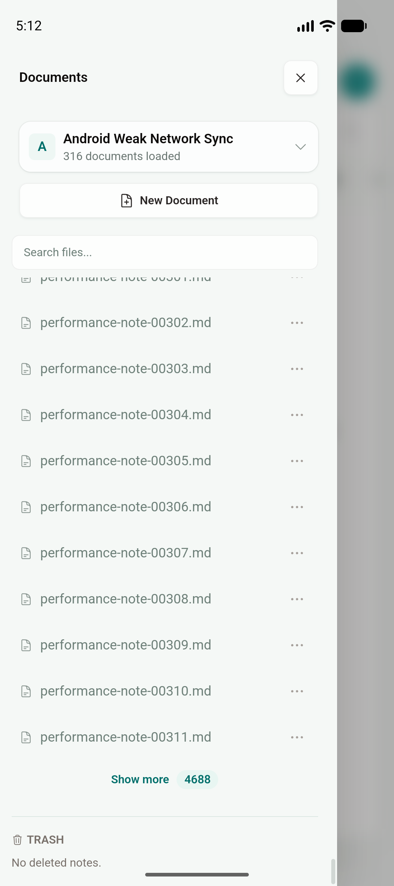
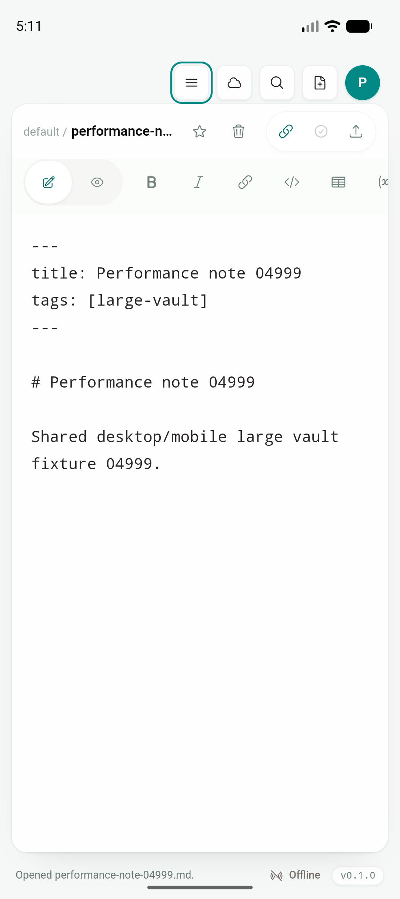
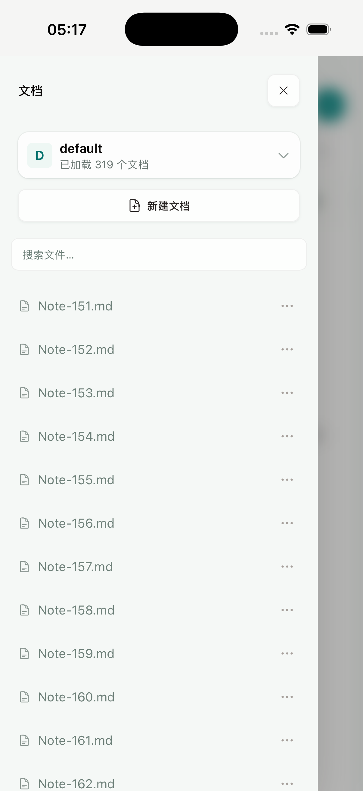
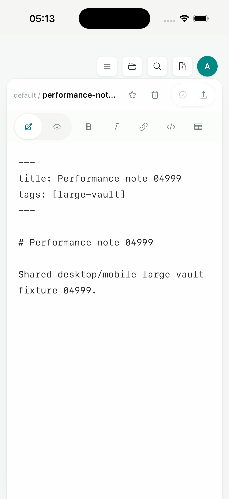

# Phase 2D：Mobile partial shallow-page cache

日期：2026-07-19

Feature branch：`codex/mobile-app`

实现 commit：`a74b43a`

状态：Android API 36 的 5,008-entry vault 与 iPhone 17 Pro / iOS 26.5 Simulator 的 5,406-entry vault 均完成真实 **Show more** 第二页交互；两端 native 日志均为 `cache=hit elapsed_ms=0`。physical-device peak RSS、memory warning、external provider full-manifest 优化仍待完成。

## 结论

这个增量没有增加 mobile-only Markdown 文档列表、编辑器、Preview、Document Info 或操作，也没有引入 web landing page、docs website 或 dashboard。Android/iOS 继续运行根 `src/` 的 Desktop `AppState`、`Sidebar`、`VaultHome`、`QuickSwitcher`、`EditorShell`、Board 和 commands。

变化只位于内部兼容层：

1. Rust core 增加一个有界 shallow-directory cache。首次 partial root page 仍枚举并排序当前目录；后续页面在目录 fingerprint 未变化时直接从同一排序结果切片。
2. cache 最多保留 32 个目录、合计 50,000 个直接子项，并以 LRU 淘汰；不会因用户展开大量目录而无界增长。
3. cursor 从裸十进制 offset 改为不透明的 `version + directory revision + offset`。目录增删/rename 后，旧 cursor 被明确判为 stale；共享 `useFileSystem` 自动重新读取该目录首屏并 merge 回同一个 canonical `WorkspaceSnapshot`。
4. partial open/page 三个 Tauri command 进入 background worker，避免大目录扫描或 cache mutex 占用 iOS WebView 主线程。Desktop 的完整 `open_workspace` 路径没有改变。
5. shared TypeScript merger 只校验 cursor 的进度/null 契约，不解析 native cursor 内容；mock 与平台 adapter 可以演进，而 UI tree/state 仍只有一份。

## 正确性边界

目录 cache 只保存 shallow `FileTreeNode` 名称、类型和路径，不保存 Markdown 正文。文件内容修改不会改变 shallow listing，因此无需失效；直接子项增删/rename 会改变目录 metadata fingerprint并使旧 cursor 失效。cache miss 扫描在目录 metadata 前后各取一次 fingerprint，最多重试三次，避免把变更中的目录发布为稳定 page。

测试覆盖：

- 连续第二页只发生一次 directory scan，后续为 cache hit。
- 目录 mutation 后旧 revision cursor 返回 stale，新首屏重新扫描。
- 33 个目录会触发固定 32-directory LRU 上限。
- unsafe page size/path/cursor 继续拒绝。
- React 接受 opaque cursor，并识别 stale 错误；目录变化时自动 refresh，而不是把旧 offset 永久留在 UI。

## Android 5,008-entry gate

环境：Android API 36 arm64 emulator，1080×2424，app-private default vault；5,008 个 root entry，其中 5,000 个为确定性 Markdown fixture。

```text
Activity cold launch TotalTime: 304 ms
workspace_page start=0 returned=160 total=5008 cache=miss elapsed_ms=14
workspace_open_partial loaded=160 total=5008 elapsed_ms=14
workspace_page start=160 returned=160 total=5008 cache=hit elapsed_ms=0
第二页后 TOTAL PSS: 120,074 KB
第二页后 TOTAL RSS: 298,440 KB
第二页后 TOTAL SWAP PSS: 76 KB
```

`tests/mobile/android-pagination-cache.yaml` 在最终 APK 上完成 Documents → scroll to Show more → native second page → loaded-count assertion。第二页后共享 Documents 抽屉显示 316 个文档、剩余 4,688 项；缓存本身没有改变 `TreeNodeList` 的 UI 或操作：



native full-vault search 继续命中首批之外的 `performance-note-04999.md`，并通过原有 read command 进入 Desktop 共用 `EditorShell`：



## iOS 5,406-entry gate

环境：iPhone 17 Pro / iOS 26.5 Simulator，clean no-sign aarch64 static archive，app-private vault 共 5,406 个 root entry。

```text
workspace_page start=0 returned=160 total=5406 cache=miss elapsed_ms=53
workspace_open_partial loaded=160 total=5406 elapsed_ms=53
workspace_page start=160 returned=160 total=5406 cache=hit elapsed_ms=0
```

`tests/mobile/ios-pagination-cache.yaml` 使用 Maestro/XCUITest 完成 Documents → scroll to Show more → native second page → loaded-count assertion。最终抽屉显示已加载 319 个文档；这是交互式 iOS static archive 证据，不再只是 cold restore：



同一最终 archive 冷启动还会恢复首批之外的 `performance-note-04999.md` 到共享 `EditorShell`：



## 自动化与构建

| 验证 | 结果 |
| --- | --- |
| `pnpm build` | PASS |
| `pnpm test:unit` | PASS，73/73 |
| `pnpm test:e2e` | PASS，56/56 |
| `cargo test --manifest-path services/jtype-core/Cargo.toml` | PASS，46/46 |
| `cargo test --manifest-path src-tauri/Cargo.toml --lib` | PASS，29/29 |
| `pnpm tauri android build --debug --target aarch64 --apk --ci` | PASS |
| `pnpm mobile:ios:build:simulator-static` | PASS；archive build 与静态入口资源 verifier 均通过 |
| `tests/mobile/android-pagination-cache.yaml` | PASS；5,008-entry interactive second page |
| `tests/mobile/ios-pagination-cache.yaml` | PASS；5,406-entry clean-static interactive second page |

构建产物：

```text
Android universal debug APK
396,017,062 bytes
SHA-256 29e4a2d7aef730d9a2d6ba32af1d4f07ff27ea42b4357fb30e6b691cb7947623

iOS Simulator archive app binary
109,370,520 bytes
SHA-256 610ccbe0d80124492543ca1abaef4095616e763d61b07b255db4584f83e5ff42
```

截图 SHA-256：

```text
7369d1f550e2646fd0a9f518ff266444a4d18173687baa510a98974032b5470f  android-partial-page-cache-hit.png
c16eeccec0a04340425fcc5ad51b7cb61fc1e7d3048966467c107b02d93d26a8  android-partial-page-cache-tail-editor.png
71479396e13e455e331c5ae75ea7a171ef7b49d13fe2bc4cc446db56cb766c82  ios-partial-page-cache-hit.png
989408520a25c5649915f2b7c1cf253d461fac7d9f37e169eaa757f8abe766e2  ios-partial-page-cache-tail-editor.png
```

## 剩余边界

1. 首次读取一个目录仍是 `O(n log n)` 的完整 shallow enumeration/sort；这次优化的是连续 page，不是 provider-native streaming cursor。
2. 超过 50,000 个直接子项的单目录不会进入 cache，仍走安全的 stateless page path。
3. external vault 的首次 mirror、native source manifest 与 content hash scan 仍可能遍历完整 source；page cache 只作用于 app-private mirror 的 workspace listing。
4. Simulator 数据不能代替 physical Android/iPhone 的 peak RSS、memory warning、后台恢复、低存储与 Files provider gate。
