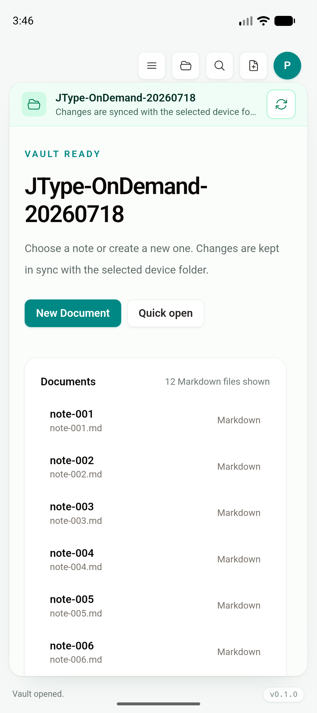
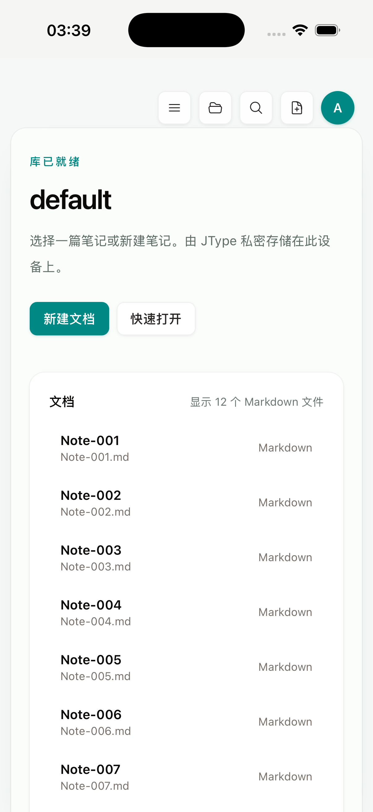

# Phase 2D：Mobile partial workspace runtime

日期：2026-07-19

Feature branch：`codex/mobile-app`

实现 commit：`1a92435`

状态：移动端 partial `WorkspaceSnapshot`、共享 loaded-first/native-fallback 查询、folder page hydration 与 mutation/sync/watch partial re-bootstrap 已接入；Desktop 继续完整打开。Android artifact/cold-launch gate 通过，iOS 共享功能链路通过；当前 Xcode 26.6 + iOS 26.5 Simulator 的静态 custom-scheme JavaScript 加载问题在基线 `434757d` 同样复现，仍需在 physical iPhone 或不同稳定 Simulator 环境补静态产物运行 gate。

## 结论

本增量没有创建 mobile-only 文件列表、编辑器、Preview、Document Info 或操作层，也没有复用 web landing page、docs website 或 dashboard。Android/iOS 继续运行根目录 `src/` 的 Desktop `AppState`、`VaultHome`、`Sidebar`、`QuickSwitcher`、`EditorShell`、Board 与 commands；平台兼容只位于 runtime capability、Tauri/Rust query 和 provider adapter。

移动端现在以 canonical `WorkspaceSnapshot` 的 partial 形态启动：

- root 首批最多加载 160 个直接子项，snapshot 明确携带 `completeness=partial` 与每个目录的 page state；Desktop 仍调用完整 `open_workspace`。
- Sidebar 展开目录或点击 **Show more** 时读取 shallow page，并 immutable merge 回同一个 workspace tree；没有第二份 mobile tree state。
- VaultHome、Sidebar search 与 Quick Open 先显示已加载结果；partial snapshot 再调用 native 全 vault search，失败时保留已加载结果。
- exact path、wikilink、通知/deep-link 与移动文档定位先解析已加载节点，缺失或 partial 歧义再走 native resolver。
- rename/move/delete 的 link impact 在 partial runtime 下走 native full-vault query，并保留当前未保存 editor buffer。
- filesystem mutation、cloud sync、cloud event、file watcher 与 Board refresh 统一通过 runtime adapter 重新取得 partial snapshot，避免把完整 mutation response 留回移动 state。

405-document E2E fixture 证明：首屏仍是 Desktop 共用 workbench；root 与 nested folder 可继续分页；Quick Open 可以直接找到并打开未加载的尾部文档。Rust fixture 的 205 篇 Markdown 加一个 folder/metadata vault 首屏为 160/207 个可见 root entries。

## 契约边界

`WorkspaceSnapshot` 仍是唯一产品数据模型。新增字段只描述完整性和 page progress，complete Desktop snapshot 对旧调用方保持兼容。shared components 不读取平台类型；只有 `usesPartialWorkspace` capability 决定 bootstrap adapter 选择完整或 partial command。

当前限制：

1. 每页仍会重新枚举并排序当前目录的全部直接子项；它限制 snapshot/IPC，不是 provider-native streaming cursor。
2. external vault 首次 mirror 与每次 native source manifest/hash scan 仍可能遍历完整 source；partial runtime 当前作用于 app-private mirror 的 workspace state。
3. page cursor 是当前确定性排序的 offset；目录变化后 mutation/watch 路径重新 bootstrap，而不是继续使用旧 cursor。
4. 5,000-document physical-device cold open、峰值 RSS、连续分页和低内存恢复仍待测，不能从 405-document功能 gate 推导性能结论。

## 自动化与构建

| 验证 | 结果 |
| --- | --- |
| `pnpm build` | PASS；Android 当前源码构建的 `beforeBuildCommand` 完成 TypeScript/Vite production build |
| `pnpm test:unit` | PASS，70/70；含 partial merge、loaded/native resolver 与 native failure fallback |
| `pnpm test:e2e` | PASS，56/56；含 405-document partial bootstrap、root/nested page 与未加载尾部 Quick Open |
| `cargo test --manifest-path services/jtype-core/Cargo.toml` | PASS，44/44 |
| `cargo test --manifest-path src-tauri/Cargo.toml --lib` | PASS，29/29 |
| `CI=true pnpm tauri android build --debug --target aarch64 --apk --ci` | PASS |
| `CI=true pnpm tauri ios build --debug --target aarch64-sim --no-sign --archive-only --ci` | PASS；静态 archive 构建通过，当前 Simulator 静态运行 gate 见下文 |

构建产物：

```text
Android universal debug APK
394,161,686 bytes
SHA-256 053d6082941fd0f779e42756eb580e3ba15a8a8c037fa21bbe00d9f28bd0d276

iOS Simulator archive app binary
108,871,656 bytes
SHA-256 a274a7eeacb17dc019ba83429a6332e18a3f3952f8a3de3c97043a5f55cbdbff
```

Android API 36 arm64 emulator 覆盖安装最终 APK 后显式 cold launch 成功，`TotalTime=336 ms`。已有 120-document SAF mirror 恢复到同一 `VaultHome`，首屏显示 12 个 Markdown 条目：



iPhone 17 Pro / iOS 26.5 Simulator 使用 signed Tauri dev build 与临时 HTTPS `devUrl` 启动同一 Rust/native shell 和根 `src/` 产品层；app-private 405-document fixture 显示 partial `VaultHome` 首批 12 项：



截图哈希：

```text
112bf22683c9d7820110e0a60019f8897bf28c208cbe0fb3cf21a2f71406cecf  android-partial-workspace-runtime.png
929676bc2800c83f09fe0cac5f61b290bc51e2b5df442e7374017dcdcc99b73f  ios-partial-workspace-runtime.png
```

### iOS 静态产物说明

串行、clean 的 no-sign archive 安装后，在当前 Xcode 26.6 / iOS 26.5 Simulator 显示空白 WebView。相同 Simulator、相同构建方式下，改动前基线 `434757d` 也显示相同空白；因此现有证据不支持把它归因于 `1a92435` 的 partial runtime。临时 HTTPS `devUrl` 绕开静态 custom scheme 后，同一 native shell、Rust commands、shared React UI 与 405-document partial flow 可以运行。

准确 gate 状态是：iOS compile/archive **PASS**，shared/native 功能 flow **PASS**，当前环境的静态 archive runtime **BLOCKED BY ENVIRONMENT/BASELINE-REPRODUCIBLE**。后续必须在 physical iPhone、不同稳定 Simulator/Xcode 组合或上游 resource-loading 修复后重跑；不以 dev build 代替最终静态产物验收。

Android 与 iOS Tauri build 继续串行执行，因为两者的 `beforeBuildCommand` 共用根 `dist/`。

## 下一步

1. 在 Android/iOS 5,000-document fixture 与 physical device 记录 cold open、首屏 IPC、峰值 RSS、尾部 search/resolve 和连续 folder paging。
2. 评估 provider-native streaming cursor 与增量 source manifest，分别减少单目录重复枚举和 external full hash I/O。
3. 在 physical iPhone 或不同稳定 Xcode/Simulator 环境补齐静态 archive cold-launch、Files provider 与 low-memory gate。
