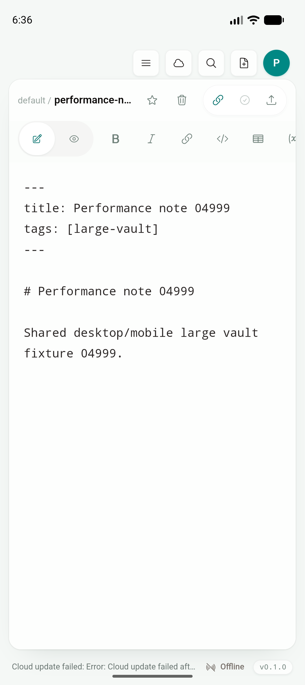
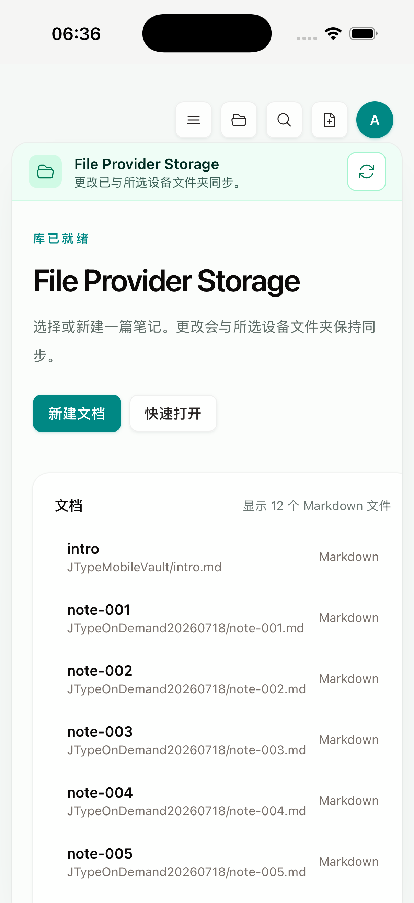

# Phase 2：Physical-device preflight gate

日期：2026-07-19

Feature branch：`codex/mobile-app`

实现 commit：`c63aac3`

状态：preflight 工程入口已完成；当前机器没有 Android 真机或 physical iPhone，且缺少 iOS development signing identity/team，因此 Phase 2 真机验收仍为 **BLOCKED**。

## 目标与边界

这一增量把 Phase 2 分散的真机前置条件收口成可重复、fail-closed 的工程门禁。它只新增测试/诊断脚本，不修改 `src/`、`shared/`、Tauri product commands 或 Desktop 行为，也不增加 mobile-only UI、landing page、docs 页面或 web dashboard。

两个入口分别用于 CI/正式验收与本地诊断：

```bash
# 缺少任何必需真机条件时返回 2
pnpm mobile:device:preflight

# 输出同一份报告，但允许当前 blocked 环境返回 0
pnpm mobile:device:preflight:report
```

可用参数：

```text
--platform all|android|ios
--format markdown|json
--output <path>
--allow-blocked
```

指定设备和 iOS team 使用环境变量，不把原始设备标识或 team 写进仓库：

```text
JTYPE_ANDROID_SERIAL
JTYPE_IOS_UDID
JTYPE_IOS_DEVELOPMENT_TEAM
```

## Fail-closed contract

Android gate 同时要求：

- `adb` 能发现非 `emulator-*` 的设备；
- 指定/选中的真机为 `device`，不是 `unauthorized`、`offline` 或其他状态；
- Android API 不低于 JType `minSdk 24`；
- ABI 能映射到已有 Tauri Android target；
- Emulator 只计入 ignored diagnostic count。

iOS gate 同时要求：

- `xcrun devicectl` 返回 available physical iPhone；
- 指定/选中的 iPhone Developer Mode 为 `enabled`；
- Keychain 中存在有效 Apple Development code-signing identity；
- Xcode build settings 或 `JTYPE_IOS_DEVELOPMENT_TEAM` 提供 development team；
- booted Simulator 只计入 ignored diagnostic count。

Markdown/JSON 报告中的设备标识会被截断；测试 fixture 只有在 `JTYPE_PREFLIGHT_TEST_MODE=1` 时才生效，正常执行不能用 fixture 绕过真实设备发现。

## 当前真实结果

完整文本证据：[`physical-device-preflight.txt`](assets/phase-2/physical-device-preflight.txt)。

| Gate | 结果 |
|---|---|
| Android physical device | BLOCKED；0 真机，1 Emulator 被忽略 |
| iOS physical iPhone | BLOCKED；0 真机，1 booted Simulator 被忽略 |
| Apple Development identity | BLOCKED；0 valid identities |
| iOS development team | BLOCKED；未配置 |
| `pnpm mobile:device:preflight:report` | PASS；完整报告，exit 0 |
| `pnpm mobile:device:preflight -- --format json` | EXPECTED BLOCK；exit 2 |

严格模式的非零退出是本阶段的正确结果：它证明当前 Emulator/Simulator 不会让真实设备 gate 误通过。

## Simulator runtime evidence

Android Studio 的 arm64 API 36 AVD 冷启动 JType 成功，`Status: ok`、`LaunchState: COLD`、`TotalTime: 326 ms`，进入根目录 `src/` 的共用 `EditorShell`：



iPhone 17 Pro / iOS 26.5 Simulator 重新启动 JType 成功，进入同一产品层的 `VaultHome` 与 provider banner：



这些截图只证明当前构建仍复用 Desktop UI/操作且双模拟器可运行；不替代 USB 真机、签名、Developer Mode、Files provider、内存和触感验收。

## 回归结果

| 验证 | 结果 |
|---|---|
| targeted preflight unit | PASS；5/5 |
| `pnpm test:unit` | PASS；78/78 |
| `pnpm test:e2e` | PASS；56/56 |
| `pnpm build` | PASS；Desktop frontend |
| `cargo test --manifest-path services/jtype-core/Cargo.toml` | PASS；46/46 |
| `cargo test --manifest-path src-tauri/Cargo.toml` | PASS；29/29 |
| `pnpm mobile:android:verify-studio-variant` | PASS；default flavor `arm64` |
| `pnpm mobile:ios:build:simulator-static` | PASS；static archive verifier |
| Android Emulator cold launch | PASS；shared `EditorShell` |
| iOS Simulator launch | PASS；shared `VaultHome` |

Desktop 的产品代码、capability 默认值与构建路径没有改变。

## 真机交接

Android 真机接入后：

```bash
adb devices -l
export JTYPE_ANDROID_SERIAL=<authorized-physical-serial>
pnpm mobile:device:preflight -- --platform android
```

通过 preflight 后，使用对应 `tauriTarget` 构建并安装，完成 cold launch、外部 vault、弱网/离线、低存储、进程终止、large-vault peak RSS/memory warning 和系统分享矩阵。

physical iPhone 接入后：

```bash
xcrun devicectl list devices
security find-identity -v -p codesigning
export JTYPE_IOS_UDID=<available-physical-iphone-identifier>
export JTYPE_IOS_DEVELOPMENT_TEAM=<apple-team-id>
pnpm mobile:device:preflight -- --platform ios
```

还必须让主 app 与 `JType Share` 使用同一 team/profile，完成 signed build/install、Developer Mode、bookmark 失效/重新授权、iCloud/第三方 Files provider、VoiceOver/gesture/haptic、memory warning 与后台恢复验收。

只有相应平台 preflight 为 `READY` 且上述真实设备 flow/证据完成后，tracking 中的 physical gate 才能标记完成。

## Artifact hashes

```text
9a55603bbf46c4e4b5361d4f15f4fbc14c31cf9ef97f1f5cf95a364f13cd24d6  android-physical-preflight-runtime.png
2ca9f7e9982ee49d646d170417ad50151cdb1be6fe5d7016226512830d750a6a  ios-physical-preflight-runtime.png
```
