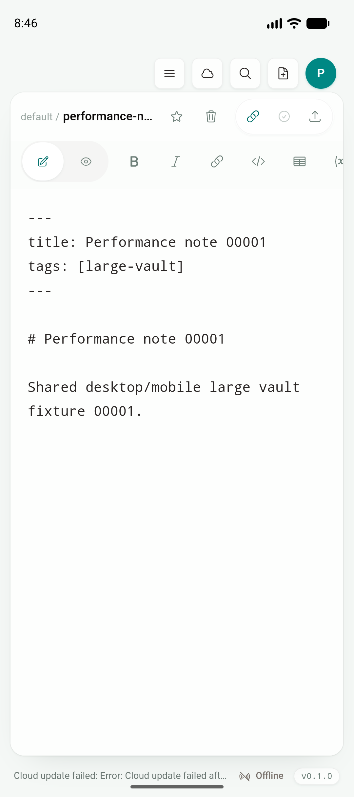
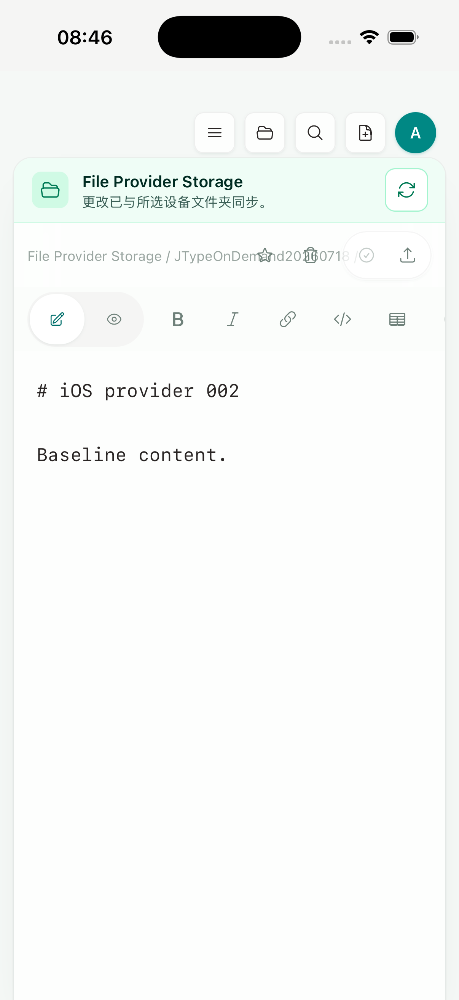

# Phase 2D — APNs / FCM provider transport engineering gate

日期：2026-07-19

实现 commit：`611dbcd`

状态：durable outbox、FCM HTTP v1 / APNs HTTP/2 transport、重试与失效 registration 清理的工程 gate 已完成；真实 provider credentials、release signing、生产网络投递与 physical-device delivery 未完成

## 结论

JType 的协作通知现已从“客户端注册 + payload contract”推进到可部署的服务端传输边界：真实文档版本提交后，服务端为同一 cloud workspace 中除操作者外的 active members 建立 durable delivery；worker 根据 registration 的 provider/environment 调用 FCM 或 APNs，并处理成功、限流/暂时失败、永久失败和 identifier 失效。

本增量只修改 `services/jtype-web`、数据库 migration 和 Docker 环境透传，没有修改根目录 `src/`、shared UI 或移动原生 UI。Android/iOS 仍运行 Desktop 共用的 `Sidebar`、`VaultHome`、`EditorShell`、Preview、Document Info、Board 和 commands；没有新增 mobile-only 文档列表/编辑器，也没有引入 web landing page、docs 或 dashboard。

准确的完成边界是：

- provider transport、凭据校验、durable queue、coalescing、并发 claim、退避、`Retry-After`、成员复核、invalid-registration cleanup 和自动化 contract 已完成；
- mock provider 验证了最终 URL、Authorization/header、FCM `message.fid`、APNs payload 与 canonical document route；
- 当前环境没有 Firebase service-account credential、APNs `.p8` key、Apple Development identity 或真机，因此没有调用真实 Google/Apple endpoint，不宣称 production remote delivery 已通过；
- Android/iOS 最终 artifact 的安装、冷启动与共享 EditorShell 截图是 UI/启动回归证据，不是 provider 网络投递证据。

## Durable outbox 与事件边界

Migration `0028_mobile_push_deliveries` 保存 registration、cloud workspace、哈希化 event/path key、相对路径、document clock、有限长度通知 copy、状态、attempt 和下一次重试时间。外键在 registration、cloud workspace 删除时 cascade 清理。

真实文档变化通过统一的 `save_document_version` wrapper enqueue；显式 conflict merge 因为绕过该 wrapper，在保存完成后调用同一 enqueue function。`MergeStatus::Unchanged` 不产生通知。enqueue 在文档事务提交后 best effort 执行，所以通知基础设施故障不会回滚用户文档。

每次 enqueue 会：

1. 只选择该 cloud workspace 的 active members；
2. 排除本次操作者，避免给自己的其他安装发送协作提示；
3. 对同一 registration/document 的未 claim `pending`、`failed`、`dead` hint 做合并，只保留最新 document clock；
4. 不删除 `processing` row，避免和并发 worker claim 相互覆盖；
5. 用 registration + event key 保证同一文档版本幂等。

通知是“重新拉取最新状态”的 refresh hint，而不是版本 ledger。成功后立即删除 delivery 中的私有相对路径和通知 copy；失效 registration 删除后 cascade 清除该安装全部队列。永久 provider/config/payload 错误保留为 `dead`，同一路径下一次真实更新会将其合并替换。后续 `948ecf6` 又增加 provider-independent maintenance 与四小时 retention，即使没有下一次更新或没有 provider credentials，这些私有 hint 也不会无限期保留；见 [`phase-2-push-retention.md`](phase-2-push-retention.md)。

## Provider transport

### FCM

- 使用 service-account RS256 JWT assertion 向固定的 `https://oauth2.googleapis.com/token` 换取 OAuth 2 access token；token 在到期前 60 秒刷新。
- 发送 endpoint 固定为 `https://fcm.googleapis.com/v1/projects/{project}/messages:send`，环境变量不能替换生产 endpoint。
- 使用当前 direct-send contract 的 `message.fid`，data-only payload 继续由 Android 原生 service 呈现系统通知。
- 首次 HTTP 401 会清空 access-token cache 并重新认证一次。
- 只有响应内明确的 FCM `UNREGISTERED` 或 `INVALID_ARGUMENT` 才清理 registration；普通 HTTP 404 记为永久错误，不会因 project ID 配错批量删除设备。

### APNs

- 使用 ES256 provider JWT，Team ID、Key ID 与 topic 均经过格式校验；provider token 每 50 分钟刷新。
- development/production registration 分别发送到 Apple 官方 sandbox/production origin；新式 environment-scoped keys 可以独立配置，旧 shared key pair 仅作兼容。
- client 要求 TLS 1.2+、启用 HTTP/2、禁用 redirect；请求固定携带 `apns-topic`、`apns-push-type=alert`、priority 与 expiration。
- `ExpiredProviderToken` 会清 token cache 并重签一次；`BadDeviceToken`、`DeviceTokenNotForTopic`、`ExpiredToken`、`Unregistered` 会删除 registration。

## Retry、并发与安全

worker 每 10 秒读取最多 40 条 due deliveries。多实例通过 conditional `UPDATE ... status='processing'` claim；超过 5 分钟的 processing claim 会恢复为 failed。发送前再次删除已经失去 active membership 的 delivery，避免历史队列继续发送 cloud workspace 路径。

HTTP 429、5xx、APNs `IdleTimeout` 和网络/OAuth 暂时错误进入 retry。provider `Retry-After` 优先，其他情况使用 60 秒起步的指数退避加稳定 jitter，上限 1 小时；最多 8 次后进入 `dead`。FCM/APNs 的永久 sender/topic/payload 错误不做无意义重试。

安全边界包括：

- provider 只有在一整组凭据完整且私钥可解析时启用；缺失或格式错误时 fail closed；
- private key 支持容器环境中的转义 `\\n`，但不会进入日志、delivery row 或 API response；
- production endpoint 不接受环境覆盖，HTTP redirect 被禁用；
- provider response body 不落库；只保存经过 ASCII allowlist 和 128 字符上限处理的 reason；
- route 继续拒绝 traversal、reserved segment、反斜线、control character 和非法 workspace ID。

## 部署配置

| Provider | 必需变量 | 说明 |
| --- | --- | --- |
| FCM | `JTYPED_FCM_PROJECT_ID`、`JTYPED_FCM_CLIENT_EMAIL`、`JTYPED_FCM_PRIVATE_KEY` | 三项必须同时有效，否则 FCM disabled |
| APNs common | `JTYPED_APNS_TEAM_ID`、`JTYPED_APNS_TOPIC` | topic 默认 `net.jcode.jtype` |
| APNs development | `JTYPED_APNS_DEVELOPMENT_KEY_ID`、`JTYPED_APNS_DEVELOPMENT_PRIVATE_KEY` | 只启用 sandbox registrations |
| APNs production | `JTYPED_APNS_PRODUCTION_KEY_ID`、`JTYPED_APNS_PRODUCTION_PRIVATE_KEY` | 只启用 production registrations |
| APNs legacy | `JTYPED_APNS_KEY_ID`、`JTYPED_APNS_PRIVATE_KEY` | 旧的 shared key，可覆盖两个 endpoint；显式 environment key 优先 |

`docker compose config --quiet` 已通过。未配置任何完整 provider 时，web service 不启动 delivery worker，并打印通用 disabled 原因；它不会使用 placeholder credential 或测试 endpoint。

## 自动化与回归

| 验证 | 结果 |
| --- | --- |
| `pnpm build` | PASS；Desktop/shared frontend |
| `pnpm test:unit` | PASS，85/85 |
| `npx playwright test tests/e2e/app.spec.ts` | PASS，56/56 |
| `cargo test --manifest-path src-tauri/Cargo.toml` | PASS，30/30 |
| `cargo test --manifest-path services/jtype-core/Cargo.toml` | PASS，46/46 |
| `cargo test --manifest-path services/jtype-web/Cargo.toml` | PASS，71 lib + 245 API integration = 316/316 |
| `cargo test --manifest-path services/jtype-web/Cargo.toml push::tests` | PASS，7/7；最终 transport/classifier 回归 |
| `cargo test --manifest-path services/jtype-web/Cargo.toml --test push_tests` | PASS，4/4；含成员排除与同路径 coalescing |
| `cargo check --manifest-path services/jtype-web/Cargo.toml` | PASS |
| `docker compose config --quiet` | PASS |

## Android / iOS Simulator artifact gate

Android 使用 `emulator-5554`、arm64、Android API 36。最终 universal debug APK 构建、覆盖安装、显式 cold launch通过，launch `403 ms`，PID `18096`，无 `AndroidRuntime` fatal。画面仍是根目录 `src/` 的 shared EditorShell：



iOS 使用 iPhone 17 Pro Simulator、iOS 26.5、UDID `BD64DE20-5397-486C-8899-4B974425A0AD`。static Simulator archive 构建、安装、launch 通过，PID `15240`，90 秒窗口内没有 app error/fault；画面继续显示 shared EditorShell 和既有 Files-provider banner：



这两张图只证明服务端增量没有分叉或破坏移动端的 Desktop 共用产品层。真实 remote delivery 必须由带真实 credentials 的 provider 和 physical devices 另行证明。

## Artifacts 与截图校验

```text
a3d11b0de7fc37d50ae9193963fbf3e7a858746cc66f59c1b0a3537b5128b7b8  app-universal-debug.apk (401200600 bytes)
5a44c0095729e10587b95887d1b0593615f92bdc89cdec62585e7d27a6d24bbc  jtype.app/jtype (109481352 bytes)
837d1f8d68c26d5c42b4cf2d9f4bae325b34703b86d61e662bcc0c2531d918fa  provider-transport-android-shared-ui.png (136918 bytes)
644c1fc5a27719ad80721a04c2e046b13ca7c2fa48d456a9031d21bfb72a3870  provider-transport-ios-shared-ui.png (187983 bytes)
```

原始 gate 摘要见 [`provider-transport-evidence.txt`](assets/phase-2/provider-transport-evidence.txt)。

## 仍未通过的 production gate

1. 在受控 secret store 配置真实 Firebase service account 与 APNs environment keys，验证 OAuth/JWT renewal、真实 provider success/rejection、限流和 invalid identifier cleanup；本报告的 mock transport 不替代该项。
2. 完成 Firebase Android app/release `google-services.json`、Apple Push capability、provisioning、release signing 与 production deployment。
3. 在 physical Android/iPhone 验证 foreground/background/terminated delivery、tap、rotation、reinstall、logout/account switch、permission denied/re-enabled，以及 provider 返回失效 identifier 后的重新注册。
4. physical-device preflight 当前按预期 exit 2：Android 真机 0、physical iPhone 0、Apple Development identity 0、development team 未配置。Simulator 不满足这个 gate。

实现依据官方 contract：[FCM HTTP v1 send/auth](https://firebase.google.com/docs/cloud-messaging/send/v1-api)、[FCM projects.messages / `message.fid`](https://firebase.google.com/docs/reference/fcm/rest/v1/projects.messages)、[FCM error codes](https://firebase.google.com/docs/cloud-messaging/error-codes)、[FirebaseMessagingService registration lifecycle](https://firebase.google.com/docs/reference/android/com/google/firebase/messaging/FirebaseMessagingService)、[Apple remote notification server](https://developer.apple.com/documentation/usernotifications/setting-up-a-remote-notification-server)、[Apple APNs connection](https://developer.apple.com/documentation/usernotifications/establishing-a-connection-to-apns)、[Apple token-based APNs connection](https://developer.apple.com/documentation/usernotifications/establishing-a-token-based-connection-to-apns)、[Apple APNs response handling](https://developer.apple.com/documentation/usernotifications/handling-notification-responses-from-apns)。
