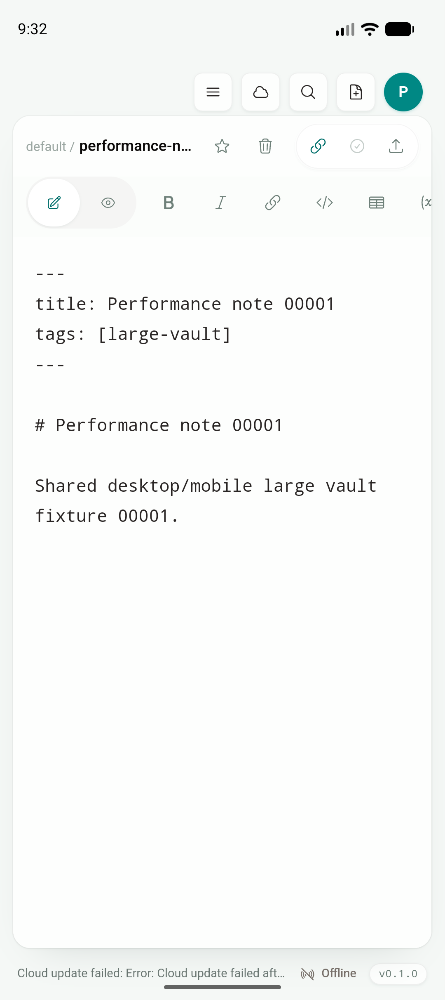
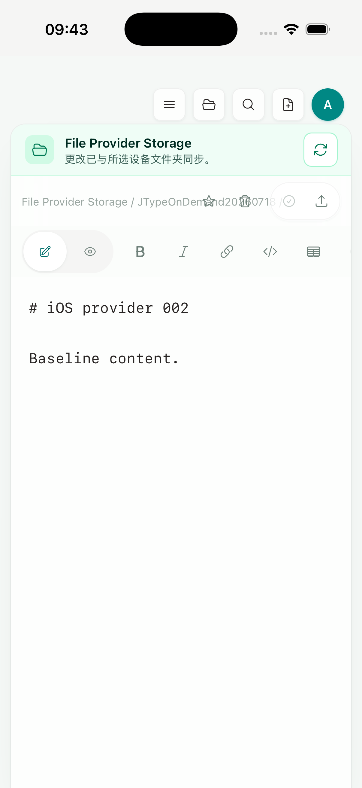
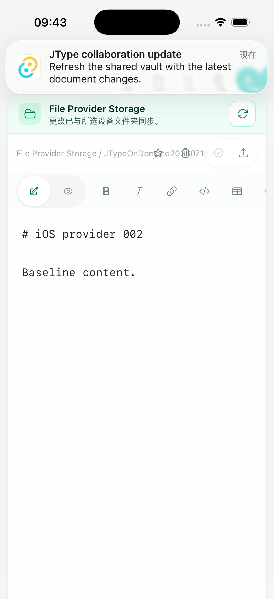
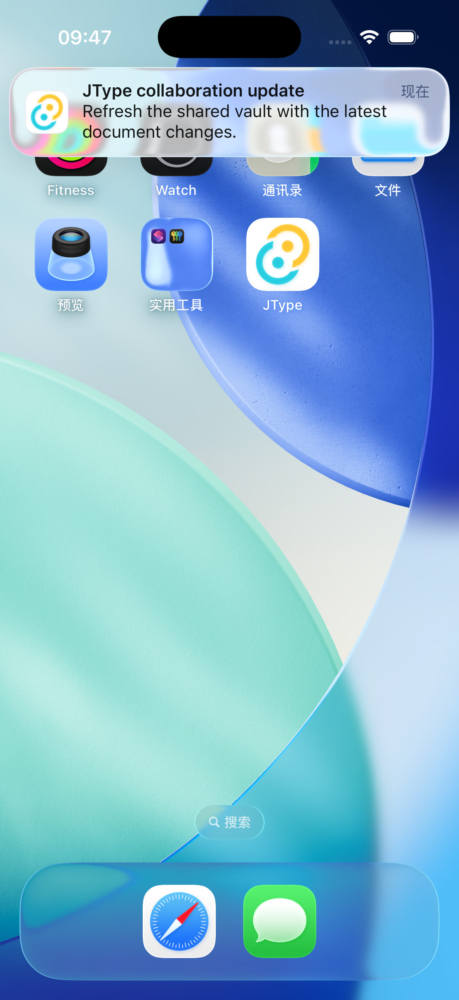

# Phase 2D — Push refresh hint 与共享同步恢复

日期：2026-07-19

实现 commit：`c14571a`

状态：native durable hint、shared lifecycle consume/coalescing、Android/iOS 工程与 Simulator artifact gate 已完成；真实 provider credentials、physical-device background/terminated delivery 与 release signing 未完成

## 结论

协作推送现在可以触发 JType 已有的 Desktop/mobile 共用同步恢复，但没有在 Kotlin 或 Swift 中复制一套同步器。原生层只验证 canonical route、原子记录一个不含内容的 `pendingRefresh=true`，并在 WebView 可运行时发送 `refreshRequested`；根目录 `src/` 的 `useMobileSyncRecovery` 消费该 bit，继续调用既有的 WebSocket restart 与 serialized cloud sync。

移动端产品界面仍以 Desktop 为基准，继续复用同一份 `Sidebar`、`VaultHome`、`EditorShell`、Write / Preview、Document Info、Board、commands 和 sync model。本增量没有建立 mobile-only 文档列表、编辑器或预览，也没有把 web landing page、docs website 或 dashboard 带入 App。

## 单一同步链路

```text
collaboration event
  -> durable server outbox / FCM or APNs visible hint
  -> native canonical-route validation
  -> content-free pendingRefresh bit + best-effort plugin event
  -> root src/ useMobileSyncRecovery
  -> existing listener restart + existing shared cloud sync
```

共享 hook 的行为边界如下：

- 只在 mobile、已登录、当前 vault 已启用 cloud sync 时注册 consume/listener；不会为本地或未绑定 vault 发起无效 cloud operation。
- listener 先注册，再读取 durable bit，关闭初始化窗口内丢失事件的竞态。
- push hint 不受普通 resume/network 的 5 秒 cooldown 限制；如果已有 recovery 正在运行，只保留一个后续 push recovery，避免并发同步。
- app resume 会先尝试消费 pending bit；没有 bit 或 native plugin 不可用时，仍退回原有 `app-resume` recovery。
- native bit 只有 Boolean，不包含文档正文、相对路径、cloud token、provider identifier 或 workspace metadata；消费采用 take-and-clear。

## Android adapter

`JTypeFirebaseMessagingService` 在接受严格 canonical route 后立即记录 refresh hint，再检查 Android 13+ 通知权限。这样用户拒绝系统横幅权限时，App 下次恢复仍可使用 shared sync 拉取 authoritative state；原生 service 不读取 vault 或 cloud credential。

FCM 报告 collapsible message 被删除时，`onDeletedMessages()` 记录一个 generic refresh bit。它只表达“本地状态可能落后”，不尝试重放被 provider 合并的每条事件。`SharedPreferences.commit()` 与进程内 lock 保证 record/take 不会把 `true` 被并发 clear 覆盖；活跃 plugin event 切回 UI thread。

没有新增 WorkManager job。Google 对 `onMessageReceived` 只提供短处理窗口，较长后台工作应另行调度；当前正确边界仍是立即记录 hint，并让共用同步在系统允许的生命周期内运行。

## iOS adapter 与 APNs payload

iOS project 声明 `UIBackgroundModes = remote-notification`。plugin 保留并链式调用已有 AppDelegate `application:didReceiveRemoteNotification:fetchCompletionHandler:` 实现；只有同时满足以下条件才记录 refresh：

- `jtypeRoute` 是严格 canonical JType document URL；
- `aps.content-available == 1`。

foreground remote notification 与系统 tap 同样记录 refresh；后台线程可以同步写入 `UserDefaults`，但 WebView plugin event 总是派发回 main queue。系统回调 completion 在成功记录时返回 `.newData`，否则返回 `.noData`。

服务端 APNs payload 保留可见 `alert`、sound、thread/collapse 语义，同时加入 `content-available: 1`。它仍使用 `apns-push-type=alert` 与 priority 10，因为这是用户可见通知附带的有限后台机会，不是 silent background push。iOS 可以延迟、节流或完全不给后台 callback；force quit 后也不能承诺唤醒。因此本实现的准确承诺是：

1. 系统授予 callback 时，记录 hint 并尽量进入 shared recovery；
2. 没有 callback 时，用户点击或 App 下次 resume 仍走既有同步恢复；
3. 不宣称后台实时同步或 guaranteed delivery。

Simulator payload 保存在 [`push-refresh-hint.apns`](assets/phase-2/push-refresh-hint.apns)。

## 自动化与回归

| 验证 | 结果 |
| --- | --- |
| `pnpm build` | PASS；Desktop/shared frontend，由最终 Android/iOS build 同时重跑 |
| `pnpm test:unit` | PASS，86/86 |
| `npx playwright test tests/e2e/app.spec.ts` | PASS，56/56 |
| 最终 shared recovery targeted E2E | PASS，1/1；push event 绕过 cooldown、启动既有 sync/listener 并 clear durable bit |
| 最终 mobile-push contract targeted unit | PASS，5/5 |
| `cargo test --manifest-path src-tauri/Cargo.toml` | PASS，30/30 |
| `cargo test --manifest-path services/jtype-core/Cargo.toml` | PASS，46/46 |
| `cargo test --manifest-path services/jtype-web/Cargo.toml` | PASS，71 lib + 245 integration = 316/316 |
| `cargo check --manifest-path services/jtype-web/Cargo.toml` | PASS |
| `docker compose config --quiet` | PASS |
| `pnpm mobile:android:verify-studio-variant` | PASS；arm64 default |
| `pnpm mobile:device:preflight:report` | 预期 BLOCKED；0 Android 真机、0 physical iPhone、0 Apple Development identity、无 team |

E2E 直接覆盖 native event 和 durable-bit 组合：在普通 resume recovery 的 cooldown 内注入 push hint，断言同一 shared listener/sync 再次运行，bit 被 take-and-clear；不是用一套测试专用 mobile sync 替代产品代码。

## Android Emulator gate

Android 使用 `emulator-5554`、arm64、API 36。完整 `pnpm mobile:android:build --debug` 最终生成 universal APK 与 AAB；首次 AAB signing worker 被一个持续约 31 小时的 stale Gradle daemon 中断，停止 daemon 后用完全相同命令重跑通过。最终 APK 安装并 cold launch，`TotalTime=360 ms`，PID `18534`，没有 `AndroidRuntime` fatal。

画面继续显示根目录 `src/` 的 shared `performance-note-00001.md` EditorShell；测试服务当时不可用产生的底部 cloud offline error 是既有可观察错误，不是原生崩溃。



## iOS Simulator gate

iOS 使用 iPhone 17 Pro Simulator、iOS 26.5。最终 `pnpm mobile:ios:build:simulator-static` 通过，archive 重新安装后 PID `75764` 启动并显示同一个 Files-provider vault 与 shared EditorShell：



最终 archive 在前台接受 canonical remote notification，显示系统 banner 且进程保持存活：



同一 payload 在 App 位于 Home/background 时也显示系统 banner，进程保持存活：



Simulator 对“可见 alert + content-available”是否同时授予 background callback 不提供稳定生产语义。最终 sandbox 中的 bit 可能已经被活跃 shared listener 立即消费，也可能没有获得 callback，因此截图只证明系统展示与进程稳定，不单独证明后台同步。native persistence/event contract 与 cloud-enabled consume/clear 由 Swift/Kotlin 编译、unit contract 和 Playwright 闭环证明；physical iPhone 必须另测 throttling、suspend、terminated 与 force-quit。

no-sign archive 日志仍可能包含 App Group entitlement、WebKit suspension/freezer 与未来 UIScene lifecycle 警告；最终 App 存活、共享产品 UI 正常，但这些结果不替代签名 gate。

## Artifacts 与证据校验

```text
97a94349efd60b1b8d0d9effb54b68f5de3df6a06ec6d93c7db04b1be99b3b92  app-universal-debug.apk (760747128 bytes)
3d99ae3883a1edc1a6008ecf3f034e895f8cf92e8114be335e6ca45d0256228a  app-universal-debug.aab (234753864 bytes)
6642c1ab1f73015f3b980965a10afa225e7636409d3fa7f4e8e7952ca6be7468  JType.app/JType (109503560 bytes)
a53b3f628b546d94ae83442f8d3a760b5da6fe3d1401fbe59510c2d837c1f4c0  push-refresh-hint.apns (407 bytes)
20222bdb06afafd96dc04729862c24b7935a8da69cb410cb2783ca624a1918a0  push-refresh-android-shared-ui.png (136933 bytes)
134690465b6efbcc023de59110a28d6b38119a43a1604d5a4ed6a99a30cac891  push-refresh-ios-banner.png (295768 bytes)
1f117308fd2ef0fc4e2ac68d830fbd764f8b28750de0e55220b14441f8771039  push-refresh-ios-background-banner.png (3068677 bytes)
5bf4cb07b2fc8a03aca4398572277d5a34f3e30094a6686d8d88424bda652fad  push-refresh-ios-resumed-shared-ui.png (187838 bytes)
```

完整 gate 摘要见 [`push-refresh-evidence.txt`](assets/phase-2/push-refresh-evidence.txt)。另外保留的 `push-refresh-ios-shared-ui.png` 是首次 archive 安装后的共享 UI 证据，不作为最终 artifact hash；最终证据以上述 resumed 图为准。

## 剩余 production gate

1. 配置真实 Firebase/APNs credentials、Firebase Android app 配置、Apple Push capability 与 development/release signing，验证真实 provider network success/rejection/rotation。
2. 在 physical Android 验证 foreground/background/Doze/terminated delivery、permission denied/re-enabled、OEM 限制；若未来确有长任务需求，再评估 WorkManager，但不得复制 shared sync。
3. 在 physical iPhone 验证系统是否授予 background callback、completion handler、throttling、terminated/force-quit、tap/resume fallback，以及 notification permission/account/logout/reinstall 矩阵。
4. 记录真实设备上的 sync duration、battery/network、低内存与 provider vault 行为；Simulator 不能关闭这些 gate。

实现依据官方 contract：[Firebase receive messages](https://firebase.google.com/docs/cloud-messaging/android/receive-messages)、[Firebase message priority](https://firebase.google.com/docs/cloud-messaging/android-message-priority)、[Firebase collapsible messages](https://firebase.google.com/docs/cloud-messaging/customize-messages/collapsible-message-types)、[FCM REST message reference](https://firebase.google.com/docs/reference/fcm/rest/v1/projects.messages)、[Apple background updates](https://developer.apple.com/documentation/usernotifications/pushing-background-updates-to-your-app)、[UIApplicationDelegate remote notification callback](https://developer.apple.com/documentation/uikit/uiapplicationdelegate/application(_:didreceiveremotenotification:fetchcompletionhandler:) 与 [Apple background strategies](https://developer.apple.com/documentation/BackgroundTasks/choosing-background-strategies-for-your-app)。
