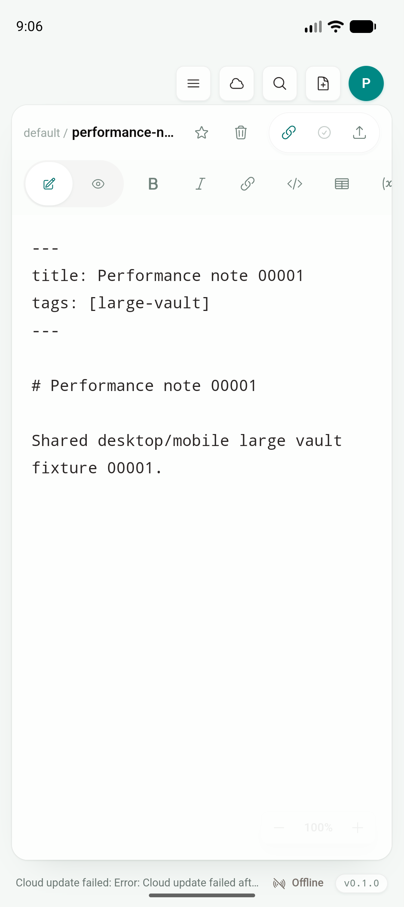
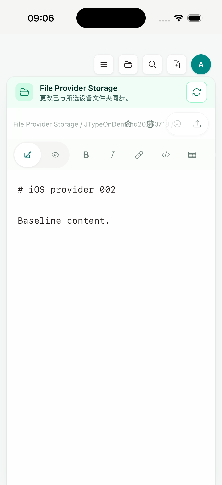

# Phase 2D — Push pressure、collapse 与 retention hardening

日期：2026-07-19

实现 commit：`948ecf6`

状态：provider-independent queue maintenance、FCM/APNs collapse 与 provider TTL 工程 gate 已完成；真实后台 delivery、真实 provider credentials 和 physical-device gate 未完成

## 结论

JType 的协作推送是“提示客户端重新拉取”的 refresh hint，不是逐条不可丢失的事件 ledger。本增量据此补齐系统压力与隐私保留边界：FCM/APNs 使用固定 collapse ID 合并离线期间的旧 hint，provider 最多保留一小时；服务端无论是否配置 Google/Apple 凭据，都会运行 queue maintenance，清除失去 active membership 的 route、恢复 stale claim，并删除超过四小时的非 processing hint。

本段只修改 `services/jtype-web` 内部 transport/worker 和集成测试。根目录 `src/`、shared UI、Android/iOS native UI 都没有变化；Android/iOS 继续显示 Desktop 共用的 `Sidebar`、`VaultHome`、`EditorShell`、Preview、Document Info、Board 与 commands。没有新增 mobile-only 文档列表/编辑器，也没有包含 web landing page、docs 或 dashboard。

## 为什么不复制后台 sync

FCM 的 `onMessageReceived` 只有数秒处理窗口；Google 明确要求立即呈现通知，较长工作才交给 WorkManager。Apple background notification 不保证投递、可能被节流，系统即使唤醒 App 也只给有限时间，而且用户 force quit 后不会自动启动。

JType 已在 mobile resume 时重启既有 Rust WebSocket，并调用 Desktop/mobile 共用的 serialized sync。为了保持单一 sync model，本增量没有在 Kotlin/Swift 里重新实现 cloud token、workspace pull、conflict、vault write 或 provider reconcile。push 继续只携带无凭据 canonical route；收到/点击后由既有 native adapter 和共享前端操作处理，恢复时仍使用同一套 sync。

因此本段的准确表述是“降低系统后台压力并限定 stale hint 生命周期”，不是“保证后台实时同步”。

## 两级 coalescing

JType 现在有两层不同目的的合并：

1. 服务端 outbox 继续按 registration + document path 合并未 claim row，保留该文档最新 clock；这是数据库压力与幂等边界。
2. FCM `android.collapse_key` 与 APNs `apns-collapse-id` 均使用 `jtype-collaboration`；设备离线或系统延迟 delivery 时，provider 可以只保留最新 refresh hint。

FCM 对同一 installation 同时只保证最多四个 collapse keys，本实现只使用一个，避免 cloud workspace/document 数量突破系统上限。APNs collapse ID 也低于 64-byte 限制。Android 原生 notification 本来就使用固定 notification ID 覆盖旧提示，三层语义保持一致：最新提示足以促使 App 拉取 authoritative cloud state。

FCM payload 的 `ttl` 保持 `3600s`。APNs 从原先 `apns-expiration=0` 改为当前时间后一小时：短时离线可以收到最新提示，超过一小时不再展示过时协作 copy。

## Provider-independent maintenance

此前 delivery worker 只在至少一组 provider credentials 完整时启动。这意味着开发/灾备环境若长期没有凭据，虽然 enqueue 会按路径合并，失去成员资格的 route 和没有后续更新的 dead hint 仍可能停留。

`948ecf6` 让 worker 始终启动；transport 仍然 fail closed，但 maintenance 每 10 秒独立执行：

- `processing` 超过 5 分钟：恢复为 `failed`，让故障实例的 claim 可以重试或过期；
- registration owner 已不是对应 cloud workspace 的 active member：立即删除所有 queued routes；
- `pending` / `failed` / `dead` 创建超过 4 小时：删除相对路径与通知 copy；
- 活跃的 `processing` row 不被 expiry 清理，避免另一个 web process 正在发送时被误删。

maintenance 日志只记录 recovered/inactive/expired 三个计数，不包含 provider identifier、route、workspace ID、document path 或通知 copy。未配置 provider 时仍不发网络请求，也不会加载 placeholder credential。

四小时服务端窗口比一小时 provider TTL 更长，是为了允许短暂凭据/网络故障完成 bounded retry；一旦首次成功，row 仍立即删除。即使一直失败，私有路径和 copy 也不会无限期保留。

## 自动化与回归

| 验证 | 结果 |
| --- | --- |
| `pnpm build` | PASS；Desktop/shared frontend |
| `pnpm test:unit` | PASS，85/85 |
| `npx playwright test tests/e2e/app.spec.ts` | PASS，56/56 |
| `cargo test --manifest-path src-tauri/Cargo.toml` | PASS，30/30 |
| `cargo test --manifest-path services/jtype-core/Cargo.toml` | PASS，46/46 |
| `cargo test --manifest-path services/jtype-web/Cargo.toml` | PASS，71 lib + 245 API integration = 316/316 |
| `cargo test --manifest-path services/jtype-web/Cargo.toml push::tests` | PASS，7/7；含 FCM/APNs header/payload contract |
| `cargo test --manifest-path services/jtype-web/Cargo.toml --test push_tests` | PASS，4/4；含 no-provider expiry 与 revoked-member cleanup |
| `cargo check --manifest-path services/jtype-web/Cargo.toml` | PASS |
| `docker compose config --quiet` | PASS |

集成测试在真实 MySQL schema 上先建立两名 active members 与 registration，验证 actor exclusion/latest-path coalescing；随后把 hint 回拨到 5 小时前，在没有 transport 的情况下运行 maintenance 并断言删除；再生成一条新 hint、撤销 member row，断言 queued route 被立即清除。

## Android / iOS Simulator artifact gate

Android 使用 `emulator-5554`、arm64、Android API 36。最终 universal debug APK 构建、覆盖安装、显式 cold launch通过，launch `304 ms`，PID `18294`，无 `AndroidRuntime` fatal。画面仍是 shared `performance-note-00001.md` EditorShell：



iOS 使用 iPhone 17 Pro Simulator、iOS 26.5、UDID `BD64DE20-5397-486C-8899-4B974425A0AD`。static Simulator archive 构建、安装和 launch 通过，PID `55514`；截图继续显示 shared `iOS provider 002` EditorShell 与既有 Files-provider banner：



no-sign Simulator archive 的日志仍包含已知 App Group entitlement 缺失、WebKit 和未来 UIScene lifecycle 警告，但 process 存活、产品 UI 正常，没有 crash。它们属于无签名 artifact 限制，不作为 production signing 通过证据。

两张截图证明 server-only 增量未破坏/分叉共享产品层，不证明真实 FCM/APNs delivery 或后台唤醒。

## Artifacts 与截图校验

```text
d94bdff621eac3f387bb63969e423bd578f3526f423cbc8a5af5fec776820306  app-universal-debug.apk (401200600 bytes)
33d11f3987faa03ab9b93e17f9f10789cce2042402a1ebabac16229b2e46b8ff  JType.app/JType (109481352 bytes)
d78f0302d6a77b6ddedae83086ddfe45d18b98968cfbc71a7965cee5dcd7c4da  push-retention-android-shared-ui.png (138892 bytes)
cc6fee351bf2b7563a526bd3ce53d7aff94e0269198c84d94ebe31cb03e8eb19  push-retention-ios-shared-ui.png (187593 bytes)
```

原始 gate 摘要见 [`push-retention-evidence.txt`](assets/phase-2/push-retention-evidence.txt)。

## 剩余 gate

1. 使用真实 Firebase/APNs credentials 验证 provider 侧 collapse、TTL、Doze/后台/terminated delivery、真实限流和失效 identifier cleanup。
2. 若产品决定加入 silent background update，必须单独启用 iOS remote-notification background mode、正确使用 `content-available=1` / `apns-push-type=background` / priority 5，并在真实设备证明节流、force-quit 和 completion-handler 行为；不得把 Simulator/Xcode 的宽松行为当生产保证。
3. Android 较长后台处理只有在确实需要且不复制 shared sync 时才使用 WorkManager；当前 user-visible high-priority data message 只立即创建通知。
4. physical-device preflight 当前按预期 exit 2：Android 真机 0、physical iPhone 0、Apple Development identity 0、development team 未配置。

实现依据官方 contract：[Firebase receive messages](https://firebase.google.com/docs/cloud-messaging/android/receive-messages)、[Firebase message priority](https://firebase.google.com/docs/cloud-messaging/android-message-priority)、[Firebase collapsible messages](https://firebase.google.com/docs/cloud-messaging/customize-messages/collapsible-message-types)、[FCM projects.messages / AndroidConfig](https://firebase.google.com/docs/reference/fcm/rest/v1/projects.messages)、[Apple pushing background updates](https://developer.apple.com/documentation/usernotifications/pushing-background-updates-to-your-app)、[Apple sending APNs requests](https://developer.apple.com/documentation/usernotifications/sending-notification-requests-to-apns)、[Apple background strategies](https://developer.apple.com/documentation/BackgroundTasks/choosing-background-strategies-for-your-app)。
