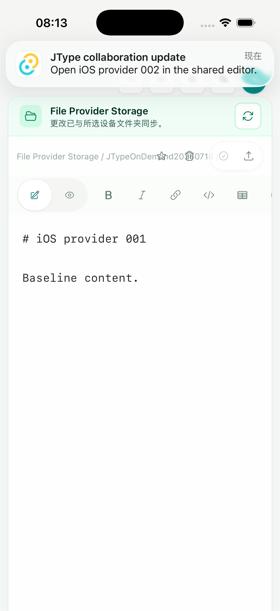
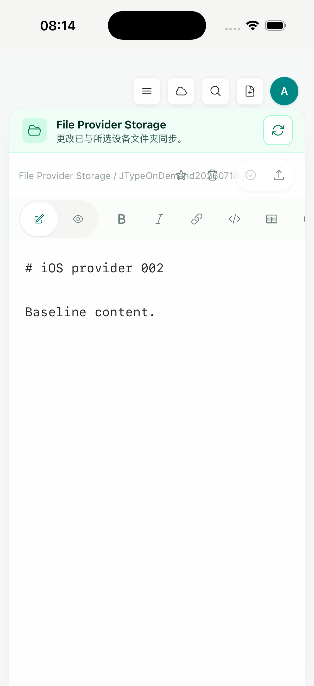
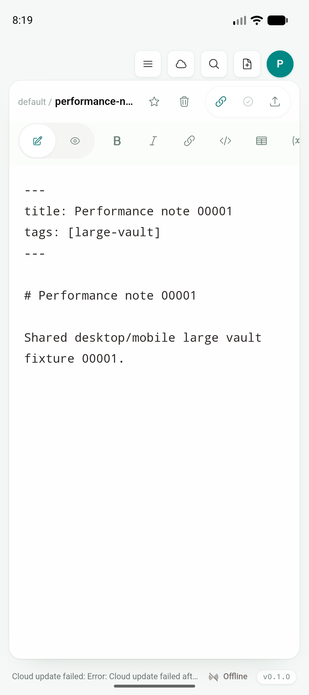

# Phase 2D — APNs / FCM remote push registration contract

日期：2026-07-19

实现 commit：`e132c0f`

状态：注册、服务端存储、provider payload、Simulator 通知点击与 fail-closed 工程 gate 已完成；真实 APNs/FCM 网络投递、release credentials、签名与 physical-device gate 未完成

## 结论

JType 现在有一条不分叉产品 UI 的 remote push 链路：Android/iOS 原生 adapter 取得 provider identifier，根目录 `src/` 在已有移动登录后把它提交给 authenticated API；协作通知只携带严格的 canonical document route，点击后继续进入 Desktop 共用的 cloud workspace → vault binding resolver，以及 `openWorkspace`、Markdown/diagram open 或 Board selection 操作。

本段没有增加 mobile-only 文档列表、编辑器、Preview、Document Info、导航栈，也没有把 web landing page、docs 或 dashboard 搬进 App。Android 与 iOS 最终显示的仍是同一份 `Sidebar`、`VaultHome`、`EditorShell`、Preview、Document Info、Board 和 commands；差异全部留在 Tauri/native adapter、runtime lifecycle 和服务端 provider contract 内。

准确的完成边界是：

- APNs/FCM identifier 注册与轮换 contract、authenticated registration API、provider payload builder 和系统通知点击闭环已实现；
- iOS Simulator 真实显示 injected remote notification 并通过系统默认 action 打开目标文档；
- Android 在没有私有 Firebase 配置时安装、冷启动和共享 EditorShell 均正常，注册按设计 fail closed；
- 当前没有 APNs HTTP/2 或 FCM HTTP v1 credential transport/worker，也没有真实 provider response、invalid-token cleanup 或 physical-device delivery 证据，因此不宣称生产远程投递已经完成。

## 原生注册与生命周期

内部 `mobile-push` Tauri plugin 不拥有页面或 navigation。

Android 使用 Firebase BoM `34.16.0`，最终解析 `firebase-messaging 25.1.1`，启用 Firebase Installation ID 注册模式：`FirebaseMessaging.register()` 成功后由 `FirebaseMessagingService.onRegistered(installationId)` 返回 FID。Android 13+ 的 `POST_NOTIFICATIONS` 通过 Tauri permission alias 请求；缺少未跟踪的 `src-tauri/gen/android/app/google-services.json` 时返回 `missingFirebaseConfiguration`，不会伪造 identifier 或阻断 App 启动。data-only message 由原生 service 创建 private collaboration notification，warm/cold intent 都将 route 原子保存，随后由共享 React lifecycle 消费。

iOS 使用系统 `UNUserNotificationCenter` 请求授权，并在每次 authenticated registration 时调用 `registerForRemoteNotifications()`；AppDelegate callback 将 APNs device token 转为 64 位小写 hex。Debug/Release 分别使用 `aps-environment=development/production`。remote notification delegate 只处理 `UNPushNotificationTrigger`，本地通知继续转发给现有 Tauri notification plugin。点击 route 先写入 `UserDefaults`，前台事件和 `Resumed` 都消费同一一次性缓存；额外 300 ms 复查覆盖 iOS resume 与 notification delegate 的 native-turn 竞态。

provider identifier 不进入 React state、`localStorage` 或 `sessionStorage`。退出移动账户时，前端先调用 authenticated DELETE，再清空 cloud profile。

## 服务端 contract

Migration `0027_mobile_push_registrations` 以用户、device ID、平台和 provider identifier hash 建立唯一边界，provider identifier 只在服务端投递所需的私有列保存，不从 GET/PUT response 返回。注册要求 full user session 和 `X-Client-Type: mobile`，并严格验证：

- Android：`platform=android`、`provider=fcm`、`environment=production`、`identifierKind=fid`；
- iOS：`platform=ios`、`provider=apns`、development/production environment、`identifierKind=deviceToken`、64 位 hex；
- 同一 provider identifier 被另一用户或安装声明时，在同一事务内转移，不会 fan-out 到旧账户；
- rotation 更新当前 device 记录，logout 删除对应 platform/device 记录。

`CollaborationPush` 只生成与前端 parser 一致的 HTTPS route：

```text
https://jtype.nightc.com/open/document?workspaceId=<cloud-workspace-id>&path=<relative-path>
```

FCM builder 使用 HTTP v1 `message.fid` 和 data-only `routeUrl`；APNs payload 使用 `aps.alert` 与顶层 `jtypeRoute`。两端都拒绝 traversal、reserved segment、反斜线、非法 workspace ID，并限制 title/body 长度。当前 builder 没有连接 provider 网络，避免在没有凭据、重试、限流、观测和 invalid-identifier 回收策略时伪装成 production delivery。

## iOS Simulator gate

- 设备：iPhone 17 Pro Simulator / iOS 26.5
- UDID：`BD64DE20-5397-486C-8899-4B974425A0AD`
- 构建：`pnpm mobile:ios:build:simulator-static`
- permission：现有 local-notification debug entry 触发系统 prompt，Maestro 点击 **Allow**
- delivery：`xcrun simctl push ... ios-collaboration-push.apns`
- action：Maestro 点击系统横幅默认 action，断言 `iOS provider 002` 与 `Baseline content.`

系统 remote banner 出现在 Desktop 共用 EditorShell 上方：



点击后打开同一 vault 中的 `JTypeOnDemand20260718/note-002.md`，没有进入第二套 mobile 页面：



覆盖安装 Simulator app 会更换随机 Data Container UUID。本次测试像既有 iOS provider gate 一样，只在产品外把 fixture 的绝对 `localVaultPath` 重定位到当前私有容器，再重启 App；产品代码没有加入 Simulator 特判。最初失败时，原生 `UserDefaults` 已保存完整 route，审计由此定位并修复了 Swift Optional → `JSObject` 桥接和 resume/delegate 竞态；修复后同一系统点击 flow 通过。

`simctl push` 验证的是 APNs payload 到 iOS notification runtime、delegate、点击与共享操作链，不会产生真实 APNs device token，也不能替代 signed physical-device delivery。

## Android Emulator gate

- 设备：`emulator-5554`，arm64，Android API 36
- 构建：`pnpm tauri android build --debug --target aarch64 --apk --ci`
- 安装：最终 APK `adb install -r`
- cold start：`365 ms`，PID 存活，无 `FATAL EXCEPTION`
- dependency：Firebase BoM `34.16.0` → `firebase-messaging 25.1.1`

仓库和构建目录没有 `google-services.json`。logcat 明确记录 `Default FirebaseApp failed to initialize because no default options were found` / `FirebaseApp initialization unsuccessful`，但 App 继续显示 Desktop 共用的 `performance-note-00001.md` EditorShell：



package dump 同时确认 `JTypeFirebaseMessagingService`、`com.google.firebase.MESSAGING_EVENT` 与 `POST_NOTIFICATIONS` 已进入最终包。这里证明的是缺配置降级和最终 artifact 集成，不是 FCM 网络投递；真实 `google-services.json`、Firebase project、service account 和 physical Android 仍属于 production gate。

## 自动化与构建

| 验证 | 结果 |
| --- | --- |
| `pnpm build` | PASS，Desktop/shared frontend |
| `pnpm test:unit` | PASS，85/85；含 native/provider/static contract |
| `npx playwright test tests/e2e/app.spec.ts` | PASS，56/56；Desktop 默认与 shared mobile route 均未回归 |
| `cargo test --manifest-path src-tauri/Cargo.toml` | PASS，30/30 |
| `cargo test --manifest-path services/jtype-core/Cargo.toml` | PASS，46/46 |
| `cargo test --manifest-path services/jtype-web/Cargo.toml --lib` | PASS，66/66；含 3 条 provider payload unit |
| `cargo test --manifest-path services/jtype-web/Cargo.toml --test push_tests` | PASS，3/3；注册、轮换、转移、隐藏 identifier、注销与负例 |
| `cargo check --manifest-path services/jtype-web/Cargo.toml` | PASS |
| Android final aarch64 debug APK | PASS；安装、365 ms cold start、缺 Firebase config fail closed |
| iOS no-sign static Simulator archive | PASS；permission、remote banner、tap → target shared EditorShell |

## Artifacts 与截图校验

```text
1113d9b73326b858a9a3137ae0d60fa60b24d6349616a97993fdb1332fbd0e9b  app-universal-debug.apk
4b3ace2ede1780af294779b00d43bf80ce215fcfdf75d29ba9fed69f3992906d  JType.app/JType
4167bab4bcd9d7709acd8c362f1d9e1468b5c8316d9646ff2e0931a6bab98cc6  push-android-fail-closed.png
2ee8369ee62005c33312c91b5e9ecb4d8569282331f0472d88811ac2c8736c4a  push-ios-remote-banner.png
62a4dedc620044f12514a9af2fd1b53a57ac151ad38528764c73ef90b67f4463  push-ios-remote-route.png
```

原始 gate 摘要见 [`remote-push-evidence.txt`](assets/phase-2/remote-push-evidence.txt)。

## 生产与真机剩余 gate

1. 配置真实 Firebase Android app、release `google-services.json` 和最小权限 service account；实现带 OAuth 2 access token、超时、限流、重试/幂等与 response classification 的 FCM HTTP v1 transport。
2. 配置 Apple Team、App ID Push capability、APNs `.p8` key、Key ID/Team ID/topic；实现 development/production endpoint 隔离、JWT renewal、HTTP/2 response classification 和 token invalidation cleanup。
3. 将 collaboration event/outbox 接到 provider transport，保证权限/成员关系在 enqueue 与 send 前重新校验，并为投递成功、provider rejection、retry exhaustion 建立可观测性。
4. 在 release-signed physical Android/iPhone 上取得真实 FID/device token，验证 cold/foreground/background/terminated delivery、tap、rotation、reinstall、logout/account switch、permission denied/re-enabled 和 invalid token cleanup。
5. 当前 physical-device preflight 仍为 **BLOCKED**：0 Android 真机、0 physical iPhone、0 Apple Development identity、未配置 development team。上述真实证据完成前不能把 APNs/FCM 标记为生产完成。

实现依据官方 contract：[Apple Registering your app with APNs](https://developer.apple.com/documentation/usernotifications/registering-your-app-with-apns)、[Apple Setting up a remote notification server](https://developer.apple.com/documentation/usernotifications/setting-up-a-remote-notification-server)、[Apple Generating a remote notification](https://developer.apple.com/documentation/UserNotifications/generating-a-remote-notification)、[Firebase Android setup](https://firebase.google.com/docs/cloud-messaging/android/get-started)、[FirebaseMessaging API](https://firebase.google.com/docs/reference/android/com/google/firebase/messaging/FirebaseMessaging)、[FirebaseMessagingService API](https://firebase.google.com/docs/reference/android/com/google/firebase/messaging/FirebaseMessagingService)、[FCM HTTP v1 Message](https://firebase.google.com/docs/reference/fcm/rest/v1/projects.messages)。
