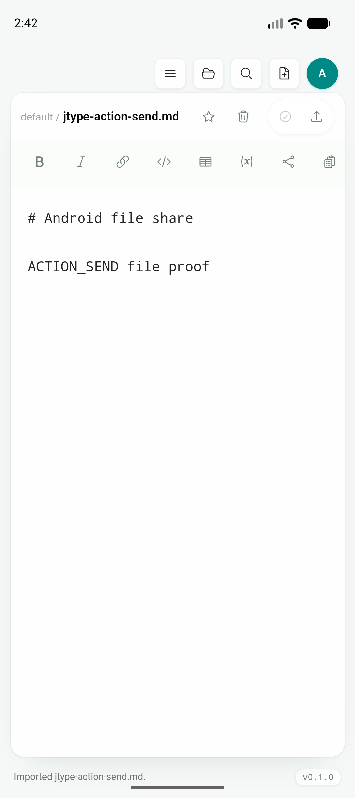
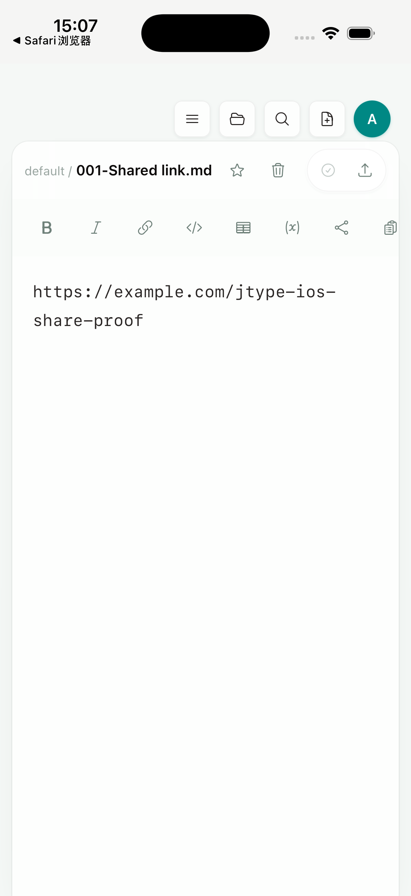

# Phase 2D — Android / iOS 系统分享导入

日期：2026-07-18

实现 commit：`ce9239b`

分支：`codex/mobile-app`

状态：Android Emulator 与 signed iPhone Simulator 端到端 gate 已通过；physical-device / 第三方 provider 组合保留到 Phase 2 最终验收。

## 产品与复用边界

本增量只增加 Android/iOS 系统入口和原生临时文件兼容层，没有增加 mobile landing page、help/docs website、web dashboard，也没有建立第二套移动端文件列表或编辑器。

系统分享最终进入现有 desktop/shared 产品链路：

```text
Android ACTION_SEND / iOS Share Extension
  → native pending-share adapter
  → Rust initial_external_file_sources
  → useFileSystem.importExternalSources
  → 现有 vault mutation / provider routing
  → 现有 Sidebar、EditorShell、Preview、Document Info、Board
```

用户已经打开 vault 时，导入目标沿用当前 desktop 导入动作的目标目录；没有打开 vault 且平台使用 app-private storage 时，仍由现有动作打开默认 vault。external vault 的 capability、只读判断、write-back 与冲突规则也保持不变。

## Android share target

Android manifest 注册 `ACTION_SEND` / `ACTION_SEND_MULTIPLE`，支持纯文本、Markdown、YAML、JSON、PDF、图片、Draw.io、Excalidraw 与通用文件。原生 `mobile-import` adapter 同时处理：

- cold launch 的 Activity 初始 Intent；
- warm app 的 `onNewIntent`；
- `EXTRA_STREAM`、`ClipData` 和最多 32 个来源；
- 无文件来源时的 `EXTRA_TEXT`，最大 10 MB，先落到 app cache；
- Activity recreation 去重；
- warm share 的 native plugin event，以及 lifecycle / startup drain 兜底；
- materialize 成功后清理 JType 自己创建的 share inbox 临时目录。

React 没有解析 Android Intent，也没有添加 Android 专用页面。它只监听系统适配事件，然后调用与 cold open-with 相同的 Rust drain 和共享导入 callback。

### Android 真实 gate

环境：`JType_API_36_1`，Android 16 / API 36，arm64，1080×2424。

通过的实际流程：

1. app 未运行时发送纯文本 `ACTION_SEND`，冷启动后导入 `Android_Cold_Listener.md`；
2. app 已运行时发送纯文本 `ACTION_SEND`，native listener 唤醒共享导入并打开 `Android_Warm_Listener.md`；
3. 将真实 Markdown 写入 MediaStore，系统 URI 为 `content://media/external/file/469`；
4. 打开 Android 系统分享选择器，选择 JType / Just once；
5. 现有默认 vault 和 `EditorShell` 打开 `jtype-action-send.md`，内容逐字确认为：

```markdown
# Android file share

ACTION_SEND file proof
```

状态栏显示 `Imported jtype-action-send.md.`，证明完成的是现有 vault import，而不是 test-only viewer：



## iOS Share Extension

XcodeGen canonical project 新增 `JType Share` app extension，并嵌入主 app。主 app 与 extension 共同声明 `group.net.jcode.jtype` App Group；已有 Markdown document types、`jtype://` URL scheme、Keychain entitlement 与 localhost ATS 配置也全部迁入 `project.yml`，避免再次生成工程时丢失。

Share Extension：

- 接收文本、网页 URL、文件、图片和 attachment，最多 32 项；
- 文本最大 10 MB；
- 使用安全文件名和顺序前缀；
- 先写 `.UUID.tmp` staging，成功后原子 rename 为完整 request；
- 单项不支持不会丢弃同一 share request 中的其他可用项；
- 完成时明确显示 `Saved for JType. Open JType to finish importing.`。

主 app 的 native adapter 把完整 App Group request 移到 app cache 后再交给现有导入动作。in-memory claim 避免并发 startup / lifecycle drain 重复返回同一路径；若 materialize 失败则释放 claim 供重试，成功后才删除一次性来源。留在 app cache 的完整 request 会在下次启动重新发现，覆盖“extension 已保存、主 app 尚未完成导入就被终止”的窗口。

### iOS 真实 gate

环境：iPhone 17 Pro Simulator，iOS 26.5，arm64，local development signing。

Maestro/XCTest 流程：

1. Safari 打开 `https://example.com/jtype-ios-share-proof`；
2. 打开系统 Share Sheet，确认 JType action 可见；
3. 选择 JType，确认 extension 显示保存成功；
4. 启动 `net.jcode.jtype`；
5. 断言现有 Markdown editor 显示原 URL。

实际导入文件为 `001-Shared link.md`，仍处于同一个 `default` vault 和 desktop/shared editor workbench：



独立 Share Extension compile 与完整 no-sign simulator archive 均通过；最终 archive 已确认包含：

```text
JType.app/PlugIns/JType Share.appex
```

## 自动化与构建结果

| 验证 | 结果 |
| --- | --- |
| `npm run build` | PASS |
| `npm run test:unit` | PASS，47/47 |
| `npx playwright test tests/e2e/app.spec.ts` | PASS，47/47；新增 warm native share event drain |
| `cargo test --manifest-path plugins/mobile-import/Cargo.toml` | PASS |
| `cargo test --manifest-path src-tauri/Cargo.toml` | PASS，28/28 |
| plugin / Tauri `cargo fmt --check` 与 `cargo check` | PASS |
| `npx tauri android build --debug --target aarch64 --apk` | PASS |
| Android cold text / warm text / real MediaStore file share | PASS |
| `pnpm tauri ios build --debug --target aarch64-sim --no-sign --archive-only --ci` | PASS；archive 内含 Share Extension |
| `tests/mobile/ios-share-target.yaml` | PASS；Safari → extension → JType shared editor |

产物：

- Android APK：`src-tauri/gen/android/app/build/outputs/apk/universal/debug/app-universal-debug.apk`
- iOS archive：`src-tauri/gen/apple/build/jtype_iOS.xcarchive`

证据 SHA-256：

```text
63924e4d2368e9ee5a923e4862177eac1d3dd5ac4fd199557e99156ab53cb85a  android-share-import.png
c1f67c690aa47c066d80a10b52eae6d609cf494dabfd2e8987583a93e458633d  ios-share-import.png
```

## 剩余 Phase 2 gate

- physical Android / iPhone 上验证相同流程和生产 provisioning 的 App Group entitlement；
- 覆盖 Google Photos、Drive、iCloud Drive 与第三方 Files provider 的 URI / file representation 差异；
- 验证多项、大文件、磁盘不足和进程终止矩阵；
- 系统通知、通知/深链定位到指定 cloud workspace、vault 和文档仍是独立后续项；
- VoiceOver/TalkBack、动态字体、对比度、键盘 accessory 与硬件快捷键继续作为下一段 2D 工作。
