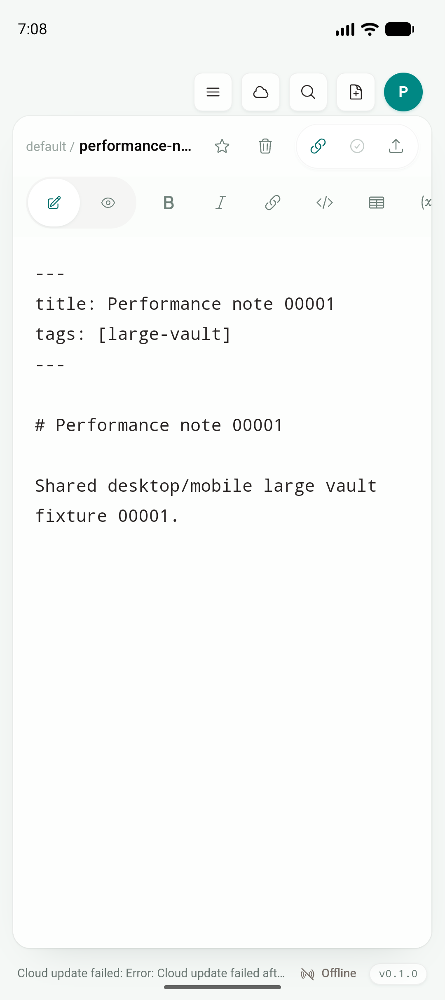
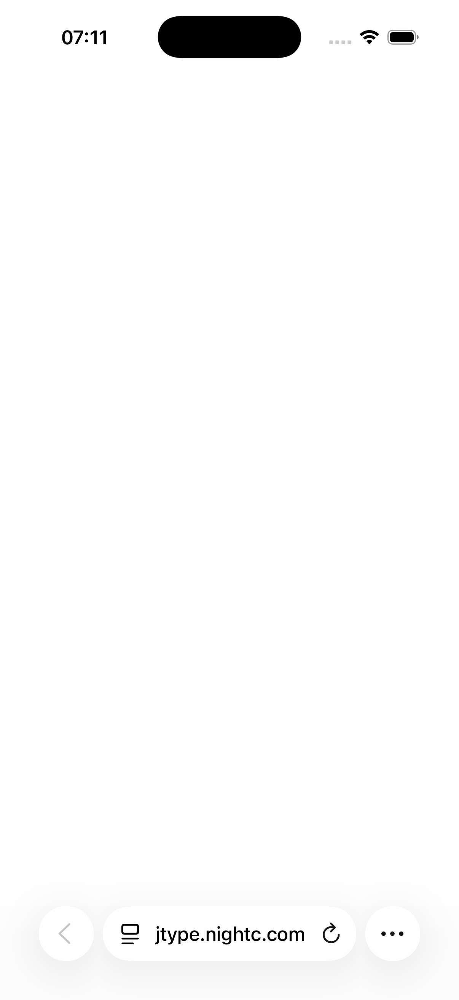
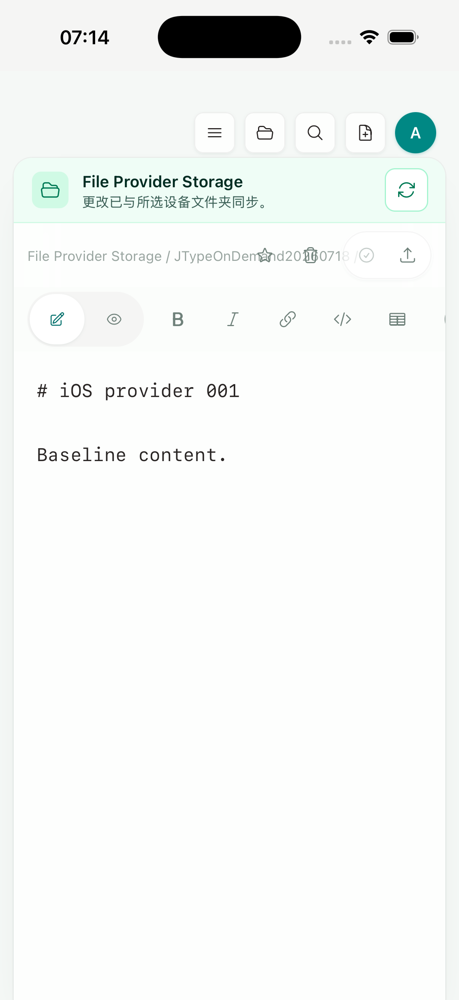

# Phase 2D — Universal Links / Android App Links

日期：2026-07-19
实现 commit：`799358c`
状态：工程与 Simulator gate 已完成；生产域名关联、release signing 与 physical-device gate 未完成

## 结论

JType 现在用同一份严格路由契约接收 HTTPS App Link 和自定义 scheme fallback：

```text
https://jtype.nightc.com/open/document?workspaceId=<cloud-workspace-id>&path=<relative-path>
jtype://open/document?workspaceId=<cloud-workspace-id>&path=<relative-path>
```

两个入口都进入根目录 `src/` 的同一个 route parser、cloud workspace → vault binding resolver，以及 Desktop 共用的 `openWorkspace`、Markdown/diagram open 或 Board selection 操作。最终界面仍是同一份 `Sidebar`、`VaultHome`、`EditorShell`、Preview、Document Info 和 Board；本段没有增加 mobile-only 文档页、导航栈，也没有引入 web landing page、docs 或 dashboard UI。

Android 已用显式 HTTPS Intent 冷启动最终 APK，并打开共用 EditorShell 中的目标文档。iOS no-sign Simulator archive 已验证 canonical associated-domains 配置和自定义 scheme fallback 到同一 EditorShell。线上 `jtype.nightc.com` 的 well-known 路径当前仍返回 SPA HTML，因此 Android 自动域名验证和 iOS Universal Link 都按预期 fail closed；这两项必须等生产部署、真实签名身份和真机后才能标记通过。

## 路由与安全边界

`src/lib/mobileNavigation.ts` 是唯一 URL contract。它只接受：

- 自定义入口 `jtype://open/document`；
- HTTPS 入口 `https://jtype.nightc.com/open/document`；
- 各一个非空 `workspaceId` 与 `path` query。

它拒绝 URL credentials、非默认 port、fragment、未知或重复 query、绝对路径、`.` / `..` traversal，以及 `.jtype`、`.git`、`node_modules`、`target` reserved segment。HTTPS 与 custom-scheme round trip、host/path/query 负例均有 unit coverage；E2E cold route 已改用 HTTPS，继续断言落入 Desktop 共用 EditorShell。

## 平台与服务端配置

Android 生成 manifest 含独立的 `android:autoVerify="true"` HTTPS intent filter，精确限定：

```text
scheme=https
host=jtype.nightc.com
path=/open/document
```

自定义 `jtype://open/document` 继续保留作已安装 app 的确定性 fallback。iOS canonical XcodeGen project 和 entitlement 增加：

```text
com.apple.developer.associated-domains = [applinks:jtype.nightc.com]
```

Axum 服务新增两个 JSON endpoint：

- `/.well-known/apple-app-site-association`
- `/.well-known/assetlinks.json`

身份配置只来自部署环境：

- `JTYPED_APPLE_APP_LINK_TEAM_ID`
- `JTYPED_ANDROID_APP_LINK_CERT_SHA256`（可用逗号配置多个签名证书）

Apple Team ID 必须是 10 位大写字母/数字，Android fingerprint 必须是 64 位十六进制；缺失或无效时返回空 association，而不是宽泛或伪造授权。Docker Compose 和 Helm values 已接入同一配置；本机没有 `helm` CLI，因此只通过了 `docker compose config --quiet`，未宣称 Helm render gate。

本地真实 Axum server 以测试身份启动后，AASA 返回 `A1B2C3D4E5.net.jcode.jtype` 与精确 `/open/document` component，assetlinks 返回 `net.jcode.jtype` 与规范化证书 SHA-256；响应为 JSON，并带 cache 与 `nosniff` header。

## Android Emulator gate

- 设备：`emulator-5554`，arm64，Android API 36
- 构建：`pnpm tauri android build --debug --target aarch64 --apk --ci`
- 安装：`adb install -r`
- flow：force-stop 后以 `ACTION_VIEW`、`CATEGORY_BROWSABLE`、完整 HTTPS route 和显式 package 冷启动
- 结果：MainActivity cold start `313 ms`，打开 `performance-note-00001.md`，显示共用 EditorShell



Android package dump 同时确认生成 manifest 的 exact host/path 与 `autoVerify=true`。随后原生 verifier 返回 relation false / state `1024`：生产 `assetlinks.json` 尚未部署，所以系统不会把该域名自动认领给 JType。显式 package Intent 证明的是应用的 HTTPS 接收、解析和共享操作链路，不等于 production verified App Link；自动验证仍为 **BLOCKED**。

## iOS Simulator gate

- 设备：iPhone 17 Pro Simulator / iOS 26.5
- UDID：`BD64DE20-5397-486C-8899-4B974425A0AD`
- 构建：`pnpm mobile:ios:build:simulator-static`
- static archive verifier：PASS
- build settings：`CODE_SIGN_ENTITLEMENTS=jtype_iOS/jtype_iOS.entitlements`，bundle ID `net.jcode.jtype`

当前 archive 是 no-sign Simulator artifact，宿主没有 Apple Development identity/team，因此不能声称 signed embedded entitlement 已通过。`simctl openurl` 打开 HTTPS route 后停留在 Safari，符合线上 AASA 仍为 SPA HTML时的 fail-closed 行为：



同一个 Simulator 随后用 `jtype://` fallback 运行 `tests/mobile/ios-document-route-fallback.yaml`，打开 `JTypeOnDemand20260718/note-001.md` 并显示共用 EditorShell。该 flow 只在 Simulator 容器外准备了一条 vault-binding fixture，没有为测试增加产品 UI 或 mobile-only 路由：



因此本段对 iOS 的准确结论是：canonical entitlement/static config 与应用内 route/action 链路通过；真正 Universal Link 的 signed association 仍为 **BLOCKED**。

## 自动化与构建

| 验证 | 结果 |
| --- | --- |
| `pnpm build` | PASS，Desktop/shared frontend |
| `pnpm test:unit` | PASS，81/81 |
| `npx playwright test tests/e2e/app.spec.ts` | PASS，56/56；cold HTTPS route → shared EditorShell |
| `cargo test --manifest-path src-tauri/Cargo.toml` | PASS，30/30 |
| `cargo test --manifest-path services/jtype-core/Cargo.toml` | PASS，46/46 |
| `cargo test --manifest-path services/jtype-web/Cargo.toml --lib` | PASS，63/63 |
| `cargo test --manifest-path services/jtype-web/Cargo.toml --test app_links_tests` | PASS，2/2 |
| `cargo check --manifest-path services/jtype-web/Cargo.toml` | PASS |
| `docker compose config --quiet` | PASS |
| Android aarch64 debug APK | PASS；安装、cold HTTPS Intent、shared EditorShell |
| iOS no-sign static Simulator archive | PASS；static verifier、entitlement build setting、fallback route |

## Artifacts 与截图校验

```text
111b155dd800cc41605e6b8992307cbea776e2fb57409a1c10e5b44b9e72cb0e  app-universal-debug.apk (204,323,392 bytes)
094718e6fecffabe04278cddf5d315b0c9c39a5b0015d853fd4fca475efa7873  JType.app/JType (109,372,136 bytes)
e09a90164d91db2e12de1647283bf40826b27ad2e8f6dd63a6f2e1f6915c8117  android-app-link-route.png
f4647f3baf19b0d02a5edac52b99f1734a23cf75005b83dfab6dc1cfa2ee26e1  ios-universal-link-unverified.png
66f7f7e547ac1775d76a9b731184e66f59882785766bcf8959e1d284fd8967d7  ios-app-link-route-fallback.png
```

原始命令与 fail-closed 观察汇总见 [`app-links-evidence.txt`](assets/phase-2/app-links-evidence.txt)。

## 生产与真机剩余 gate

1. 发布包含 well-known endpoints 的 web service，并注入真实 Apple Team ID 与所有 Android release signing certificate SHA-256。
2. 构建 signed iOS app，确认签名后的 embedded associated-domains entitlement 与线上 AASA 一致。
3. 在 physical Android/iPhone 安装 release-signed build，从浏览器、邮件/消息普通点击 HTTPS URL，分别验证 cold/warm open，不使用显式 package 或 `simctl`。
4. 验证 Android 不出现 chooser、iOS 不回退 Safari；同时复跑 invalid route、未绑定 workspace、目标路径不存在及认证恢复。
5. 把 production verifier 状态、设备型号/系统版本、截图与签名 artifact hash 追加到本报告后，才能把 Universal/App Links 标为完成。

实现遵循 Apple 与 Android 的官方关联模型：[Apple Supporting Universal Links](https://developer.apple.com/documentation/xcode/supporting-universal-links-in-your-app)、[Apple Associated Domains entitlement](https://developer.apple.com/documentation/BundleResources/Entitlements/com.apple.developer.associated-domains)、[Android Add intent filters for App Links](https://developer.android.com/training/app-links/add-applinks)、[Android Configure website associations](https://developer.android.com/training/app-links/configure-assetlinks)。
