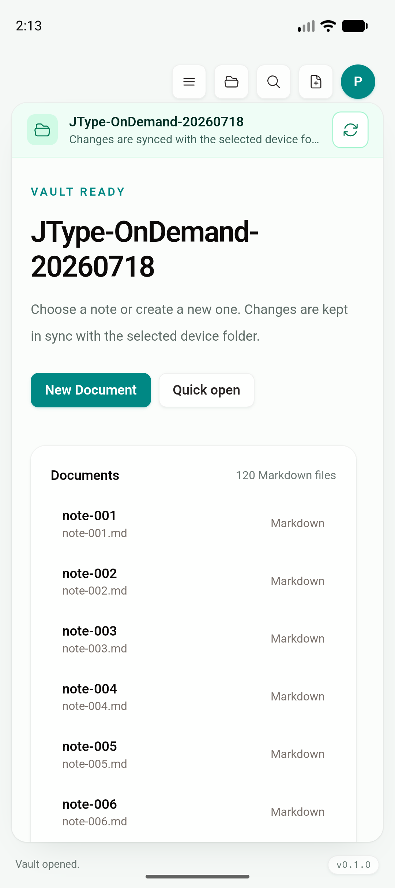

# Phase 2D：未加载 vault entry 原生查询契约

日期：2026-07-19

Feature branch：`codex/mobile-app`

查询实现 commit：`1060d1c`

iOS 首屏回归修复 commit：`999dc11`

状态：native search、exact path、wikilink 与 rename link-impact 查询契约、双平台构建和冷启动视觉 gate 已完成；后续 `1a92435` 已把这些 contract 接入 mobile partial `WorkspaceSnapshot` 的 shared loaded-first/native-fallback 路径，见 [`phase-2-partial-workspace-runtime.md`](phase-2-partial-workspace-runtime.md)。本报告仍不把后续 runtime/性能结果归入 `1060d1c`。

## 结论

本增量补齐了共享 workspace 分页契约启用前最关键的“未加载目标可解析”边界，同时继续以 Desktop 为产品基准：

- 搜索、路径解析和链接影响全部返回现有 canonical `FileTreeNode` / `WorkspaceLinkImpact`，没有新增 mobile-only 文档模型。
- Rust 在 native vault 上扫描，但不先构造、递归序列化完整 `WorkspaceSnapshot`。
- Tauri commands 全部先经过既有 provider recovery；external mirror 的事务、授权与路径边界没有被绕开。
- TypeScript 只增加 canonical types 和 `tauri` adapter。当前 Desktop、Android 和 iOS 运行时仍走现有完整 `open_workspace` 与同步 `WorkspaceIndex`，所以本段不会改变现有 UI 或操作行为。

它是 partial snapshot 的第二个 **contract gate**，不是已经上线的移动端 lazy tree。

## 契约与 Desktop 语义

### Search

`search_workspace_entries(root, query, folder_filter, scope, limit)` 支持两个既有界面 scope：

- `documents`：与 Sidebar explorer search 一致，只返回 Markdown，使用 name + relative path 的大小写不敏感 substring。
- `quickOpen`：返回 Markdown 与 Board；精确 substring 始终排在 fuzzy subsequence 之前，folder filter 继续匹配 parent relative path。

结果上限为 100，返回顺序与完整 Desktop tree 相同：folder-first 排序后 depth-first traversal。`.jtype`、`.git`、`node_modules` 和 `target` 不进入查询；Diagram 与 PDF 不被误放进现有 Quick Open scope。每个结果都是 `children: []` 的 shallow `FileTreeNode`，可以直接交给共享 open/select operation。

### Exact path 与 wikilink

`resolve_workspace_entry(root, relative_path)` 精确解析一个 vault-relative path；缺失或 Desktop tree 不可见的类型返回 `null`，absolute/traversal/reserved path 为错误。它覆盖通知与 deep-link 在 partial tree 中定位尚未加载的 Markdown、Board 或 Diagram。

`resolve_workspace_wiki_target(root, target)` 保持现有 shared index 的优先级：

1. 先匹配完整 relative stem；
2. 没有 exact relative match 时，取 canonical tree order 中第一个 basename stem。

因此同名笔记不会因为切换到 native query 改变既有 wikilink 行为。

### Rename link impact

`find_workspace_link_impacts(root, target_relative_path)` 扫描全部可见 Markdown，识别现有 `[label](target)` 与 `[[target]]` 规则。每个受影响文件只返回一条记录和第一个命中行，避免一个文件内的重复链接被 UI 错报为多篇 Markdown；同时附带内容供现有 rename link updater 使用。`.jtype` metadata 永远不参与影响计数。

当前未将该 command 接入 `useFileSystem`，因为运行时仍是 complete snapshot，现有未保存 editor buffer 优先语义保持不变。partial runtime 接入时会由 shared resolver 先合并当前 editor buffer，再使用 native 结果补足未加载文档。

## 自动化与构建

| 验证 | 结果 |
| --- | --- |
| `cargo test --manifest-path services/jtype-core/Cargo.toml` | PASS，43/43；新增 exact-before-fuzzy、scope/folder filter、100-result bound、reserved path、deep resolve、wikilink precedence、nested link impact 与 metadata exclusion |
| `cargo test --manifest-path src-tauri/Cargo.toml` | PASS，29/29 |
| `pnpm test:unit` | PASS，66/66；包含 iOS 首屏前延迟通知 plugin 调用、Android native schedule 与 desktop no-op 三条回归测试 |
| `pnpm build` | PASS |
| `pnpm test:e2e` | PASS，55/55；Desktop/shared runtime 继续使用完整 snapshot。首轮有一个移动键盘工具栏动画稳定性超时，单测例与随后完整重跑均通过 |
| `pnpm tauri android build --debug --target aarch64 --apk --ci` | PASS；与 iOS 串行构建 |
| `pnpm tauri ios build --debug --target aarch64-sim --no-sign --archive-only --ci` | PASS |

构建产物：

```text
Android universal debug APK
394,311,366 bytes
SHA-256 44a2dbb64221c939a29db82269894dc28dd3c4d237d8f8130c1bd8c0b38bd22d

iOS Simulator archive app binary
108,822,248 bytes
SHA-256 85f059c1d37ed073b4c53219fcf94d9078a26c5ec0b04a2b4a6eca069b6e7bbc
```

Android APK 已覆盖安装到 API 36.1 emulator 并显式 cold launch，保留的 120-file SAF vault 正常进入 Desktop 共用 `VaultHome`。iOS archive 在卸载旧包后安装到 iPhone 17 Pro / iOS 26.5 Simulator 并冷启动，等待 6 秒越过 2.5 秒 notification preview 窗口后仍正常显示共用 Welcome。截图只证明 `999dc11` 的最终双平台 artifact 启动同一 shared product shell，不作为 native query 性能证据。




```text
f4311cf3d1e9c312f6802e4e44886d19a8ead1de549e8fe776fd57d51f3eda5a  android-unloaded-entry-query-smoke.png  1080x2424
5d988efcefdacac41dcd90d2d967e85cd4b2e1140efa724a7e53cf9096eeaf9f  ios-unloaded-entry-query-smoke.png      1206x2622
```

## iOS 首屏回归调查

对最终 archive 做 fresh uninstall/install 时发现 WKWebView 长时间停留在白色 launch surface，因此该产物最初没有被接受为通过。使用独立 worktree、清理 target、卸载旧 app 后逐提交构建并截取 Simulator framebuffer，结果为：

- `798be1c` 与 `2a1fc09` 正常显示 shared Welcome；
- `ff21f86` 是第一个白屏提交，`5970d15` 仍可复现；
- 唯一行为变化是 iOS debug notification preview 从 2.5 秒延时改为启动时立即调用 notification plugin。

只修正 `Schedule.at` 的时区并不足够：plugin 成功调用仍发生在 WKWebView 首次 paint 前，fresh launch 继续白屏。`999dc11` 因此让 iOS 先在 JavaScript 进程内等待 2.5 秒，再动态导入 plugin 并使用前台立即呈现；Android 继续使用 native scheduler。这样既绕过 plugin 的 ISO `Z` 本地时区解析，也确保第一帧先完成。Desktop 不调用该 adapter。

调查还确认两条构建纪律：

1. `src-tauri/gen/apple/build/arm64-sim/JType.app` 的旧目录会阻止 Tauri rename，必须先移走再判定新 build；不能把旧可启动 artifact 当成当前源码结果。
2. Tauri mobile build 在外层命令让出输出后仍可能继续运行，必须等待真实 exit code 与 `Finished ... Bundle/APK`，再安装产物；Android/iOS 继续串行，因为两端 `beforeBuildCommand` 共用根 `dist/`。

## 该 contract commit 尚未启用的边界

1. native query 仍会递归扫描 filesystem；它避免完整 tree allocation/IPC，但不是 provider-native index，也不是 O(1) lookup。
2. `1060d1c` 时移动启动仍调用完整 `open_workspace`；首屏时间、峰值 RSS 与 snapshot IPC size 没有因该 commit 改善。
3. `1060d1c` 时 QuickSwitcher 与 Sidebar 仍是同步 render/search API；后续需要 shared async resolver，并仅在 partial snapshot capability 下调用 native query。
4. runtime 接入必须让通知/deep-link 与 wikilink 使用 loaded-first/native-fallback，并在 cloud pull 或 mutation 后刷新 partial state。
5. rename link impact 接入必须保留当前未保存 editor buffer，不能让磁盘扫描覆盖 Desktop 已有语义。第 2–5 项已由 `1a92435` 按这些约束实现。

## 下一步

1. [完成于 `1a92435`] 给 `WorkspaceSnapshot` 增加 completeness/page state，只让 mobile bootstrap 使用根目录首个 `WorkspaceEntryPage`；Desktop `open_workspace` 保持完整。
2. [完成于 `1a92435`] 建立 shared loaded-first resolver：complete snapshot 继续走同步 `WorkspaceIndex`，partial snapshot 才调用 native fallback。
3. [完成于 `1a92435`] 将 folder expansion / Show more 接到 canonical page merger；mutation、pull、cloud event 与 watcher 重新 bootstrap partial state。
4. 在 Android/iOS 5,000 文档 fixture 和 physical device 上记录 cold open、snapshot bytes、峰值 RSS、尾部 exact/fuzzy search、wikilink/deep-link 与连续 folder page，再决定 provider-native persistent index/streaming cursor 是否必要。
