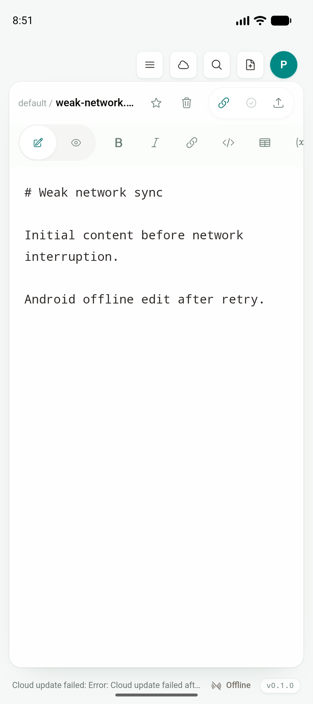
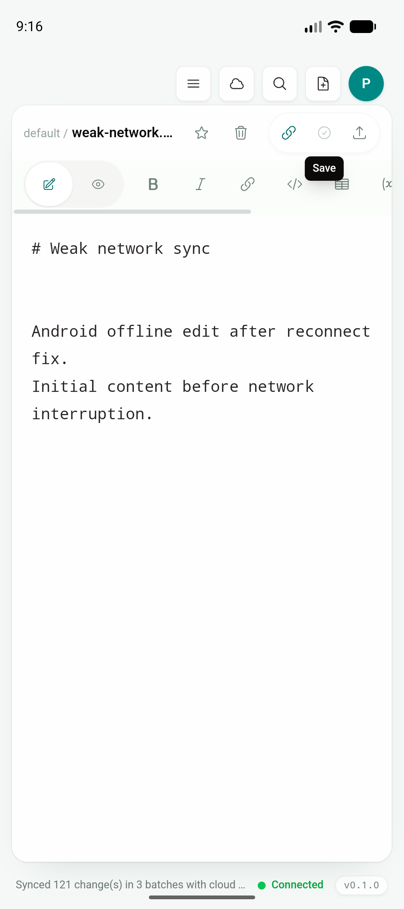
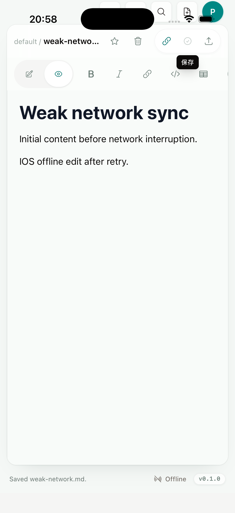
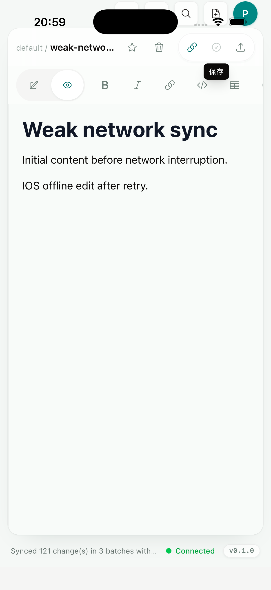

# Phase 2D：同步批处理、重试、幂等与离线恢复

日期：2026-07-18

Feature branch：`codex/mobile-app`

App code commit：`798be1c`

## 结论

Desktop、Android 与 iOS 现在共用同一套 cloud sync transport：push 按最多 50 个 operation / 约 1 MB 的确定性批次发送，pull 与 push 对网络错误、408、425、429 和 5xx 最多尝试 3 次；一次批次的所有重试复用同一个 `requestId`。服务端先为 `(cloud workspace, device, requestId)` 建立 reservation，完成后保存响应；顺序或并发 replay 都返回同一缓存响应，不重复创建 document version，request-id 复用不同 payload 会被拒绝。

移动端没有新增同步页或另一套文档 UI。Android/iOS 继续使用 desktop 根目录 `src/` 中的 `useCloudSync`、`useEagerSync`、Account dialog、operation log、`EditorShell` 和 lifecycle adapter；移动兼容只负责 app-private vault、平台安全存储、前后台事件与 WebSocket 生命周期。web landing page、help/docs website 和 dashboard 不进入移动 App。

Android API 36 Emulator 与 iPhone 17 Pro / iOS 26.5 Simulator 使用同一一次性账号、各自独立 cloud workspace 和 121 篇实际 Markdown。首次 push 均被服务端记录为 3 个 request-id，即 `50 + 50 + 21`。关闭 Axum 服务后，两端仍能在共享 Editor 中保存本地内容；手动同步经过 3 次尝试后显示明确错误且 App 保持可用。恢复服务并触发前后台恢复后，两端均完成 `Synced 121 change(s) in 3 batches`，目标文档服务端时钟为 122、version count 从 1 精确增加到 2。

验证过程中发现并修复了一个真实竞态：Android 保持前台时，服务恢复后的 WebSocket reconnect 可能早于 lifecycle recovery 执行增量 pull；旧实现只在 full pull 加载 sync base，因而旧云端 echo 能覆盖已保存的离线编辑。现在所有 pull 路径都加载 sync base，增量 pull 会把本地偏离 base 的内容留给后续 push。新增 E2E 和 Android 前台重连重放均证明本地内容不会被覆盖。

这轮完成的是 Emulator/Simulator 的服务中断、恢复、批处理和 retry gate，不等同于真实蜂窝网络。physical Android/iPhone 的丢包、延迟、网络切换、后台时限与磁盘不足矩阵仍保留在 Phase 2 最终真实设备 gate。

## 共享实现

### 有界批处理

`src/lib/syncTransport.ts` 将 folders、documents、deleted paths、deleted folders 和 trash operations 以稳定顺序打包：

- 每批最多 50 个 operation；
- 以 UTF-8 JSON payload 估算约 1,000,000 bytes 上限；
- folder create 位于文档之前，删除与 trash mutation 位于尾部；
- 空同步仍生成一个幂等 request；
- run ID 只创建一次，批次 ID 为 `<run-id>:0001`、`0002`……；
- 同一批次的 transport retry 不重新生成 ID 或 body。

`useCloudSync` 逐批合并 accepted documents、deleted paths 和 conflicts，operation log 在多批次时显示当前批次、retry 原因、attempt 和最终 batch count。`useEagerSync` 复用同一 retry helper 与稳定 request-id，没有另建移动 sync 实现。

### 有界重试与错误

默认延迟为 350 ms、1,000 ms，总计最多 3 次。`Retry-After` 支持秒数和 HTTP date，并限制在 30 秒以内。401/403/404 等永久错误不盲目重试；cloud workspace 丢失仍走既有解绑/本地文件保留路径。

最终错误包含 pull/push、batch 位置、attempt 上限和 HTTP status 或 network unavailable，不包含 bearer token。状态继续显示在 desktop/mobile 共用 operation log 与底部连接状态中。

### 服务端幂等

迁移 `0025_sync_push_idempotency` 建立 request cache；增量迁移 `0026_sync_push_reservation` 将 response 变为可空，使 handler 能先占位再执行。服务端行为为：

1. 验证 request-id/device-id 长度并对完整 payload 做 SHA-256；
2. 原子 `INSERT IGNORE` reservation；
3. 已完成 replay 直接返回缓存响应；
4. 并发 replay 等待首个 handler 写入响应，不再次执行 mutation；
5. 同 ID 不同 payload 返回 400；
6. 只清理 7 天前已完成响应，未完成 reservation 不被误删后重复执行。

旧 client 不发送 `requestId` 时仍沿用原 API 行为，保持协议兼容。

## 自动化证据

新增 unit/E2E/service cases 覆盖：

- 50-operation 确定性切批、约 1 MB 切批、空请求；
- transient response retry 与永久 4xx 不重试；
- pull 首次 503 后成功；
- push 首批首次 503，retry request-id 完全一致，随后总计 3 个成功批次；
- WebSocket reconnect 拉到旧云端副本时保留本地离线编辑与原 sync base；
- 顺序 replay 返回相同 JSON 且只创建 1 个 version；
- 两个并发 handler replay 50-document payload 时总 version 数严格为 50；
- 同 request-id 不同 payload 被拒绝。

## Android Emulator

环境：`sdk_gphone64_arm64`，Android 16 / API 36，arm64，1080×2424；universal debug APK；app code commit `798be1c`。

服务关闭后，共享编辑器保存成功，完整同步经 3 次尝试后显示可观测失败，底部连接状态为 Offline：



安装包含 reconnect 修复的最终 APK 后再次重放：在 App 保持前台的情况下恢复服务，先等待 WebSocket reconnect pull，文件系统与 Editor 中的 `Android offline edit after reconnect fix.` 均保持不变；随后 Home → foreground 触发完整恢复，UI 显示 `Synced 121 change(s) in 3 batches` 和 Connected：



服务端最终验证：`weak-network.md` updated clock `122`，document version count `2`，内容包含 Android 离线编辑。

## iPhone Simulator

环境：iPhone 17 Pro Simulator，iOS 26.5，arm64，1206×2622；签名 simulator archive 用于 Keychain/真实 UI flow，最终另通过 no-sign archive gate；app code commit `798be1c`。

服务关闭后，共享编辑器保存 `IOS offline edit after retry.`，同步显示 `Cloud update failed after 3 attempts` 与 Offline：



恢复服务并执行 lifecycle recovery 后，UI 显示三批同步与 Connected；覆盖安装最新 simulator build 后，本地内容、Keychain session 和 cloud workspace binding 均保留，手动“立即同步”再次通过：



服务端最终验证：`weak-network.md` updated clock `122`，document version count `2`，内容包含 iOS 离线编辑。

## Desktop、Web、Rust 与构建回归

| 验证 | 结果 |
| --- | --- |
| `npm run build` | PASS |
| `npm run test:unit` | PASS，55/55 |
| `npx playwright test tests/e2e/app.spec.ts --workers=4` | PASS，53/53；包含 batching/retry 与 reconnect 本地编辑保护 |
| `npm run build --prefix services/jtype-web/frontend` | PASS；mobile 仍不复用 web 产品层 |
| `npm run test:web` | PASS，27/27 |
| `cargo test --manifest-path services/jtype-core/Cargo.toml` | PASS，38/38 |
| `cargo test --manifest-path src-tauri/Cargo.toml` | PASS，28/28 |
| `cargo test --manifest-path services/jtype-web/Cargo.toml` | PASS；sync 15/15，包含顺序与并发幂等 |
| `cargo check --manifest-path services/jtype-web/Cargo.toml` | PASS |
| `pnpm tauri android build --debug --target aarch64 --apk --ci` | PASS |
| `pnpm tauri ios build --debug --target aarch64-sim --archive-only --ci` | PASS；签名 Simulator flow |
| `pnpm tauri ios build --debug --target aarch64-sim --no-sign --archive-only --ci` | PASS；最终 archive gate |
| Android/iOS 121-document service-stop/recovery flow | PASS |
| `git diff --check` | PASS |

## Artifacts 与截图校验

Android debug APK：

- `src-tauri/gen/android/app/build/outputs/apk/universal/debug/app-universal-debug.apk`
- 199,325,407 bytes
- SHA-256 `f13da1503678baeedd0f4cc47392df39afe720f951bfe75e7cac6e36e553414e`

iOS no-sign archive：

- `src-tauri/gen/apple/build/jtype_iOS.xcarchive`
- archive 约 531 MiB；app binary 106,874,360 bytes
- app binary SHA-256 `5906513b0a926f270ecba5ada86405fea1c4e4cb9a7118cabeb8afca4ed5a6c7`

截图 SHA-256：

```text
a1a94055c5a34025296fa1efa0b3110341700373deaf99d9fbe6650f4ffe6c67  android-weak-network-error.png
4d2b890255bae2e1880b9196fa22e9076756515a2ceea2592ad142c04a85172f  android-weak-network-sync.png
d43808152c716ef2299b0dec18e799bf6dca60e265afcb4a5343f0c9796655f6  ios-weak-network-error.png
2b8f9306a7796521f67fb4ea0844e2f07f9308148ca395f9a83cfa0d4fe69ed0  ios-weak-network-sync.png
```

## 剩余边界

本轮已经完成共享 sync transport 的 batch/retry/idempotency/observable-error 工程 gate，以及双模拟器的服务中断、离线保存、前台重连竞态和 lifecycle recovery。仍未由本报告宣称完成的项目：

- physical Android/iPhone 的高延迟、丢包、蜂窝/Wi-Fi 切换与系统后台时限；
- 真机低存储/磁盘不足和进程终止与 sync batch 交叉矩阵；
- APNs/FCM 与通知/深链文档定位；
- provider-native streaming/full-hash 优化和 physical low-memory/provider lifecycle gate；Android/iOS 120-file Simulator on-demand 已在 `264db8a` 前后完成。
