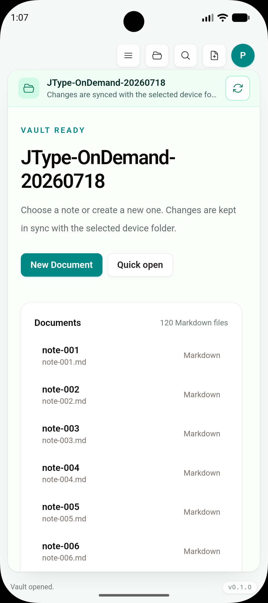

# Phase 2D：共享 vault 分页枚举契约

日期：2026-07-19

Feature branch：`codex/mobile-app`

实现 commit：`3f945c4`

状态：分页读取与 canonical snapshot 合并契约、自动化和双平台构建 gate 已完成；移动运行时尚未启用 partial snapshot，因此本段不宣称启动内存、首屏时间或 provider I/O 已改善。

## 结论

本增量建立了下一步移动端按需枚举所需的底层边界，同时保持 Desktop 为产品基准：

- Rust core 新增单目录、浅层、有界的 `WorkspaceEntryPage`；文件类型、排序和相对路径继续使用现有 `FileTreeNode` 规则。
- Tauri 只增加一个 provider-aware command。读取 external mirror 前仍先执行现有 provider recovery，不绕过事务恢复或路径防护。
- React 层只增加 immutable page merger，把分页结果合回同一个 `WorkspaceSnapshot`。
- Desktop 的 `open_workspace`、`AppState`、Sidebar、VaultHome、Quick Open、EditorShell、Preview、Document Info 和 commands 均未切换，也没有新增 mobile-only 文件树或页面。

因此，这一段是 **共享 contract foundation**，不是第二套移动端数据模型，也不是已经上线的 lazy loading。

## 契约

`read_workspace_entry_page(root, relative_path, cursor, page_size)` 返回目标目录的直接子项：

```text
relativePath   当前目录的 vault-relative path；根目录为 ""
entries        直接子项；folder.children 暂为空
startIndex     当前页在确定性排序后的起始位置
totalEntries   当前目录可见直接子项总数
nextCursor     下一页 opaque cursor；末页为 null
```

默认共享批量为 160，Rust 硬上限为 500。读取继续遵守既有可见类型、folder-first 排序、`.git` / `node_modules` / `target` 排除和 vault containment；同时拒绝零/超限 page size、绝对路径、路径逃逸、无效 cursor 和越过当前目录末尾的 stale cursor。大小写相同的文件名增加精确名称与 relative path tie-breaker，保证分页边界可重复。

`mergeWorkspaceEntryPage()` 不建立额外 state shape：

- 首页面替换目标目录的直接子项；
- 后续页必须与当前已加载长度连续；
- 已展开 folder 的 children 在父级首屏 refresh 时保留；
- nested hydration 只复制目标 ancestor chain，未变化 sibling 保持引用；
- duplicate、non-child、错误 total、未加载 parent 和乱序 page 会立即失败。

## 尚未启用的原因

当前 app 启动仍调用完整 `open_workspace`，所以本段没有减少 `WorkspaceSnapshot` 的枚举量或前端完整索引内存。直接启用 root partial snapshot 会让 Quick Open、Sidebar search、wikilink、filesystem link impact、通知/deep-link 定位看不到尚未加载的文件，这与“尽可能复用 Desktop UI 和操作”冲突。

运行时切换前还需要一层同源的 native search/path resolver，让共享操作可以解析未加载目标，再由 platform capability 在移动端选择 partial bootstrap。Desktop 继续使用完整 snapshot；共享组件只消费逐步合并后的 canonical tree，不出现 `if (mobile)` 文件树分支。

本契约还有三个明确限制：

1. 每一页目前会重新枚举并排序该目录的所有直接子项；它是内存/IPC 有界，不是 provider-native streaming cursor。
2. cursor 是当前排序结果的 offset；目录变化后调用方必须从首屏 refresh，不能继续使用旧 cursor。
3. external vault 的首次 app-private mirror、native source full hash scan 和真正的按文档 provider read 均未在本段改变。

## 自动化与构建

| 验证 | 结果 |
| --- | --- |
| `cargo test --manifest-path services/jtype-core/Cargo.toml` | PASS，40/40；覆盖 405 文档的 `160 + 160 + 87` 三页、浅层 folder、排序、路径/limit/cursor guard |
| `cargo test --manifest-path src-tauri/Cargo.toml` | PASS，29/29 |
| `pnpm test:unit` | PASS，63/63；覆盖 root/nested merge、refresh child preservation、顺序与结构 guard |
| `pnpm build` | PASS |
| `pnpm test:e2e` | PASS，55/55；Desktop/shared runtime 继续使用完整 snapshot |
| `pnpm tauri android build --debug --target aarch64 --apk --ci` | PASS |
| `pnpm tauri ios build --debug --target aarch64-sim --no-sign --archive-only --ci` | PASS |

构建产物：

```text
Android universal debug APK
394,013,070 bytes
SHA-256 a81b3915a418d22127d30f74d39ba1c6b187077df48349047a8f6f563a9758d4

iOS Simulator archive app binary
108,695,928 bytes
SHA-256 42093181cc1fbdff2adcdfe4aec644e591cc96d188e61b68e4c53d5e23029ca2
```

### 最终产物启动 smoke

最终 Android APK 覆盖安装到 API 36.1 `JType_API_36_1`，显式 cold launch 后恢复已有 120-document external mirror，并显示 Desktop 共用的 `VaultHome`：



最终 iOS archive clean install 到 iPhone 17 Pro / iOS 26.5 后显示 Desktop 共用的 Welcome。清理前的 Simulator test container 已备份到 `/tmp/jtype-ios-pagination-smoke.4owERj`，外部 Files fixture 未删除：


构建 smoke 同时暴露了一个 orchestration 限制：首次为了节省时间并行运行 Android/iOS Tauri build，两个 `beforeBuildCommand` 同时清理和重写根 `dist/`，所得 iOS bundle 启动后为空白。相同 commit 单独串行重建 iOS、再次 clean install 后立即通过。现有移动构建在为每个平台隔离 frontend output 前必须串行执行；上方 iOS hash 来自串行产物。

证据哈希：

```text
dac94d5830263edb1e210c73e1b7b6ca9813f8eca18e269d3bbb2db1a80ac258  android-workspace-pagination-smoke.png
9d165ba82efe8b6ae73f23f4ca3f3138f86840cd3c0d84a8bc630b55a84837ee  ios-workspace-pagination-smoke.png
```

本段没有新增用户可见行为，两张图只证明 `3f945c4` 的最终双平台产物继续运行共用产品层，不作为分页性能证据。分页运行时启用后会重新保存首屏、尾部搜索/定位、展开下一页和内存指标证据。

## 下一步

1. 未加载 entry 的 canonical native exact/fuzzy search、relative-path/wikilink resolve 与 link-impact query 已在 `1060d1c` 完成 contract gate；完整边界见 [`phase-2-unloaded-entry-resolution.md`](phase-2-unloaded-entry-resolution.md)。
2. 仅在 mobile runtime capability 下以根目录首屏创建 partial `WorkspaceSnapshot`；Desktop `open_workspace` 保持不变。
3. 将共享 Sidebar 的 folder expansion / Show more 接到同一 page loader，mutation 后从受影响目录首屏刷新；文档正文继续通过现有 read command 在打开时读取。
4. 在 Android/iOS 5,000 文档夹具上记录 cold open、首屏 IPC、峰值 RSS、尾部精确搜索/定位和连续分页，再决定是否需要 provider-native streaming cursor。
