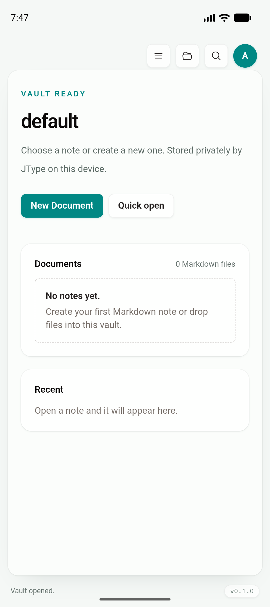
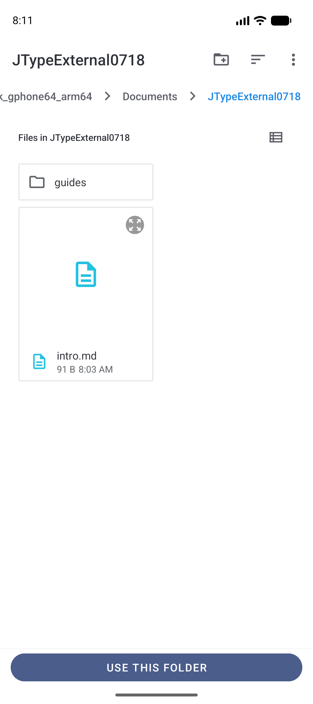
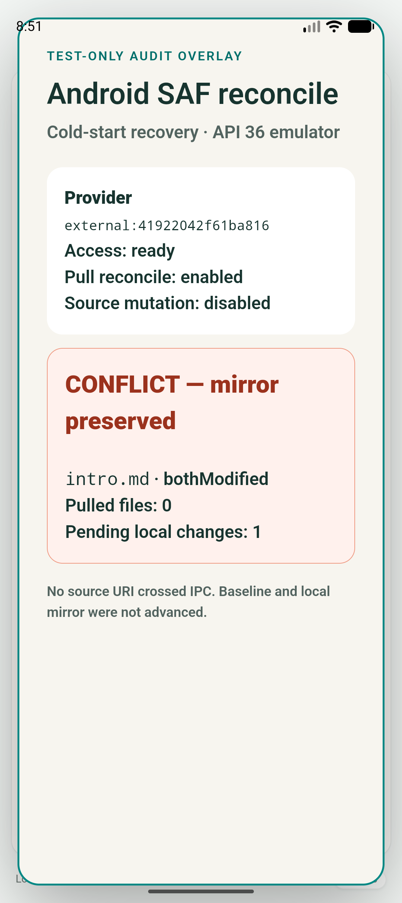
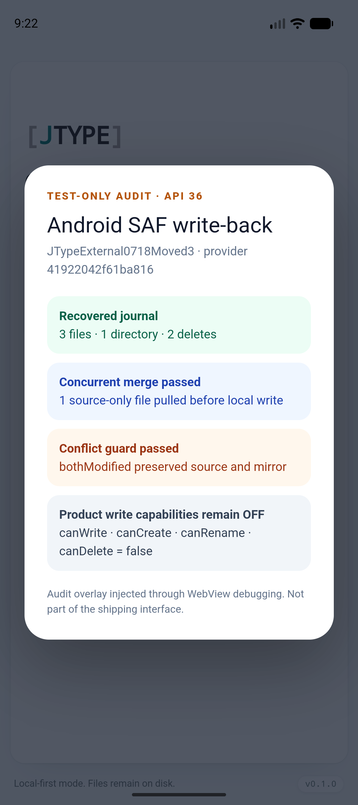
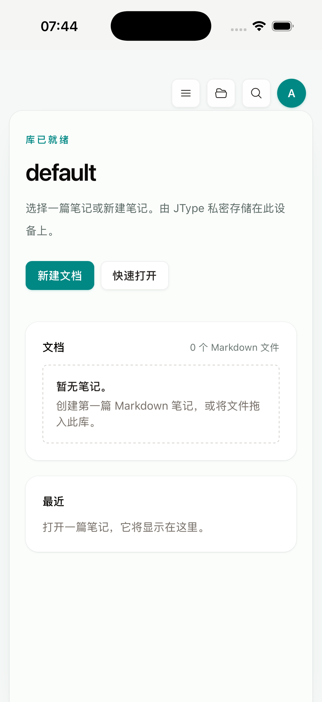
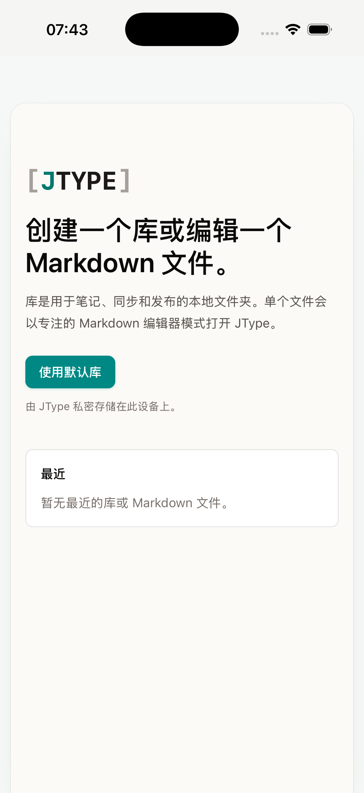

# Phase 2：External vault provider and mobile integration

日期：2026-07-18

Feature branch：`codex/mobile-app`

当前 app code commit：`99a7d39`

本报告状态：进行中；2A provider contract 已完成。2B 已完成 Android SAF 系统目录选择、persistable permission、native-only provider record、首次原子镜像、permission health、目录失效检测、重新授权、内容哈希 baseline、安全 pull reconcile、冲突阻断、冷启动恢复，以及带 mutation journal 的原生受控 write-back。shared workbench mutation routing、正式 write capability/UI 与 iOS security-scoped folder provider 尚未完成。

## 本增量结论

现有 app-private vault 已成为第一个 `VaultProvider` 实现。共享 React 产品层仍使用同一套 `AppState`、commands、`Sidebar`、`VaultHome`、`EditorShell`、Document Info、Board 和相对路径模型；移动端没有新增另一套文件树、编辑器或预览。

Android SAF 的实现同样没有新增 mobile 产品 UI：native picker 与 opaque tree URI 被封装在 Android/Rust provider adapter 内，选中的目录先镜像到 app-private root，再返回现有 `WorkspaceSnapshot`。permission health、重新授权、安全 pull 与受控 write-back 已经进入 provider adapter，并继续复用同一 provider identity、mirror 与 workspace state。正式入口仍保持关闭，直到 shared write/create/rename/delete commands 全部完成 provider routing 与冲突恢复 UI；因此用户当前不会误以为尚未接线的常规 mirror 编辑已经写回外部来源。

本增量建立的边界包括：

- provider identity：稳定的 `providerId`，移动默认库固定为 `app-private:default`。
- provider kind：`appPrivate`、`localDirectory`、`externalMirror`。
- access state：`ready`、`authorizationRequired`、`sourceUnavailable`、`error`。
- storage mode：`direct` 与 `mirror`。
- capability：read/write/create/rename/delete/watch/reconcile/reauthorize。
- external native record：区分 Android SAF tree 与 iOS security-scoped bookmark，包含 mirror root、只读状态、source revision 和最后 reconcile 时间。
- versioned provider store schema：当前版本 `1`。

`open_default_vault` 与 `open_workspace` 先解析 provider，再继续调用现有 `jtype-core` / workspace 实现，因此 `WorkspaceSnapshot`、前端 state 和 command callback 没有变化。后续 SAF/bookmark 会先 reconcile 到 app-private mirror，再复用当前 workspace 文件操作；其余 read/write/rename/delete 命令仍需在后续增量逐步接入 provider adapter。

## 安全边界

WebView 只能获得 canonical `VaultProviderDescriptor`：

```text
providerId, kind, displayName, localRootPath,
accessState, storageMode, capabilities
```

Android persistable tree URI 与 iOS security-scoped bookmark 只存在于 Rust/native record 的 `opaqueSourceReference`。descriptor 序列化测试确认不会输出 `content://`、bookmark 或 `opaqueSourceReference`，前端 canonical type 也没有这些字段。

Android provider store 使用 app config 目录内的 `vault-providers.json`，写入采用同目录 temporary file → rename 的原子替换。SAF mirror 也先写入同目录 staging tree，完整枚举成功后才 rename 为稳定 provider root；失败会删除 staging tree，不会暴露半成品 vault。

## Provider 验证

### Rust contract

七条 provider 单测覆盖：

1. mobile 默认库解析为 `appPrivate` / `direct`。
2. desktop/local directory provider ID 跨解析保持稳定。
3. external mirror capability 正确，native source reference 不进入 descriptor JSON。
4. 缺省 store JSON 迁移到 schema version 1。
5. Android/iOS source kind 与 opaque source reference 共同生成稳定、隔离的 external provider ID。
6. provider store 能幂等 upsert，并按 source 或 mirror root 恢复记录。
7. schema 1 的旧 external record 缺少 `sourceReadOnly` 时安全迁移为 source 只读，不会在升级后意外开放写入。

本轮 `cargo test --manifest-path src-tauri/Cargo.toml` 结果为 24/24，其中 provider tests 7/7、reconcile/write-back tests 12/12。

### Android Emulator：2A app-private contract

环境：`JType_API_36_1`，Android 16 / API 36，arm64，1080×2424；app code commit `309aebb`。

通过 Tauri IPC 实际读取默认库 descriptor：

```text
localRootPath  /data/user/0/net.jcode.jtype/vaults/default
providerId     app-private:default
kind           appPrivate
displayName    On this device
accessState    ready
storageMode    direct
capabilities   read/write/create/rename/delete/watch = true
               reconcile/reauthorize = false
```

随后打开同一个默认库，选择 Local only，冷启动最新 APK 后共享 `VaultHome` 正常恢复：



### Android Emulator：2B SAF 首次导入

环境：`JType_API_36_1`，Android 16 / API 36，arm64，1080×2424；app code commit `18fbeb8`。

测试源目录位于系统 Documents provider 的 `JTypeExternal0718`，包含：

```text
intro.md                 91 bytes
guides/setup.md          72 bytes
```

实际执行链路：

1. 调用 native-only `initialize_android_external_vault` 调试入口。
2. 系统 `ACTION_OPEN_DOCUMENT_TREE` picker 打开 `Documents/JTypeExternal0718`。
3. 用户点击 `USE THIS FOLDER` 并在系统确认框点击 `ALLOW`。
4. Android 使用 result intent 的实际 read/write flags 调用 `takePersistableUriPermission`。
5. native plugin 递归枚举 tree，复制到 app-private staging tree，再原子 rename 为稳定 mirror root。
6. Rust 写入 native provider record，并用现有 workspace implementation 返回文件树。



首次导入的安全响应为：

```text
providerId          external:41922042f61ba816
kind                externalMirror
displayName         JTypeExternal0718
localRootPath       /data/user/0/net.jcode.jtype/vaults/external/41922042f61ba816
accessState         ready
storageMode         mirror
capabilities        read/watch = true
                    write/create/rename/delete/reconcile/reauthorize = false
imported            2 files, 1 directory, 163 bytes
```

WebView 响应中不存在 `content://` 或 `opaqueSourceReference`。模拟器 native store 内保留实际 tree URI，`dumpsys activity` 同时确认 UID `10225` 持有对应的 `[prefix]` UriPermission；mirror 中的两份 Markdown 内容与 source fixture 完全一致。

重复选择同一 source 后 provider ID 和 mirror root 不变，返回 `0 files / 0 directories / 0 bytes`，没有重复复制；原子 provider store 更新没有遗留 `.vault-providers.json.tmp-*`。随后 force-stop/cold launch，`describe_vault_provider` 与 `open_workspace` 均从 native store 恢复同一个 descriptor 和嵌套文件树。

当前 native import 防护包括：mirror root 必须位于 app-private `vaults/external`、最大目录深度 64、最大 entry 数 50,000、拒绝 virtual documents、清理不安全文件名并拒绝清理后的同名项、跳过 `.jtype` / `.git` / `node_modules` / `target` source directory。

### Android Emulator：2B permission health 与重新授权

环境：同一台 `JType_API_36_1`，Android 16 / API 36，arm64；app code commit `0b69f16`。

本增量在每次恢复 external provider descriptor 时向 Android 原生层复核 persisted URI permission 与 source root 可用性，并把实际 access state 原子写回 provider store。Android provider 现在输出 `canReauthorize = true`；iOS 在对应 native command 完成前仍为 `false`。`canReconcile` 继续为 `false`，read/write/create/rename/delete 也没有提前开放。

真实授权丢失测试没有伪造返回值：先备份测试 app 的 provider store 与 mirror，精确卸载并重装 `net.jcode.jtype` 以清除 Android 对该 UID 的 persisted permission，再恢复 store 与 mirror。此时 `dumpsys activity` 确认没有 tree permission，descriptor 状态链为：

```text
ready -> authorizationRequired -> ready
```

处于 `authorizationRequired` 时，现有 app-private mirror 仍可通过 `open_workspace` 只读恢复，用户的本地快照不会因为 source 暂时不可访问而消失。重新选择原目录后：

- provider ID 仍为 `external:41922042f61ba816`；
- mirror root 保持不变；
- persisted permission 恢复；
- force-stop / cold launch 后 descriptor 仍为 `ready`。

随后将系统 Documents provider 中的测试目录移动并更名，旧 tree URI 能被准确识别为 `sourceUnavailable`，状态链为：

```text
ready -> sourceUnavailable -> ready
```

通过同一 provider 的 reauthorize command 选择 replacement tree 后，provider ID、mirror root 与本地 workspace state 保持不变；display name 与 native-only source reference 更新，旧 `sourceRevision` / `lastReconciledAt` 被清空，避免把新 source 误判为已经 reconcile。原 tree permission 在提交 replacement record 前被显式释放；最终 `dumpsys activity` 对 UID `10226` 只显示：

```text
content://com.android.externalstorage.documents/tree/primary%3ADocuments%2FJTypeExternal0718Moved3 [prefix]
```

WebView 的 reauthorize 响应和后续 descriptor 仍不包含 `content://`、`opaqueSourceReference` 或其他原生授权材料。精确卸载只用于可恢复的测试 app 数据夹具；外部 source fixture 被保留，供后续 reconcile/write-back 测试继续使用。

### Android Emulator：2B 内容哈希 baseline、安全 pull 与冲突阻断

环境：`JType_API_36_1`，Android 16 / API 36，arm64，1080×2424；reconcile app code commit `f9537f2`，open recovery fix `231a2dc`。

reconcile 使用 source / last-reconciled baseline / mirror 三方比较，file equality 以 SHA-256 内容哈希与字节数为准，directory rename 明确定义为旧路径删除 + 新路径创建：

- baseline 缺失且 source 与 mirror 完全相同：只建立 baseline，不修改 mirror。
- source 已变、mirror 仍等于 baseline：允许 pull 对应路径。
- mirror 已变、source 仍等于 baseline：保留本地变化并报告 pending local changes。
- source 与 mirror 均变化且结果不同：整次事务返回 conflict，不推进 baseline，不修改 mirror。
- source 删除/替换父目录但其下有本地变化：阻止事务；manifest 排除的本地目录也不会被递归删除吞掉。
- replacement tree 重新授权清空 record revision 后，旧 baseline 不再可信；只有新 source 与 mirror 完全一致时才能重新建立 baseline。

初次对已有 provider 执行 reconcile，真实返回：

```text
status              baselineEstablished
pulledFiles         0
pulledDirectories   0
deletedEntries      0
pendingLocalChanges 0
conflicts           []
```

随后直接在 Android Documents source 中执行三类外部变化：修改 `intro.md`、新增 `research/remote.md`、删除 `guides/setup.md`。第二次 reconcile 返回：

```text
status              pulled
pulledFiles         2
pulledDirectories   1
deletedEntries      1
pendingLocalChanges 0
conflicts           []
```

mirror 内容与 source 一致，原 `.jtype/workspace.json` / publish metadata 保留，且 `vaults/external` 下没有遗留 `.reconciling`、`.reconcile-backup` 或 `.source-snapshot-*`。实现先复制现有 mirror 到 staging，在 staging 中应用 path delta 并重新计算 manifest；校验通过后才执行 mirror → backup、staging → mirror 的可恢复切换。若进程在两次 rename 之间终止，下一次 external describe/open/reconcile 会恢复 backup。

冲突测试分别把 source 与 mirror 的 `intro.md` 改成不同内容。返回值为：

```text
status              conflict
pulledFiles         0
pendingLocalChanges 1
conflicts           [{ relativePath: "intro.md", reason: "bothModified" }]
```

测试前后的 provider store SHA-256 完全相同，mirror 保留本地内容，baseline revision 没有推进；force-stop / cold launch 后同一个 conflict 再次被确定性识别。因为正式 external-vault UI 尚未开放，以下截图使用明确标注的 test-only audit overlay 呈现真实 cold-start IPC 结果；它不是产品 UI，截图后已通过冷启动清除：



将 source 与 mirror 收敛到相同内容后，reconcile 返回 `unchanged` / 0 pending / 0 conflict 并安全推进 baseline。随后把 source 的 `research/remote.md` rename 为 `research/renamed.md`，真实结果为 `pulledFiles=1`、`deletedEntries=1`，mirror 与 `WorkspaceSnapshot` 均只保留新路径。安装最终 APK 并再次 cold launch 后，reconcile 返回 `unchanged`，provider ID、mirror root、baseline 与唯一 persisted tree grant 都保持稳定。

最后精确构造事务中断状态：force-stop app，将 active mirror 改名为固定 `.41922042f61ba816.reconcile-backup`，确认 active path 不存在后冷启动 `231a2dc`。第一次 `describe_vault_provider` 自动恢复 backup，紧接着 `open_workspace` 返回完整树；最终只剩 active mirror，backup/staging 均不存在。该恢复 hook 与 reconcile 共用同一操作锁，open 不会撞上正在进行的原子切换。

原安全 pull 增量的 Rust reconcile tests 9/9 覆盖：内容 hash / reserved metadata 排除、source-only pull、both-modified conflict、父目录删除与本地子项冲突、无 baseline bootstrap guard、record revision trust、原子 mirror swap、进程中断 backup 恢复、排除目录不被递归删除。

### Android Emulator：2B mutation journal 与受控 write-back

环境：`JType_API_36_1`，Android 16 / API 36，arm64，1080×2424；app code commit `99a7d39`。测试 provider 为 `external:41922042f61ba816`，source 为 Documents provider 中的 `JTypeExternal0718Moved3`，mirror 为 app-private `vaults/external/41922042f61ba816`。

本增量把 Android SAF 的真实 source 可写性与产品层有效 capability 分开保存：native access health 确认 persisted tree grant 具有 read/write permission，并在 record 中记录 `sourceReadOnly=false`；有效 `readOnly` 仍为 `true`，所以 WebView descriptor 的 `canWrite/canCreate/canRename/canDelete` 继续全部为 `false`。这允许先验证 provider adapter，而不让尚未接入 provider routing 的共享 command 提前写 mirror。

受控 write-back 每次都在同一 external operation lock 内执行：

1. 重新检查 persisted permission 与 source root health。
2. materialize source，并以 baseline/source/mirror 三方规则先 pull 不冲突的 source-only 变化。
3. 按“浅层目录创建 → 文件 upsert → 深层优先删除”生成确定性 operation plan；file/directory 类型替换直接返回 `unsafeTypeChange`，不执行 source mutation。
4. 在 `.jtype/external-vault-writeback.json` 原子写入 versioned journal 后，逐条调用 Android `DocumentsContract`；每条操作都验证 provider 的 create/write/delete flags、app-private mirror 边界、相对路径深度与 reserved directory。
5. 再次 materialize source，要求 source 与 mirror manifest 完全相等，之后才推进 baseline/provider revision 并清除 journal。

rename 使用幂等的“新路径 create/write + 旧路径 delete”计划。创建与删除均允许重试：已存在且类型一致的目录、已删除的条目不会导致重试失败；文件通过 `openOutputStream(..., "rwt")` 覆盖写入。

第一次真实事务在首条 `upsertDirectory` 前暴露了一个 Kotlin nullable bug：`findChild` 把“query 成功但目标子项不存在”误判成“目录无法枚举”。此时 source 尚未修改，但完整 journal 已先落盘。修复并覆盖安装 APK、冷启动后，同一事务从 journal 状态安全重试，实际返回：

```text
status              written
writtenFiles        3
createdDirectories  1
deletedEntries      2
pulledBeforeWrite   0
pendingJournal      false
conflicts           []
```

覆盖的 mirror-only 变化包括：编辑 `intro.md`、创建 `drafts/local.md`、删除空目录 `guides`，以及把 `research/renamed.md` 重命名为 `research/moved.md`。回写后 source 与 mirror 三份文件的逐文件 SHA-256 完全相同，旧路径和旧目录均不存在，journal 已清除。force-stop / cold launch 后重复执行返回 `unchanged`，所有计数为 0。

随后增加一个 source-only `source-only.md`，同时在 mirror 修改另一路径的 `intro.md`。write-back 先安全 pull 1 个 source-only 文件，再写入 1 个本地文件，返回 `pulledBeforeWrite=1`、`writtenFiles=1`，最终 source/mirror 再次完全一致。对同一个 `intro.md` 分别制造 source 与 mirror 的不同修改时，write-back 返回：

```text
status              conflict
writtenFiles        0
pendingJournal      false
conflicts           [{ relativePath: "intro.md", reason: "bothModified" }]
```

冲突前后 source 与 mirror 各自 SHA-256 不变，没有创建 journal，也没有推进 baseline。将两边显式收敛到同一内容后，命令返回 `unchanged` 并安全更新 baseline。

因为正式 external-vault UI 与 write capability 仍关闭，以下截图使用明确标注的 test-only audit overlay 汇总上述真实 IPC 与文件系统结果；overlay 通过 WebView debugging 注入，不属于 shipping interface 或源码：



本轮新增三条 Rust tests：write-back plan 的 create/write/deep-delete 排序、file/directory 类型变化阻断、journal 原子 round-trip/clear。加上旧 record 的 `sourceReadOnly=true` 安全迁移测试，本轮 Rust 总结果为 24/24。

本增量有意保持以下限制：

- 正式 external vault UI capability 仍关闭；系统 picker 只通过调试 IPC 验证。
- mirror 对产品层仍是只读 provider；原生受控 write-back 与 journal 已验证，但常规 shared workbench 写入、创建、重命名和删除尚未逐条路由到 provider adapter，descriptor 对这些 capability 继续返回 `false`。
- source 内容变化检测、安全 pull、受控双向 write-back、删除/rename、journal retry 与冲突阻断已经实现；部分 native mutation 后的强制进程终止、权限在事务中途撤销、磁盘不足，以及正式冲突选择/合并 UI 仍待后续 2B 增量。
- 当前每次 reconcile 仍完整枚举并 materialize source 到短期 app-private snapshot，再按 manifest delta 更新 mirror；真正的按需 source materialization 与大 vault 性能优化留在 2D。
- permission health、replacement tree 重新授权与 pull command 已完成，但正式 UI 提示/入口要在 write-back 行为稳定后才接入复用的 Welcome/VaultHome action callback。

### iPhone Simulator

环境：iPhone 17 Pro Simulator，iOS 26.5，arm64；app code commit `309aebb`。

使用 no-sign simulator archive 干净安装，通过 Maestro/XCTest 执行“使用默认库”→“仅本地”并断言“库已就绪”。实际 provider root 为 simulator app container 内的：

```text
Library/Application Support/net.jcode.jtype/vaults/default
```

它经同一个 native resolver 输出 `app-private:default` / `appPrivate` / `direct`，并交给共享 `VaultHome`：



## 本轮发现并修复的共享壳层问题

iOS 中文 locale 暴露出 desktop 共享壳层的隐式 Grid 列会按中文 Header/状态栏最小内容宽度撑开。修复没有建立 mobile-only 页面，而是在唯一 `App` shell 上显式使用 `minmax(0, 1fr)`，并给 shell、内容轨道和 content panel 增加 `min-width: 0`。

E2E 现在以完整中文 locale 在 390×844 viewport 验证：content panel 与 Welcome 的 `scrollWidth <= clientWidth`，且 panel 右边界不超过 viewport。iOS 实际 archive 的中文标题、说明和 Recent 也完整换行：



相关 commits：

- `232222c`：Welcome 内容的窄屏约束。
- `309aebb`：修复真正根因——共享 App shell 隐式 Grid 列宽，并增加完整中文 locale 回归。
- `18fbeb8`：Android SAF picker、persistable permission、native provider record、原子首次 mirror 与冷启动恢复。
- `0b69f16`：Android SAF permission health、`authorizationRequired` / `sourceUnavailable` 状态恢复、replacement tree 重新授权与旧 grant 释放。
- `f9537f2`：SHA-256 manifest baseline、三方 reconcile plan、原子安全 pull、delete/rename 与 conflict guard。
- `231a2dc`：external describe/open 在事务中断后先恢复 mirror backup，再返回 provider/workspace。
- `99a7d39`：Android SAF create/write/delete adapter、确定性 write-back plan、versioned mutation journal、source-first conflict guard 与 manifest verification。

## 自动化与构建结果

| 验证 | 结果 |
| --- | --- |
| `npm run build` | PASS |
| `npm run test:unit` | PASS，47/47 |
| `npx playwright test tests/e2e/app.spec.ts` | PASS，42/42 |
| `cargo test --manifest-path src-tauri/Cargo.toml` | PASS，24/24；provider 7/7，reconcile/write-back 12/12 |
| `cargo check --manifest-path plugins/mobile-import/Cargo.toml` | PASS |
| `cargo fmt --manifest-path plugins/mobile-import/Cargo.toml --check` | PASS |
| `pnpm tauri android build --debug --target aarch64 --apk --ci` | PASS |
| Android SAF picker / initial mirror / persisted permission / idempotent reselect / cold restore | PASS |
| Android persisted permission loss / source move / replacement reauthorization / old grant release | PASS |
| Android baseline bootstrap / source edit-create-delete / rename / both-modified conflict / cold restore / cleanup | PASS |
| Android interrupted mirror transaction → cold describe/open backup recovery | PASS |
| Android journal retry / edit-create-delete-rename write-back / cold idempotency / source-only concurrent merge / both-modified guard | PASS；正式 write capability 保持关闭 |
| `pnpm tauri ios build --debug --target aarch64-sim --no-sign --archive-only --ci` | PASS；Android write-back 增量未开启 iOS capability |
| iOS clean install / Maestro default vault flow / localized shell | PASS（2A contract 增量；本次只重跑 compile gate） |

Android debug APK：

- `src-tauri/gen/android/app/build/outputs/apk/universal/debug/app-universal-debug.apk`
- 374,927,691 bytes
- SHA-256 `2863cf7b25b4a8ef789c418d568724ca873ebc205d67652b0698b7b0826a89d9`

iOS archive：

- `src-tauri/gen/apple/build/jtype_iOS.xcarchive`
- no-sign simulator archive，约 99 MB

截图 SHA-256：

```text
9e7588d5c42ca9e76f8ac5b102cbb5f87a3c1d294035aaa737e86f172c50a0ea  localized-welcome-ios.png
4ca09fcf784119fb175202638907e2dec1a0bc8c7fd6da10652111b6b5c1e64c  provider-contract-android.png
d0c3678bbb8ae7c24e69044f53a501ac52a6c66a924da3263a76a4f7edee0055  provider-contract-ios.png
fab1577c4ac914eb86df29678fbbc6310af83dc4c8db9346ca8a5f8bb5113c66  android-saf-initial-import.png
12aed07f2bcc35c8a59f006b695444ef94b279fe5168db99738e85f351b68dc2  android-saf-reconcile-conflict.png
6cceee423e1a312798695d2934ec963957f775110b727a4534ab0fc9c4c836f0  android-saf-writeback.png
```

## 下一增量：2B shared mutation routing 与 capability 开放

下一段继续按已冻结的 contract 实现：

1. 让 shared workbench 的 write/create/rename/delete command 先解析 provider，并在 external mirror mutation 成功后调用当前 write-back transaction，而不是把本地 mirror 成功直接当成 source 已写入。
2. 保持 shared React action callback、WorkspaceSnapshot 与相对路径 contract 不变；provider 差异只进入 Rust command routing，不在 EditorShell/Sidebar/Board 内加入 SAF 分支。
3. 对每类 shared mutation 增加 source 并发修改、部分 native mutation 后进程终止、权限中途失效与磁盘不足恢复测试。
4. 只有上述路径全部闭环后，才逐项把 descriptor 的 write/create/rename/delete capability 从 `false` 打开。
5. capability 开放后，把 external vault 入口、reconcile 状态、重新授权与冲突提示接入复用的 Welcome/VaultHome/EditorShell callbacks。

iOS security-scoped bookmark 会在 Android SAF contract 与 reconcile 行为稳定后复用同一 store、descriptor 和 mirror 状态机。
