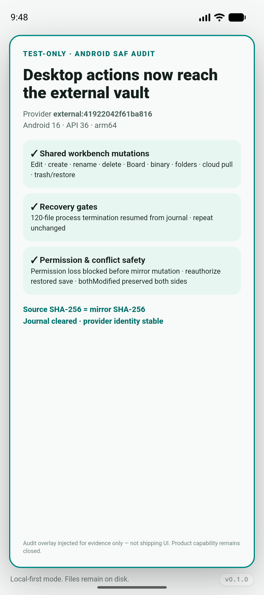
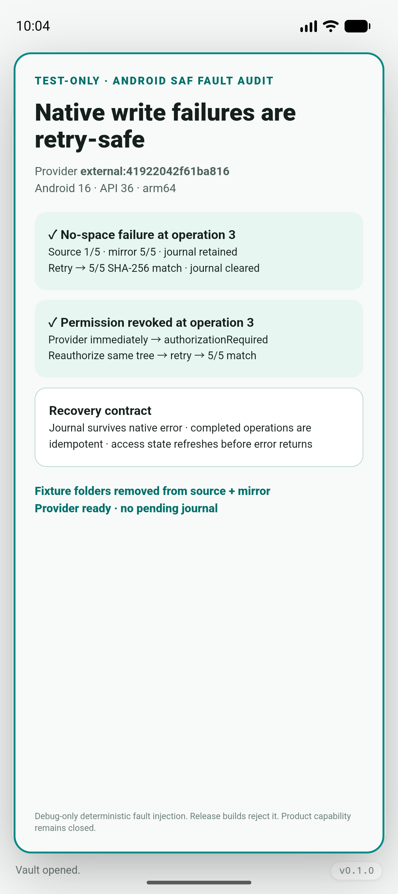
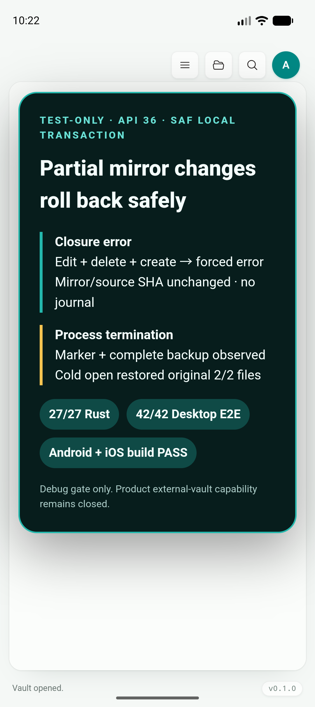
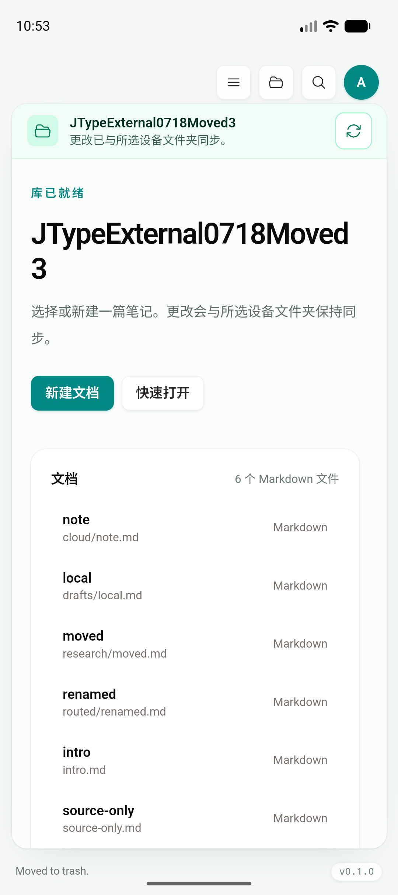
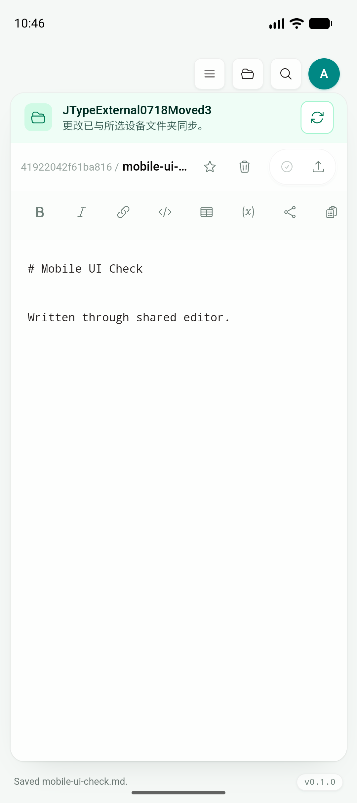
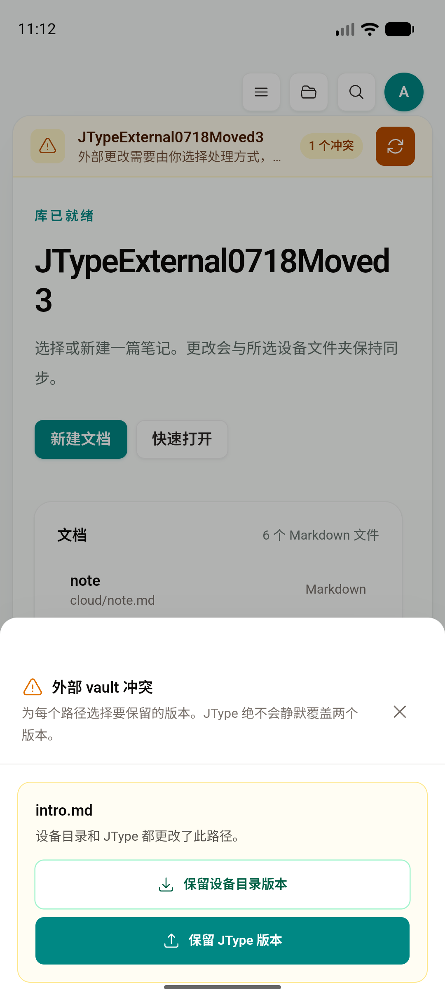
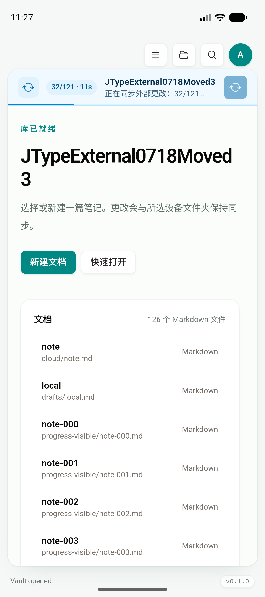
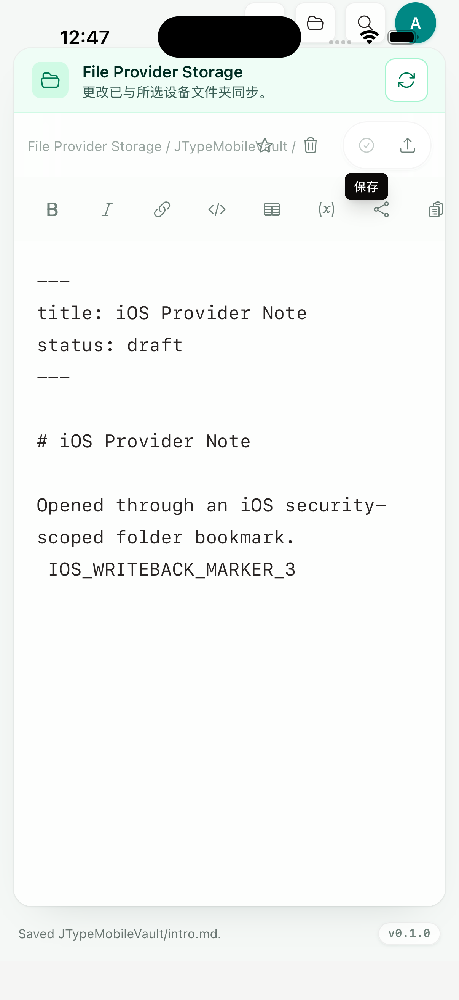

# Phase 2：External vault provider and mobile integration

日期：2026-07-19

Feature branch：`codex/mobile-app`

当前 app code commit：`799358c`

当前 iOS provider gate commit：`264db8a`

当前 physical-device preflight commit：`c63aac3`

当前 external mirror reuse commit：`a374204`

本报告状态：进行中；2A provider contract、2B Android SAF 与 2C iOS security-scoped provider 的工程/Simulator gate 已完成。2D 已完成 app-private 草稿冷恢复、Keystore/Keychain pending OAuth 冷恢复、Android share target / iOS Share Extension、模拟器无障碍、共享触控交互与键盘辅助栏、5,000 文档大 vault、大 Markdown/附件/1,200-card Board 渐进渲染、sync reliability、本地原生通知文档定位、HTTPS universal/app-link 工程契约，以及 mobile partial `WorkspaceSnapshot`、shared loaded-first/native-fallback resolver 与 folder hydration。Android partial 5,008-entry cold open、IPC/snapshot、RSS 和尾部打开，以及 iOS clean static archive 的 5,406-entry partial cold open、unloaded tail cold restore 均已通过；双端交互式第二页使用有界 shallow cache，native hit 均为 0 ms。external reconcile/write-back 已改为 native full scan + plan-driven source materialization；Android SAF 与 iOS local Files provider 的原生复测均通过。`a374204` 在 source 完整 SHA-256 与可信 baseline 完全一致、无 mutation/journal 时复用 baseline，消除 unchanged 稳定状态的第二次 app-private mirror full hash；Android/iOS Simulator 均命中，Android changed/restored source 仍精确走 1-file materialization。`799358c` 增加严格 HTTPS route、Android autoVerify、iOS associated-domain 和 Axum fail-closed association endpoint；当前生产域名尚未部署 JSON association，真实 signing/physical verified link 继续 blocked。Android Studio 已把 `arm64` 设为唯一默认 product flavor。`c63aac3` 新增 fail-closed physical-device preflight，当前真实报告正确排除 Emulator/Simulator，并因 0 真机、0 Apple Development identity 和未配置 team 保持 blocked。真实设备弱网、APNs/FCM、provider-native streaming、source full-hash 优化、双平台 physical low-memory/performance、physical bookmark 生命周期与真机终验继续进行。

## 本增量结论

现有 app-private vault 已成为第一个 `VaultProvider` 实现。共享 React 产品层仍使用同一套 `AppState`、commands、`Sidebar`、`VaultHome`、`EditorShell`、Document Info、Board 和相对路径模型；移动端没有新增另一套文件树、编辑器或预览。

Android SAF 没有新增 mobile-only 产品页：native picker 与 opaque tree URI 被封装在 Android/Rust provider adapter 内，选中的目录先镜像到 app-private root，再返回现有 `WorkspaceSnapshot`。正式入口复用 Welcome / Sidebar 原有的 Open vault action；打开后继续使用同一套 `VaultHome`、文件树、编辑器、预览、Document Info、Board 和 commands。共享壳层只增加 provider status banner 与 Headless UI 冲突 dialog，用于展示目录名、访问状态、pending write-back、冲突数量、重新授权/检查动作和逐路径版本选择。

系统分享也遵守相同边界：Android Intent 与 iOS Share Extension 只负责捕获、暂存和唤醒，Rust 将来源交给现有 `importExternalSources`，最终仍由同一套 vault provider routing 和 `EditorShell` 呈现；移动端没有 landing page、docs website、share inbox 页面或独立编辑器。

触控交互同样没有复制产品 UI：Sidebar 与 Board 的长按、滑动和 selection 复用现有 action callbacks；Editor 键盘辅助栏复用现有格式化/插入命令和 native undo history。平台兼容层只负责手势输入、visual viewport keyboard inset 与 Android/iOS native haptic，desktop 的右键、拖拽和快捷键路径保持不变。

大 vault 性能也在同一产品层收口：一个 WeakMap 缓存的 workspace index 由 Sidebar、VaultHome、Quick Open、Editor wikilink 和 filesystem link impact 共用；每级文件树只挂载 160 个 sibling，并围绕 active path 定位。Android/iOS 没有新增 mobile-only 文档列表或搜索页，也没有复用 web dashboard、landing page 或 help/docs website。

按需枚举也保持这个方向：Rust/Tauri 的 provider-aware shallow page 由 mobile runtime capability 接入 app startup，React 只把 page immutable merge 回现有 `WorkspaceSnapshot`。Quick Open、Sidebar search、wikilink、link impact、通知/deep-link 均先用 loaded Desktop index，再用同源 native resolver 查找未加载路径。Desktop 继续完整打开，不会为了移动端改成不完整文件树。

大内容渲染继续沿用同一边界：共享 Preview 首批挂载 240 个 Markdown block，Mermaid 与 vault-relative 大图按可见性加载；Board 每列首批 80 张，Table/Agenda/Swimlane 首批 160 张，但搜索、计数、filter 与依赖关系仍使用完整模型。Android/iOS 没有新增 mobile-only Preview 或 Board；PDF/export 显式渲染完整文档。

同步可靠性也继续复用 desktop 产品层：`useCloudSync` / `useEagerSync`、Account dialog、operation log、Editor 与 lifecycle adapter 都是同一份代码。push 现在按 50-operation / 约 1 MB 确定性切批，pull/push 对 transient failure 最多尝试 3 次；服务端对顺序和并发 request-id replay 返回缓存响应。Android/iOS 没有新增 mobile-only sync 页面，也没有复用 web dashboard。

external provider 的性能兼容同样留在 adapter：native 层先完整读取并 hash source manifest，Rust 三方 plan 再决定需要 materialize 的 source 路径；unchanged、source delete、mirror-only change 和 `UseJtype` verification 不复制 source 文件。`a374204` 又让 unchanged + trusted baseline + 无 mutation/journal 的稳定状态跳过第二次 app-private mirror hash；source 变化、stale/missing baseline 与 recovery 仍走完整三方路径。首次 external vault import 仍完整 mirror，因此当前不是零拷贝/lazy provider。完整边界与 Android/iOS Simulator 复测见 [`phase-2-native-on-demand.md`](phase-2-native-on-demand.md) 与 [`phase-2-mirror-manifest-reuse.md`](phase-2-mirror-manifest-reuse.md)。

本增量建立的边界包括：

- provider identity：稳定的 `providerId`，移动默认库固定为 `app-private:default`。
- provider kind：`appPrivate`、`localDirectory`、`externalMirror`。
- access state：`ready`、`authorizationRequired`、`sourceUnavailable`、`error`。
- storage mode：`direct` 与 `mirror`。
- capability：read/write/create/rename/delete/watch/reconcile/reauthorize。
- external native record：区分 Android SAF tree 与 iOS security-scoped bookmark，包含 mirror root、只读状态、source revision 和最后 reconcile 时间。
- versioned provider store schema：当前版本 `2`，source identity 与可刷新 source reference 分离。

`open_default_vault` 与 `open_workspace` 先解析 provider，再继续调用现有 `jtype-core` / workspace 实现，因此 `WorkspaceSnapshot`、前端 state 和 command callback 没有变化。Android SAF 与 iOS bookmark 都先 reconcile 到 app-private mirror，再复用当前 workspace 文件操作；现有 read/write/create/rename/delete、Board、binary、folder、cloud 和 trash mutation 已按 root/path 自动进入同一个 mobile provider adapter，desktop 仍直通原实现。

## 安全边界

WebView 只能获得 canonical `VaultProviderDescriptor`：

```text
providerId, kind, displayName, localRootPath,
accessState, storageMode, capabilities
```

Android persistable tree URI 与 iOS security-scoped bookmark 只存在于 Rust/native record 的 `opaqueSourceReference`。descriptor 序列化测试确认不会输出 `content://`、bookmark 或 `opaqueSourceReference`，前端 canonical type 也没有这些字段。

mobile provider store 使用 app config 目录内的 `vault-providers.json`，写入采用同目录 temporary file → rename 的原子替换。Android SAF 与 iOS bookmark 的首次 mirror 都先写入同目录 staging tree，完整枚举成功后才 rename 为稳定 provider root；失败会删除 staging tree，不会暴露半成品 vault。

## Provider 验证

### Rust contract

七条 provider 单测覆盖：

1. mobile 默认库解析为 `appPrivate` / `direct`。
2. desktop/local directory provider ID 跨解析保持稳定。
3. external mirror capability 正确，native source reference 不进入 descriptor JSON。
4. 缺省/旧 store JSON normalize 到 schema version 2。
5. Android/iOS source kind 与稳定 source identity 共同生成隔离的 external provider ID；可刷新 bookmark 不参与 identity。
6. provider store 能幂等 upsert，并按 source 或 mirror root 恢复记录。
7. schema 1 的旧 external record 缺少 `sourceReadOnly` / `sourceIdentity` 时安全迁移，不会在升级后意外开放写入。

当前 `cargo test --manifest-path src-tauri/Cargo.toml` 结果为 28/28，覆盖 provider capability、reconcile/write-back、local rollback、cold recovery 与 source conflict subtree 原子替换。

### Android Emulator：2A app-private contract

环境：`JType_API_36_1`，Android 16 / API 36，arm64，1080×2424；app code commit `309aebb`。

通过 Tauri IPC 实际读取默认库 descriptor：

```text
localRootPath  /data/user/0/net.jcode.jtype/vaults/default
providerId     app-private:default
kind           appPrivate
displayName    On this device
accessState    ready
storageMode    direct
capabilities   read/write/create/rename/delete/watch = true
               reconcile/reauthorize = false
```

随后打开同一个默认库，选择 Local only，冷启动最新 APK 后共享 `VaultHome` 正常恢复：


### Android Emulator：2B SAF 首次导入

环境：`JType_API_36_1`，Android 16 / API 36，arm64，1080×2424；app code commit `18fbeb8`。

测试源目录位于系统 Documents provider 的 `JTypeExternal0718`，包含：

```text
intro.md                 91 bytes
guides/setup.md          72 bytes
```

实际执行链路：

1. 调用 native-only `initialize_android_external_vault` 调试入口。
2. 系统 `ACTION_OPEN_DOCUMENT_TREE` picker 打开 `Documents/JTypeExternal0718`。
3. 用户点击 `USE THIS FOLDER` 并在系统确认框点击 `ALLOW`。
4. Android 使用 result intent 的实际 read/write flags 调用 `takePersistableUriPermission`。
5. native plugin 递归枚举 tree，复制到 app-private staging tree，再原子 rename 为稳定 mirror root。
6. Rust 写入 native provider record，并用现有 workspace implementation 返回文件树。


首次导入的安全响应为：

```text
providerId          external:41922042f61ba816
kind                externalMirror
displayName         JTypeExternal0718
localRootPath       /data/user/0/net.jcode.jtype/vaults/external/41922042f61ba816
accessState         ready
storageMode         mirror
capabilities        read/watch = true
                    write/create/rename/delete/reconcile/reauthorize = false
imported            2 files, 1 directory, 163 bytes
```

WebView 响应中不存在 `content://` 或 `opaqueSourceReference`。模拟器 native store 内保留实际 tree URI，`dumpsys activity` 同时确认 UID `10225` 持有对应的 `[prefix]` UriPermission；mirror 中的两份 Markdown 内容与 source fixture 完全一致。

重复选择同一 source 后 provider ID 和 mirror root 不变，返回 `0 files / 0 directories / 0 bytes`，没有重复复制；原子 provider store 更新没有遗留 `.vault-providers.json.tmp-*`。随后 force-stop/cold launch，`describe_vault_provider` 与 `open_workspace` 均从 native store 恢复同一个 descriptor 和嵌套文件树。

当前 native import 防护包括：mirror root 必须位于 app-private `vaults/external`、最大目录深度 64、最大 entry 数 50,000、拒绝 virtual documents、清理不安全文件名并拒绝清理后的同名项、跳过 `.jtype` / `.git` / `node_modules` / `target` source directory。

### Android Emulator：2B permission health 与重新授权

环境：同一台 `JType_API_36_1`，Android 16 / API 36，arm64；app code commit `0b69f16`。

本增量在每次恢复 external provider descriptor 时向 Android 原生层复核 persisted URI permission 与 source root 可用性，并把实际 access state 原子写回 provider store。Android provider 现在输出 `canReauthorize = true`；iOS 在对应 native command 完成前仍为 `false`。`canReconcile` 继续为 `false`，read/write/create/rename/delete 也没有提前开放。

真实授权丢失测试没有伪造返回值：先备份测试 app 的 provider store 与 mirror，精确卸载并重装 `net.jcode.jtype` 以清除 Android 对该 UID 的 persisted permission，再恢复 store 与 mirror。此时 `dumpsys activity` 确认没有 tree permission，descriptor 状态链为：

```text
ready -> authorizationRequired -> ready
```

处于 `authorizationRequired` 时，现有 app-private mirror 仍可通过 `open_workspace` 只读恢复，用户的本地快照不会因为 source 暂时不可访问而消失。重新选择原目录后：

- provider ID 仍为 `external:41922042f61ba816`；
- mirror root 保持不变；
- persisted permission 恢复；
- force-stop / cold launch 后 descriptor 仍为 `ready`。

随后将系统 Documents provider 中的测试目录移动并更名，旧 tree URI 能被准确识别为 `sourceUnavailable`，状态链为：

```text
ready -> sourceUnavailable -> ready
```

通过同一 provider 的 reauthorize command 选择 replacement tree 后，provider ID、mirror root 与本地 workspace state 保持不变；display name 与 native-only source reference 更新，旧 `sourceRevision` / `lastReconciledAt` 被清空，避免把新 source 误判为已经 reconcile。原 tree permission 在提交 replacement record 前被显式释放；最终 `dumpsys activity` 对 UID `10226` 只显示：

```text
content://com.android.externalstorage.documents/tree/primary%3ADocuments%2FJTypeExternal0718Moved3 [prefix]
```

WebView 的 reauthorize 响应和后续 descriptor 仍不包含 `content://`、`opaqueSourceReference` 或其他原生授权材料。精确卸载只用于可恢复的测试 app 数据夹具；外部 source fixture 被保留，供后续 reconcile/write-back 测试继续使用。

### Android Emulator：2B 内容哈希 baseline、安全 pull 与冲突阻断

环境：`JType_API_36_1`，Android 16 / API 36，arm64，1080×2424；reconcile app code commit `f9537f2`，open recovery fix `231a2dc`。

reconcile 使用 source / last-reconciled baseline / mirror 三方比较，file equality 以 SHA-256 内容哈希与字节数为准，directory rename 明确定义为旧路径删除 + 新路径创建：

- baseline 缺失且 source 与 mirror 完全相同：只建立 baseline，不修改 mirror。
- source 已变、mirror 仍等于 baseline：允许 pull 对应路径。
- mirror 已变、source 仍等于 baseline：保留本地变化并报告 pending local changes。
- source 与 mirror 均变化且结果不同：整次事务返回 conflict，不推进 baseline，不修改 mirror。
- source 删除/替换父目录但其下有本地变化：阻止事务；manifest 排除的本地目录也不会被递归删除吞掉。
- replacement tree 重新授权清空 record revision 后，旧 baseline 不再可信；只有新 source 与 mirror 完全一致时才能重新建立 baseline。

初次对已有 provider 执行 reconcile，真实返回：

```text
status              baselineEstablished
pulledFiles         0
pulledDirectories   0
deletedEntries      0
pendingLocalChanges 0
conflicts           []
```

随后直接在 Android Documents source 中执行三类外部变化：修改 `intro.md`、新增 `research/remote.md`、删除 `guides/setup.md`。第二次 reconcile 返回：

```text
status              pulled
pulledFiles         2
pulledDirectories   1
deletedEntries      1
pendingLocalChanges 0
conflicts           []
```

mirror 内容与 source 一致，原 `.jtype/workspace.json` / publish metadata 保留，且 `vaults/external` 下没有遗留 `.reconciling`、`.reconcile-backup` 或 `.source-snapshot-*`。实现先复制现有 mirror 到 staging，在 staging 中应用 path delta 并重新计算 manifest；校验通过后才执行 mirror → backup、staging → mirror 的可恢复切换。若进程在两次 rename 之间终止，下一次 external describe/open/reconcile 会恢复 backup。

冲突测试分别把 source 与 mirror 的 `intro.md` 改成不同内容。返回值为：

```text
status              conflict
pulledFiles         0
pendingLocalChanges 1
conflicts           [{ relativePath: "intro.md", reason: "bothModified" }]
```

测试前后的 provider store SHA-256 完全相同，mirror 保留本地内容，baseline revision 没有推进；force-stop / cold launch 后同一个 conflict 再次被确定性识别。该段验证时正式 external-vault UI 尚未开放，因此以下截图使用明确标注的 test-only audit overlay 呈现真实 cold-start IPC 结果；它不是产品 UI，截图后已通过冷启动清除：


将 source 与 mirror 收敛到相同内容后，reconcile 返回 `unchanged` / 0 pending / 0 conflict 并安全推进 baseline。随后把 source 的 `research/remote.md` rename 为 `research/renamed.md`，真实结果为 `pulledFiles=1`、`deletedEntries=1`，mirror 与 `WorkspaceSnapshot` 均只保留新路径。安装最终 APK 并再次 cold launch 后，reconcile 返回 `unchanged`，provider ID、mirror root、baseline 与唯一 persisted tree grant 都保持稳定。

最后精确构造事务中断状态：force-stop app，将 active mirror 改名为固定 `.41922042f61ba816.reconcile-backup`，确认 active path 不存在后冷启动 `231a2dc`。第一次 `describe_vault_provider` 自动恢复 backup，紧接着 `open_workspace` 返回完整树；最终只剩 active mirror，backup/staging 均不存在。该恢复 hook 与 reconcile 共用同一操作锁，open 不会撞上正在进行的原子切换。

原安全 pull 增量的 Rust reconcile tests 9/9 覆盖：内容 hash / reserved metadata 排除、source-only pull、both-modified conflict、父目录删除与本地子项冲突、无 baseline bootstrap guard、record revision trust、原子 mirror swap、进程中断 backup 恢复、排除目录不被递归删除。

### Android Emulator：2B mutation journal 与受控 write-back

环境：`JType_API_36_1`，Android 16 / API 36，arm64，1080×2424；app code commit `99a7d39`。测试 provider 为 `external:41922042f61ba816`，source 为 Documents provider 中的 `JTypeExternal0718Moved3`，mirror 为 app-private `vaults/external/41922042f61ba816`。

本增量把 Android SAF 的真实 source 可写性与产品层有效 capability 分开保存：native access health 确认 persisted tree grant 具有 read/write permission，并在 record 中记录 `sourceReadOnly=false`；有效 `readOnly` 仍为 `true`，所以 WebView descriptor 的 `canWrite/canCreate/canRename/canDelete` 继续全部为 `false`。这允许先验证 provider adapter，而不让尚未接入 provider routing 的共享 command 提前写 mirror。

受控 write-back 每次都在同一 external operation lock 内执行：

1. 重新检查 persisted permission 与 source root health。
2. materialize source，并以 baseline/source/mirror 三方规则先 pull 不冲突的 source-only 变化。
3. 按“浅层目录创建 → 文件 upsert → 深层优先删除”生成确定性 operation plan；file/directory 类型替换直接返回 `unsafeTypeChange`，不执行 source mutation。
4. 在 `.jtype/external-vault-writeback.json` 原子写入 versioned journal 后，逐条调用 Android `DocumentsContract`；每条操作都验证 provider 的 create/write/delete flags、app-private mirror 边界、相对路径深度与 reserved directory。
5. 再次 materialize source，要求 source 与 mirror manifest 完全相等，之后才推进 baseline/provider revision 并清除 journal。

rename 使用幂等的“新路径 create/write + 旧路径 delete”计划。创建与删除均允许重试：已存在且类型一致的目录、已删除的条目不会导致重试失败；文件通过 `openOutputStream(..., "rwt")` 覆盖写入。

第一次真实事务在首条 `upsertDirectory` 前暴露了一个 Kotlin nullable bug：`findChild` 把“query 成功但目标子项不存在”误判成“目录无法枚举”。此时 source 尚未修改，但完整 journal 已先落盘。修复并覆盖安装 APK、冷启动后，同一事务从 journal 状态安全重试，实际返回：

```text
status              written
writtenFiles        3
createdDirectories  1
deletedEntries      2
pulledBeforeWrite   0
pendingJournal      false
conflicts           []
```

覆盖的 mirror-only 变化包括：编辑 `intro.md`、创建 `drafts/local.md`、删除空目录 `guides`，以及把 `research/renamed.md` 重命名为 `research/moved.md`。回写后 source 与 mirror 三份文件的逐文件 SHA-256 完全相同，旧路径和旧目录均不存在，journal 已清除。force-stop / cold launch 后重复执行返回 `unchanged`，所有计数为 0。

随后增加一个 source-only `source-only.md`，同时在 mirror 修改另一路径的 `intro.md`。write-back 先安全 pull 1 个 source-only 文件，再写入 1 个本地文件，返回 `pulledBeforeWrite=1`、`writtenFiles=1`，最终 source/mirror 再次完全一致。对同一个 `intro.md` 分别制造 source 与 mirror 的不同修改时，write-back 返回：

```text
status              conflict
writtenFiles        0
pendingJournal      false
conflicts           [{ relativePath: "intro.md", reason: "bothModified" }]
```

冲突前后 source 与 mirror 各自 SHA-256 不变，没有创建 journal，也没有推进 baseline。将两边显式收敛到同一内容后，命令返回 `unchanged` 并安全更新 baseline。

该段验证时正式 external-vault UI 与 write capability 仍关闭，因此以下截图使用明确标注的 test-only audit overlay 汇总上述真实 IPC 与文件系统结果；overlay 通过 WebView debugging 注入，不属于 shipping interface 或源码：


本轮新增三条 Rust tests：write-back plan 的 create/write/deep-delete 排序、file/directory 类型变化阻断、journal 原子 round-trip/clear。加上旧 record 的 `sourceReadOnly=true` 安全迁移测试，本轮 Rust 总结果为 24/24。

该受控 write-back 增量当时保留的限制及当前状态：

- 正式 external vault 入口和 Android write/create/rename/delete capability 已在 `276ced1` 开放，并通过真实产品 UI 验证。
- mirror capability 现在同时受 native `sourceReadOnly` 和 access state 约束；权限不为 `ready` 时共享写动作立即进入只读状态。
- source 内容变化检测、安全 pull、受控双向 write-back、删除/rename、journal retry、local/native 两阶段进程终止恢复、native operation 中途权限撤销/磁盘不足恢复、冲突阻断与正式逐路径冲突选择均已实现。
- 当前每次 reconcile 仍完整枚举并 hash source，但不再整库 materialize 到短期 snapshot；只有三方 plan 的 source upsert/`UseSource` subtree 会进入 app-private staging。首次 mirror、native 分页枚举、partial `WorkspaceSnapshot` 与按文档读取继续留在 2D。
- permission health、replacement tree 重新授权、pull command、正式状态提示、重新授权 callback 与大批量 write-back/verification 进度均已接入共享 UI；2D 继续优化完整枚举/hash I/O，并补齐双模拟器真实 provider 性能 gate。

### Android Emulator：2B shared workbench mutation routing

环境：`JType_API_36_1`，Android 16 / API 36，arm64，1080×2424；app code commit `123bea6`。测试继续使用 provider `external:41922042f61ba816`、Documents source `JTypeExternal0718Moved3` 与 app-private mirror `vaults/external/41922042f61ba816`。

本增量没有新建 mobile command 或复制 EditorShell/Sidebar/Board 的 action callback。现有 Tauri command 根据 mutation 的 root/path 解析 provider：普通 app-private/desktop 路径仍直接执行原实现；Android external mirror 则在同一 external operation lock 内执行以下流程：

1. 恢复可能中断的 mirror swap，并在任何本地 mutation 之前刷新 persisted permission、source root health 与只读状态。
2. 原样执行现有 local filesystem mutation。
3. 在同一锁内调用已经验证的 SAF write-back transaction；若三方比较发现 `bothModified`，command 以包含结构化 conflict 的错误返回，不推进 baseline，也不修改 source。
4. 对 root mutation，write-back 完成后再重新打开 workspace，因此 source-only 安全 pull 会反映在返回的 `WorkspaceSnapshot` 中。

`provider_for_local_path` 只接受 mirror root 本身或其真实 descendant；相邻前缀目录与包含 `.` / `..` 的路径不会被误路由。desktop 继续直接调用原 closure；Android/iOS 通过同一个 mobile adapter 包裹 closure，command 参数和返回值不变。

在真实模拟器中通过同一批 desktop/shared commands 完成并核对 source/mirror：

- `write_markdown_file`、`create_workspace_entry`、`rename_workspace_entry`、`delete_workspace_entry`；
- `create_board`、`write_board_file`、`write_binary_file`、`write_text_file`；
- folder create/rename/move/delete；
- `apply_cloud_documents` 与 `apply_deleted_cloud_folders`；
- `trash_workspace_entry` 与 `restore_workspace_trash`。

Markdown、Board、diagram 与 binary 的 source/mirror SHA-256 均一致，删除、rename、trash/restore 的路径状态一致，成功事务后 journal 均被清除。对 `intro.md` 制造 source 与 editor stale buffer 的并发修改时，标准共享保存返回：

```text
External vault mutation is pending conflict resolution:
[{"relativePath":"intro.md","reason":"bothModified"}]
```

source 与 mirror 保留各自不同的 SHA-256，未创建 journal；随后通过同一共享保存显式提交 source 当前内容，两边重新收敛并推进 baseline。

进程终止 gate 使用标准 `apply_cloud_documents` 一次创建 120 个约 4 KB 文件，并在 SAF write-back 中途 force-stop：当时 source 已有 98/120、mirror 为 120/120，versioned journal 存在。冷启动后重试继续剩余 operation，最终 source/mirror 均为 120/120、journal 清除；再次执行返回 `unchanged`。随后标准 `delete_workspace_folder` 同样完成 source/mirror 删除。该批量删除在模拟器上超过 15 秒，已记录为 2D 大 vault/增量性能优化项。

权限恢复 gate 先精确备份 provider record 与 mirror，再卸载测试 package 以清除 persisted tree grant，并恢复同一 app-private fixture。权限缺失时，标准 `write_markdown_file` 返回 `External vault access is not ready for mutation`；source 与 mirror 的 SHA-256 均保持不变，证明检查发生在 local mirror mutation 之前，descriptor 进入 `authorizationRequired`。通过同一 provider 的 reauthorize command 重选原 tree 后，provider identity 与 mirror root 不变，descriptor 恢复 `ready`；再次执行标准共享保存成功，source/mirror 均为：

```text
c6da01b027a604447667f6aa18538695da8eaa72ed2ee5d98344317bcd961ba7
```

journal 不存在。该段验证时正式 external-vault UI/capability 仍保持关闭，因此下图继续使用明确标注的 test-only audit overlay；覆盖层只汇总上述真实 IPC/文件系统结果，截图后已从 WebView 移除：



本段之后的 local transaction 增量关闭了多文件 closure 自身部分失败的边界。当时产品 descriptor 的 `canWrite/canCreate/canRename/canDelete` 仍为 `false`；入口、重新授权提示和 pending/conflict 状态随后在 `276ced1` 接入现有 Welcome/VaultHome/EditorShell callbacks。

### Android Emulator：2B native fault recovery

环境：`JType_API_36_1`，Android 16 / API 36，arm64，1080×2424；app code commit `455eafe`。测试继续使用 provider `external:41922042f61ba816`、Documents source `JTypeExternal0718Moved3` 与相同 app-private mirror。

为验证真实 SAF operation 的中途失败，本增量在 Android plugin 内加入仅 debuggable app 可配置的确定性 fault injector。release build 和非 Android target 均拒绝该调试 command；fault 不进入 provider record，也不会改变产品 capability。注入器可在指定数量的已完成 native operation 后模拟：

- `diskFull`：抛出与系统无空间一致的 `IOException`；
- `permissionRevoked`：真实释放 persisted tree URI grant，再抛出 `SecurityException`；
- `clear`：清除未消费 fault。

在 native mutation 开始前，完整 write-back journal 已原子保存。因此任一 native operation 失败后，Rust adapter 保留 journal、立即刷新 provider access health，并返回明确的 retry-safe 错误，而不是把 partial source 当作成功 baseline。

磁盘不足 gate 使用标准 shared `apply_cloud_documents` 创建 5 个文件，并在第 3 个 native operation 前失败。实际状态为 source 1/5、mirror 5/5、journal `attempts=1`、provider 仍为 `ready`，错误明确说明 pending journal retained。清除 fault 后重试同一个 shared command，source/mirror 收敛到 5/5，逐文件 SHA-256 完全一致，journal 清除；随后使用标准 `delete_workspace_folder` 清理测试目录。

权限撤销 gate 同样在第 3 个 native operation 前失败。实际状态为 source 1/5、mirror 5/5、journal `attempts=1`；adapter 在同一次错误路径把 descriptor 刷新为 `authorizationRequired`、`sourceReadOnly=true`，错误提示先恢复 external vault access 再安全重试。通过现有 reauthorize command 重选同一 tree 后，provider ID 与 mirror root 保持不变，descriptor 恢复 `ready`；重试同一个 shared command 后 source/mirror 收敛到 5/5、SHA-256 一致、journal 清除，并使用标准 folder command 清理。

以下 test-only audit overlay 只汇总上述真实 IPC、provider store 与文件系统结果，不属于 shipping UI，截图后已从 WebView 移除：



这两条 gate 证明失败发生在 source 已部分变化时，仍能依靠同一 versioned journal 确定性续跑；也证明权限变化会立即反映到 canonical descriptor。native write-back 之前的 local multi-file closure 自身部分失败由下一段的 mirror transaction 关闭。

### Android Emulator：2B local mirror transaction

环境：`JType_API_36_1`，Android 16 / API 36，arm64，1080×2424；app code commit `c78eaad`。测试继续使用相同 external provider、Documents source 与 mirror。

每个通过 `with_external_vault_mutation` 路由的 shared command 现在先建立 sibling transaction：完整复制当前 mirror 到 backup，再原子写入 versioned marker，之后才执行原有 local closure。行为边界为：

1. closure 返回错误且尚无 SAF journal：立即把 mirror 与 backup 可恢复交换，返回原始错误；
2. 进程在 local closure 中途终止且尚无 SAF journal：下一次 describe/open 根据 marker 自动恢复 backup；
3. SAF journal 已建立：冷恢复保留 forward mirror，不回滚已经开始写入 source 的目标状态；
4. source verification、baseline 和 provider store 均完成后，先清理 local backup/marker，再清除 SAF journal，避免崩溃窗口把已提交 source 误判为 local-only 变化；
5. reconcile 和新 mutation 遇到 pending journal 时拒绝并要求先完成 write-back，避免两个事务交错。

三组 Rust tests 覆盖完整 rollback、无 journal 的 cold rollback，以及有 journal 时保留 forward state；Rust 总结果从 24/24 增加到 27/27。debug-only Android 集成 command 在 release/非 Android 构建中拒绝执行。

真实 API 36 closure error gate 先用标准 `apply_cloud_documents` 建立 `fault-local/edited.md` 与 `removed.md`，然后在同一 closure 内依次 edit、delete、create 并返回确定性错误。结果为 source/mirror 原两文件 SHA-256 完全不变、`created.md` 不存在、无 marker/backup/journal：

```text
32b55fa870aef84f565e49df6ca8d8d24e0dcb9110243852692709ca3267d820  edited.md
a2779713f4951576bcc2f8a51c226ab25d84fb5d390b5d95ebd7330f65f4ad93  removed.md
```

process termination gate 在同样三项 partial local change 完成、closure 尚未返回时 force-stop。终止前实际观察到 changed `edited.md`、deleted `removed.md`、new `created.md`、versioned marker 和完整 backup，且没有 SAF journal；冷启动后 `describe_vault_provider` 自动恢复原两文件及上述 SHA，清除所有 transaction sibling，source 全程未改变。最后通过标准 `delete_workspace_folder` 同时清理 source/mirror fixture。

第一轮真实集成还发现并修复了 active transaction 重入问题：wrapper 开启 local transaction 后，内部 write-back 曾把它当成冷启动遗留并提前回滚，导致 command 声称已写入但文件不存在。locked write-back 现在明确区分当前活跃事务与 standalone cold recovery；覆盖安装后标准 shared command 的 workspace、mirror 和 source 三方结果一致。

以下 test-only audit overlay 仅用于汇总真实 IPC/文件系统 gate，截图后已移除，不属于产品 UI：



### Android Emulator：2B write capability 与正式共享 UI

环境：`JType_API_36_1`，Android 16 / API 36，arm64，1080×2424；app code commit `276ced1`。测试继续使用 provider `external:41922042f61ba816` 与 Documents source `JTypeExternal0718Moved3`。

Android runtime capability 现在正式开放 external vault。用户从 Welcome 原有的 **Open vault** 动作进入系统 SAF picker，授权后回到共享 `VaultHome`；没有 landing page、Web dashboard、mobile 文件列表或第二套编辑器。外部目录的真实 display name 会适配到现有 `WorkspaceSnapshot`，内部 mirror ID 不进入产品标题。

effective capability 由 native source 只读状态和 access state 共同决定。真实 writable tree 返回：

```text
read/write/create/rename/delete/watch = true
reconcile/reauthorize = true
accessState = ready
storageMode = mirror
```

共享 `VaultProviderBanner` 监听 app focus、visibility 和 native provider event，展示目录名与以下状态：

- healthy：可手动检查外部变化；
- `authorizationRequired` / `sourceUnavailable`：所有共享 mutation 进入只读，并可重选同一目录；
- pending journal：可继续中断的 write-back；
- conflicts：显示待处理数量，点击后进入共享逐路径版本选择 dialog。



真实产品 UI gate 使用同一套 `NewResourceDialog`、`EditorShell` 和 trash action 完成：

1. 新建 `mobile-ui-check.md`，source 立即出现；
2. 在共享 Markdown editor 写入标题与正文并保存，source SHA-256 为 `999d47880987c63f678d6ef6177b48527a1be71f7ab67ef52e9ae6d484fae86a`；
3. 通过共享“移入回收站”动作删除，source 文件消失，文档总数回到 6；
4. 再用 `display-name-check.md` 重跑 create/delete，确认 mutation 返回新 workspace snapshot 后标题仍为 `JTypeExternal0718Moved3`，不会退回 mirror ID `41922042f61ba816`。



E2E 在 390×844 Android capability 下覆盖同一 Open vault action、正式 provider banner、写 capability、权限丢失后的只读与重新授权、pending journal 继续动作，并验证 reconcile 返回内部 workspace name 时仍保留 provider display name。

### Android Emulator：2B 正式逐路径冲突选择

环境：`JType_API_36_1`，Android 16 / API 36，arm64，1080×2424；app code commit `15df904`。测试继续使用 provider `external:41922042f61ba816`、Documents source `JTypeExternal0718Moved3` 与相同 app-private mirror。

本增量没有复制移动端文件树、编辑器或 action。共享 `VaultProviderBanner` 的 conflict count 打开同一个 `ExternalVaultConflictDialog`；phone capability 只让该 Headless UI dialog 使用紧凑 bottom-sheet 布局。前端仍消费 canonical conflict reason，并通过同一 `useFileSystem` callback 调用 provider command。

resolution command 在 external operation lock 内重新 materialize source 并验证该 path 仍是当前 conflict；遇到 stale conflict、pending local mutation/journal、权限失效或只读 source 时拒绝执行。两种选择分别为：

- **保留设备目录版本**：使用现有 staging/swap transaction 原子替换 mirror 中的选中 path 及其受管子树，再进入普通 reconcile/write-back 收敛流程。
- **保留 JType 版本**：只对选中 path 执行 SAF delete/upsert，重新 materialize source 并精确验证 source/mirror entry 相同，再进入普通 write-back 流程。

若仍有其他 conflict，baseline 不推进，dialog 返回剩余列表继续选择；只有 source 与 mirror 完整收敛后才保存新 baseline。只读 provider 的“保留 JType 版本”在产品 UI 中禁用。WebView 仍不会获得 tree URI 或 native record。

真实产品 UI 连续验证了两个方向：

1. source `intro.md` 为 `9e976ade…`、mirror 为 `e948e9d9…`，选择“保留 JType 版本”后两边均为 `e948e9d9…`，baseline 写入相同 content hash。
2. 新 baseline 下再次令 source 为 `9e976ade…`、mirror 为 `c6da01b0…`，选择“保留设备目录版本”后两边均为 `9e976ade…`，baseline 再次推进到相同 content hash。

两次操作后 dialog 自动关闭、banner 恢复 healthy、SAF persisted grant 保持存在，mirror sibling 中没有遗留 reconcile staging/backup、source snapshot、mutation marker 或 journal。



E2E 同时覆盖两种选择的 command payload、剩余 conflict state 与 dialog 关闭；Rust 新增 source subtree 原子替换测试，Rust 总结果从 27/27 增加到 28/28。

### Android Emulator：2B 大批量可见进度

环境：`JType_API_36_1`，Android 16 / API 36，arm64，1080×2424；app code commit `f0e3443`。测试继续使用 provider `external:41922042f61ba816`、Documents source `JTypeExternal0718Moved3` 与相同 app-private mirror。

SAF write-back 现在对至少 8 个 native operation 发出 canonical `vault-provider-operation-progress` event，包含 provider、阶段、完成数、总数、当前路径与耗时。共享 `VaultProviderBanner` 监听同一事件，在原有 provider 状态 surface 中显示 applying / verifying、计数、秒数和无障碍 progressbar；完成或失败后恢复正常 provider 状态。没有新增 mobile-only 页面，也没有复制文件列表或操作代码。

第一次真实 gate 暴露出一个关键问题：Rust 虽然持续发出了事件，但同步 Tauri command 占住 WebView 调用线程，UI 只能在命令结束后处理事件，因此长操作期间仍看不到反馈。修复将可能产生大批量 external write-back 的共享 cloud apply/delete、folder import/rename/move/delete 与 trash restore 等命令放入 Tauri blocking worker；IPC command 名、参数、返回值和 TypeScript Promise contract 不变，desktop 继续执行同一 filesystem mutation。

真实产品 UI 连续验证：

1. 标准 `delete_workspace_folder` 删除 120 个文件，native plan 为 121 项；2 秒内出现 `0/121`，11 秒时更新为 `32/121`，约 30.0 秒完成。source 与 mirror 中目标目录均不存在，progressbar 自动清除。
2. 标准 `apply_cloud_documents` 新建 120 个约 4 KB 文件，6 秒时为 `34/121`，33 秒时进入 `121/121` verifying，约 35.7 秒完成。source/mirror 均为 120/120，随后再以标准 delete 完整清理。
3. create/delete 后 baseline 正常推进，write-back journal、local mutation marker/backup、reconcile staging 与 temporary file 均无残留。进度事件没有改变 source-first write-back、verification 或 journal commit 顺序。



E2E 通过 synthetic native event 覆盖 `42/120` applying → completed 的共享 state、文案、ARIA 数值与自动清除；完整 desktop App E2E 仍为 43/43。

### iPhone Simulator

环境：iPhone 17 Pro Simulator，iOS 26.5，arm64；app code commit `309aebb`。

使用 no-sign simulator archive 干净安装，通过 Maestro/XCTest 执行“使用默认库”→“仅本地”并断言“库已就绪”。实际 provider root 为 simulator app container 内的：

```text
Library/Application Support/net.jcode.jtype/vaults/default
```

它经同一个 native resolver 输出 `app-private:default` / `appPrivate` / `direct`，并交给共享 `VaultHome`：


### iPhone Simulator：2C security-scoped external vault

环境：iPhone 17 Pro Simulator，iOS 26.5，arm64；app code commit `2e52c8b`。

iOS 使用系统 folder picker、security-scoped bookmark 与稳定 volume/file identity 接入既有 external provider contract。bookmark 只存于 native store；每次操作平衡 security-scoped access，stale bookmark 可在 health check 中刷新。首次 staging mirror、三方 reconcile、journal write-back、conflict/progress surface 与 Android 共用 Rust 实现。

真实 Files fixture 已完成选择、首次镜像、共享 VaultHome/Editor 打开、terminate/launch、两次覆盖安装后的 container UUID rebase，以及 shared Save 写回 source/mirror。compact editor 同时增加 16px iOS focus 下限，避免键盘触发 WebView 自动缩放后把 Save 挤出 viewport。



完整实现、安全边界、Simulator 证据与剩余真机 gate：[`phase-2-ios-external-vault.md`](phase-2-ios-external-vault.md)。

## 本轮发现并修复的共享壳层问题

iOS 中文 locale 暴露出 desktop 共享壳层的隐式 Grid 列会按中文 Header/状态栏最小内容宽度撑开。修复没有建立 mobile-only 页面，而是在唯一 `App` shell 上显式使用 `minmax(0, 1fr)`，并给 shell、内容轨道和 content panel 增加 `min-width: 0`。

E2E 现在以完整中文 locale 在 390×844 viewport 验证：content panel 与 Welcome 的 `scrollWidth <= clientWidth`，且 panel 右边界不超过 viewport。iOS 实际 archive 的中文标题、说明和 Recent 也完整换行：


相关 commits：

- `232222c`：Welcome 内容的窄屏约束。
- `309aebb`：修复真正根因——共享 App shell 隐式 Grid 列宽，并增加完整中文 locale 回归。
- `18fbeb8`：Android SAF picker、persistable permission、native provider record、原子首次 mirror 与冷启动恢复。
- `0b69f16`：Android SAF permission health、`authorizationRequired` / `sourceUnavailable` 状态恢复、replacement tree 重新授权与旧 grant 释放。
- `f9537f2`：SHA-256 manifest baseline、三方 reconcile plan、原子安全 pull、delete/rename 与 conflict guard。
- `231a2dc`：external describe/open 在事务中断后先恢复 mirror backup，再返回 provider/workspace。
- `99a7d39`：Android SAF create/write/delete adapter、确定性 write-back plan、versioned mutation journal、source-first conflict guard 与 manifest verification。
- `123bea6`：现有 shared workbench mutation command 首先通过 provider adapter 路由到 Android SAF，并保持 desktop/iOS 直通实现；`2e52c8b` 再将同一 adapter 开放给 iOS。
- `455eafe`：debug-only Android SAF native fault injector、失败后 journal 保留、permission health 即时刷新与 retry-safe 错误。
- `c78eaad`：shared mutation 的完整 mirror backup/marker、local error rollback、进程终止冷恢复与 journal-aware forward recovery。
- `276ced1`：开放 Android external vault capability，把入口、状态、重新授权、pending write-back 与写操作接入同一套 desktop/shared UI。
- `15df904`：在共享 Headless UI dialog 中逐路径选择设备目录或 JType 版本，并以 provider adapter 完成验证、收敛与 baseline 推进。
- `f0e3443`：在共享 provider banner 中显示 SAF 批量 write-back/verification 进度，并将大批量共享 mutation 移到 blocking worker，保持 desktop IPC contract 不变。
- `2e52c8b`：iOS security-scoped folder provider、mobile external command 泛化、container path rebase、shared editor iOS focus 修复与 native picker smoke flow。
- `49dea60`：单一 untitled draft 的 app-private 原子 snapshot、双平台 cold recovery，以及 Keystore/Keychain pending OAuth、单一 poll owner、expiry/retry/cancel 清理。
- `ce9239b`：Android cold/warm `ACTION_SEND`、iOS Share Extension / App Group inbox，以及复用现有 vault import 和 shared editor 的单一 drain 链路。
- `409919c`：共享 UI accessibility 语义、键盘焦点、contrast/reduced-motion、Android WebView font scale、iOS Dynamic Type 与 native undo/redo history。
- `7e65195`：共享 Sidebar/Board 长按、滑动与 selection callback，Android/iOS native haptic adapter，以及复用同一编辑命令的键盘辅助栏。
- `85dee2f`：共享 workspace index、bounded exact-first search、每级 160 行渐进树 window、原生 debug 性能日志，以及 Android/iOS 5,000 文档夹具和 Maestro flow。
- `4cdf48d`：共享 Markdown/diagram/attachment 与 Board 渐进挂载、完整模型搜索、mobile visual viewport 兼容，以及双平台大内容夹具和 Maestro flow。
- `798be1c`：desktop/mobile 共用 sync batching/retry、稳定 request-id、服务端幂等与 reconnect 离线编辑保护。
- `2a1fc09`：严格无凭据文档 route、移动端原生通知 adapter、vault binding 定位与 Desktop 共用打开操作。
- `ff21f86`：iOS 前台原生通知立即呈现，兼容 notification plugin 的 ISO `Z` 本地时区解析。
- `999dc11`：iOS notification preview 先让出 WKWebView 首次 paint，再调用前台通知；Android 保持 native schedule，并增加 delivery-mode 单测。

## 2D 草稿与 pending OAuth 冷恢复

移动端仍使用 desktop/shared `NEW_DRAFT`、`EditorShell`、Account Dialog、device OAuth 和 cloud profile。兼容层只补充 app lifecycle 与原生持久化：一份 dirty untitled draft 写入 app-private 原子 snapshot；device OAuth pending record 在打开浏览器前写入 Android Keystore 或 iOS Keychain。显式系统打开/分享目标优先于 draft，draft 又优先于 last-opened document。

Android API 36 与 signed iPhone 17 Pro Simulator / iOS 26.5 均完成连续 process-kill gate：draft 在 cold launch 后恢复并在 Discard 后永久清理；OAuth 在两次 cold launch 后仍恢复 waiting，Cancel 后再冷启动回到 Connect in browser。完整安全边界、自动化和截图见 [`phase-2-mobile-recovery.md`](phase-2-mobile-recovery.md)。

## 2D Android / iOS 系统分享导入

Android manifest 注册 `ACTION_SEND` / `ACTION_SEND_MULTIPLE`，native plugin 同时捕获 cold Activity Intent 与 warm `onNewIntent`，支持文本、Markdown、图片、PDF 和通用文件，并通过 plugin event、lifecycle 和 startup drain 接入同一 Rust command。iOS 使用嵌入主 app 的 `JType Share` extension，把完整 request 原子写入 App Group，再由主 app 移入可恢复的 app-cache inbox。两端最终都调用现有 `useFileSystem.importExternalSources`，没有新增 mobile-only share 页面、文件树或编辑器。

Android API 36 已完成 cold text、warm text 和真实 MediaStore `content://` 文件的系统分享选择器 gate；signed iPhone 17 Pro Simulator / iOS 26.5 已完成 Safari → Share Sheet → JType extension → 主 app → shared Markdown editor。完整实现、安全边界、自动化和截图见 [`phase-2-share-import.md`](phase-2-share-import.md)。

## 2D 无障碍、动态字体与硬件键盘

本增量继续复用 desktop/shared `Header`、`Sidebar`、`EditorShell`、Board、toolbar 与 command system，只补充标准 ARIA 语义、keyboard focus、contrast/reduced-motion 和平台字体 adapter。Android WebView 现在跟随系统 font scale；iOS 通过 `-apple-system-body` 测量 Dynamic Type，在保持 hit-target 几何的前提下放大内容与 chrome 文本。格式化/插入命令进入 WebView 原生 editing history，Android 实际 `Ctrl+B` → undo → redo 已通过。

Android API 36 实际启用 TalkBack 后完成 accessibility tree 与焦点 flow；iPhone 17 Pro Simulator / iOS 26.5 完成 XCUITest accessibility tree、accessibility-extra-large Dynamic Type、Increase Contrast 与 TAB flow。iOS physical VoiceOver 语音/手势仍保留为真机 gate。完整边界、命令、截图与 SHA-256 见 [`phase-2-accessibility.md`](phase-2-accessibility.md)。

## 2D 触控交互与键盘辅助栏

Sidebar 文件/文件夹的长按与向左滑动现在进入与省略号按钮相同的 action sheet callback；Board 长按进入多选，后续触摸增删选择，滑动进入现有 card action。Editor 底部辅助栏提供 Undo、Redo、Bold、Italic、Link、Task 与收起键盘，继续调用同一 command system 和 WebView native editing history。触控编辑器保留系统文本选择/copy callout，desktop 右键、快捷键和 Board pointer drag 不变。

Android API 36 已完成 Bold → Undo → Dismiss、文件长按、关闭 action sheet、文件向左滑动并再次打开同一 action sheet；native log 证明 selection/impact haptic 已执行且长按/滑动没有重复 impact。iOS Simulator 已验证辅助栏 accessibility surface、Documents drawer 和手势注入 flow，但当前 iOS 26 XCUITest/WKWebView 没有把注入事件转发给 JavaScript，因此不宣称 iOS action callback 或触感 gate 已通过；这些项目保留给 physical iPhone。完整边界、截图、artifact hash 与限制见 [`phase-2-interactions.md`](phase-2-interactions.md)。

## 2D 大 vault 索引与渐进渲染

Sidebar、VaultHome、Quick Open、Editor wikilink 与 filesystem link impact 现在复用同一份迭代式 workspace index；Sidebar 搜索与 Quick Open 结果保持有界并优先精确 substring。共享 `TreeNodeList` 在每一级 sibling list 首批只挂载 160 行，Show more 以相同批量扩展；从搜索或 Quick Open 打开尾部文档后，active path 会被保留在 bounded window 中。

Android API 36 的 5,003 篇实际 workspace（5,000 夹具 + 原有 3 篇）原生打开为 131 ms、共享索引 24.9 ms；iPhone 17 Pro Simulator 的 5,001 篇 workspace 原生打开为 48 ms。双端都完成精确搜索 `performance-note-04999.md` 并通过同一个 EditorShell 读取唯一正文。Desktop 2,500 文档 E2E 为 795 ms，20,000 文档索引单测为 27.62 ms。完整阈值、夹具、日志、截图和剩余 native on-demand 边界见 [`phase-2-large-vault.md`](phase-2-large-vault.md)。

## 2D 大 Markdown、附件与大 Board

共享 Preview 现在对 353,355-character / 1,826-block fixture 首批只挂载 240 block；KaTeX 位于首批内容，Mermaid 和 23 张 3072×3072 vault 图片在接近 Preview viewport 时才渲染/读取。Board 的 1,200 张卡片仍进入同一完整 view model，但 Board 首批 DOM 为每列 80、合计 240，Table/Agenda/Swimlane 首批 160；尾部搜索在 Desktop 与双模拟器均精确命中。

Android 最终包实测 workspace open 201 ms、shared index 23.2 ms、Preview 首批渲染 107 ms。iPhone 17 Pro / iOS 26.5 最终 archive 完成 Documents → large Markdown → Preview → scroll，以及 Quick Open → 1,200-card Board → 搜索 01197 的完整 flow。验证同时修复 touch toolbar action 排序、compact Board 搜索顺序、Preview 大图宽度和 iOS Dynamic Type 下 layout/visual viewport 不一致的问题；所有修复都落在 shared root/container 或 runtime capability，没有第二套移动 UI。完整阈值、自动化、截图和 physical low-memory 剩余边界见 [`phase-2-large-content.md`](phase-2-large-content.md)。

## 2D 同步批处理、重试与离线恢复

共享 sync transport 现在将 121-document fixture 稳定拆为 `50 + 50 + 21` 三批，同一批次重试保持同一 request-id；pull/push 对 network、408、425、429 与 5xx 最多尝试 3 次。服务端 reservation/cache 对顺序 replay 和两个并发 handler 均只执行一次 mutation，不同 payload 复用 request-id 返回 400。

Android API 36 与 iPhone 17 Pro / iOS 26.5 在 Axum 服务关闭期间均能通过同一个 EditorShell 保存离线编辑，并显示 bounded error 与 Offline；服务恢复后 lifecycle sync 显示 `Synced 121 change(s) in 3 batches` 与 Connected，服务端目标文档 clock `122`、version count `2`。重放同时发现并修复 WebSocket reconnect 增量 pull 未加载 sync base、可能覆盖本地离线编辑的竞态。完整实现、API 测试、双模拟器步骤和截图见 [`phase-2-weak-network-sync.md`](phase-2-weak-network-sync.md)。physical device 丢包/延迟/网络切换仍待最终 gate。

## 2D 系统通知与文档定位

移动端现在接受严格的无凭据 `jtype://open/document?workspaceId=...&path=...` route。deep link 与 notification tap 都先解析 cloud workspace binding，必要时使用现有 full pull 重试一次，再调用 Desktop 共用的 `openWorkspace`、Markdown/diagram open 或 Board selection；没有新增 mobile-only 文档列表、编辑器、预览、Document Info 或导航栈。

Android API 36 已显示真实系统通知，并在点击后定位到绑定 vault 的 `performance-note-00001.md` 和共用 EditorShell。官方 adapter 在 Android 实机模拟器回调中给出 `notification: null`，实现以固定 collaboration notification ID 和读取即删除的 canonical-route fallback 兼容；iOS payload 缺少 `extra` 时走同一边界。route 拒绝凭据、fragment、未知/重复参数、路径 traversal 与 reserved metadata segment。

iPhone 17 Pro / iOS 26.5 Simulator 同样显示真实系统横幅，点击后消费一次性 canonical route fallback，并使用共用 EditorShell 打开 `Performance note 00001`；fallback localStorage 记录数随后为 `0`。Tauri notification `2.3.3` 的 iOS `Schedule.at()` 会把 ISO `Z` 按本地时间 literal 解析；兼容层在 JavaScript 中等待 2.5 秒、确保 WKWebView 首次 paint 完成后，再调用 iOS 前台立即呈现，Android 继续使用 native 2.5 秒 schedule。fresh-install 白屏通过提交级二分定位到 `ff21f86`，并由 `999dc11` 修复；route、状态和 UI 仍完全共用。APNs/FCM token 与服务端投递、有限后台刷新继续留在后续。完整边界、截图、artifact hash 与限制见 [`phase-2-notification-routing.md`](phase-2-notification-routing.md) 与 [`phase-2-unloaded-entry-resolution.md`](phase-2-unloaded-entry-resolution.md)。

## 2D Universal / Android App Links

`799358c` 将同一 canonical 文档 route 扩展到严格的 `https://jtype.nightc.com/open/document`：HTTPS 与 `jtype://` fallback 共用 parser、vault-binding resolver、`openWorkspace` 和 Desktop 的 EditorShell/Board 操作。Android manifest 使用 exact host/path 的 `autoVerify` filter，iOS canonical project/entitlement 声明 `applinks:jtype.nightc.com`；Axum 用部署环境中的 Apple Team ID 与 Android release certificate fingerprints 生成 fail-closed AASA/assetlinks JSON，没有增加 mobile-only 页面或 web 产品内容。

Android API 36 已用显式 HTTPS Intent cold-start 最终 APK，并打开 `Performance note 00001` 的共用 EditorShell；iPhone 17 Pro / iOS 26.5 no-sign archive 已通过 entitlement build setting/static gate，并用 custom fallback 打开共用 EditorShell。当前生产域名两个 well-known URL 仍返回 SPA HTML，所以 Android verifier relation false、iOS HTTPS 按预期停留 Safari；生产发布、release signing 与 physical verified association 不宣称通过。完整命令、构建 hash、截图和官方规范链接见 [`phase-2-universal-app-links.md`](phase-2-universal-app-links.md)。

## 2D External provider 按需物化

Android SAF 与 iOS security-scoped provider 新增 native content-addressed scan；Rust 继续使用相同 source/baseline/mirror manifest 与 reconcile plan，只 materialize source upsert 路径。write-back 的前置 pull、最终 verification 和逐路径 `UseSource` 也走同一边界，shared Desktop UI/commands/`WorkspaceSnapshot` contract 没有分叉。

工程 gate 已通过：原实现的 mobile-import cargo check、Tauri 29/29、unit 59/59、app E2E 55/55 与双平台构建均 PASS；`264db8a` follow-up 又重跑当前 unit 73/73、app E2E 56/56、jtype-core 46/46、Tauri 29/29、Desktop build、Android universal APK 与 iOS static Simulator archive verifier，全部 PASS。Android SAF 120-file changed run 为 551 ms、只 materialize 1 file / 89 bytes，立即复扫 540 ms / 0 materialize；iOS local Files provider 为 17 ms、只 materialize 1 file / 72 bytes，立即复扫 16 ms / 0 materialize。两端都返回 Desktop 共用 `VaultHome` 与 provider banner。详见 [`phase-2-native-on-demand.md`](phase-2-native-on-demand.md)。

## 2D Android Studio arm64 默认 variant

`cc2ec80` 使用 Android Gradle Plugin 的 `ApplicationProductFlavor.isDefault` 把 Tauri `arm64` ABI flavor 标为唯一 Studio 默认项，解决普通 **Run app** 过去选到 `armDebug`、与 `arm64-v8a` AVD 不兼容的问题。universal/arm/x86/x86_64 variants 仍完整保留；新增 Gradle verification task 确认默认集合严格为 `[arm64]`。Tauri session-backed arm64 build、只含 `lib/arm64-v8a/libjtype_lib.so` 的 APK、AVD 安装/冷启动与 Documents → 尾部搜索 → 共用 EditorShell flow 均通过；Desktop/iOS 回归没有变化。详见 [`phase-2-android-studio-arm64.md`](phase-2-android-studio-arm64.md)。

## 2D 共享 workspace 分页契约

Rust core 现在可以按目录返回 shallow `WorkspaceEntryPage`，默认共享批量 160、硬上限 500；visible kind、folder-first 排序、relative path 和安全边界与完整 `open_workspace` 一致。Tauri command 在读取前继续执行 external provider recovery。React merger 将 root/nested page immutable merge 回 canonical `WorkspaceSnapshot`，并在父目录 refresh 时保留已加载 folder children；没有增加 mobile-only tree、state、列表或操作。

这一契约在 `3f945c4` 只完成底层与 build gate，运行时仍调用完整 `open_workspace`。Quick Open、Sidebar search、wikilink、filesystem link impact 和通知/deep-link 原本依赖完整 workspace index，因此不能直接切到 partial root；`1060d1c` 补齐 native query contract，后续 `1a92435` 再完成 shared loaded-first/native-fallback resolver、completeness state 与运行时接入。因此 `3f945c4` 本身不宣称 cold open、内存或 provider I/O 改善。jtype-core 40/40、Tauri 29/29、unit 63/63、app E2E 55/55、Desktop build、Android APK 与 iOS simulator archive 均通过。移动 build 必须串行执行，因为 Android/iOS Tauri `beforeBuildCommand` 当前共享同一个根 `dist/`。完整契约、限制、artifact/screenshot hash 与启用顺序见 [`phase-2-workspace-pagination.md`](phase-2-workspace-pagination.md)。

## 2D 未加载 entry 原生查询契约

Rust core 现在可以在不先构造完整 recursive snapshot 的前提下查询 native vault：Sidebar document search 保持 Markdown substring 语义；Quick Open 保持 Markdown/Board、exact-before-fuzzy 与 parent folder filter；exact relative path、wikilink relative-stem-first/basename-first-fallback，以及 rename link impact 都返回现有 canonical `FileTreeNode` / impact shape。结果有 100 项硬上限，跳过 `.jtype` 与既有 reserved tree，Tauri command 读取 external mirror 前仍执行 provider recovery。

实现 commit `1060d1c` 只增加 core/Tauri/TypeScript contract，没有切换 `WorkspaceSnapshot` completeness、QuickSwitcher、Sidebar、EditorShell 或 `useFileSystem`。因此 Desktop 和当前 mobile runtime 仍使用完整 `open_workspace` 与同步 `WorkspaceIndex`，未保存 editor buffer、现有 UI/操作和 E2E 行为没有变化；本段也不宣称搜索、cold open、RSS 或 IPC 性能改善。最终 artifact gate 同时发现并以 `999dc11` 修复 iOS notification preview 抢在 WKWebView 首次 paint 前调用 plugin 的白屏问题。jtype-core 43/43、Tauri 29/29、unit 66/66、app E2E 55/55、Desktop build、Android APK 与 iOS simulator archive 均通过。完整语义、artifact hash 和 partial runtime 接入顺序见 [`phase-2-unloaded-entry-resolution.md`](phase-2-unloaded-entry-resolution.md)。

## 2D Mobile partial workspace runtime

`1a92435` 只在 mobile runtime capability 下以 160-entry root page 创建 partial canonical `WorkspaceSnapshot`；Desktop 继续完整 `open_workspace`。Sidebar 展开/Show more 将 shallow page merge 回同一 tree，VaultHome/Sidebar/Quick Open、exact path、wikilink、通知/deep-link 与 link impact 都采用 shared loaded-first/native-fallback。mutation、cloud sync/event、watcher 与 Board refresh 重新 bootstrap partial state，文档正文继续由现有 read command 在打开时读取。没有 mobile-only 文件列表、编辑器、Preview、Document Info，也没有 web landing/docs/dashboard 代码进入 app。

405-document E2E 验证 root/nested paging 和未加载尾部 Quick Open；Android API 36 最终 APK cold launch 336 ms 并恢复 120-document SAF mirror。后续审计确认此前 iOS 静态空白是 `tauri ios dev` 覆盖同路径 archive 后造成的 artifact 误判；clean static binary 可以加载共用 UI。`5865737` 进一步把启动 share inbox plugin drain 移到 Tauri background worker，消除 iOS 主线程等待，5,406-entry partial cold open 与 unloaded `04999` cold restore 已在静态包通过。完整实现、构建 hash、截图和限制见 [`phase-2-partial-workspace-runtime.md`](phase-2-partial-workspace-runtime.md)。

## 2D Mobile partial 5,000-entry performance follow-up

`231aa18` 沿用 Desktop 共用 `TreeNodeList`，把已加载 DOM window 与 native shallow page 的两个 Show more 合并为一个操作；Desktop complete snapshot 不调用 mobile page。Android API 36 的 5,008-entry default vault cold launch 为 302 ms，native 首批 160 项 16 ms，JavaScript → Tauri IPC 22.4 ms、snapshot 30,580 bytes；原始第二页 21 ms，RSS 从约 304 MB 到约 298 MB，tail search/open `performance-note-04999.md` 继续进入共用 EditorShell。`5865737` 后 iOS clean static archive 首批为 160 / 5,406，记录 114 ms 与 51 ms 两次 cold bootstrap，并从首批之外冷恢复同一 `04999` 到共用 EditorShell；`a74b43a` follow-up 已补齐双端交互式第二页 cache gate，memory 与 physical gate 继续保留。完整日志、截图、artifact hash 与限制见 [`phase-2-partial-large-vault.md`](phase-2-partial-large-vault.md) 与 [`phase-2-partial-page-cache.md`](phase-2-partial-page-cache.md)。

## 2D Mobile partial shallow-page cache

`a74b43a` 保持同一 Desktop `WorkspaceSnapshot`、Sidebar 和 Show more 操作，只在 Rust/Tauri adapter 增加 32-directory / 50,000-entry 有界 LRU shallow cache。cursor 绑定目录 metadata revision；直接子项变化会让旧 cursor stale，共享 hook 自动 refresh 当前文件夹首屏。partial open/page command 同时移到 background worker，避免目录 I/O 阻塞 iOS WebView 主线程。Android 5,008-entry 与 iOS clean-static 5,406-entry 均通过真实 Maestro 第二页 flow，native 日志都是 `start=160 … cache=hit elapsed_ms=0`。完整设计、测试、artifact 和截图见 [`phase-2-partial-page-cache.md`](phase-2-partial-page-cache.md)。

## 自动化与构建结果

| 验证 | 结果 |
| --- | --- |
| `npm run build` | PASS |
| `npm run build --prefix services/jtype-web/frontend` | PASS |
| `npm run test:unit` | PASS，73/73；包含 opaque page cursor、canonical workspace page/query guard、loaded/native resolver fallback、partial bootstrap metrics，以及 iOS first-paint/Android native-schedule delivery mode 回归 |
| `npx playwright test tests/e2e/app.spec.ts` | PASS，56/56；包含 405-document partial bootstrap/paging/tail Quick Open、mobile 三批 retry、cold document deep link 与 native notification tap fallback |
| `npm run test:web` | PASS，27/27 |
| `cargo test --manifest-path services/jtype-core/Cargo.toml` | PASS，46/46；包含 partial workspace completeness/root page、cache hit/mutation invalidation/LRU bound、405-document shallow pagination、未加载 entry exact/fuzzy search、path/wikilink resolve 与 nested link impact guard |
| `cargo test --manifest-path src-tauri/Cargo.toml` | PASS，29/29；包含 source conflict subtree 原子替换与 native manifest canonical revision/path guard |
| `cargo test --manifest-path services/jtype-web/Cargo.toml` | PASS；sync 15/15，包含顺序/并发 request-id 幂等与 collision 拒绝 |
| `cargo check --manifest-path services/jtype-web/Cargo.toml` | PASS |
| `cargo check --manifest-path plugins/mobile-import/Cargo.toml` | PASS |
| `cargo fmt --manifest-path plugins/mobile-import/Cargo.toml --check` | PASS |
| `cargo check --manifest-path plugins/mobile-interaction/Cargo.toml` | PASS |
| `cargo fmt --manifest-path plugins/mobile-interaction/Cargo.toml --check` | PASS |
| `pnpm tauri android build --debug --target aarch64 --apk --ci` | PASS |
| Android SAF picker / initial mirror / persisted permission / idempotent reselect / cold restore | PASS |
| Android persisted permission loss / source move / replacement reauthorization / old grant release | PASS |
| Android baseline bootstrap / source edit-create-delete / rename / both-modified conflict / cold restore / cleanup | PASS |
| Android interrupted mirror transaction → cold describe/open backup recovery | PASS |
| Android journal retry / edit-create-delete-rename write-back / cold idempotency / source-only concurrent merge / both-modified guard | PASS；正式 write capability 已开放 |
| Android shared Markdown/Board/binary/folder/cloud/trash mutation routing | PASS；source/mirror 内容和路径状态一致 |
| Android shared save both-modified / 120-file process termination recovery / permission loss-before-local-mutation / reauthorize | PASS；journal 冷恢复完成，正式 capability 已开放 |
| Android native operation disk-full at op 3 / retained journal / same-command retry | PASS；source 1/5 → 5/5，mirror 5/5，journal 清除 |
| Android native operation persisted permission revoke at op 3 / immediate access refresh / reauthorize / retry | PASS；`authorizationRequired` → `ready`，source/mirror 5/5，journal 清除 |
| Android local closure partial edit/delete/create error → immediate rollback | PASS；source/mirror 原 SHA 不变，无 transaction/journal 残留 |
| Android process termination during local closure → cold describe rollback | PASS；marker + complete backup 恢复原 2/2 文件，source 未改变 |
| Android 正式 Open vault → SAF picker → shared VaultHome / Editor create-save-trash | PASS；source 同步写入/删除，provider display name 保持稳定 |
| Android 正式 provider banner / permission read-only / reauthorize / pending journal action | PASS；E2E 共享 UI 状态闭环 |
| Android 正式 conflict dialog / keep JType / keep device folder / baseline advance | PASS；真实 API 36 两个方向均完成 source/mirror 收敛，E2E payload/state 闭环 |
| Android 120-file create/delete / live progress / verification / cleanup | PASS；`34/121` applying、`121/121` verifying 均在操作期间可见，source/mirror 收敛且无 transaction 残留 |
| `cargo check --release --manifest-path src-tauri/Cargo.toml` | PASS；release `debug_assertions=false` 分支不暴露 fault 配置 |
| `pnpm tauri ios build --debug --target aarch64-sim --no-sign --archive-only --ci` | PASS；security-scoped external provider 编译通过 |
| `pnpm mobile:ios:verify-static` | PASS；当前入口 JS/CSS 均存在于 archive binary，fake executable 负例按预期失败 |
| iOS clean picker / initial mirror / cold restore / container migration / shared editor write-back | PASS；Files source 与 mirror 收敛 |
| Android cold text / warm text / real MediaStore file system share | PASS；均进入现有 default vault 和 shared editor |
| iOS Safari → Share Extension → App Group inbox → JType shared editor | PASS；archive 内含 `JType Share.appex` |
| Android TalkBack accessibility tree / keyboard focus | PASS；实际 TalkBack service 已启用 |
| iOS accessibility tree / Dynamic Type / Increase Contrast | PASS；XCUITest tree + TAB flow，physical VoiceOver 手势待终验 |
| Android hardware keyboard Bold / undo / redo | PASS；`Ctrl+B` / `Ctrl+Z` / `Ctrl+Shift+Z` |
| Android keyboard accessory Bold / Undo / Dismiss / file long-press / swipe | PASS；两个手势进入同一 action sheet，native haptic log 无重复 impact |
| iOS keyboard accessory accessibility surface / long-press and swipe injection | PASS；XCUITest 未把注入事件转发给 WKWebView，callback、按钮激活与 haptic 待 physical iPhone |
| Android 5,000 文档 cold open / 精确搜索 / 尾部文档 shared EditorShell | PASS；native 131 ms、shared index 24.9 ms、Maestro 28.59 s（含 driver/assertion） |
| iOS 5,000 文档 cold open / 精确搜索 / 尾部文档 shared EditorShell | PASS；native 48 ms、Maestro 18.08 s（含 driver/assertion） |
| Android 大 Markdown / Mermaid / KaTeX / 23 张大图 / 1,200-card Board | PASS；Preview 240/1,826 block 107 ms，尾部卡片 01197 精确可见 |
| iOS 大 Markdown / 大图 / 1,200-card Board | PASS；最终 archive 四条共享操作链路与 visual viewport 截图通过 |
| Android/iOS 121-document 三批、服务中断、离线保存、bounded error 与恢复 | PASS；目标文档 clock 122、version 2 |
| Android system notification → tap → bound vault → shared EditorShell target | PASS；真实 API 36 系统通知与 `notification: null` adapter callback |
| iOS system notification → tap → bound vault → shared EditorShell target | PASS；真实 iOS 26.5 系统横幅、点击、fallback 消费与 `Performance note 00001` |
| Android/iOS external provider plan-driven materialization 工程 gate | PASS；native plugin contract、Rust 29/29、unit 59/59、app E2E 55/55、双平台构建通过 |
| Android 120-file external provider `1 changed / 0 changed` 原生复测 | PASS；SAF picker + shared VaultHome；551 ms / 1 file / 89 bytes，立即复扫 540 ms / 0 materialize |
| iOS 120-file external provider `1 changed / 0 changed` 原生复测 | PASS；security-scoped Files provider + shared VaultHome；17 ms / 1 file / 72 bytes，立即复扫 16 ms / 0 materialize |
| Android Studio default arm64 variant / Tauri session build / AVD runtime | PASS；default flavor `arm64`、APK `primaryCpuAbi=arm64-v8a`、shared large-vault Maestro flow 通过 |
| Physical-device preflight 工程 gate | PASS；strict exit 2 正确保持 blocked：Android 真机 0 / ignored Emulator 1，iPhone 真机 0 / ignored Simulator 1，Apple Development identity 0，team 未配置 |
| Stable external mirror baseline reuse | PASS；双端 unchanged source scan 后复用 trusted baseline、0 materialize；Android changed/restored source 均回退 1-file materialize 并恢复原 SHA |
| Shared workspace pagination contract | PASS；jtype-core 40/40、Tauri 29/29、unit 63/63、app E2E 55/55、Desktop build 与双平台 mobile build；`3f945c4` contract commit 未启用 runtime，后续已由 `1a92435` 接入 |
| Unloaded-entry native query contract | PASS；jtype-core 43/43、Tauri 29/29、unit 66/66、app E2E 55/55、Desktop build、双平台 mobile build 与 cold-launch screenshot；`1060d1c` contract commit 未启用 fallback，后续已由 `1a92435` 接入 |
| Mobile partial workspace runtime | PASS；jtype-core 46/46、Tauri 29/29、unit 73/73、app E2E 56/56、Desktop build、双平台构建与 Android final APK/cold launch；iOS clean static 5,406-entry cold open + unloaded tail cold restore PASS |
| Partial large-vault performance | Android PASS：cold 302 ms、native first page 16 ms、IPC 22.4 ms、snapshot 30,580 bytes、RSS 无增长、尾部 search/open；iOS static first page/tail restore PASS（114/51 ms）；physical memory gate 待完成 |
| Partial shallow-page cache | PASS；Android 5,008-entry 与 iOS 5,406-entry 均完成交互式第二页，`cache=hit elapsed_ms=0`；cursor mutation invalidation 与 bounded LRU 回归通过 |
| Universal/App Link contract | PASS；unit 81/81、app E2E 56/56、Tauri 30/30、jtype-core 46/46、web 63/63 + association integration 2/2、Desktop build、Android APK、iOS static archive |
| Android HTTPS route / domain verification | 显式 HTTPS Intent → shared EditorShell PASS；production `assetlinks.json` 未部署，auto verification BLOCKED |
| iOS Universal Link / fallback | entitlement/static config 与 custom fallback → shared EditorShell PASS；production AASA + signed association BLOCKED |

Android debug APK：

- `src-tauri/gen/android/app/build/outputs/apk/universal/debug/app-universal-debug.apk`
- 204,323,392 bytes（当前 `799358c` universal/app-link gate build）
- SHA-256 `111b155dd800cc41605e6b8992307cbea776e2fb57409a1c10e5b44b9e72cb0e`

iOS archive：

- `src-tauri/gen/apple/build/jtype_iOS.xcarchive`
- no-sign simulator archive；包含 `JType.app/PlugIns/JType Share.appex`
- app binary 109,372,136 bytes；SHA-256 `094718e6fecffabe04278cddf5d315b0c9c39a5b0015d853fd4fca475efa7873`

截图 SHA-256：

```text
9e7588d5c42ca9e76f8ac5b102cbb5f87a3c1d294035aaa737e86f172c50a0ea  localized-welcome-ios.png
4ca09fcf784119fb175202638907e2dec1a0bc8c7fd6da10652111b6b5c1e64c  provider-contract-android.png
d0c3678bbb8ae7c24e69044f53a501ac52a6c66a924da3263a76a4f7edee0055  provider-contract-ios.png
fab1577c4ac914eb86df29678fbbc6310af83dc4c8db9346ca8a5f8bb5113c66  android-saf-initial-import.png
12aed07f2bcc35c8a59f006b695444ef94b279fe5168db99738e85f351b68dc2  android-saf-reconcile-conflict.png
6cceee423e1a312798695d2934ec963957f775110b727a4534ab0fc9c4c836f0  android-saf-writeback.png
835d72af68bdc24f477697f8f77e81f03f728e87f6e155de1e59ca5ee9d70846  android-saf-shared-routing.png
c3bff7dc864d60a13f562b6f0ea83c2f385b1b161e38fef26e66ced6cad5d414  android-saf-fault-recovery.png
d7ca9b5f30658ff8d135cbff757c36c0c7ca2bfc33231246ac9830176f5cff0f  android-saf-local-transaction.png
67fa5e07c856d9aa2795c16878e7a1493d8d755085243d482440edbc5fbc53e5  android-saf-product-ui.png
8b33279cf5e1e59b5e651c33392bfaa4ac2c6afba4097a9cbf1170b4162b42e7  android-saf-shared-editor.png
857ba5a38d37dad57fb28dbc38d6cbd3717d2bed4dc56c0f9dca8fde31a9f5f0  android-saf-conflict-dialog.png
efaf0b4b082cda9833811b3cdc5071b2f96ae26487a72f406be74207e947e4de  android-saf-batch-progress.png
c213478f4fe7e1bde3d85447c08b9793b4559dc36de2cd40b80c065572bf876f  ios-security-scoped-shared-editor.png
63924e4d2368e9ee5a923e4862177eac1d3dd5ac4fd199557e99156ab53cb85a  android-share-import.png
c1f67c690aa47c066d80a10b52eae6d609cf494dabfd2e8987583a93e458633d  ios-share-import.png
57697105bd8a25350f878c456bda8d2fd7ad6f195ea8a0f4d96dcca97d5c2bbc  android-talkback-focus.png
ef622b3a8b82e9c897934c81238fd6396573f3b1e97f2e18fb9153841dbf7359  android-accessibility-large-text.png
5a3e39494e6fa771dbe27d2c0dd7bc7f0c4cbe82bdac237226d848fafbb93c34  ios-accessibility-large-text.png
a859dc7facc0c9ff3c1b5153649cca81bb7c5ed8d31537baed1077661cd7aa3a  android-keyboard-accessory.png
4ebc895f6e80119ca3db76713250c5d33cf232e1c7d166400cd97d14015e0546  android-touch-action-sheet.png
aba8143f881434c46e1bd1d05fce99e74ce6627b041cc4969af1afaa6b61763d  ios-keyboard-accessory.png
d8a7d059400a63ac9620b8beecc7522ebc6640ac2340e5ab975c699bf049e54e  ios-touch-affordance.png
fa339e2158ccb3a4677c020a65f25cbd3b9b2542e7a82e3f5e867823e8cf2ce0  android-large-vault-search.png
81217b8d0a30aa75a24041a541449e0cfe11da7a2f9e1bbd0ac423c24442e72b  android-large-vault-editor.png
5b0e44318c09d378284e4be2e32769c6ebb851dd4c4ad938946a3674adbd394f  ios-large-vault-search.png
84ea191ffcac29e313cb8c89855c3edbcddfe70324cf3c70076715e1d0e6ef32  ios-large-vault-editor.png
e7a42b28950fcacb1fa4b443be54d6521bdec5efd05858870a90bcedfd075522  android-large-content-preview.png
8fc2525e14ace87183b7ccc5e2f917451d309aeaf336ee80487b7db8eb5a6cce  ios-large-content-preview.png
794e892fa2bc0a9781035213081fc4318563b4e6cab44e6a1de3c3041cc9f115  android-large-board.png
29002f6767ae88bb6df6af1535e6363395f87eceb248e9004dfb9f805d65e7a5  ios-large-board.png
a1a94055c5a34025296fa1efa0b3110341700373deaf99d9fbe6650f4ffe6c67  android-weak-network-error.png
4d2b890255bae2e1880b9196fa22e9076756515a2ceea2592ad142c04a85172f  android-weak-network-sync.png
d43808152c716ef2299b0dec18e799bf6dca60e265afcb4a5343f0c9796655f6  ios-weak-network-error.png
2b8f9306a7796521f67fb4ea0844e2f07f9308148ca395f9a83cfa0d4fe69ed0  ios-weak-network-sync.png
9d57babbe5fc512189c4c20cc48fd42be8022e9ad30862539a888a99a3a29ca2  notification-android.png
27a25b145e4fe6ce74e7d7872d8cbaf1f11ce4eebbe7523e4101d131e488abad  notification-target-android.png
ff6c2100eb7960b95222a2e028c2753bd46199197304bffaaa9bdecfac7a4a24  notification-ios.png
8cb3a85b74f01f925b9b50311b50dca3c7bd99c1b655a0010484a3cd7743add3  notification-target-ios.png
53ef21ae9cf84ee62cffebed9912375d2ae802e4b61971ba2c1a33f9b0ec9790  android-on-demand-reconcile.png
e646299f60e8b7ad70d3dc16e7ce41a8dc882c99c3d51fc4e8b4c0d9d2ce63a0  ios-shared-welcome.jpeg
0c3d652d5c5244944caad33d5de572f4eaadefa3dbc56b019c793e79cedd7a1d  ios-on-demand-reconcile.png
e699e7de3cc1e2796bda09e87335b18068067ab85934d4ef5eb45eb9220ade44  android-studio-arm64-runtime.png
9a55603bbf46c4e4b5361d4f15f4fbc14c31cf9ef97f1f5cf95a364f13cd24d6  android-physical-preflight-runtime.png
2ca9f7e9982ee49d646d170417ad50151cdb1be6fe5d7016226512830d750a6a  ios-physical-preflight-runtime.png
bd8275d76f19f1b8ac956e075e16d4765f3d489265c023b0eb1b95fb5bd0905d  android-mirror-manifest-reuse.png
b255845aa90a75f95c26739e12a6a008d7de0f3367f07dd2f42ac1fba025469f  ios-mirror-manifest-reuse.png
dac94d5830263edb1e210c73e1b7b6ca9813f8eca18e269d3bbb2db1a80ac258  android-workspace-pagination-smoke.png
9d165ba82efe8b6ae73f23f4ca3f3138f86840cd3c0d84a8bc630b55a84837ee  ios-workspace-pagination-smoke.png
f4311cf3d1e9c312f6802e4e44886d19a8ead1de549e8fe776fd57d51f3eda5a  android-unloaded-entry-query-smoke.png
5d988efcefdacac41dcd90d2d967e85cd4b2e1140efa724a7e53cf9096eeaf9f  ios-unloaded-entry-query-smoke.png
11ae9a0d299083f43bc61274bf2e71b2fbd62570a63427138ff40b46cd5b4f51  android-partial-large-vault-page.png
1ca1c4256e06381bd0c43516e1e76e6f1cc283b44e5b2e10554d0c772802853a  android-partial-large-vault-search.png
a71e5b1dd6357c5844d389fdc06002db09e25c3a568bc56a55600120938d75d2  android-partial-large-vault-editor.png
0fc340f629b0d4910aea4ce6882835d1044183f315d3326dc1fbe13891bfcdc4  ios-partial-large-vault-static-home.png
6cd947aad38c6c17db4bb10ce856a852c37b99d2ac385b7279edc7eb9145a973  ios-partial-large-vault-static-tail-editor.png
7369d1f550e2646fd0a9f518ff266444a4d18173687baa510a98974032b5470f  android-partial-page-cache-hit.png
c16eeccec0a04340425fcc5ad51b7cb61fc1e7d3048966467c107b02d93d26a8  android-partial-page-cache-tail-editor.png
71479396e13e455e331c5ae75ea7a171ef7b49d13fe2bc4cc446db56cb766c82  ios-partial-page-cache-hit.png
989408520a25c5649915f2b7c1cf253d461fac7d9f37e169eaa757f8abe766e2  ios-partial-page-cache-tail-editor.png
e09a90164d91db2e12de1647283bf40826b27ad2e8f6dd63a6f2e1f6915c8117  android-app-link-route.png
f4647f3baf19b0d02a5edac52b99f1734a23cf75005b83dfab6dc1cfa2ee26e1  ios-universal-link-unverified.png
66f7f7e547ac1775d76a9b731184e66f59882785766bcf8959e1d284fd8967d7  ios-app-link-route-fallback.png
```

## 下一增量：2D provider 复测、真实设备可靠性与厂商通知投递

2A、2B、2C 与 2D recovery/share-import/accessibility/touch interaction/5,000-document vault/大内容渐进渲染/sync batching-retry-idempotency，以及 Android/iOS 本地系统通知 → 文档定位的工程 gate 已收口。下一段继续保持 desktop/shared product surface，处理：

1. Android/iOS external provider 120-file `1 changed / 0 changed`、stable mirror baseline reuse、shared loaded-first/native-fallback resolver、mobile partial `WorkspaceSnapshot`、folder page loading、按打开读取正文、Android 5,008-entry 与 iOS clean-static 5,406-entry cold/第二页 Simulator gate 已完成。下一步在双平台 physical-device fixture 记录交互式连续分页/搜索、source scan/total reconcile、peak RSS/memory warning、iPhone bookmark 生命周期；source full-hash 优化与 provider-native streaming 仍需保持离线/冲突正确性。
2. physical device 弱网、网络切换、低存储，以及系统分享大文件/进程终止矩阵。
3. 接入 APNs/FCM token/服务端投递与有限后台刷新；将已完成的 association endpoints 以真实 Team ID/release certificate 发布，并完成 signed Android/iOS physical-device verified-link gate。
4. physical iPhone 的 gesture/haptic/VoiceOver 与双端真实设备最终 gate；先运行 `pnpm mobile:device:preflight`，只有 READY 才进入真机证据矩阵。

Android Studio 默认 arm64 的配置缺口已由 `cc2ec80` 关闭；宿主解锁后可补工具栏 **Run app** 可视录屏，但不再需要 ABI 代码变更。

physical iPhone 上的 bookmark 失效/重新授权、iCloud/第三方 Files provider 行为与 signed build 继续作为 Phase 2 最终验收项，不用 Simulator 结果替代。

真机设备/签名前置条件、当前 fail-closed 输出和精确交接命令见 [`phase-2-physical-device-preflight.md`](phase-2-physical-device-preflight.md)。
