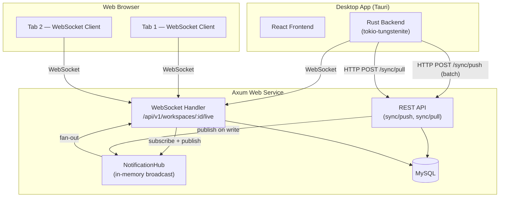

# Real-Time Notification & Sync Design (v2 — Unified WebSocket)

> Status: **Proposal v2**  
> Author: Architecture  
> Date: 2026-05-03

---

## 0. Design Philosophy Change (v2)

**v1 的问题**: 原方案为 Web 前端设计了 WebSocket，为桌面端设计了 SSE，是两套不同的协议。Web 前端直接通过 REST `PUT /documents` 保存，桌面端通过 `sync/push` 保存——保存路径也不统一。这导致服务端需要维护两套通知通道和两套保存语义。

**v2 核心思路**: **Web 浏览器是一个特殊的客户端**，与桌面端地位对等。统一使用同一套 WebSocket 协议。保存操作通过 WebSocket 消息完成（请求-响应模式），服务端在保存成功后立即广播给同一 workspace 的所有其他连接，实现最低延迟的实时同步。

**关键变化**:
1. **一个协议**: Web 和桌面都用 WebSocket，没有 SSE
2. **一个保存通道**: 文档保存走 WebSocket 消息（`document:save` → `ack` + broadcast），取代 Web 的 REST PUT
3. **一个客户端模型**: 每个 WebSocket 连接就是一个 "client session"，带有 `clientId`（浏览器 tab / 桌面设备）

---

## 1. Architecture Overview



### 统一 WebSocket 的优势

| | v1 (WS + SSE) | v2 (统一 WS) |
|--|---------------|-------------|
| 服务端通知通道 | 2 套（WS handler + SSE handler） | 1 套 |
| 客户端库 | 浏览器 WS API + Rust reqwest streaming | 统一 WS 协议 |
| 保存路径 | Web REST PUT + Desktop sync/push | Web WS save + Desktop sync/push (共享同一个 hub) |
| 自回显处理 | 需分别实现 | 统一 clientId 过滤 |
| 协议升级 | 分别演进 | 一处修改，全部受益 |

### 桌面端为什么也用 WebSocket？

- `tokio-tungstenite` 是 Rust 生态成熟的 WS 客户端，零额外复杂度
- 桌面端也能发送 `ping`、`focus` 等上行消息，为后续 presence 做准备
- 统一协议意味着一套测试、一套文档

### Desktop sync/push 为什么保留 REST？

桌面端的 sync/push 是**批量操作**（一次推送多个文件 + sync base），天然适合 HTTP 请求-响应模型。WebSocket 消息更适合单文档交互式保存。两条通道互补：

- **WebSocket**: 单文档实时保存（Web）、实时通知（Web + Desktop）、presence
- **REST sync/push**: 批量同步（Desktop），push 完成后通过 Hub 广播通知

---

## 2. Client Identity Model

每个 WebSocket 连接代表一个 **client session**:

```typescript
interface ClientSession {
  sessionId: string       // 服务端生成的 UUID，连接时分配
  userId: string          // 认证用户 ID
  username: string        // 显示名
  clientType: "web" | "desktop"
  deviceId?: string       // 桌面端的设备 ID（来自 cloud profile）
  workspaceId: string     // 当前 workspace
  connectedAt: number     // 连接时间戳
}
```

**Web 浏览器**: 每个 tab 是一个独立 session，`clientType = "web"`，无 `deviceId`。  
**桌面端**: 每个 vault binding 对应一个连接，`clientType = "desktop"`，携带 `deviceId`。

**自回显过滤**: 服务端在广播事件时附带 `sourceSessionId`。客户端收到事件后，如果 `sourceSessionId === 自己的 sessionId`，则忽略。这比 v1 的 contentHash 比较更可靠。

---

## 3. WebSocket Protocol

### 3.1 Connection Lifecycle

**Endpoint**: `GET /api/v1/workspaces/:workspace_id/live`

```
1. Client connects: ws(s)://host/api/v1/workspaces/:id/live?token=<bearer>&clientType=web
2. Server validates token, checks workspace role
3. Server assigns sessionId, subscribes to workspace broadcast channel
4. Server sends → { type: "connected", sessionId, workspaceClock }
5. Bidirectional JSON messages flow
6. Server ping frame every 30s; client must pong within 10s
7. On disconnect, server unsubscribes and broadcasts presence:offline (Phase 2)
```

**Auth**: `?token=` query param（理由同 v1：浏览器 WebSocket API 无法设置自定义 header）。桌面端也走同一参数，保持一致。

### 3.2 Message Envelope

所有消息共享一个信封结构：

```typescript
// Client → Server
interface ClientMessage {
  type: string
  ref?: string    // 客户端提供的请求 ID，服务端会在 ack 中回传
  [key: string]: any
}

// Server → Client
interface ServerMessage {
  type: string
  ref?: string          // 对应客户端请求的 ref
  sourceSessionId?: string  // 产生此事件的 session（用于自回显过滤）
  [key: string]: any
}
```

### 3.3 Client → Server Messages

```typescript
// ── 文档保存 ──
interface DocumentSave {
  type: "document:save"
  ref: string                 // 客户端生成的请求 ID
  relativePath: string
  content: string
  title?: string
  baseContentHash?: string    // 上次加载时的 hash，用于冲突检测
  baseContent?: string        // 上次加载时的内容，用于三方合并
}

// ── 文档删除 ──
interface DocumentDelete {
  type: "document:delete"
  ref: string
  relativePath: string
}

// ── 文档移入/移出回收站 ──
interface DocumentTrash {
  type: "document:trash"
  ref: string
  relativePath: string
  action: "trash" | "restore"
}

// ── 焦点变化（Phase 2 Presence） ──
interface FocusDocument {
  type: "focus"
  relativePath: string | null  // null = 离开文档
}

// ── 心跳 ──
interface ClientPing {
  type: "ping"
}
```

### 3.4 Server → Client Messages

```typescript
// ── 连接确认 ──
interface Connected {
  type: "connected"
  sessionId: string
  workspaceClock: number   // 当前 workspace 的最新 clock，客户端可用于判断是否需要全量拉取
}

// ── 请求响应 ──
interface Ack {
  type: "ack"
  ref: string              // 对应客户端请求的 ref
  ok: boolean
  error?: string
  document?: CloudDocument  // 保存成功时返回保存后的文档信息
}

// ── 文档变更（他人保存/sync push） ──
interface DocumentChanged {
  type: "document:changed"
  sourceSessionId: string    // 谁触发的（用于自回显过滤）
  workspaceId: string
  documentId: string
  relativePath: string
  contentHash: string
  updatedClock: number
  editedBy: string
  source: "web" | "desktop" | "api"
}

// ── 文档删除 ──
interface DocumentDeleted {
  type: "document:deleted"
  sourceSessionId: string
  workspaceId: string
  relativePath: string
  deletedClock: number
  deletedBy: string
}

// ── 回收站操作 ──
interface DocumentTrashed {
  type: "document:trashed"
  sourceSessionId: string
  workspaceId: string
  relativePath: string
  action: "trashed" | "restored"
}

// ── 冲突 ──
interface ConflictCreated {
  type: "conflict:created"
  workspaceId: string
  conflictId: string
  relativePath: string
  localDevice: string
}

interface ConflictResolved {
  type: "conflict:resolved"
  workspaceId: string
  conflictId: string
  relativePath: string
  resolution: string
}

// ── 需要全量同步（客户端落后太多） ──
interface SyncRequired {
  type: "sync:required"
  reason: "lagged" | "reconnect"
}

// ── Presence（Phase 2） ──
interface PresenceUpdate {
  type: "presence:update"
  workspaceId: string
  user: string
  status: "online" | "editing" | "offline"
  relativePath?: string
}
```

---

## 4. Save Flow Redesign

### 4.1 Web Save — Through WebSocket

**Before (v1)**: Web `Workspace.tsx` → `api.saveDocument()` → REST `PUT /api/v1/workspaces/:id/documents` → DB write → 另外通过 Hub 广播

**After (v2)**: Web `Workspace.tsx` → WebSocket `document:save` message → Server handler → DB write → `ack` 回发给发送者 + `document:changed` 广播给其他连接

```
Web Tab A                  Server                    Web Tab B
   │                         │                          │
   │── document:save ──────→ │                          │
   │   { ref:"s1",           │                          │
   │     relativePath,       │── save_document_version()│
   │     content,            │          ↓               │
   │     baseContentHash }   │      DB write            │
   │                         │          ↓               │
   │←── ack ─────────────────│ { ref:"s1", ok:true,     │
   │   { document: {...} }   │   document: {...} }      │
   │                         │                          │
   │                         │── document:changed ────→ │
   │                         │  { sourceSessionId:A }   │
   │                         │                          │
```

**好处**:
- 保存和通知在同一条连接上，延迟最低
- `ack` 消息携带保存结果（成功/冲突/错误），客户端逻辑清晰
- 自回显天然通过 `sourceSessionId` 过滤
- 无需额外的 REST endpoint

**三方合并**: 保存时如果 `baseContentHash` 与服务端当前 `contentHash` 不一致，服务端执行与现有 `save_document_version()` 相同的三方合并逻辑。合并成功则返回合并后内容，合并失败则创建 conflict 并在 `ack` 中通知。

### 4.2 Desktop Save — REST sync/push (unchanged) + Hub broadcast

桌面端保存流程不变：本地 Ctrl+S 写入磁盘，显式同步时调用 REST `POST /sync/push`。服务端 push handler 处理完毕后，向 Hub 发布 `document:changed` 事件，所有 WebSocket 连接（包括桌面端自己的 WS 连接）都会收到通知。

```
Desktop                     Server                    Web Tab
   │                          │                          │
   │── POST /sync/push ─────→│                           │
   │   { documents: [...] }  │── save + merge            │
   │                         │          ↓                │
   │←── 200 { accepted,     │                           │
   │     documents, ... }    │                           │
   │                         │── document:changed ─────→ │
   │                         │   (for each changed doc)  │
   │                         │                           │
   │←── document:changed ───│ (via WS, sourceSessionId  │
   │   (桌面端 WS 也收到,     │  与桌面端 WS session 不同, │
   │    但 source="desktop", │  所以不过滤；桌面端已有最新  │
   │    可选择性忽略)          │  内容，看到通知可忽略)      │
```

**桌面端收到自己 push 的 echo 怎么办？** Push 是 REST 请求，不是通过 WS 发送的，所以 Hub 广播的 `sourceSessionId` 不会匹配桌面端的 WS session。桌面端收到 `document:changed` 后，可以通过 `source: "desktop"` + `editedBy` 字段判断是自己的 push 回声，选择忽略。或者更简单：push handler 在发布事件时附带 `deviceId`，桌面端比对 `deviceId` 来过滤。

### 4.3 Web 是否还保留 REST Save？

**保留作为降级手段**。当 WebSocket 未连接或断线时，Web 前端 fallback 到 REST `PUT /api/v1/workspaces/:id/documents`。这确保离线→在线瞬间或网络抖动时用户不丢失保存。

```typescript
async function saveDocument(path: string, content: string, base: string) {
  if (ws.readyState === WebSocket.OPEN) {
    // 优先走 WebSocket
    return wsSave(path, content, base)
  }
  // 降级走 REST
  return api.saveDocument(workspaceId, { relativePath: path, content, baseContentHash: base })
}
```

---

## 5. Server-Side Implementation Plan

### 5.1 NotificationHub (Same as v1)

```rust
// src/hub.rs
use std::collections::HashMap;
use std::sync::Arc;
use tokio::sync::{broadcast, RwLock};
use serde::{Serialize, Deserialize};

#[derive(Debug, Clone, Serialize, Deserialize)]
#[serde(tag = "type", rename_all = "camelCase")]
pub enum WorkspaceEvent {
    #[serde(rename = "document:changed")]
    DocumentChanged {
        source_session_id: String,
        workspace_id: String,
        document_id: String,
        relative_path: String,
        content_hash: String,
        updated_clock: i64,
        edited_by: String,
        source: String, // "web" | "desktop" | "api"
        device_id: Option<String>,
    },
    #[serde(rename = "document:deleted")]
    DocumentDeleted {
        source_session_id: String,
        workspace_id: String,
        relative_path: String,
        deleted_clock: i64,
        deleted_by: String,
    },
    #[serde(rename = "document:trashed")]
    DocumentTrashed {
        source_session_id: String,
        workspace_id: String,
        relative_path: String,
        action: String,
    },
    #[serde(rename = "conflict:created")]
    ConflictCreated {
        workspace_id: String,
        conflict_id: String,
        relative_path: String,
        local_device: String,
    },
    #[serde(rename = "conflict:resolved")]
    ConflictResolved {
        workspace_id: String,
        conflict_id: String,
        relative_path: String,
        resolution: String,
    },
}

const CHANNEL_CAPACITY: usize = 256;

#[derive(Clone)]
pub struct NotificationHub {
    channels: Arc<RwLock<HashMap<String, broadcast::Sender<WorkspaceEvent>>>>,
}

impl NotificationHub {
    pub fn new() -> Self {
        Self {
            channels: Arc::new(RwLock::new(HashMap::new())),
        }
    }

    pub async fn publish(&self, workspace_id: &str, event: WorkspaceEvent) {
        let channels = self.channels.read().await;
        if let Some(tx) = channels.get(workspace_id) {
            let _ = tx.send(event);
        }
    }

    pub async fn subscribe(
        &self,
        workspace_id: &str,
    ) -> broadcast::Receiver<WorkspaceEvent> {
        {
            let channels = self.channels.read().await;
            if let Some(tx) = channels.get(workspace_id) {
                return tx.subscribe();
            }
        }
        let mut channels = self.channels.write().await;
        let tx = channels
            .entry(workspace_id.to_string())
            .or_insert_with(|| broadcast::channel(CHANNEL_CAPACITY).0);
        tx.subscribe()
    }

    pub async fn cleanup(&self) {
        let mut channels = self.channels.write().await;
        channels.retain(|_, tx| tx.receiver_count() > 0);
    }
}
```

### 5.2 AppState Changes

```rust
#[derive(Clone)]
pub struct AppState {
    pub pool: Pool<MySql>,
    pub public_base_url: String,
    pub hub: NotificationHub,  // NEW
}
```

### 5.3 Unified WebSocket Handler

与 v1 最大的区别：WebSocket handler 不仅转发 Hub 事件，还处理客户端的 **save/delete/trash 请求**，直接调用现有的 `save_document_version()` 等函数。

```rust
// src/handlers/live.rs
use axum::{
    extract::{Path, Query, State, WebSocketUpgrade, ws::{Message, WebSocket}},
    response::Response,
};
use futures::{SinkExt, StreamExt};
use serde::{Deserialize, Serialize};
use tokio::sync::broadcast;
use uuid::Uuid;

use crate::AppState;
use crate::hub::WorkspaceEvent;

#[derive(Deserialize)]
pub struct WsAuth {
    token: String,
    #[serde(rename = "clientType", default = "default_client_type")]
    client_type: String,
    #[serde(rename = "deviceId")]
    device_id: Option<String>,
}

fn default_client_type() -> String { "web".to_string() }

pub async fn ws_upgrade(
    State(state): State<AppState>,
    Path(workspace_id): Path<String>,
    Query(auth): Query<WsAuth>,
    ws: WebSocketUpgrade,
) -> Result<Response, crate::AppError> {
    let token_hash = crate::util::sha256_hex(&auth.token);
    let user = crate::handlers::auth::validate_session(&state.pool, &token_hash).await?;
    crate::handlers::workspace::require_workspace_role(
        &state.pool, &workspace_id, &user.id,
        &["owner", "admin", "editor", "viewer"],
    ).await?;

    let session_id = Uuid::new_v4().to_string();
    let role = crate::handlers::workspace::get_workspace_role(
        &state.pool, &workspace_id, &user.id,
    ).await?;

    Ok(ws.on_upgrade(move |socket| {
        handle_ws(socket, state, workspace_id, user, session_id,
                  auth.client_type, auth.device_id, role)
    }))
}

async fn handle_ws(
    socket: WebSocket,
    state: AppState,
    workspace_id: String,
    user: AuthUser,
    session_id: String,
    client_type: String,
    device_id: Option<String>,
    role: String,
) {
    let (mut sink, mut stream) = socket.split();
    let mut rx = state.hub.subscribe(&workspace_id).await;

    // Send connected message with current workspace clock
    let clock = get_workspace_clock(&state.pool, &workspace_id).await.unwrap_or(0);
    let connected_msg = serde_json::json!({
        "type": "connected",
        "sessionId": &session_id,
        "workspaceClock": clock,
    });
    let _ = sink.send(Message::Text(connected_msg.to_string().into())).await;

    let session_id_clone = session_id.clone();

    // Task 1: Hub events → WebSocket (broadcast to this client)
    let sink = Arc::new(Mutex::new(sink));
    let sink_clone = sink.clone();
    let ws_send = tokio::spawn(async move {
        loop {
            match rx.recv().await {
                Ok(ev) => {
                    let json = serde_json::to_string(&ev).unwrap_or_default();
                    let mut s = sink_clone.lock().await;
                    if s.send(Message::Text(json.into())).await.is_err() {
                        break;
                    }
                }
                Err(broadcast::error::RecvError::Lagged(_)) => {
                    let msg = r#"{"type":"sync:required","reason":"lagged"}"#;
                    let mut s = sink_clone.lock().await;
                    let _ = s.send(Message::Text(msg.into())).await;
                }
                Err(_) => break,
            }
        }
    });

    // Task 2: Read client messages and handle save/delete/trash
    let can_write = matches!(role.as_str(), "owner" | "admin" | "editor");
    while let Some(Ok(msg)) = stream.next().await {
        match msg {
            Message::Text(text) => {
                let parsed: serde_json::Value = match serde_json::from_str(&text) {
                    Ok(v) => v,
                    Err(_) => continue,
                };
                let msg_type = parsed["type"].as_str().unwrap_or("");
                let ref_id = parsed["ref"].as_str().unwrap_or("").to_string();

                match msg_type {
                    "document:save" if can_write => {
                        let result = handle_ws_save(
                            &state, &workspace_id, &user, &session_id,
                            &client_type, &device_id, &parsed,
                        ).await;
                        let ack = make_ack(&ref_id, result);
                        let mut s = sink.lock().await;
                        let _ = s.send(Message::Text(
                            serde_json::to_string(&ack).unwrap().into()
                        )).await;
                    }
                    "document:delete" if can_write => {
                        let result = handle_ws_delete(
                            &state, &workspace_id, &user, &session_id, &parsed,
                        ).await;
                        let ack = make_ack(&ref_id, result);
                        let mut s = sink.lock().await;
                        let _ = s.send(Message::Text(
                            serde_json::to_string(&ack).unwrap().into()
                        )).await;
                    }
                    "document:trash" if can_write => {
                        let result = handle_ws_trash(
                            &state, &workspace_id, &user, &session_id, &parsed,
                        ).await;
                        let ack = make_ack(&ref_id, result);
                        let mut s = sink.lock().await;
                        let _ = s.send(Message::Text(
                            serde_json::to_string(&ack).unwrap().into()
                        )).await;
                    }
                    "focus" => { /* Phase 2: presence tracking */ }
                    "ping" => {
                        let mut s = sink.lock().await;
                        let _ = s.send(Message::Text(
                            r#"{"type":"pong"}"#.into()
                        )).await;
                    }
                    _ if !can_write => {
                        let ack = serde_json::json!({
                            "type": "ack", "ref": ref_id,
                            "ok": false, "error": "read-only access"
                        });
                        let mut s = sink.lock().await;
                        let _ = s.send(Message::Text(
                            ack.to_string().into()
                        )).await;
                    }
                    _ => {} // Unknown types silently ignored
                }
            }
            Message::Close(_) => break,
            _ => {}
        }
    }

    ws_send.abort();
}
```

### 5.4 WebSocket Save Handler

WebSocket save handler 复用现有的 `save_document_version()` 函数，与 REST PUT handler 共享完全相同的合并逻辑：

```rust
async fn handle_ws_save(
    state: &AppState,
    workspace_id: &str,
    user: &AuthUser,
    session_id: &str,
    client_type: &str,
    device_id: &Option<String>,
    msg: &serde_json::Value,
) -> Result<serde_json::Value, String> {
    let relative_path = msg["relativePath"].as_str()
        .ok_or("missing relativePath")?;
    let content = msg["content"].as_str()
        .ok_or("missing content")?;
    let title = msg["title"].as_str().map(String::from);
    let base_content_hash = msg["baseContentHash"].as_str().map(String::from);
    let base_content = msg["baseContent"].as_str().map(String::from);

    // Reuse the exact same save_document_version() logic
    let outcome = save_document_version(
        &state.pool, workspace_id, relative_path,
        content, title.as_deref(),
        base_content_hash.as_deref(), base_content.as_deref(),
        &user.username, client_type,
    ).await.map_err(|e| e.to_string())?;

    match outcome {
        SaveDocumentOutcome::Saved(doc) => {
            // Publish to hub for broadcast
            state.hub.publish(workspace_id, WorkspaceEvent::DocumentChanged {
                source_session_id: session_id.to_string(),
                workspace_id: workspace_id.to_string(),
                document_id: doc.version_id.clone(),
                relative_path: doc.relative_path.clone(),
                content_hash: doc.content_hash.clone(),
                updated_clock: doc.updated_clock,
                edited_by: user.username.clone(),
                source: client_type.to_string(),
                device_id: device_id.clone(),
            }).await;

            Ok(serde_json::to_value(&doc).unwrap())
        }
        SaveDocumentOutcome::Conflict(conflict) => {
            state.hub.publish(workspace_id, WorkspaceEvent::ConflictCreated {
                workspace_id: workspace_id.to_string(),
                conflict_id: conflict.conflict_id.clone(),
                relative_path: relative_path.to_string(),
                local_device: session_id.to_string(),
            }).await;

            Err(format!("conflict:{}", conflict.conflict_id))
        }
    }
}
```

### 5.5 Route Registration

```rust
// In lib.rs build_router(), add:
.route(
    "/api/v1/workspaces/:workspace_id/live",
    get(handlers::live::ws_upgrade),
)
// REST save endpoint RETAINED as fallback (no change)
```

只有一个新 route。REST save endpoint 保留不变。

### 5.6 Publishing Events from REST Handlers

当桌面端通过 REST `sync/push` 修改数据时，push handler 发布事件到 Hub。与 v1 相同，只是事件结构增加了 `source_session_id`（REST 请求没有 session，使用 `"rest:<request_id>"` 或空字符串）:

```rust
// In handlers/sync.rs after successful push
state.hub.publish(&workspace_id, WorkspaceEvent::DocumentChanged {
    source_session_id: String::new(), // REST request, no WS session
    workspace_id: workspace_id.clone(),
    document_id: doc.version_id.clone(),
    relative_path: doc.relative_path.clone(),
    content_hash: doc.content_hash.clone(),
    updated_clock: doc.updated_clock,
    edited_by: user.username.clone(),
    source: "desktop".to_string(),
    device_id: Some(device_id.clone()),
}).await;
```

### 5.7 New Dependencies

```toml
# Add to services/jtype-web/Cargo.toml [dependencies]
axum = { version = "0.7", features = ["ws"] }
tokio-stream = "0.1"
async-stream = "0.3"
futures = "0.3"
```

No SSE-specific dependencies needed.

---

## 6. Web Frontend Implementation

### 6.1 `useWorkspaceSocket` Hook

```typescript
// services/jtype-web/frontend/src/hooks/useWorkspaceSocket.ts

import { useEffect, useRef, useCallback, useState } from 'react'
import { getToken } from '../api'

export type WorkspaceEvent =
  | { type: 'connected'; sessionId: string; workspaceClock: number }
  | { type: 'ack'; ref: string; ok: boolean; error?: string; document?: CloudDocument }
  | { type: 'document:changed'; sourceSessionId: string; relativePath: string; contentHash: string; updatedClock: number; editedBy: string; source: string }
  | { type: 'document:deleted'; sourceSessionId: string; relativePath: string; deletedClock: number; deletedBy: string }
  | { type: 'document:trashed'; sourceSessionId: string; relativePath: string; action: 'trashed' | 'restored' }
  | { type: 'conflict:created'; conflictId: string; relativePath: string }
  | { type: 'sync:required'; reason: string }
  | { type: 'pong' }

type ConnectionStatus = 'connecting' | 'connected' | 'disconnected' | 'error'

export function useWorkspaceSocket(workspaceId: string | undefined) {
  const [status, setStatus] = useState<ConnectionStatus>('disconnected')
  const [sessionId, setSessionId] = useState<string | null>(null)
  const wsRef = useRef<WebSocket | null>(null)
  const reconnectTimer = useRef<number | null>(null)
  const reconnectDelay = useRef(1000)
  const pendingRef = useRef<Map<string, { resolve: Function; reject: Function }>>(new Map())
  const listenersRef = useRef<Set<(event: WorkspaceEvent) => void>>(new Set())

  const connect = useCallback(() => {
    if (!workspaceId) return
    const token = getToken()
    if (!token) return

    const protocol = location.protocol === 'https:' ? 'wss:' : 'ws:'
    const url = `${protocol}//${location.host}/api/v1/workspaces/${workspaceId}/live?token=${token}&clientType=web`

    const ws = new WebSocket(url)
    wsRef.current = ws
    setStatus('connecting')

    ws.onopen = () => {
      setStatus('connected')
      reconnectDelay.current = 1000
    }

    ws.onmessage = (e) => {
      try {
        const event = JSON.parse(e.data) as WorkspaceEvent
        // Handle connected
        if (event.type === 'connected') {
          setSessionId(event.sessionId)
        }
        // Handle ack — resolve pending save/delete promise
        if (event.type === 'ack' && event.ref) {
          const pending = pendingRef.current.get(event.ref)
          if (pending) {
            pendingRef.current.delete(event.ref)
            if (event.ok) pending.resolve(event)
            else pending.reject(new Error(event.error || 'save failed'))
          }
        }
        // Notify all listeners (for non-ack events)
        listenersRef.current.forEach(fn => fn(event))
      } catch { /* ignore malformed */ }
    }

    ws.onclose = () => {
      setStatus('disconnected')
      wsRef.current = null
      setSessionId(null)
      // Reject all pending requests
      pendingRef.current.forEach(p => p.reject(new Error('connection lost')))
      pendingRef.current.clear()
      // Reconnect
      reconnectTimer.current = window.setTimeout(() => {
        reconnectDelay.current = Math.min(reconnectDelay.current * 2, 60000)
        connect()
      }, reconnectDelay.current)
    }

    ws.onerror = () => {
      setStatus('error')
      ws.close()
    }
  }, [workspaceId])

  useEffect(() => {
    connect()
    return () => {
      if (reconnectTimer.current) clearTimeout(reconnectTimer.current)
      wsRef.current?.close()
    }
  }, [connect])

  // Send a message and wait for ack
  const request = useCallback((msg: ClientMessage): Promise<WorkspaceEvent> => {
    return new Promise((resolve, reject) => {
      const ws = wsRef.current
      if (!ws || ws.readyState !== WebSocket.OPEN) {
        reject(new Error('not connected'))
        return
      }
      const ref = crypto.randomUUID()
      msg.ref = ref
      pendingRef.current.set(ref, { resolve, reject })
      ws.send(JSON.stringify(msg))
      // Timeout: 30s
      setTimeout(() => {
        if (pendingRef.current.has(ref)) {
          pendingRef.current.delete(ref)
          reject(new Error('timeout'))
        }
      }, 30000)
    })
  }, [])

  const subscribe = useCallback((fn: (event: WorkspaceEvent) => void) => {
    listenersRef.current.add(fn)
    return () => { listenersRef.current.delete(fn) }
  }, [])

  return { status, sessionId, request, subscribe }
}
```

### 6.2 `saveDocument` via WebSocket with REST Fallback

```typescript
// In Workspace.tsx or a dedicated hook
const { status, sessionId, request, subscribe } = useWorkspaceSocket(workspaceId)

async function saveDocument(relativePath: string, content: string, baseContentHash?: string) {
  if (status === 'connected') {
    // WebSocket save
    const ack = await request({
      type: 'document:save',
      relativePath,
      content,
      title: extractTitle(content),
      baseContentHash,
      baseContent: lastLoadedContent,
    })
    // ack.document contains the saved CloudDocument
    return ack.document
  }
  // REST fallback
  return api.saveDocument(workspaceId!, { relativePath, content, baseContentHash })
}
```

### 6.3 Handling Live Events

```typescript
useEffect(() => {
  return subscribe((event) => {
    // Skip self-echoes
    if ('sourceSessionId' in event && event.sourceSessionId === sessionId) return

    switch (event.type) {
      case 'document:changed':
        // Refresh document list
        api.listDocuments(workspaceId!).then(setDocuments)
        // Stale warning if editing the changed document
        if (event.relativePath === selectedDocPath && event.contentHash !== loadedContentHash) {
          setStaleWarning(true)
        }
        break
      case 'document:deleted':
        setDocuments(prev => prev.filter(d => d.relativePath !== event.relativePath))
        break
      case 'sync:required':
        api.listDocuments(workspaceId!).then(setDocuments)
        break
    }
  })
}, [sessionId, workspaceId, selectedDocPath, loadedContentHash])
```

### 6.4 Stale Document Warning

与 v1 相同：

```
┌──────────────────────────────────────────────────┐
│ ⚠ This document was modified by another session. │
│ [Reload] [Ignore]                                │
└──────────────────────────────────────────────────┘
```

有未保存修改时：

```
┌─────────────────────────────────────────────────────────┐
│ ⚠ This document was modified by another session.        │
│   You have unsaved changes.                             │
│ [Reload (discard mine)] [Save mine] [View diff]         │
└─────────────────────────────────────────────────────────┘
```

### 6.5 Polling Fallback

```typescript
useEffect(() => {
  if (status === 'connected') return
  const timer = setInterval(() => {
    api.listDocuments(workspaceId!).then(setDocuments)
  }, 10_000)
  return () => clearInterval(timer)
}, [status, workspaceId])
```

### 6.6 Connection Status Indicator

```
● Connected (green)  — WebSocket active
● Reconnecting (yellow) — attempting to reconnect
● Offline (red) — falling back to REST polling
```

---

## 7. Desktop App Integration

### 7.1 WebSocket Client in Tauri Rust Backend

桌面端使用 `tokio-tungstenite` 连接同一个 WebSocket endpoint，取代 v1 的 SSE。

```rust
// src-tauri/src/ws_client.rs
use tokio_tungstenite::{connect_async, tungstenite::Message};
use futures::{SinkExt, StreamExt};
use tauri::AppHandle;

pub async fn start_ws_listener(
    app: AppHandle,
    server_url: &str,
    token: &str,
    workspace_id: &str,
    device_id: &str,
) {
    let url = format!(
        "{}/api/v1/workspaces/{}/live?token={}&clientType=desktop&deviceId={}",
        server_url.replace("http", "ws"), workspace_id, token, device_id
    );

    loop {
        match connect_async(&url).await {
            Ok((ws_stream, _)) => {
                let (mut write, mut read) = ws_stream.split();

                // Keepalive ping every 25s
                let ping_task = tokio::spawn(async move {
                    let mut interval = tokio::time::interval(Duration::from_secs(25));
                    loop {
                        interval.tick().await;
                        if write.send(Message::Text(r#"{"type":"ping"}"#.into()))
                            .await.is_err() { break; }
                    }
                });

                while let Some(Ok(msg)) = read.next().await {
                    if let Message::Text(text) = msg {
                        if let Ok(event) = serde_json::from_str::<serde_json::Value>(&text) {
                            let event_type = event["type"].as_str().unwrap_or("");
                            match event_type {
                                "connected" => {
                                    // 连接成功，可以获取 workspaceClock 判断是否需要全量拉取
                                    app.emit("cloud:ws-connected", &event).ok();
                                }
                                "document:changed" | "document:deleted" | "document:trashed" => {
                                    // 通知前端触发 sync pull
                                    app.emit("cloud:remote-change", &event).ok();
                                }
                                "conflict:created" => {
                                    app.emit("cloud:conflict", &event).ok();
                                }
                                "sync:required" => {
                                    app.emit("cloud:sync-required", &event).ok();
                                }
                                _ => {}
                            }
                        }
                    }
                }
                ping_task.abort();
            }
            Err(_) => {}
        }

        // Reconnect with exponential backoff
        tokio::time::sleep(Duration::from_secs(5)).await;
    }
}
```

### 7.2 Desktop React Frontend Integration

```typescript
// src/hooks/useCloudEvents.ts
import { listen } from "@tauri-apps/api/event"

export function useCloudEvents(onRemoteChange: () => void) {
  useEffect(() => {
    const unlistens = [
      listen("cloud:remote-change", () => onRemoteChange()),
      listen("cloud:sync-required", () => onRemoteChange()),
    ]
    return () => { unlistens.forEach(u => u.then(fn => fn())) }
  }, [onRemoteChange])
}

// In vault mode, onRemoteChange triggers syncPull()
```

### 7.3 Interaction with Periodic Sync

```
WebSocket connected:     periodic sync every 5 min (safety net)
WebSocket disconnected:  periodic sync every 30 sec (fallback, current behavior)
```

`usePeriodicSync` 通过 Tauri event `cloud:ws-connected` / `cloud:ws-disconnected` 切换间隔。

---

## 8. Scaling Considerations

### 8.1 Phase 1: In-Memory Broadcast

与 v1 相同。`tokio::sync::broadcast` 完全够用：

| Metric | Capacity |
|--------|----------|
| Concurrent WebSocket connections | Thousands per Axum instance |
| Broadcast channels (workspaces) | Limited only by memory |
| Message throughput | 100k+ msgs/sec per channel |
| Latency | Sub-millisecond within process |

### 8.2 Phase 2: Redis Pub/Sub (When Needed)

当需要多实例部署时，将 Hub 替换为 Redis Pub/Sub。接口不变，所有 WebSocket handler 代码无需修改。

### 8.3 Channel Cleanup

```rust
tokio::spawn(async move {
    let mut interval = tokio::time::interval(Duration::from_secs(300));
    loop {
        interval.tick().await;
        hub.cleanup().await;
    }
});
```

---

## 9. Security

### 9.1 Authentication

- **Token in query param**: `?token=<bearer>` — Web 和 Desktop 统一方式
- 在 WebSocket upgrade 之前验证，握手完成前拒绝非法 token
- 生产环境全部走 WSS (TLS)
- 可选升级为 ticket-based auth（`POST /api/v1/ws-ticket` → 一次性 30s token）

### 9.2 Authorization

- Workspace role 在连接建立时检查
- `viewer` 角色只能接收事件，不能发送写操作（`document:save` 等返回 `"read-only access"` 错误）
- 角色被撤销时，服务端可主动关闭连接

### 9.3 Rate Limiting

- Client → Server 消息: 每连接每分钟 60 条
- `document:save` 消息: 额外限制最大 body 256 KB
- 每用户最多 10 个并发 WebSocket 连接

### 9.4 Input Validation

- 最大消息大小: 256 KB（保存消息含文档内容，需要比纯通知消息更大）
- 必须是合法 JSON
- 必须有 `type` 字段
- `relativePath` 必须通过路径遍历验证（禁止 `../`）
- 未知 `type` 静默忽略（前向兼容）

---

## 10. Fallback & Degradation

| Scenario | Behavior |
|----------|----------|
| WebSocket fails to connect (Web) | Fallback 到 REST save + polling 每 10s |
| WebSocket disconnects mid-session (Web) | 自动重连 (1s→2s→4s→max 60s)，pending saves reject，用户可 REST retry |
| WebSocket fails to connect (Desktop) | 继续用 periodic sync (30s interval) |
| Client fell behind (Lagged) | Server 发送 `sync:required`，客户端做全量 pull |
| Server restarts | 所有连接断开，客户端重连后 pull catch up |
| Token expired | Server 关闭连接 code 4001，客户端重新认证 |
| Save via WS times out (30s) | 客户端自动 fallback 到 REST save |

---

## 11. Phased Implementation Plan

### Phase 1: Unified WebSocket + Web Save (Priority: High)

**Goal**: 统一 WebSocket 协议，Web 前端通过 WS 保存并接收实时更新。

| Step | Task | Effort |
|------|------|--------|
| 1.1 | Create `NotificationHub` (`src/hub.rs`) | S |
| 1.2 | Add `hub` to `AppState`, start cleanup task | S |
| 1.3 | Implement unified WebSocket handler with save/delete/trash support | L |
| 1.4 | Publish events from REST `sync/push` handler to Hub | M |
| 1.5 | Create `useWorkspaceSocket` React hook with request/subscribe | M |
| 1.6 | Refactor `Workspace.tsx` save to use WS with REST fallback | M |
| 1.7 | Integrate live event handling (document list refresh, stale warning) | M |
| 1.8 | Add connection status indicator + polling fallback | S |
| 1.9 | Add `futures`, `tokio-stream`, `async-stream` deps | S |

**Definition of done**: 两个浏览器 tab 打开同一 workspace。Tab A 保存 → Tab B 2 秒内看到更新。WS 断线时自动 fallback 到 REST 保存。

### Phase 2: Desktop WebSocket Client (Priority: High)

**Goal**: 桌面端通过 WebSocket 接收实时变更通知。

| Step | Task | Effort |
|------|------|--------|
| 2.1 | Add `tokio-tungstenite` to `src-tauri/Cargo.toml` | S |
| 2.2 | Implement WS client in Tauri Rust backend (`ws_client.rs`) | M |
| 2.3 | Emit Tauri events from WS listener → Desktop React frontend | S |
| 2.4 | Desktop React: listen for events, trigger `syncPull()` | S |
| 2.5 | Adjust `usePeriodicSync` interval based on WS connection state | S |

**Definition of done**: Web 浏览器保存 → 桌面端 2 秒内触发 pull 并更新本地文件（WS 连接时）。

### Phase 3: Conflict Notifications (Priority: Medium)

| Step | Task | Effort |
|------|------|--------|
| 3.1 | Publish `conflict:created` from WS save handler and REST push | S |
| 3.2 | Web: show conflict banner | M |
| 3.3 | Desktop: system notification for new conflicts | S |

### Phase 4: Presence & Awareness (Priority: Low)

| Step | Task | Effort |
|------|------|--------|
| 4.1 | Track connected sessions per workspace in Hub | M |
| 4.2 | Handle `focus` messages, broadcast `presence:update` | S |
| 4.3 | Web: avatar indicators on documents | M |
| 4.4 | Desktop: presence in sidebar (optional) | M |

### Phase 5: Redis Pub/Sub (Priority: Low, If Needed)

| Step | Task | Effort |
|------|------|--------|
| 5.1 | Add `redis` crate | S |
| 5.2 | `RedisNotificationHub` with same interface | L |
| 5.3 | Config flag for in-memory vs Redis | S |

---

## Appendix A: Updated Cargo.toml Dependencies

**Server** (`services/jtype-web/Cargo.toml`):
```toml
axum = { version = "0.7", features = ["ws"] }
tokio-stream = "0.1"
async-stream = "0.3"
futures = "0.3"
```

**Desktop** (`src-tauri/Cargo.toml`):
```toml
tokio-tungstenite = { version = "0.24", features = ["native-tls"] }
```

## Appendix B: Route Summary

```
GET  /api/v1/workspaces/:workspace_id/live   → WebSocket upgrade (Web + Desktop)
PUT  /api/v1/workspaces/:id/documents         → REST save (fallback, unchanged)
POST /api/v1/workspaces/:id/sync/push         → REST batch sync (Desktop, unchanged)
POST /api/v1/workspaces/:id/sync/pull         → REST batch sync (Desktop, unchanged)
```

Only ONE new route. All existing REST routes remain as-is.

## Appendix C: File Changes Summary

| File | Change |
|------|--------|
| `services/jtype-web/Cargo.toml` | Add `futures`, `tokio-stream`, `async-stream`; enable `axum/ws` |
| `services/jtype-web/src/lib.rs` | Add `hub` module, extend `AppState`, add WS route |
| `services/jtype-web/src/hub.rs` | **New** — `NotificationHub` |
| `services/jtype-web/src/handlers/mod.rs` | Add `pub mod live;` |
| `services/jtype-web/src/handlers/live.rs` | **New** — Unified WebSocket handler (notifications + save/delete/trash) |
| `services/jtype-web/src/handlers/sync.rs` | Publish events to Hub after push |
| `services/jtype-web/frontend/src/hooks/useWorkspaceSocket.ts` | **New** — WebSocket hook with request/subscribe |
| `services/jtype-web/frontend/src/pages/Workspace.tsx` | Refactor save to use WS; integrate live events |
| `src-tauri/Cargo.toml` | Add `tokio-tungstenite` |
| `src-tauri/src/ws_client.rs` | **New** — WebSocket client for desktop |
| `src-tauri/src/lib.rs` | Start WS listener when vault binding is active |
| `src/hooks/usePeriodicSync.ts` | Adjust interval based on WS connection state |

## Appendix D: v1 vs v2 Comparison

| Aspect | v1 | v2 |
|--------|----|----|
| Web notification channel | WebSocket | WebSocket (same) |
| Desktop notification channel | SSE | **WebSocket** |
| Web save | REST PUT | **WebSocket `document:save`** (REST fallback) |
| Desktop save | REST sync/push | REST sync/push (same) |
| Server handler files | `live.rs` + `events.rs` | **`live.rs` only** |
| Protocol specs | 2 (WS + SSE) | **1 (WS)** |
| Self-echo filtering | contentHash comparison | **sessionId comparison** |
| New routes | 2 (`/live` + `/events`) | **1 (`/live`)** |
| Desktop Rust dependency | `reqwest` streaming | **`tokio-tungstenite`** |
