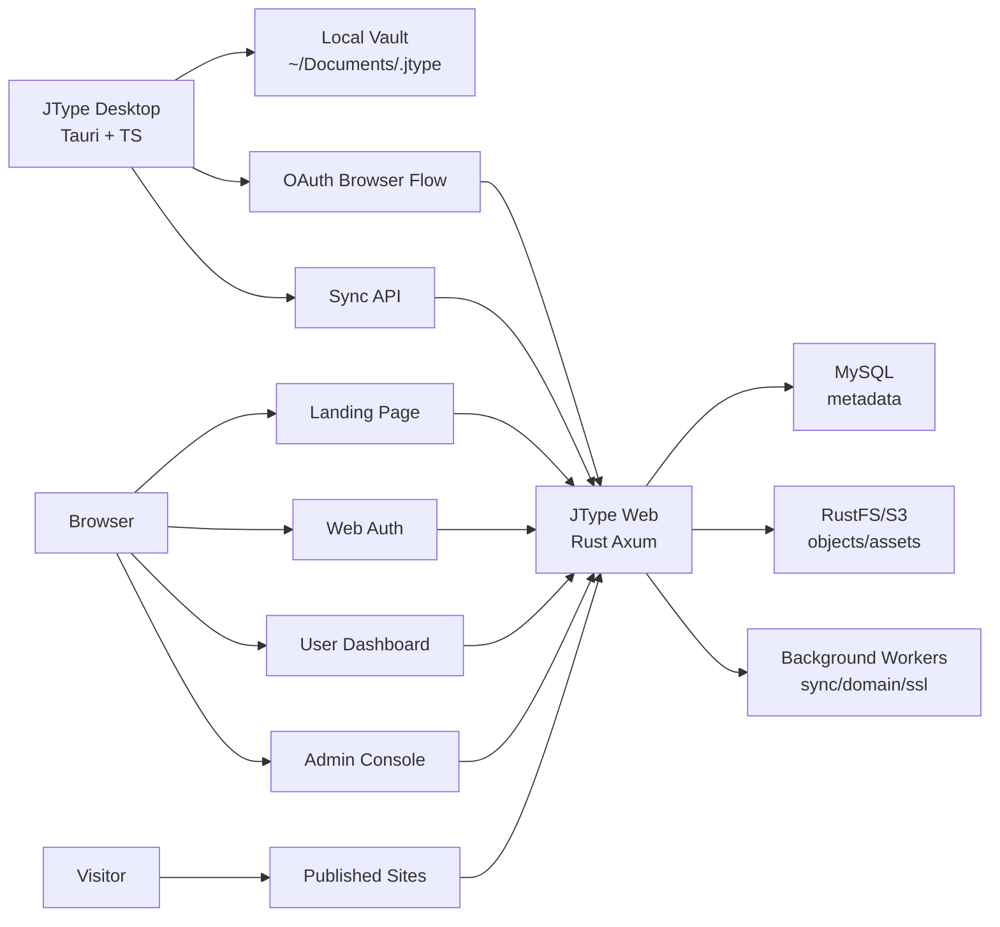
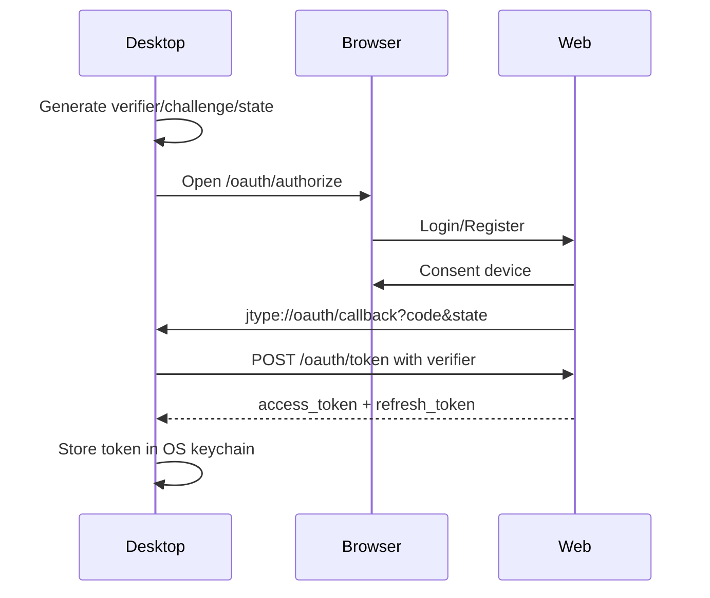
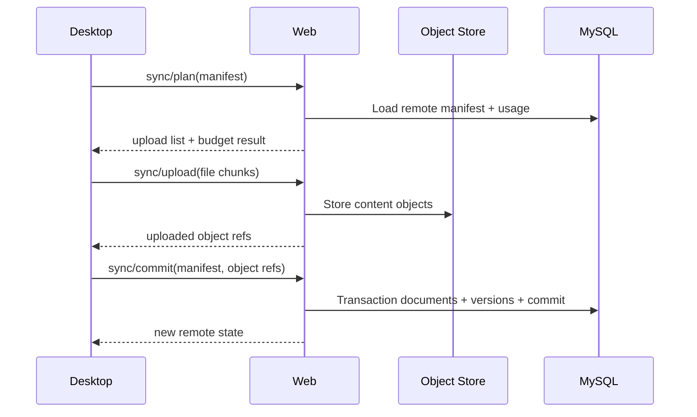
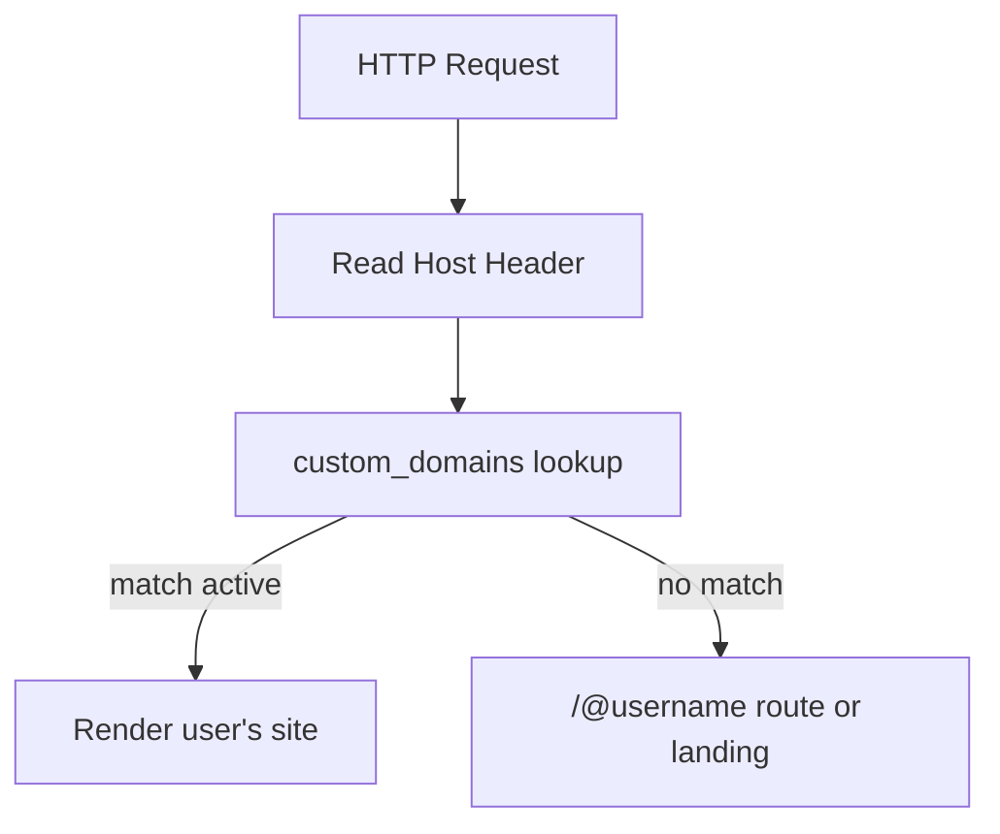
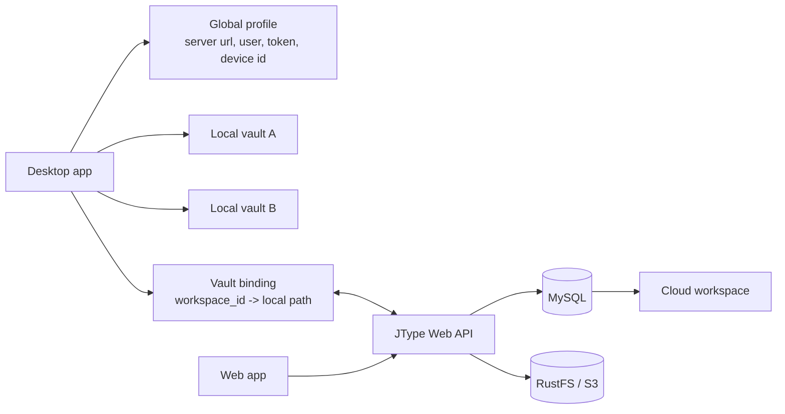
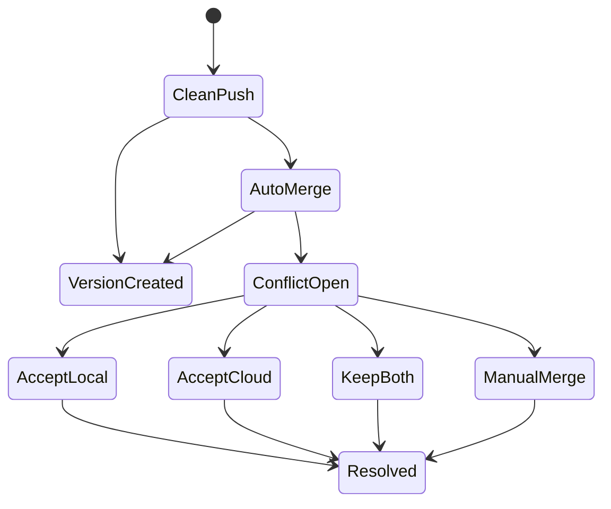

# JType Vault + Cloud Architecture Design

日期：2026-05-02

## 1. 架构目标

本设计将 JType 重构为：

- Desktop：Tauri 本地 vault 编辑器 + OAuth device client + sync client。
- Web：Rust/Axum 云端服务 + landing + auth + dashboard + admin + published sites。
- Storage：MySQL 存元数据，RustFS/S3 存对象和附件，local filesystem 存 vault。

不考虑旧 workspace 兼容性。旧概念统一迁移为 vault。

## 2. 总体架构



## 3. Desktop Architecture

### 3.1 Modules

```text
src/
  app/
    bootstrap.ts
    mode.ts
    command-registry.ts
  vault/
    vault-setup.ts
    vault-store.ts
    vault-index.ts
    vault-settings.ts
  editor/
    markdown-editor.ts
    shortcuts.ts
    preview.ts
  sync/
    sync-client.ts
    manifest.ts
    conflict.ts
    oauth-client.ts
  version/
    local-snapshot.ts
  tauri/
    fs-api.ts
    opener.ts
    protocol.ts
```

Rust side:

```text
src-tauri/src/
  vault.rs
  files.rs
  oauth.rs
  sync.rs
  keychain.rs
  protocol.rs
```

### 3.2 Desktop Modes

```ts
type DesktopMode =
  | "first-run"
  | "vault-local"
  | "vault-cloud"
  | "single-file";
```

Rules:

- `first-run`: no vault configured.
- `vault-local`: vault exists, no cloud token.
- `vault-cloud`: vault exists, token valid or refreshable.
- `single-file`: external Markdown file opened directly; no sync/publish.

### 3.3 Vault Path Resolution

Default:

```text
%USERPROFILE%\Documents\.jtype
~/Documents/.jtype
```

Desktop stores selected vault path in app config:

```json
{
  "vaultPath": "C:\\Users\\Jack\\Documents\\.jtype",
  "serverUrl": "http://localhost:13345",
  "deviceId": "device_...",
  "lastVaultId": "vault_..."
}
```

Suggested config location:

- Tauri app config dir, not inside vault.

Vault internal files:

```text
<vault>/
  notes/
  published/
  assets/
  .jtype-meta/
    vault.json
    index.sqlite
    sync-manifest.json
    versions/
```

### 3.4 Local Vault Metadata

`vault.json`:

```json
{
  "id": "vault_01h...",
  "name": "Jack's Vault",
  "createdAt": "2026-05-02T00:00:00Z",
  "serverUrl": "http://localhost:13345",
  "remoteVaultId": null,
  "version": 1
}
```

Local index:

- Use SQLite for file summaries, frontmatter, backlinks, headings, checksums.
- Rebuildable from files.
- Not uploaded as source of truth.

### 3.5 OAuth Desktop Flow

Use Authorization Code + PKCE.



Fallback if custom protocol is unavailable:

- Desktop starts loopback callback server on `127.0.0.1:{random}`.
- `redirect_uri=http://127.0.0.1:{random}/oauth/callback`.

### 3.6 Token Storage

Desktop must not store password.

Store:

- access token: memory + short disk cache optional.
- refresh token: OS keychain / secure store.
- device id: config file.

## 4. Web Architecture

### 4.1 Rust Service Modules

```text
services/jtype-web/src/
  main.rs
  app.rs
  auth/
    password.rs
    session.rs
    oauth.rs
    roles.rs
  landing/
    routes.rs
  dashboard/
    routes.rs
  admin/
    routes.rs
  vaults/
    sync.rs
    versions.rs
    manifest.rs
  publishing/
    renderer.rs
    routes.rs
    themes.rs
  domains/
    verification.rs
    certificates.rs
    routing.rs
  storage/
    mysql.rs
    object_store.rs
    budget.rs
  workers/
    usage.rs
    ssl_checks.rs
```

### 4.2 Routes

Public:

```text
GET  /
GET  /pricing-or-self-hosting
GET  /docs
GET  /@{username}
GET  /@{username}/{path...}
GET  /_health
```

Auth:

```text
GET  /login
POST /login
GET  /register
POST /register
POST /logout
GET  /oauth/authorize
POST /oauth/token
POST /oauth/revoke
```

User:

```text
GET  /dashboard
GET  /settings
POST /settings/site
POST /settings/domain
POST /settings/domain/{id}/verify
POST /settings/domain/{id}/certificate
GET  /documents
GET  /documents/{id}
GET  /documents/{id}/versions
POST /documents/{id}/restore
```

Admin:

```text
GET  /admin
GET  /admin/users
GET  /admin/users/{id}
POST /admin/users/{id}/budget
POST /admin/users/{id}/disable
POST /admin/users/{id}/enable
GET  /admin/domains
GET  /admin/storage
```

Sync API:

```text
POST /api/v1/vaults
GET  /api/v1/vaults/{id}
POST /api/v1/vaults/{id}/sync/plan
POST /api/v1/vaults/{id}/sync/upload
POST /api/v1/vaults/{id}/sync/commit
GET  /api/v1/vaults/{id}/sync/status
```

## 5. Database Design

### 5.1 Core Tables

```sql
users(
  id char(36) primary key,
  username varchar(64) not null unique,
  email varchar(255) null,
  password_hash varchar(255) not null,
  role enum('admin','user') not null,
  status enum('active','disabled') not null,
  storage_budget_bytes bigint not null,
  created_at datetime not null,
  updated_at datetime not null
)
```

```sql
sessions(
  id char(36) primary key,
  user_id char(36) not null,
  session_hash varchar(255) not null,
  expires_at datetime not null,
  created_at datetime not null
)
```

```sql
oauth_clients(
  id varchar(64) primary key,
  name varchar(128) not null,
  redirect_uri_prefix varchar(255) not null,
  trusted boolean not null
)
```

```sql
oauth_authorization_codes(
  code_hash varchar(255) primary key,
  client_id varchar(64) not null,
  user_id char(36) not null,
  redirect_uri varchar(512) not null,
  code_challenge varchar(255) not null,
  state varchar(255) null,
  expires_at datetime not null,
  used_at datetime null
)
```

```sql
device_tokens(
  id char(36) primary key,
  user_id char(36) not null,
  device_name varchar(255) not null,
  refresh_token_hash varchar(255) not null,
  revoked_at datetime null,
  created_at datetime not null,
  last_used_at datetime null
)
```

### 5.2 Vault Tables

```sql
vaults(
  id char(36) primary key,
  user_id char(36) not null,
  name varchar(255) not null,
  client_vault_id varchar(128) not null,
  created_at datetime not null,
  updated_at datetime not null,
  unique(user_id, client_vault_id)
)
```

```sql
documents(
  id char(36) primary key,
  vault_id char(36) not null,
  relative_path varchar(512) not null,
  title varchar(255) not null,
  status enum('draft','published','archived') not null,
  content_hash char(64) not null,
  current_version_id char(36) null,
  deleted_at datetime null,
  updated_at datetime not null,
  unique(vault_id, relative_path)
)
```

```sql
document_versions(
  id char(36) primary key,
  document_id char(36) not null,
  vault_id char(36) not null,
  version_number bigint not null,
  content_hash char(64) not null,
  object_key varchar(512) not null,
  size_bytes bigint not null,
  created_by_device_id char(36) null,
  created_at datetime not null
)
```

```sql
vault_sync_commits(
  id char(36) primary key,
  vault_id char(36) not null,
  device_token_id char(36) not null,
  manifest_hash char(64) not null,
  uploaded_bytes bigint not null,
  created_at datetime not null
)
```

### 5.3 Budget Tables

```sql
storage_usage(
  user_id char(36) primary key,
  document_bytes bigint not null,
  asset_bytes bigint not null,
  version_bytes bigint not null,
  publish_bytes bigint not null,
  calculated_at datetime not null
)
```

### 5.4 Site Tables

```sql
site_settings(
  user_id char(36) primary key,
  title varchar(255) not null,
  description text null,
  theme varchar(64) not null,
  favicon_object_key varchar(512) null,
  updated_at datetime not null
)
```

```sql
custom_domains(
  id char(36) primary key,
  user_id char(36) not null,
  domain varchar(255) not null unique,
  verification_token varchar(255) not null,
  verified_at datetime null,
  status enum('pending','verified','active','error') not null,
  created_at datetime not null,
  updated_at datetime not null
)
```

```sql
tls_certificates(
  id char(36) primary key,
  domain_id char(36) not null,
  certificate_chain_object_key varchar(512) not null,
  encrypted_private_key_object_key varchar(512) not null,
  not_before datetime not null,
  not_after datetime not null,
  fingerprint_sha256 char(64) not null,
  status enum('valid','expiring','invalid') not null,
  created_at datetime not null
)
```

## 6. Storage Design

### 6.1 Object Store Layout

```text
users/{user_id}/vaults/{vault_id}/documents/{doc_id}/versions/{version_id}.md
users/{user_id}/vaults/{vault_id}/assets/{asset_hash}
users/{user_id}/sites/{site_id}/favicon/{object_id}
users/{user_id}/domains/{domain_id}/certs/{certificate_id}.pem
users/{user_id}/domains/{domain_id}/keys/{certificate_id}.key.enc
```

### 6.2 Budget Enforcement

Before upload:

1. Desktop sends sync plan.
2. Server computes projected usage.
3. If projected usage exceeds budget, server returns:

```json
{
  "error": "budget_exceeded",
  "usedBytes": 900000000,
  "budgetBytes": 1000000000,
  "requiredBytes": 150000000
}
```

During upload:

- Server checks object size and content hash.
- Server rejects oversized request.

After commit:

- Usage worker recalculates actual usage.

## 7. Sync Protocol

### 7.1 Manifest

Desktop builds manifest:

```json
{
  "vaultId": "vault_...",
  "clientCommitId": "commit_...",
  "files": [
    {
      "path": "notes/hello.md",
      "kind": "markdown",
      "size": 1024,
      "mtime": "2026-05-02T10:00:00Z",
      "sha256": "...",
      "status": "published"
    }
  ]
}
```

### 7.2 Sync Steps



### 7.3 Conflict Rules

MVP:

- If remote document changed since last known remote version and local changed too, create conflict.
- Desktop receives conflict response.
- Desktop writes conflict file:

```text
notes/hello.conflict-20260502.md
```

Later:

- Add merge UI.

## 8. Domain + SSL Architecture

### 8.1 Domain Routing

Request host resolution:



### 8.2 SSL Options

MVP:

- User uploads certificate chain and private key.
- Web stores private key encrypted.
- Deployment assumes reverse proxy or service TLS layer can load certs.

Recommended self-host setup:

- JType Web behind Caddy/Nginx/Traefik for TLS termination.
- JType still stores certificate metadata for product visibility.

Future:

- ACME DNS-01 / HTTP-01 automation.
- Certificate renewal worker.

### 8.3 Certificate Validation

On upload:

- Parse PEM.
- Verify private key matches certificate.
- Verify domain SAN/CN contains custom domain.
- Read not_before / not_after.
- Compute fingerprint.
- Encrypt private key before object storage.

## 9. Landing + App Shell

Web frontend can start as server-rendered HTML from Rust templates.

Required page groups:

- Marketing landing.
- Auth pages.
- Dashboard pages.
- Admin pages.
- Published docs pages.

Header behavior:

- Anonymous: Login, Register.
- User: Dashboard, Settings.
- Admin: Dashboard, Settings, Admin.

## 10. Security

### 10.1 Auth

- Password login only on Web.
- Desktop OAuth uses PKCE.
- Refresh tokens hashed server-side.
- Tokens revocable per device.

### 10.2 Admin Bootstrap

Rule:

- If `users` table is empty, first registered user becomes admin.
- Otherwise default role is user.
- Bootstrap event is written to audit log.

### 10.3 Certificate Private Keys

- Store private keys encrypted at rest.
- Never return private key from API after upload.
- Admin can delete cert but cannot view key.

### 10.4 Markdown Security

- Published HTML sanitized.
- Raw HTML disabled by default for public pages.
- Assets served with safe content type.

## 11. Implementation Phases

### Phase A: Product reset

- Remove workspace wording from primary UI.
- Add vault setup.
- Default vault path.
- Remove desktop login/register.
- Add server URL setting.

### Phase B: Web auth and OAuth

- Landing page.
- Login/register.
- First user admin.
- OAuth authorize/token.
- Desktop callback.

### Phase C: Vault sync

- Manifest protocol.
- Remote vault tables.
- Document versions.
- Budget enforcement.

### Phase D: Web dashboard/admin

- Dashboard.
- Personal settings.
- Admin user management.
- Budget UI.

### Phase E: Publishing settings

- Site title/theme.
- Online docs.
- Custom domain.
- Certificate upload and validation.

## 12. Migration Policy

Because JType has not released:

- Remove old workspace open flow.
- Rename code-level workspace concepts to vault where practical.
- Reset local metadata schema if needed.
- Drop old MySQL tables and rebuild migrations if simpler.
- Keep single-file editor mode only as standalone external-file mode.

## 13. Cloud Workspace + Bidirectional Sync Architecture

This section updates the architecture to match the corrected product model:

- Local `vault`: local folder and local metadata.
- Cloud `workspace`: server-side isolation, membership, publishing, budget, and version history.
- Local `vault binding`: device-local mapping between a workspace and a local vault path.
- Global desktop profile: user/server/token/device state shared by all local vaults.

### 13.1 System Model



### 13.2 Desktop Local State

Desktop state is split into global identity and per-workspace bindings.

Global profile, stored in app config/keychain:

```json
{
  "serverUrl": "http://localhost:13345",
  "userId": "usr_...",
  "username": "jack",
  "deviceId": "dev_...",
  "tokenRef": "os-keychain-ref"
}
```

Workspace binding, stored locally outside the Markdown content:

```json
{
  "workspaceId": "wks_...",
  "workspaceSlug": "research",
  "localVaultPath": "C:/Users/Jack/Documents/.jtype/research",
  "lastPulledClock": "00000000000042",
  "lastPushedChangeId": "chg_...",
  "status": "active"
}
```

Rules:

- `.jtype/` inside a vault may cache local indexes and rebuildable metadata.
- Tokens must not be stored inside the vault folder.
- Deleting or resetting global profile must not delete vault files.
- A workspace switch is allowed only when the target workspace has a local binding.
- Single-file mode bypasses global profile, bindings, and sync.

### 13.3 Cloud API Routes

Human web routes:

| Route | Purpose |
| --- | --- |
| `GET /` | Landing page |
| `GET /login` | Login |
| `GET /register` | Registration |
| `GET /oauth/authorize` | Desktop OAuth authorize page |
| `GET /dashboard` | User workspace dashboard |
| `GET /workspaces/:workspace_id` | Workspace document dashboard/editor |
| `GET /workspaces/:workspace_id/settings` | Workspace settings |
| `GET /workspaces/:workspace_id/members` | Members and invites |
| `GET /settings` | Personal settings |
| `GET /admin` | Server admin console |

API routes:

| Method | Route | Purpose |
| --- | --- | --- |
| `GET` | `/api/v1/workspaces` | List workspaces visible to current user |
| `POST` | `/api/v1/workspaces` | Create workspace |
| `GET` | `/api/v1/workspaces/:id` | Workspace metadata |
| `PATCH` | `/api/v1/workspaces/:id` | Update title, budget, publish defaults |
| `POST` | `/api/v1/workspaces/:id/invites` | Create invite |
| `POST` | `/api/v1/workspace-invites/:token/accept` | Accept invite |
| `GET` | `/api/v1/workspaces/:id/documents` | List cloud documents |
| `PUT` | `/api/v1/workspaces/:id/documents/:path` | Save cloud editor document |
| `POST` | `/api/v1/workspaces/:id/sync/pull` | Pull workspace changes since cursor |
| `POST` | `/api/v1/workspaces/:id/sync/push` | Push local changes with base versions |
| `POST` | `/api/v1/workspaces/:id/conflicts/:conflict_id/resolve` | Accept local/cloud/keep both/manual |

### 13.4 Database Model

Workspace and membership tables:

```sql
CREATE TABLE workspaces (
  id CHAR(26) PRIMARY KEY,
  owner_user_id CHAR(26) NOT NULL,
  name VARCHAR(160) NOT NULL,
  slug VARCHAR(180) NOT NULL,
  storage_budget_bytes BIGINT NOT NULL,
  created_at DATETIME NOT NULL,
  updated_at DATETIME NOT NULL
);

CREATE TABLE workspace_members (
  workspace_id CHAR(26) NOT NULL,
  user_id CHAR(26) NOT NULL,
  role ENUM('owner','admin','editor','viewer') NOT NULL,
  status ENUM('active','invited','removed') NOT NULL,
  joined_at DATETIME NULL,
  PRIMARY KEY (workspace_id, user_id)
);

CREATE TABLE workspace_invites (
  id CHAR(26) PRIMARY KEY,
  workspace_id CHAR(26) NOT NULL,
  invited_by_user_id CHAR(26) NOT NULL,
  email VARCHAR(255) NULL,
  role ENUM('admin','editor','viewer') NOT NULL,
  token_hash VARBINARY(64) NOT NULL,
  expires_at DATETIME NOT NULL,
  accepted_at DATETIME NULL,
  revoked_at DATETIME NULL
);
```

Document/version tables should use `workspace_id`, not `vault_id`:

```sql
CREATE TABLE workspace_documents (
  id CHAR(26) PRIMARY KEY,
  workspace_id CHAR(26) NOT NULL,
  path VARCHAR(1024) NOT NULL,
  title VARCHAR(255) NULL,
  deleted_at DATETIME NULL,
  current_version_id CHAR(26) NULL,
  UNIQUE KEY uq_workspace_path (workspace_id, path)
);

CREATE TABLE document_versions (
  id CHAR(26) PRIMARY KEY,
  workspace_id CHAR(26) NOT NULL,
  document_id CHAR(26) NOT NULL,
  parent_version_id CHAR(26) NULL,
  base_version_id CHAR(26) NULL,
  author_user_id CHAR(26) NOT NULL,
  author_device_id CHAR(64) NULL,
  source ENUM('desktop','web','system') NOT NULL,
  content_sha256 CHAR(64) NOT NULL,
  object_key VARCHAR(1200) NOT NULL,
  created_at DATETIME NOT NULL
);

CREATE TABLE sync_conflicts (
  id CHAR(26) PRIMARY KEY,
  workspace_id CHAR(26) NOT NULL,
  document_id CHAR(26) NOT NULL,
  base_version_id CHAR(26) NULL,
  local_version_id CHAR(26) NOT NULL,
  cloud_version_id CHAR(26) NOT NULL,
  status ENUM('open','resolved') NOT NULL,
  resolution ENUM('accept_local','accept_cloud','keep_both','manual_merge') NULL,
  created_at DATETIME NOT NULL,
  resolved_at DATETIME NULL
);
```

Devices and cursors:

```sql
CREATE TABLE devices (
  id CHAR(64) PRIMARY KEY,
  user_id CHAR(26) NOT NULL,
  name VARCHAR(160) NULL,
  created_at DATETIME NOT NULL,
  last_seen_at DATETIME NULL
);

CREATE TABLE workspace_sync_cursors (
  workspace_id CHAR(26) NOT NULL,
  device_id CHAR(64) NOT NULL,
  last_seen_clock BIGINT NOT NULL DEFAULT 0,
  updated_at DATETIME NOT NULL,
  PRIMARY KEY (workspace_id, device_id)
);
```

### 13.5 Object Storage Layout

Use workspace-scoped prefixes:

```text
workspaces/{workspace_id}/documents/{document_id}/versions/{version_id}.md
workspaces/{workspace_id}/assets/{asset_id}/{filename}
workspaces/{workspace_id}/publish/{build_id}/...
```

Benefits:

- Budget calculation is workspace-scoped.
- Workspace deletion/export can operate on one prefix.
- Published site generation can read only workspace-owned data.

### 13.6 Bidirectional Sync Protocol

Pull flow:

1. Desktop sends `workspace_id`, `device_id`, and `last_seen_clock`.
2. Server verifies membership.
3. Server returns ordered changes after that clock.
4. Desktop applies creates/updates/renames/deletes to local vault.
5. Desktop updates local binding cursor only after successful local apply.

Push flow:

1. Desktop detects local file changes and records local base version.
2. Desktop sends changed path, local content hash, local content, and `base_version_id`.
3. Server verifies membership and workspace budget.
4. If server current version equals base, server creates a new version.
5. If server current version differs from base, server attempts three-way merge.
6. Clean merge creates a merged version with both parents.
7. Failed merge creates `sync_conflicts` and returns conflict details.

Conflict resolution:



Resolution behavior:

- `accept_local`: cloud current document becomes the local version.
- `accept_cloud`: desktop overwrites local file with cloud version on next pull.
- `keep_both`: server creates a sibling copy with a conflict suffix.
- `manual_merge`: user edits merged content and saves a new version.

### 13.7 Cloud Editor Versioning

The web editor writes through the same version model:

- Load document by workspace membership.
- Save creates `document_versions.source = 'web'`.
- Save includes current `base_version_id`.
- If another edit landed meanwhile, web uses the same merge/conflict path as desktop.
- Web editor does not need real-time multiplayer for MVP.

### 13.8 Implementation Update

Recommended implementation order:

1. Rename server-side remote vault tables/routes to workspace-based tables/routes.
2. Add workspace membership and invites.
3. Split desktop state into global profile and local vault bindings.
4. Add workspace list and binding flow to desktop.
5. Add bidirectional pull/push with base versions.
6. Add web editor saves as workspace versions.
7. Add auto-merge and conflict records.
8. Add conflict resolution UI on desktop first, then web.
