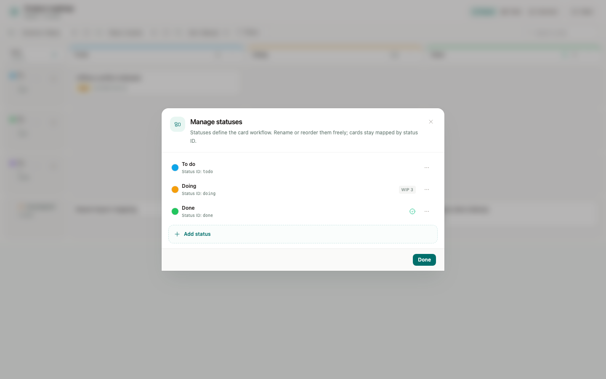
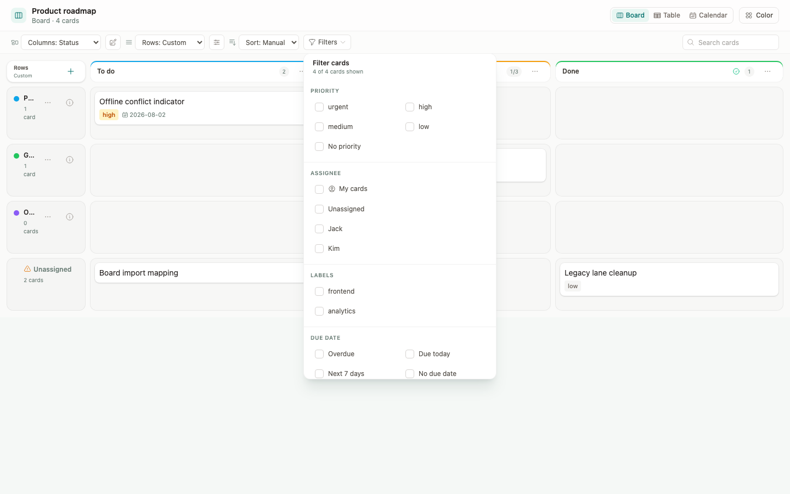

# Status columns and lightweight filters

## Feature impact analysis

| Area | Decision | Rationale |
|------|----------|-----------|
| Desktop app | Yes | Local `.board` files expose the same board and must make status editing discoverable offline. |
| Web app | Yes | Cloud boards expose the same document model and need the same layout/filter language. |
| Shared model/utilities | Yes | Structured filters and status/row terminology are consumed by every board host. |
| Shared UI | Yes | Desktop, Web, and the embed render the same board surface with platform adapters. |
| Web service/API | No | Status definitions and row settings already persist through document save APIs; filters are view-only. |
| `packages/board-react` | Yes | The embed exposes the full shared board toolbar and checked-in bundle. |
| CLI/MCP | No | Status and card mutation contracts do not change; filters are an in-app view concern. |
| In-app Help | Yes | The board workflow and terminology change visibly. |
| Other docs | Yes | The board package README and this design record must describe the new model. |
| Release/deployment | Yes | Rebuild Desktop, Web, and package artifacts after merge; this PR does not promote or change rollout infrastructure. |

## Product model

JType keeps Jira's useful separation of concerns without adopting JQL:

1. **Status columns are the primary workflow.** `To do`, `Doing`, and `Done`
   are status definitions and normally render as columns. A card maps to a
   stable status key through frontmatter `status`.
2. **Horizontal rows are an optional second dimension.** Users may arrange
   cards into rows by priority, assignee, status, or existing custom row IDs.
   The UI calls these "Rows", not "Swimlanes".
3. **Filters only focus the current view.** They never determine board
   membership or mutate cards. Board membership continues to come from the
   `.board` id plus each card's `board` field.

JType deliberately does not add:

- a JQL-style text language;
- saved global searches as board data sources;
- Jira's many-statuses-to-one-column mapping;
- a backend contract for personal view filters.

## UI design

### Toolbar hierarchy

The toolbar is ordered by the decisions users make:

1. **Columns** — Status (default), Priority, or Assignee.
2. **Manage statuses** — always visible for editable boards because statuses
   remain the card workflow even when the current columns show another field.
3. **Rows** — None (default), Priority, Assignee, Status, or Custom.
4. **Row settings** — visible only when the selected row mode has configurable
   behavior.
5. **Sort**, **Filters**, and **Search**.

The former labels `Group` and `Swimlane` are removed from the primary toolbar.
The status manager no longer depends on choosing Status as a horizontal row.

### Status management

Status definitions have stable keys and editable presentation:

- add, rename, reorder, color, WIP limit, and done designation;
- deleting a populated status requires moving its cards first;
- changing the name does not change card mapping;
- the manager explains that statuses drive card workflow and board columns;
- each row exposes its stable **Status ID**, which is the value stored on cards.

Direct column actions remain available as shortcuts. The empty slot after the
last status says **Add status**, not **Add column**.

### Lightweight filters

The filter popover supports structured, composable choices:

- priority (multi-select);
- assignee (multi-select, including Unassigned);
- labels (multi-select);
- due date: overdue, today, next seven days, or no due date;
- blocked cards;
- cards assigned to the current user when known.

Selections within one dimension use OR. Dimensions combine with AND. Active
dimensions appear as removable chips in the toolbar and the trigger shows the
number of active dimensions plus `visible / total` cards. Filters work in
Board, Table, and Calendar views and remain personal in component state.

The existing missing-custom-row recovery filter remains available
programmatically after a deleted row leaves recoverable card references.

## Implemented visuals

### Status workflow management

### Lightweight filter composition

## Acceptance criteria

- From a normal board with Columns = Status and Rows = None, an editor can find
  and open Manage statuses without changing the row setting.
- Adding or renaming a status persists through the Desktop filesystem adapter
  and the Web document adapter.
- Selecting multiple values in one filter dimension broadens that dimension;
  selecting a second dimension narrows the result.
- Clearing a chip only clears that dimension; Clear all restores every card.
- Row terminology is used in the toolbar, dialogs, tests, package README, and
  Help Center. Existing persisted `swimlaneBy`, `swimlanes`, and card
  `swimlane` keys remain readable for compatibility.
- Desktop, Web, and `jtype-board-react` render the shared behavior.
