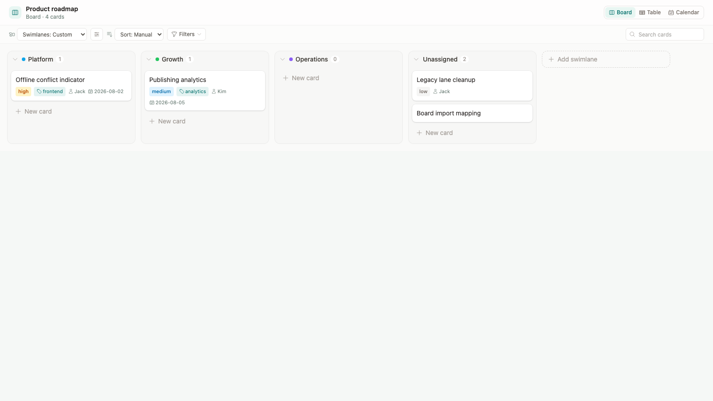

# Vertical swimlanes and lightweight filters

## Feature impact analysis

| Area | Decision | Rationale |
|------|----------|-----------|
| Desktop app | Yes | Local `.board` files must expose the same swimlane selection and drag writeback offline. |
| Web app | Yes | Cloud boards use the same interaction and persisted document model. |
| Shared model/utilities | Yes | One canonical lane resolver maps every host to the correct card field. |
| Shared UI | Yes | Desktop, Web, and the embed render the same `BoardSurface`. |
| Web service/API | No | Existing document save APIs already persist board config and card frontmatter. |
| `packages/board-react` | Yes | The embed ships the shared board and must write the same fields on drop. |
| CLI/MCP | No | Their status/card mutation contracts remain compatible. |
| In-app Help | Yes | The visible model and terminology changed. |
| Release/deployment | Yes | Desktop, Web, and package artifacts must be rebuilt after merge. |

## Product model

JType has one visible board dimension: **vertical swimlanes with their labels
at the top**. There is no second left-side row axis.

The swimlane selector offers:

1. **Status** — default. `To do`, `Doing`, and `Done` are workflow definitions.
   Dropping a card changes frontmatter `status`.
2. **Priority** — fixed `Urgent`, `High`, `Medium`, `Low`, and `Unassigned`
   columns. Dropping a card changes or clears `priority`.
3. **Assignee** — columns derived from current values plus `Unassigned`.
   Dropping a card changes or clears `assignee`.
4. **Custom** — board-owned definitions with immutable IDs, editable names,
   colors, and order. Dropping a card changes or clears frontmatter `swimlane`.

Status is the conventional Kanban workflow and remains the default. Priority,
assignee, and custom swimlanes are alternate views, not filters and not an
additional grid dimension.

## Stable identity and custom swimlanes

Custom definitions persist in `.board` configuration:

```json
{
  "swimlaneBy": "custom",
  "swimlanes": [
    {
      "key": "lane_platform_12345678",
      "name": "Platform",
      "color": "#0ea5e9"
    }
  ]
}
```

Cards persist only the immutable key:

```yaml
swimlane: lane_platform_12345678
```

Renaming a swimlane therefore never disconnects its cards. When a definition
is deleted without migrating cards, those cards render in **Unassigned** while
their original IDs remain recoverable.

Priority and Assignee can be converted into editable custom swimlanes. The
conversion creates immutable IDs, migrates cards, and leaves the original
priority or assignee fields unchanged.

## UI design

The board toolbar has one **Swimlanes** selector, then the settings action for
that selection, followed by Sort, Filters, and Search.

- Status shows **Manage statuses**.
- Priority and Assignee show **Make swimlanes editable**.
- Custom shows **Manage custom swimlanes**.

Every swimlane is a fixed-width vertical column. Cards use pointer drag:

- horizontal movement crosses swimlanes and updates the selected field;
- vertical movement reorders cards when Status + Manual sort is active;
- empty swimlanes are valid drop targets;
- read-only boards expose neither drag nor mutation controls.

Custom management uses a shared Headless UI dialog. It supports add, rename,
reorder, color, stable-ID inspection, and deletion with optional card
migration. **Add swimlane** also appears after the final custom column.

## Lightweight filters

Filters focus the current view without changing membership or card data:

- priority (multi-select);
- assignee (multi-select, including Unassigned);
- labels (multi-select);
- due date: overdue, today, next seven days, or no due date;
- blocked cards;
- cards assigned to the current user;
- recoverable cards whose custom swimlane definition is missing.

Values within one dimension use OR; dimensions combine with AND. Filters are
local component state and apply to Board, Table, and Calendar.

## Persisted compatibility

- New Status, Priority, and Assignee selections persist in existing `groupBy`.
- Custom persists as `groupBy: "status"`, existing `swimlaneBy: "custom"`,
  plus `swimlanes`; conversion normalizes to the same shape.
- Historical boards that stored `swimlaneBy: "status" | "priority" |
  "assignee"` from the retired two-dimensional UI use that value as the single
  active vertical swimlane dimension.
- No migration rewrites cards merely to open a board.

## Acceptance criteria

- Desktop, Web, and `jtype-board-react` render identical top-labelled vertical
  swimlanes with no left-side row labels.
- Status is the default selection.
- Selecting Status, Priority, Assignee, or Custom produces exactly one set of
  vertical columns.
- Dragging a card to another column updates the corresponding frontmatter
  field in all three hosts.
- Custom swimlanes can be added, renamed, reordered, recolored, and deleted;
  stable IDs remain inspectable.
- Empty and Unassigned swimlanes accept drops.
- Missing custom definitions surface their cards in Unassigned without
  destroying the original mapping.
- Desktop and Web builds, shared unit tests, component drag E2E, real Desktop
  E2E, real Web E2E, and the package build pass.

## Implemented visual


