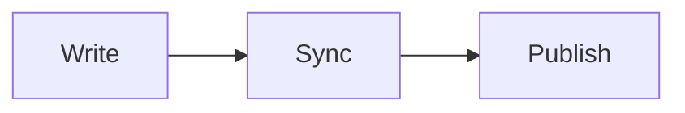
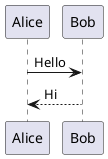

Everything you write in JType is plain Markdown, so your notes stay readable anywhere. The editor adds a live preview on top — including math, diagrams, and frontmatter — without changing the file on disk.

## GitHub-flavored Markdown

JType renders **GitHub-flavored Markdown (GFM)**, so the syntax you already know just works:

```markdown
## A heading

- A bullet
- [ ] A task to do
- [x] One that's done

A **bold** word, some `inline code`, and a [link](https://example.com).

| Feature | Status |
| ------- | ------ |
| Tables  | Yes    |
```

You get headings, lists, task lists, tables, blockquotes, and fenced code blocks. Headings drive the on-page outline, so use `##` and `###` to give long notes structure.

## YAML frontmatter

A note can open with a **YAML frontmatter** block — a fenced `---` section at the very top that holds metadata instead of body text:

```markdown
---
title: Launch plan
publish: true
---

# This body is your note
```

Two keys matter most:

- `title` sets the note's display name (handy when the filename and the heading differ).
- `publish: true` marks the note for your public site. See [Publish a site](/help/c/publishing/publish-a-site).

The frontmatter block itself is never rendered into the preview body — it's metadata, not content.

## Write, split, and preview modes

The editor has three modes; switch freely as you work:

- **Write** — just the Markdown source, for distraction-free typing.
- **Split** — source on one side, live preview on the other, scrolling together.
- **Preview** — the rendered result only, to read a note the way others will.

Split mode is the everyday default: you see formatting, math, and diagrams update as you type.

## Math with KaTeX

The preview renders math through KaTeX. Use single dollar signs for inline and double for a display block:

```markdown
The mass-energy relation is $E = mc^2$.

$$
\int_0^1 x^2 \, dx = \frac{1}{3}
$$
```

## Mermaid diagrams

A fenced `mermaid` code block becomes a rendered diagram:

````markdown

````

## PlantUML diagrams

A fenced `plantuml` block is rendered to a diagram as well:

````markdown

````

These render only in the preview. In the raw file they stay as ordinary code blocks, so the note is still perfectly readable in any other editor.

## Where to go next

- New to the model? Read [How vaults work](/help/c/vault-editing/how-vaults-work).
- Move between notes fast: [Quick open and links](/help/c/vault-editing/quick-open-and-links).
