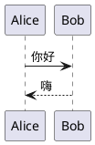

你在 JType 中写下的一切都是纯 Markdown，因此你的笔记在任何地方都保持可读。编辑器在此之上叠加了实时预览——包含数学公式、图表与 frontmatter——而且不会改动磁盘上的文件。

## GitHub 风格 Markdown

JType 渲染 **GitHub 风格 Markdown（GFM）**，所以你早已熟悉的语法直接就能用：

```markdown
## 一级小节标题

- 一个项目符号
- [ ] 一项待办
- [x] 一项已完成

一个**加粗**词、一段 `行内代码`，还有一个[链接](https://example.com)。

| 功能 | 状态 |
| ---- | ---- |
| 表格 | 支持 |
```

你可以使用标题、列表、任务列表、表格、引用块和围栏代码块。标题会生成页内大纲，所以请用 `##` 和 `###` 为长笔记搭建结构。

## YAML frontmatter

一条笔记可以以一段 **YAML frontmatter** 开头——位于文件最顶端、由 `---` 围起的区块，存放元数据而非正文：

```markdown
---
title: 发布计划
publish: true
---

# 这部分正文才是你的笔记
```

最重要的是两个键：

- `title` 设置笔记的显示名称（当文件名与标题不一致时很方便）。
- `publish: true` 把笔记标记为发布到你的公开站点。参见[发布站点](/help/c/publishing/publish-a-site)。

frontmatter 区块本身绝不会渲染进预览正文——它是元数据，不是内容。

## 写作、分屏与预览模式

编辑器有三种模式；写作时可随意切换：

- **写作（Write）**——只显示 Markdown 源码，专注码字、不受打扰。
- **分屏（Split）**——一侧源码、一侧实时预览，并随滚动联动。
- **预览（Preview）**——只显示渲染结果，让你以别人看到的样子来阅读笔记。

分屏模式是日常默认：边打字边看到排版、数学公式与图表实时更新。

## 用 KaTeX 写数学公式

预览通过 KaTeX 渲染数学公式。行内用单个美元符号，独立成块用双美元符号：

```markdown
质能关系为 $E = mc^2$。

$$
\int_0^1 x^2 \, dx = \frac{1}{3}
$$
```

## Mermaid 图表

一个围栏 `mermaid` 代码块会被渲染成图表：

````markdown

````

## PlantUML 图表

一个围栏 `plantuml` 代码块同样会被渲染成图表：

````markdown

````

这些只在预览中渲染。在原始文件里它们仍是普通的代码块，因此这条笔记在任何其他编辑器中依旧完全可读。

## 接下来去哪儿

- 还不熟悉这套模型？阅读[仓库是如何工作的](/help/c/vault-editing/how-vaults-work)。
- 在笔记之间快速穿梭：[快速打开与链接](/help/c/vault-editing/quick-open-and-links)。
